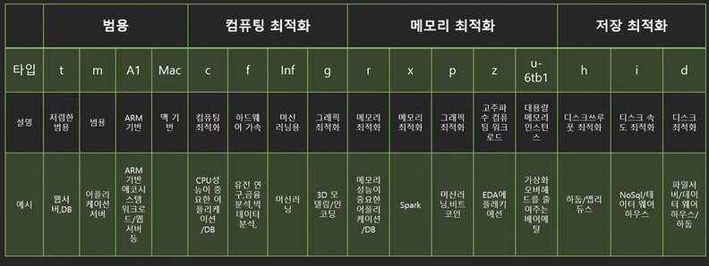
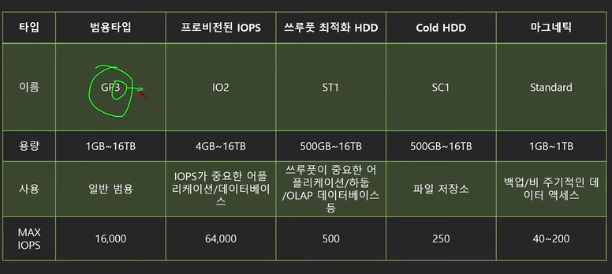
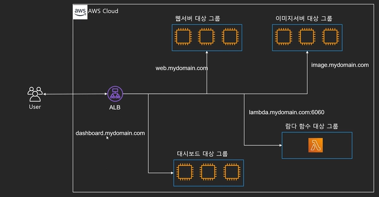
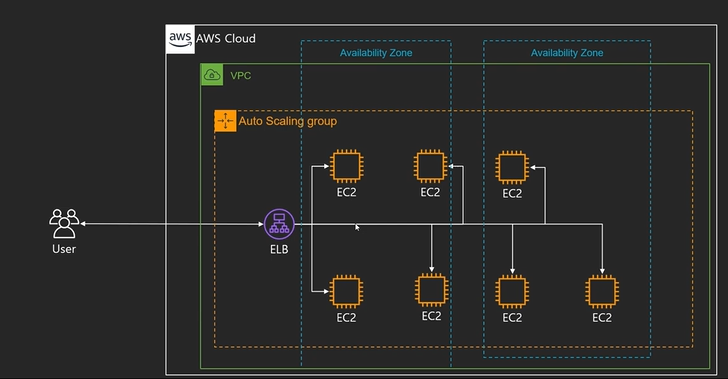
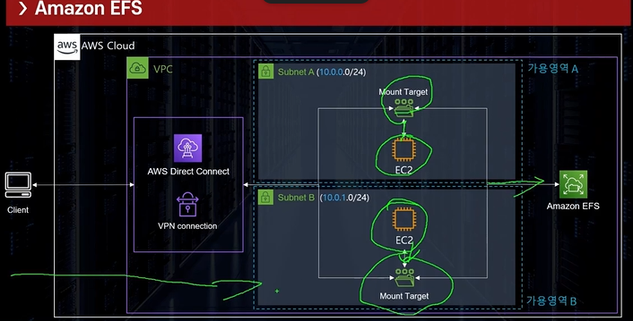
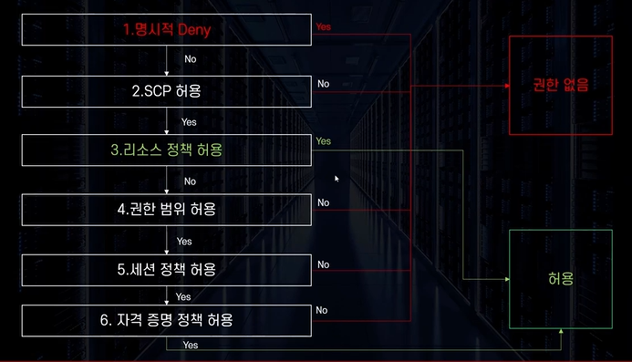

# [쉽게 설명하는 AWS 기초 강좌 1] 클라우드 컴퓨팅이란?

## 1. 클라우드 컴퓨팅의 정의
* **개념:** IT 리소스를 인터넷을 통해 **온디맨드(On-Demand)**로 제공하고, 사용한 만큼만 비용을 지불하는 서비스
* **핵심 키워드:** **온디맨드 (On-Demand)** — '수요에 반응한다'는 뜻으로, 사용자가 필요할 때 즉시 리소스를 제공하는 것을 의미함

---

## 2. 서버-클라이언트 아키텍처와 서버의 필요성
* **서버가 없는 멀티플레이 통신 (P2P 방식):**
  * 유저 수가 늘어날수록 서로 주고받아야 하는 통신 경로가 기하급수적으로 복잡해짐
  * 데이터 싱크가 맞지 않거나 하나의 통신만 끊겨도 전체 게임에 부하가 발생함
* **서버(Server)의 역할:**
  * 중앙에서 모든 클라이언트의 데이터를 수집, 계산, 저장 및 전달함
  * 데이터 조작(해킹)을 방지하고 게임의 효율성과 보안성을 극대화함

---

## 3. 전통적인 온프레미스 (데이터 센터) 방식의 한계
기업들이 서버-클라이언트 구조를 위해 직접 **데이터 센터**(서버 하드웨어, 네트워크 장비, 전력 시스템, 냉각 장치, 운영 및 보안 인력 등)를 구축하면서 다음과 같은 한계가 발생했습니다.

* **막대한 운영 비용:** 건물 유지비, 초기 서버 구매비, 부대시설 유지보수비가 지속적으로 발생함
* **고정된 자원 보유:** 수요가 줄어들거나 프로젝트가 중단되어도 이미 구매한 서버 자원을 쉽게 처분할 수 없음
* **느린 구축 및 대처 속도:** 유저가 급증하여 서버를 증설할 때 주문, 배송, 조립, 네트워크 세팅 및 테스트까지 최소 며칠에서 몇 달이 소요됨
* **유지보수의 어려움:** 하드웨어 고장 시 직접 원인을 찾아 부품을 교체해야 하므로 시간과 인력이 많이 낭비됨

---

## 4. 클라우드 컴퓨팅의 비유 (집 짓기 vs 호텔 투숙)
클라우드와 데이터 센터의 차이는 **'집을 직접 짓는 것'**과 **'호텔에 묵는 것'**의 차이로 이해할 수 있습니다.

| 구분 | 온프레미스 (직접 집 짓기) | 클라우드 컴퓨팅 (호텔 투숙) |
| :--- | :--- | :--- |
| **초기 비용** | 부지 매입, 건축비 등 막대한 자본 필요 | 체크인/체크아웃만으로 비용 부담 최소화 |
| **구축 기간** | 수개월에서 수년 소요 | 즉시 사용 가능 |
| **수요 대처** | 인원 증감 시 증축이나 공간 낭비 발생 | 방을 더 빌리거나 반납하여 유연하게 대처 |
| **유지 보수** | 고장 시 본인 비용으로 직접 수리 | 호텔 측에서 알아서 관리 및 수리 제공 |
| **결제 방식** | 거대한 목돈 지출 | 사용한 만큼만 지불 (**빌려 쓰기**) |

---

## 5. 클라우드 컴퓨팅의 6대 장점

### 1) 자본 비용을 가변 비용으로 대체
* 막대한 초기 투자 비용(데이터 센터 구축, 서버 구매) 대신, 사용한 만큼만 소액으로(시간·분·초 단위) 지불할 수 있어 경제적임

### 2) 규모의 경제로 인한 이점
* AWS 같은 거대 기업이 수십만 대 규모의 인프라를 공동 구축하므로, 개인이 구축하는 것보다 훨씬 저렴한 단가로 이용 가능 (전 세계 고객과의 공동구매 효과)

### 3) 용량 추정 불필요 (수요 최적화)
* 과거에는 서버 다운을 막기 위해 항상 **최대 트래픽 피크(Peak)**에 맞춰 과도한 자원을 구매해야 했고, 평소에는 자원이 낭비되었음
* 클라우드는 사용자가 많을 때는 늘리고 적을 때는 줄이는 **온디맨드** 방식이므로 자원 낭비가 없음

### 4) 속도 및 민첩성 개선
* 몇 번의 클릭만으로 즉시 새로운 서버와 자원을 확보할 수 있어, 인프라 고민 없이 **오직 개발에만 집중**할 수 있음

### 5) 데이터 센터 운영 및 유지관리 비용 불필요
* 하드웨어 고장, 냉각, 전력 관리 등에 인력과 비용을 쓸 필요가 없으므로 비즈니스 핵심 가치에 자원을 집중할 수 있음

### 6) 전 세계로의 빠른 확장성 (Global Reach)
* 몇 번의 클릭이나 코드(IaC)를 통해 미국, 유럽 등 전 세계 각지에 즉시 인프라를 구축하고 서비스를 제공할 수 있으며, 불필요해지면 즉시 정리 가능


# [쉽게 설명하는 AWS 기초 강좌 2] 클라우드 컴퓨팅의 종류

## 1. 클라우드 컴퓨팅 서비스 분류 방식
클라우드 컴퓨팅 서비스를 분류하는 기준은 크게 두 가지로 나뉩니다.
1. **무엇을 제공하느냐**에 따른 분류: **클라우드 컴퓨팅 모델 (서비스 모델)**
2. **어떻게 배포(제공)하느냐**에 따른 분류: **클라우드 컴퓨팅 배포 모델**

---

## 2. 클라우드 컴퓨팅 서비스 모델 (IaaS, PaaS, SaaS)
어플리케이션은 일반적으로 **네트워크, 스토리지, 컴퓨팅(CPU/RAM), OS(운영체제), 런타임/어플리케이션** 레이어로 구성됩니다. 클라우드가 어디까지 관리하고 제공해 주느냐에 따라 3가지로 분류됩니다.

### 1) IaaS (Infrastructure as a Service - 인프라 서비스)
* **개념:** 인프라(네트워크, 스토리지, 컴퓨팅 하드웨어)만 빌려주는 모델입니다.
* **특징:** 사용자가 가상의 빈 컴퓨터를 임대하는 것과 비슷하며, OS 설치부터 소프트웨어 개발/배포까지 직접 해야 합니다.
* **주방 비유:** **주방 공간만 대여** (주방기기, 요리 재료, 레시피는 사용자가 직접 챙겨와야 함)
* **대표 예시:** AWS EC2 (가상 컴퓨터 임대 서비스)

### 2) PaaS (Platform as a Service - 플랫폼 서비스)
* **개념:** 인프라를 넘어 OS와 어플리케이션을 실행할 수 있는 환경(런타임)까지 모두 포함하여 제공하는 모델입니다.
* **특징:** 개발자는 인프라나 OS 관리에 신경 쓰지 않고, 본인이 작성한 **코드만 올려서 바로 실행**할 수 있습니다.
* **주방 비유:** **주방 + 주방기기 + 요리 재료 대여** (사용자는 요리법인 '레시피'만 가지고 오면 됨)
* **대표 예시:** Firebase, 구글 앱 엔진(Google App Engine)

### 3) SaaS (Software as a Service - 소프트웨어 서비스)
* **개념:** 인프라, OS, 소프트웨어까지 **모든 스택을 통째로 완제품 형태로 제공**하는 모델입니다.
* **특징:** 사용자가 별도의 세팅이나 설치 없이 웹 브라우저나 앱을 통해 서비스 자체를 즉시 이용합니다. 가장 편리한 형태입니다.
* **주방 비유:** **음식 완제품 제공** (준비된 음식을 맛있게 먹기만 하면 됨)
* **대표 예시:** 지메일(Gmail), 드롭박스(Dropbox), 슬랙(Slack), 구글 독스(Google Docs)

---

## 3. 클라우드 컴퓨팅 배포 모델 (Public, Private, Hybrid)

### 1) 공개형 (Public Cloud - 퍼블릭 클라우드)
* **개념:** 모든 컴퓨팅 자원이 클라우드 제공업체의 인프라에서 실행되며 인터넷을 통해 불특정 다수에게 서비스가 제공되는 형태입니다.
* **특징:** 초기 비용이 낮고 높은 확장성을 자랑하여 클라우드의 장점을 100% 누릴 수 있습니다.
* **대표 예시:** AWS (Amazon Web Services)

### 2) 폐쇄형 (Private Cloud - 프라이빗 클라우드)
* **개념:** 기업이나 조직이 자체적인 데이터 센터(IDC)나 단독 인프라 내에 클라우드 환경을 직접 구축해 두고 사용하는 형태입니다.
* **특징:** 높은 수준의 커스터마이징이 가능하고 직접 관리하므로 **보안성이 매우 높습니다.** 다만, 구축 및 유지보수를 위한 초기 비용이 많이 듭니다.

### 3) 혼합형 (Hybrid Cloud - 하이브리드 클라우드)
* **개념:** 공개형(Public)과 폐쇄형(Private) 클라우드를 혼합하여 사용하는 형태입니다.
* **주요 활용 사례:**
  * **마이그레이션 과도기:** 폐쇄형에서 공개형 클라우드로 시스템을 점진적으로 전환할 때 안전하게 병행 운영하는 경우
  * **백업 및 이중화:** 핵심 데이터는 폐쇄형(Private)에 보관하면서, 부담이 적고 용량이 큰 데이터 백업 및 복구 인프라만 공개형(Public) 클라우드를 활용하는 경우

  # [쉽게 설명하는 AWS 기초 강좌 3] AWS의 구조 — 리전, 가용영역, 엣지 로케이션 등 —

## 1. AWS(Amazon Web Services) 소개
* **개념:** 전 세계 데이터센터에서 200개가 넘는 완벽한 기능의 서비스를 제공하는 세계적이고 포괄적인 클라우드 플랫폼
* **특징:**
  * 현재 글로벌 클라우드 서비스 점유율 1위 (풍부한 노하우와 레퍼런스 축적)
  * 수많은 스타트업 및 엔터프라이즈 기업들이 활용 중이며 매년 새로운 서비스 출시로 성장 중
  * 2002년 아마존닷컴의 부속 기능으로 출발하여 2006년 첫 클라우드 제품을 공식 출시함

---

## 2. AWS 글로벌 인프라의 핵심 구조
AWS의 인프라 구조는 크게 **리전(Region), 가용 영역(Availability Zone, AZ), 엣지 로케이션(Edge Location)**으로 구분됩니다.

### 1) 리전 (Region)
* **정의:** AWS 서비스가 제공되는 서버들의 **물리적인 지리적 위치** (데이터 센터의 묶음 거점)
* **특징:**
  * 전 세계 주요 거점(동남아, 유럽, 북아메리카 등)에 분산 배치되어 있음
  * 각 리전마다 고유 코드 부여 (예: 서울 리전은 `ap-northeast-2`, 도쿄 리전은 `ap-northeast-1`)
  * **미국 동부 버지니아 북부 (`us-east-1`):** 가장 첫 번째로 구축된 특별한 리전으로, 신규 서비스가 가장 먼저 출시되며 빌링(결제)이나 클라우드프론트 같은 글로벌 서비스의 중심 역할을 함
* **리전 선택 시 고려사항:**
  1. **지연 시간(Latency):** 서비스 대상 유저와 지리적으로 가장 가까운 리전 선택
  2. **법률 및 규제:** 국가별 데이터 저장 위치 관련 법적 규제 준수
  3. **서비스 가용성:** 리전별로 지원하는 AWS 서비스의 종류가 다를 수 있음

### 2) 가용 영역 (AZ - Availability Zone)
* **정의:** 하나의 리전 하부에 위치한 **독립된 전력, 냉각 및 물리적 보안을 갖춘 하나 이상의 데이터 센터 모음**
* **특징:**
  * 하나의 리전은 **반드시 2개 이상의 가용 영역**으로 구성됨
  * 가용 영역 간에는 매우 빠른 전용 광네트워크로 연결되어 데이터 동기화가 원활함
  * 홍수, 지진 등 자연재해로 인한 동시 피해(데미지 컨트롤)를 방지하기 위해 **물리적으로 일정 거리 이상 떨어져 있음** (단, 지연 시간 최소화를 위해 모두 100km 이내에 위치)
  * **보안 및 트래픽 분산:** AWS 계정마다 가용 영역 코드(예: AZ A, AZ B)가 맵핑되는 실제 물리적 데이터 센터의 위치는 서로 다르게 무작위 처리됨 (특정 센터 침입 방지 및 트래픽 집중 완화)

### 3) 엣지 로케이션 (Edge Location)
* **정의:** AWS의 **CloudFront(CDN)** 서비스 등을 위해 전 세계 주요 도시에 배치된 임시 데이터 저장소 거점
* **특징:**
  * 콘텐츠 전송 네트워크(CDN) 서비스를 통해 유저에게 데이터를 가장 빠른 속도로 제공하기 위해 캐싱(Caching) 목적으로 주로 활용됨
  * 메인 리전 서버까지 가지 않고 사용자와 가까운 엣지 로케이션에서 데이터를 직접 가져오므로 속도가 매우 빠르고 메인 서버의 부하가 분산됨

---

## 3. 서비스 범위에 따른 분류

* **글로벌 서비스 (Global Services):**
  * 특정 리전에 종속되지 않고 전 세계 모든 인프라가 공유하는 서비스
  * 예: CloudFront, IAM, Route 53, WAF 등
* **지역 서비스 (Regional Services):**
  * 특정 리전을 기반으로 데이터와 서비스를 제공하는 형태 (대부분의 AWS 서비스가 여기에 해당)
  * **Amazon S3의 특이점:** 전 세계에서 버킷 이름을 고유하게 사용하지만, 실제 데이터가 저장되고 관리되는 위치는 특정 리전에 종속됨

---

## 4. AWS 리소스 고유 식별자 — ARN
* **ARN (Amazon Resource Name):** AWS 내에 존재하는 모든 리소스(서비스, 파일, 데이터베이스 테이블 등)에 부여되는 **전 세계 유일한 고유 ID**
* **특징:**
  * 특정 규격의 텍스트 형태로 구성됨 (예: `arn:aws:s3:::bucket_name` 등)
  * 맨 끝자리 등에 **와일드카드(`*`)** 기호를 사용하면 특정 명칭으로 시작하는 다수의 리소스를 한 번에 지정할 수 있어 권한 관리 시 유용함


# [쉽게 설명하는 AWS 기초 강좌 4] AWS 계정 만들기 및 첫 설정 (feat. 실습)

## 1. AWS 계정 생성의 기본 개념
* **필수 준비물:** 처음 가입할 때 본인 명의의 해외 결제 가능 **신용카드/체크카드**가 필요합니다.
* **초기 생성 리소스:** 계정을 처음 만들면 **루트 사용자(Root User)**와 각 리전별 기본 네트워크 환경인 **기본 VPC(Default VPC)** 등이 자동으로 생성됩니다.
* **계정 식별:** 가입 시 12자리 숫자로 된 고유한 **AWS 계정 ID**가 부여됩니다. 추후 로그인 편의를 위해 문자로 된 **계정 별칭(Alias)**을 지정할 수 있습니다.

---

## 2. AWS의 사용자 유형 (Root User vs IAM User)
AWS의 사용자 유형은 크게 두 가지로 분류되며, 보안을 위해 쓰임새를 명확히 구분해야 합니다.

### 1) 루트 사용자 (Root User)
* **개념:** 계정 생성 시 사용한 이메일 주소로 로그인하는 유저로, 해당 계정의 **모든 자원에 대한 절대적인 권한**을 가집니다.
* **특징:**
  * 계정당 단 하나만 존재하며 권한 축소나 삭제가 불가능합니다.
  * **보안 위험성:** 루트 계정을 해킹(탈취)당하면 복구가 매우 어렵고, 해커가 비트코인 채굴용 인스턴스(EC2)를 수천 대 생성하여 수천만 원의 요금 폭탄을 맞을 수 있습니다.
  * **API 호출 불가:** AWS CLI나 SDK를 통한 프로그래밍 방식의 API 호출용으로 사용할 수 없습니다.
* **권장 조치:** **일상적인 작업 시 사용을 절대 자제**하고, 가입 직후 멀티팩터 인증(MFA)을 필수 설정한 뒤 관리용(결제 수단 변경, 계정 해지 등)으로만 봉인해 두어야 합니다.

### 2) IAM 사용자 (IAM User)
* **개념:** AWS의 권한 관리 서비스인 **IAM(Identity and Access Management)**을 통해 생성하는 개별 사용자입니다. 이메일이 아닌 지정한 **ID**로 로그인합니다.
* **특징:**
  * **최소 권한의 원칙:** 처음 생성 시 아무런 권한이 없으므로, 관리자가 해당 유저에게 필요한 권한(예: 개발자 권한, 읽기 전용 권한, 결제 확인 권한 등)을 세부적으로 부여해야 합니다.
  * **안전성:** 해킹이나 유출 의심 시 해당 IAM 유저만 즉시 삭제하거나 권한을 회수하면 되므로 관리가 안전합니다.
  * **프로그래밍 방식 액세스:** API 호출을 위한 `액세스 키 ID(Access Key ID)`와 `비밀 액세스 키(Secret Access Key)` 발급이 가능합니다. (※ 비밀 액세스 키는 발급 시 단 한 번만 조회 가능하므로 안전하게 보관해야 하며 절대 외부에 노출되면 안 됩니다.)

---

## 3. 계정 생성 후 필수 첫 설정 (실습 프로세스)

보안과 원활한 실습 진행을 위해 계정 생성 직후 아래의 5단계를 반드시 수행해야 합니다.

### 1단계: 기본 리전 설정
* 콘솔 로그인 후 우측 상단에서 리전 서버 위치를 확인하고, 국내 서비스 및 실습 속도를 위해 **아시아 태평양(서울) 리전 (`ap-northeast-2`)**으로 변경하는 습관을 기릅니다.

### 2단계: 루트 계정 MFA(멀티팩터 인증) 설정
1. 우측 상단 계정명을 누르고 **[내 보안 자격 증명]**으로 이동합니다.
2. **MFA 활성화**를 선택하고 '가상 MFA 디바이스'를 지정합니다.
3. 스마트폰에 **구글 OTP(Google Authenticator)** 앱을 설치한 후, 화면의 QR 코드를 스캔합니다.
4. 앱에 표시되는 6자리 일회용 비밀번호를 연속으로 2회 입력하여 연동을 완료합니다.
* ※ **팁:** 핸드폰 분실 시 루트 계정 복구가 매우 까다로우므로, 루트 계정의 MFA QR 코드 이미지는 따로 안전한 곳에 캡처/백업해 두는 것이 좋습니다.

### 3단계: 계정 별칭(Alias) 생성 
* IAM 사용자로 로그인할 때 원본 12자리 숫자 ID 대신 기억하기 쉬운 문자열(예: `aws-lecture-test`)로 별칭을 지정해 두면 로그인 주소(`https://별칭.signin.aws.amazon.com/console`)가 심플해집니다.

### 4단계: 관리자(Admin) 권한의 IAM 사용자 생성 
1. IAM 서비스 메뉴의 [사용자 추가]를 선택합니다.
2. 사용자 이름(예: `admin`)을 입력하고, 'AWS Management Console 액세스' 및 프로그래밍 방식 액세스를 모두 체크합니다.
3. 권한 설정에서 기존 정책 직접 연결을 선택한 후, 최상위 권한인 **`AdministratorAccess`**를 부여합니다. (단, 기본적으로 결제 관련 권한은 제외됨)
4. 생성 완료 화면에서 제공되는 **액세스 키 파일(.csv)을 다운로드**하여 안전하게 보관합니다.

### 5단계: 관리자 IAM 사용자용 MFA 추가 설정
* 새로 만든 관리자(Admin) IAM 유저 역시 권한이 매우 막강하므로, 유저 상세 페이지의 [보안 자격 증명] 탭에서 루트 계정과 동일한 방식으로 **구글 OTP를 활용한 MFA를 한 번 더 등록**해 줍니다.

---

## 4. 실습 마무리 및 확인
* 모든 설정이 완료되면 활성화되어 있던 루트 사용자 계정을 **로그아웃(Sign Out)** 합니다.
* 이후 생성한 계정 별칭 주소로 접속하여, 방금 만든 **IAM 사용자 ID(`admin`)와 패스워드, 그리고 스마트폰 OTP 번호**를 입력하여 로그인되는지 최종 확인합니다. 앞으로의 모든 실습은 이 IAM 계정으로 진행하게 됩니다.


# [쉽게 설명하는 AWS 기초 강좌 5] IAM 기초

## 1. IAM(Identity and Access Management)이란?
* **정의:** AWS 서비스와 리소스에 대한 액세스를 안전하게 제어하고 관리하는 핵심 보안 서비스입니다.
* **핵심 기능:** AWS 인프라 전반에서 **"누가(Who), 언제(When), 어디서(Where), 무엇을(What), 어떻게(How)"** 할 수 있는지 정의하고 허용/거부(Access Control)를 제어합니다.
* **주요 특징:**
  * 사용자별 패스워드 정책 관리 (일정 주기마다 변경 강제 등)
  * 타사 서비스(구글, 페이스북 등) 연동 로그인 지원 (Identity Federation)
  * **글로벌 서비스:** 리전별로 독립 작동하는 서비스가 아니라, 한 번 설정하면 전 세계 모든 AWS 인프라 및 리전에 공통 적용됩니다.

---

## 2. IAM을 구성하는 4대 핵심 요소
모든 권한 제어는 **정책(Policy)**을 기반으로 유기적으로 연결됩니다.

| 요소명 | 개념 설명 | 비고 |
| :--- | :--- | :--- |
| **사용자 (User)** | 실제 AWS를 사용하는 사람 또는 프로그래밍 방식으로 접근하는 **어플리케이션**을 의미합니다. | 최초 생성 시 아무런 권한이 없음 |
| **그룹 (Group)** | 동일한 권한을 공유하는 **사용자들의 집합**입니다. (예: 개발팀, 인사팀, 감사팀 등) | 그룹에 정책을 부여하면 소속된 모든 유저에게 자동 적용 |
| **정책 (Policy)** | 무엇을 허용하고 거부할지 세부 내용을 정의한 **JSON 형식의 문서**입니다. | 시간, IP, 특정 리소스 단위까지 아주 정밀하게 설계 가능 |
| **역할 (Role)** | AWS 리소스(예: EC2, Lambda 등)나 다른 사용자가 임시로 권한을 위임받기 위해 사용하는 **가면(Role)** 같은 개념입니다. | 자격 증명 공유 없이 안전하게 임시 권한을 부여할 때 활용 |

---

## 3. IAM 권한 검증 프로세스 및 예시
AWS 리소스에 접근할 때 시스템은 아래의 순서로 다각도 체크를 수행하며, 어디에도 명시적인 허용 정책이 없다면 기본적으로 **접근 권한 없음(Deny)** 처리가 됩니다.

1. **사용자 자체 정책 체크:** 해당 IAM 유저에게 다이렉트로 연결된 허용 정책이 있는가?
2. **그룹 정책 체크:** 사용자가 속해 있는 IAM 그룹에 허용 정책이 있는가?
3. **위임된 역할 정책 체크:** 사용자가 임시로 위임받아 수행 중인 역할에 허용 정책이 있는가?
* **서비스 간 연동 예시:** 서버리스 서비스인 `Lambda`가 파일 저장소인 `S3`에 접근하려면, Lambda 서비스에 "S3 접근 권한 정책이 담긴 **역할(Role)**"이 올바르게 부여되어 있어야 정상 작동합니다.

---

## 4. [중요] IAM 유저의 결제(Billing) 권한 활성화 방법
> **자주 하는 실수:** IAM 유저에게 최고 권한인 `AdministratorAccess` 정책을 주더라도, 기본 설정 상태에서는 **결제 대시보드(Billing)를 볼 수 없습니다.** 이를 해결하기 위해선 반드시 **루트 사용자**로 로그인하여 권한을 열어주어야 합니다.
1. **루트 계정**으로 AWS 콘솔 로그인 (MFA 인증 필요)
2. 우측 상단 계정명 클릭 후 **[내 계정 (My Account)]** 메뉴로 진입
3. 하단으로 스크롤하여 **[결제 정보에 대한 IAM 사용자/역할 액세스]** 확인
4. 비활성화 상태인 설정을 **[편집]**하여 **'IAM 액세스 활성화'**에 체크 후 업데이트
5. 설정 완료 후 IAM 유저(`admin` 등)로 재로그인하면 정상적으로 결제 대시보드 열람이 가능해집니다.

---

## 5. IAM 자격 증명 보고서 (Credential Report)
* **개념:** 현재 AWS 계정에 등록된 전체 사용자의 자격 증명 현황을 한눈에 파악할 수 있는 종합 보안 리포트입니다.
* **포함 정보:** 비밀번호 최종 사용/변경일, 액세스 키(Access Key) 활성화 여부 및 마지막 사용 시간, MFA(멀티팩터 인증) 등록 여부 등
* **특징:** 최대 4시간에 한 번씩 새로 생성(콘솔 및 CLI/API 요청 가능)할 수 있으며, Excel(.csv) 파일로 다운로드하여 인프라 보안 점검 자동화 및 감사(Audit) 자료로 활용하기 좋습니다.

---

## 6. AWS IAM 보안 모범 사례 (Best Practices)
* **루트 사용자는 봉인:** 최초 개정 생성 및 결제 권한 변경 등 특수 목적 외에는 루트 계정의 사용을 금지하고 일상 업무는 무조건 IAM 유저로 처리합니다.
* **최소 권한 부여의 원칙 (Principle of Least Privilege):** 업무 수행에 딱 필요한 만큼의 권한만 제공하며 불필요하게 넓은 권한(Admin 등)을 남발하지 않습니다.
* **그룹 단위 관리:** 유저 개개인에게 권한을 주면 관리가 꼬이기 쉬우므로, 직무별 그룹을 만들고 그룹에 정책을 맵핑하는 방식을 지향합니다.
* **MFA(2차 인증) 필수화:** 권한이 높은 루트 계정과 관리자(Admin) IAM 계정에는 반드시 구글 OTP 등 MFA 설정을 의무화합니다.
* **액세스 키 노출 금지:** 개발 소스 코드에 `액세스 키 ID`와 `비밀 액세스 키`를 하드코딩하지 말고, 가급적 **IAM 역할(Role)**을 소스나 서버에 맵핑하여 사용합니다.


# [쉽게 설명하는 AWS 기초 강좌 6] 가상화란?

## 1. 가상화(Virtualization)의 개념과 필요성
* **정의:** 단일 물리 컴퓨터의 하드웨어 자원(CPU, 메모리, 스토리지 등)을 여러 개의 가상 컴퓨터(가상 머신, VM)로 분할하여 사용할 수 있도록 해주는 기술입니다.
* **필요성 (자원 효율화):** * 예를 들어 회사에 빌드 서버, 웹 서버, 메일 서버가 각각 독립된 물리 장비로 존재하고 자원 점유율이 10~50%에 불과하다면, 나머지 남는 자원은 모두 버려지는 '잉여 자원'이 됩니다.
  * 가상화 기술을 통해 이 서버들을 하나의 고성능 물리 서버 안에 가상 머신 형태로 통합하면, 하드웨어 자원을 100%에 가깝게 효율적으로 쓰면서 물리 장비 대수를 줄여 상당한 비용을 절감할 수 있습니다.

---

## 2. 가상화 이해를 위한 배경 지식
* **운영체제(OS):** 시스템 하드웨어 및 소프트웨어 자원을 운영하고 관리하는 프로그램입니다. (예: Windows, Linux, macOS 등)
* **특권 명령(Privileged Instructions):** 시스템의 물리적인 하드웨어 요소(메모리, 마더보드 등)와 직접 소통하고 제어할 수 있는 특수한 명령입니다. 이 명령은 보안과 안정성을 위해 **오직 OS만** 내릴 수 있습니다.
* **베어 메탈(Bare Metal):** 가상화 레이어 없이 일반적인 개인 PC처럼 하드웨어 상에 운영체제(OS)가 직접 설치되어 실행되는 상태를 말합니다. 가상화가 등장하기 전에는 '1 물리 하드웨어 = 1 OS' 구조인 베어 메탈 방식이 기본이었습니다.

---

## 3. 가상화 기술의 발전 세대 (1세대 ~ 3세대)

### 1세대: 완전 가상화 (Full Emulation / Emulated)
* **특징:** 하드웨어의 모든 요소(CPU, 메모리, 그래픽카드 등)를 에뮬레이터(프로그램)를 통해 가상으로 똑같이 구현하여 게스트 OS를 구동하는 방식입니다.
* **비유:** 영화 '매트릭스'처럼 모든 물리 법칙과 사물이 다 프로그램으로 만들어진 가상 세계와 같습니다.
* **단점:** 하드웨어의 직접적인 도움을 전혀 받지 못하고 모든 것을 소프트웨어적으로 모방하기 때문에 속도가 엄청나게 느립니다.

### 2세대: 준가상화 (Para-Virtualization)
* **특징:** OS와 하드웨어 사이에 가상화를 전담하여 관리해 주는 매니저인 **하이퍼바이저(Hypervisor)**가 도입되었습니다. 가상 머신의 게스트 OS들이 이 하이퍼바이저와 통신하며 자원을 할당받습니다.
* **단점:** 1세대에 비해서는 속도가 획기적으로 빨라졌지만, 하이퍼바이저가 하드웨어의 모든 요소를 100% 직접 지원하지 못했기 때문에 일부 자원은 여전히 느린 에뮬레이션 방식을 혼용해야 했습니다.

### 3세대: 하드웨어 가상화 (HVM - Hardware Virtual Machine)
* **특징:** **하드웨어(CPU/메인보드 등) 자체에서 직접 가상화 기술을 지원**하는 방식입니다. 하이퍼바이저의 중계 레이어가 생략되거나 최소화되어, 가상 머신의 게스트 OS가 하드웨어와 거의 직접 소통합니다.
* **장점:** 중간에 가로막는 단단계가 사라졌기 때문에 가상화 환경임에도 불구하고 **실제 베어 메탈(물리 서버)과 거의 동일한 수준의 속도**를 냅니다.
* **AWS에서의 활용:** AWS에서 인스턴스를 생성할 때 자주 보게 되는 **HVM(Hardware Virtual Machine)**이라는 용어가 바로 이 3세대 가상화 기술을 의미합니다.

---

## 4. 클라우드 컴퓨팅과 가상화의 관계
* AWS의 대표적인 컴퓨팅 서비스인 **EC2(Elastic Compute Cloud)**는 사용자가 요청하면 몇 초 만에 새로운 서버 컴퓨터를 빌려줍니다.
* 이때 AWS 직원들이 사용자를 위해 물리적인 컴퓨터를 새로 조립하거나 선을 연결해서 주는 것이 아닙니다. 이미 거대한 데이터 센터에서 돌아가고 있는 대형 물리 서버들을 **3세대 가상화(HVM) 기술**로 쪼개어, 준비된 가상 머신(OS) 중 하나를 유저에게 즉시 할당해 주는 원리입니다.
* 사용이 끝나고 반납하면 해당 가상 머신을 초기화하여 다른 유저에게 다시 재할당합니다.
* 따라서 **가상화 기술은 클라우드 컴퓨팅을 존재하게 만드는 핵심 원동력**이며, 클라우드와 가상화는 뗄래야 뗄 수 없는 관계입니다.


# [쉽게 설명하는 AWS 기초 강좌 7] EC2 기초 (1): 소개 및 맛보기

## 1. EC2(Elastic Compute Cloud)란?
* **정의:** AWS 클라우드에서 안전하고 크기 조정이 가능한 가상 컴퓨팅 파워(서버)를 제공하는 핵심 웹 서비스입니다.
* **핵심 개념:** 쉽게 말해 AWS로부터 **"컴퓨팅 파워(컴퓨터)를 필요한 만큼 빌려 쓰는 서비스"**입니다. 클라우드를 활용하는 가장 근본적인 이유이자, 수많은 다른 AWS 서비스들의 기초 뼈대가 됩니다.

### 주요 용도
* **서버 구축:** 웹 서버, 어플리케이션 서버, 게임 서버 등 다양한 목적의 서버 호스팅
* **어플리케이션 구동:** 데이터베이스(DB) 설치, 머신러닝 연산, 비트코인 채굴, 연구용 프로그램 실행
* **다양한 연산 작업:** 그래픽 및 동영상 렌더링 작업, 고사양 원격 게임 구동 등

### 주요 특성
* **초단위 온디맨드(On-Demand) 가격 정책:** 약정이나 선입금 없이 내가 실제 사용한 시간(초 단위)만큼만 비용을 지불하므로 유연성이 매우 높습니다.
* **빠른 프로비저닝(빌리기) 및 확장성:** 물리적 컴퓨터를 조립할 필요 없이 클릭 몇 번(몇 분) 만에 전 세계 원하는 지역에 수십~수백 대의 서버 인스턴스를 즉시 구축할 수 있습니다.
* **최적화된 다양한 유연성:** CPU, 메모리 등 필요 목적(웹서버, 머신러닝 등)에 맞는 최적의 서버 사양을 자유롭게 선택 가능합니다.
* **다양한 요금 모델:** 온디맨드 외에도 1~3년 약정으로 최대 75% 할인받는 **예약 인스턴스(RI)**, 경매 방식으로 최대 90% 싸게 쓰는 **스팟 인스턴스** 등을 지원합니다.
* **연동성:** 인스턴스 수를 자동으로 늘려주는 *오토 스케일링*, 트래픽을 분산해 주는 *로드 밸런서*, 상태를 모니터링하는 *클라우드 워치* 등 다양한 AWS 서비스와 유기적으로 연동됩니다.

---

## 2. EC2 맛보기 실습을 위한 4대 구성 요소
* **인스턴스(Instance):** 클라우드 상에서 동작하는 가상 서버 컴퓨터 자체를 의미하며 연산(CPU, 메모리 등)을 담당합니다.
* **EBS(Elastic Block Store):** 가상 서버에 장착하는 일종의 **가상의 하드디스크(스토리지)**입니다.
* **AMI(Amazon Machine Image):** OS(리눅스, 윈도우 등)나 기본 프로그램들이 미리 세팅되어 있는 **서버 실행용 템플릿(이미지)**입니다.
* **보안 그룹(Security Group):** 가상 서버의 인/아웃바운드 트래픽을 통제하는 **가상의 방화벽** 역할을 합니다.

---

## 3. 웹 서버 구축 맛보기 실습 단계

### 단계 1: EC2 인스턴스 생성 및 프로비저닝
1. AWS 콘솔에서 **EC2** 검색 후 대시보드로 이동하여 **[인스턴스 시작]** 클릭
2. **AMI 선택:** 가장 기본적이고 범용적인 `Amazon Linux` 선택
3. **인스턴스 유형 선택:** 프리티어로 무료 사용이 가능한 기본값 `t2.micro` 선택
4. **스토리지 추가(EBS):** 기본 크기인 8GB 그대로 유지
5. **태그 추가:** 키(Key)에 `Name` (첫 글자 대문자 중요), 값(Value)에 `My WebServer` 입력 (서버의 별명 역할)
6. **보안 그룹 설정:** 새로운 보안 그룹을 생성하고, 외부 웹브라우저 접속을 위해 규칙 추가를 눌러 **HTTP** 프로토콜(80번 포트)을 허용
7. **키 페어(Key Pair) 설정:** 원격 접속 및 관리에 필수적인 키 페어 파일을 새로 생성하여 다운로드한 후 안전하게 보관 (실습 완료 후 인스턴스를 종료할 예정이라 이번 접속에는 사용하지 않음)
8. **인스턴스 시작:** 생성을 완료하면 상태가 '대기 중'에서 '실행 중'으로 변경됨

### 단계 2: 서버 접속 및 웹 서버 설치 (EC2 Instance Connect)
1. 생성된 인스턴스를 선택하고 상단의 **[연결]** 버튼 클릭
2. 별도의 프로그램 설치 없이 웹브라우저에서 바로 서버에 접속할 수 있는 `EC2 인스턴스 연결(EC2 Instance Connect)` 기능을 통해 서버 터미널 진입
3. **관리자 권한 획득:** 터미널에 `sudo su` 입력
4. **아파치 웹 서버 설치:** `yum install httpd -y` 입력
5. **웹 서버 서비스 시작:** `service httpd start` 입력

### 단계 3: 웹 서버 정상 작동 확인 및 페이지 커스텀
1. EC2 인스턴스 세부 정보 창에서 **퍼블릭 IP 주소**를 복사합니다.
2. 새 인터넷 창 주소창에 해당 IP를 입력하고 엔터를 치면 아파치(Apache) 기본 테스트 페이지가 뜨는 것을 확인할 수 있습니다.
3. **기본 페이지 바꾸기:** 다시 터미널로 돌아와 사용자가 처음 접속했을 때 보여줄 메인 화면 파일(`index.html`)을 만들기 위해 아래 명령어를 수행합니다.
   * `nano /var/www/html/index.html` 입력
   * 편집 창에 `Hello World` 문구 작성 후 `Ctrl + X` ➔ `Y` ➔ `Enter`를 눌러 저장 및 종료
4. 다시 웹브라우저 창을 새로고침하면 기본 테스트 페이지 대신 우리가 방음 작성한 `Hello World` 화면이 정상적으로 출력됩니다.

---

## 4. [★매우 중요★] 실습 종료 후 자원 정리
> 실습을 마친 후 서버를 그대로 켜두면 프리티어 용량을 초과하거나 본인도 모르는 사이에 **요금 폭탄**을 맞을 수 있습니다. 사용하지 않는 인스턴스는 반드시 정리해야 합니다.

* **정리 방법:** EC2 인스턴스 목록에서 방금 만든 인스턴스를 마우스 우클릭한 뒤 **[인스턴스 상태] ➔ [종료]**를 선택합니다.
* **참고 (중지와 종료의 차이):**
  * **중지(Stop):** 컴퓨터 전원만 끄는 상태입니다. 컴퓨터 연산 비용은 안 나가지만, 하드디스크 연결(EBS 소유) 비용은 계속 청구됩니다.
  * **종료(Terminate):** 컴퓨터를 완전히 삭제 및 폐기하는 상태입니다. 연결된 하드디스크(EBS)까지 깔끔하게 함께 삭제되므로 추가 요금이 전혀 발생하지 않습니다. (추천)

  # [쉽게 설명하는 AWS 기초 강좌 8] EC2 기초 (2): EC2 가격 모델

EC2의 요금 정책을 정확히 알고 상황에 맞게 선택해야 클라우드 비용을 효과적으로 절감하고 효율적으로 서비스를 운영할 수 있습니다. EC2는 크게 **4가지 가격 모델**을 제공합니다.

---

## 1. EC2의 4대 가격 모델 개요

| 가격 모델 | 주요 특징 | 추천 사용 상황 |
| :--- | :--- | :--- |
| **온디맨드<br>(On-Demand)** | * 약정 없이 쓴 만큼만 지불 (초/시간 단위)<br>* 가장 유연하며 기본이 되는 모델 | * 수요 예측이 어렵거나 단기 프로젝트<br>* 테스트/개발 환경 또는 첫 도입 시 |
| **예약 인스턴스<br>(RI - Reserved)** | * 1년 또는 3년 기간 약정<br>* 온디맨드 대비 **최대 75%** 할인 | * 사용량이 고정적이고 확실한 서비스<br>* 중·대기업의 상시 구동 서버 |
| **스팟 인스턴스<br>(Spot Instance)** | * AWS의 남는 자원을 경매 방식으로 낙찰<br>* 온디맨드 대비 **최대 90%** 할인 | * 중단되어도 무방한 분산 처리 작업<br>* 빅데이터, 머신러닝, 배치 작업 |
| **전용 호스트<br>(Dedicated Host)** | * 가상 서버가 아닌 실제 물리 서버를 통째로 임대<br>* 가장 비용이 높음 | * 엄격한 규정 및 보안이 필요한 프로젝트<br>* 기존 보유 라이선스(BYOL) 유지 목적 |

---

## 2. 가격 모델별 상세 분석

### ① 온디맨드 (On-Demand)
* 실행한 인스턴스의 사양에 따라 시간 또는 초 단위로 비용을 지불합니다.
* 아마존 리눅스 등 오픈소스 기반 OS는 초 단위로, 일부 상용 OS는 시간 단위로 측정됩니다.
* 선입금이나 장기 약정이 전혀 없으므로 자유도가 가장 높습니다.
* **어떨 때 쓰나요?** 무엇을 선택해야 할지 잘 모를 때는 우선 온디맨드로 시작하는 것이 정석입니다.

### ② 예약 인스턴스 (RI)
* 1년 또는 3년 단위로 기간을 약정하여 사용합니다. (2년 약정 같은 단위는 존재하지 않음)
* 온디맨드의 유연성을 포기하는 대신 대폭의 가격 할인 혜택을 제공합니다.
* **어떨 때 쓰나요?** 인프라 수요와 프로젝트 계획이 확실한 대기업이나 상시 가동되어야 하는 서비스(프로덕션 웹서버 등)에서 총비용을 줄일 때 필수적입니다.

### ③ 스팟 인스턴스 (Spot Instance)
* AWS 데이터 센터에 남아 도는 유휴 인스턴스 자원을 경매 형식으로 가져와 매우 저렴하게 사용하는 방식입니다.
* **작동 원리:**
  * 수요에 따라 스팟 인스턴스의 시장 가격이 실시간으로 변동합니다.
  * 내가 입찰(지정)한 가격보다 현재 시장 가격이 **낮으면** 인스턴스를 정상적으로 사용합니다.
  * 시장 가격이 내가 지정한 가격보다 **높아지면** AWS가 즉시 자원을 회수(인스턴스 강제 종료)해 갑니다.
* **주의점:** 언제 인스턴스가 반납될지 예측이 불가능하므로, 서버가 갑자기 꺼져도 시스템 전체에 문제가 없는 **'분산형 아키텍처'**가 반드시 갖춰져 있어야 합니다.
* **어떨 때 쓰나요?** 마스터(매니저)가 태스크를 관리하여 개별 유저 노드가 꺼져도 작업이 유지되는 하두(Hadoop) 기반 빅데이터 분석, 머신러닝 연산 훈련 등에 최적입니다.

### ④ 전용 호스트 (Dedicated Host)
* 다른 사용자들과 물리적 하드웨어를 공유하는 일반적인 가상화 환경(멀티 테넌시)과 달리, 단일 고객만을 위해 지정된 물리적 서버를 통째로 제공합니다.
* 일반 가상 서버에서는 간혹 다른 가상 머신(게스트 OS)의 과도한 자원 소모로 인해 성능 간섭(CPU 스틸 현상 등)이 생길 수 있으나, 전용 호스트는 성능이 완벽하게 보장됩니다.
* **어떨 때 쓰나요?** 대정부/방산 프로젝트 같은 물리적 격리가 필요한 높은 보안 규격 충족, 코어/소켓 단위로 제한된 소프트웨어 라이선스 규정을 준수해야 할 때 주로 도입됩니다.

---

## 3. 요금 산정 시 추가 참고 사항
* **기본 가격 순서 (저렴한 순):** 스팟 인스턴스 ➔ 예약 인스턴스(RI) ➔ 온디맨드 ➔ 전용 호스트
* **스토리지(EBS) 요금 별도:** EC2 가격 모델은 순수 컴퓨터 연산 기능에 대한 비용입니다. 데이터를 저장하는 가상 하드디스크인 EBS 요금은 사용 모델과 관계없이 '실제 사용( 보유)한 공간'만큼 별도로 매달 청구됩니다.
* **데이터 전송(트래픽) 비용 정책:** * AWS 외부에서 내부로 들어오는 데이터(Inbound / 업로드): **무료**
  * AWS 내부에서 바깥 인터넷으로 나가는 데이터(Outbound / 다운로드): **유료 청구**
  * AWS 동일 리전 내에서 EC2 인스턴스끼리 통신하는 데이터: **무료**


  # [쉽게 설명하는 AWS 기초 강좌 9] EC2 기초 (3): EC2의 유형과 크기

AWS에서 EC2 서버를 생성할 때 고전 RPG 게임에서 캐릭터의 스탯(힘, 지능, 민첩 등)을 찍는 것처럼, 해결하려는 목적에 맞춰 서버의 자원(CPU, 메모리, 저장장치 등) 비중을 선택할 수 있습니다. 

---

## 1. EC2 인스턴스 유형 (Instance Types) = '직업'
인스턴스 유형은 사용 목적에 따라 특정 하드웨어 자원이 최적화되어 분류된 일종의 **서버의 직업**입니다. 알파벳으로 구분됩니다.

* **범용 (General Purpose - T, M 타입):** CPU, 메모리, 네트워크 자원이 균형 있게 배분된 유형입니다. 웹 서버, 개발 환경 등 어떤 용도로 써야 할지 잘 모르거나 초기 테스트 단계일 때 선택하는 기본 타입입니다.
* **컴퓨팅 최적화 (Compute Optimized - C 타입):** 고성능 프로세서(CPU) 비중이 높은 유형입니다. 대용량 데이터 처리, 배치 작업, 고성능 웹 서버 등에 사용됩니다.
* **메모리 최적화 (Memory Optimized - R 타입):** 대용량 RAM(메모리)이 장착된 유형입니다. 인메모리 데이터베이스, 실시간 빅데이터 분석 등에 적합합니다.
* **스토리지 최적화 (Storage Optimized - I, D, H 타입):** 매우 빠른 읽기/쓰기(I/O) 성능이나 대용량 로컬 저장 공간이 최적화된 유형입니다. Data Warehouse나 분산 파일 시스템 구축 시 활용됩니다.

> **Tip:** AWS 프리티어(Free Tier)로 제공되어 우리가 실습에서 자주 사용한 `t2.micro`가 바로 범용(T 타입)에 해당합니다.

---

## 2. 인스턴스 명명 규칙 (Naming Convention)
EC2 인스턴스의 이름(예: `m5a.xlarge`)을 보면 이 서버가 어떤 성능과 세대의 장비인지 파악할 수 있습니다.



* **패밀리/유역 (m):** 인스턴스의 기본 직업(타입)을 나타냅니다. (예: m = 범용)
* **세대 (5):** 하드웨어 장비의 세대(버전)를 뜻합니다. 숫자가 높을수록 AWS가 최근에 출시한 고성능·고효율의 신형 장비입니다. (현재 m6, t4 등 지속적으로 업그레이드 중)
* **추가 기능/접두사 (a):** 특정 기술적 특징을 나타냅니다.
  * `a`: AMD 프로세서 탑재
  * `g`: AWS가 직접 만든 그래비턴(Graviton) 프로세서 탑재
  * `d`: 로컬 NVMe 기반 SSD 스토리지 장착 등
* **크기 (xlarge):** 인스턴스의 규모(사이즈)를 의미합니다.

---

## 3. 인스턴스 크기 (Instance Size) = '레벨'
인스턴스의 크기는 서버의 **레벨(체급)**과 같습니다. 크기가 커질수록 성능과 비용이 정비례하여 상승합니다.

* **크기 종류:** `nano` ➔ `micro` ➔ `small` ➔ `medium` ➔ `large` ➔ `xlarge` ➔ `2xlarge` 순으로 커집니다.
* **체급 상승 시 변화하는 자원:**
  * 가상 CPU(vCPU) 개수 증가
  * RAM(메모리) 용량 증가
  * 네트워크 대역폭(성능) 확장
  * 외부 가상 하드디스크(EBS)와의 통신 대역폭 확장
* **참고 사항:** 가상 서버(EC2)와 가상 하드디스크(EBS)는 물리적으로 직접 꽂혀 있는 게 아니라 내부 네트워크로 연결되어 통신합니다. 따라서 인스턴스 크기가 클수록 데이터를 더 빠르고 원활하게 주고받을 수 있습니다.

# [쉽게 설명하는 AWS 기초 강좌 10] EC2 기초 (4): EBS, 스냅샷, AMI

일반적인 물리 서버가 연산(CPU/RAM), 저장장치(하드디스크), 네트워크 카드로 구성되듯, EC2 서버도 연산을 담당하는 **인스턴스**, 저장장치를 담당하는 **EBS**, 그리고 네트워크인 **ENI**로 분리되어 작동합니다. 이번 장에서는 저장과 복제에 관련된 핵심 개념을 배웁니다.

---

## 1. EBS (Elastic Block Store) = '가상 하드드라이브'
EC2 인스턴스에서 사용할 영구적인 블록 스토리지 볼륨을 제공하는 서비스입니다. 쉽게 말해 **클라우드 환경의 가상 하드디스크/SSD**입니다.


* **네트워크 연결 구조:** EC2 인스턴스와 EBS는 같은 본체 안에 조립된 하드웨어가 아니라 **내부 네트워크로 연결**되어 있습니다. 
  * **장점:** 인스턴스의 사양을 업그레이드하거나 교체할 때 데이터를 따로 옮길 필요 없이, 네트워크 연결만 새 인스턴스로 바꿔 붙이면 되므로 인프라 변경이 매우 용이합니다.
* **독립성:** EC2 인스턴스를 정지(Stop)하거나 종료(Terminate)하더라도 설정을 통해 EBS 볼륨은 삭제하지 않고 데이터만 영구적으로 보존할 수 있습니다. (서버를 끈 동안에는 EC2 비용은 나가지 않고 EBS 저장 요금만 발생)
* **주의점:** ebs 볼륨은 **반드시 EC2 인스턴스와 동일한 가용 영역(AZ, Availability Zone) 내에 존재**해야 연결할 수 있습니다. 가용 영역이 다르면 물리적 거리 차이로 인해 네트워크 연결이 불가능합니다.

### 💡 EBS 볼륨 유형 종류



1. **범용 SSD (gp2, gp3):** 일반적인 웹 서버, 개발 환경 등 대부분의 환경에 추천하는 기본 SSD 볼륨입니다.
2. **프로비저닝된 IOPS SSD (io1, io2):** 대규모 데이터베이스처럼 매우 높은 입출력(I/O) 성능과 대역폭이 엄격하게 보장되어야 할 때 사용합니다.
3. **처리량 최적화 HDD (st1):** 자주 액세스하는 대용량 데이터, 로그 분석 등에 적합한 대용량 하드디스크입니다.
4. **Cold HDD (sc1):** 접근 빈도가 낮고 비용을 최대한 아껴야 하는 아카이브 목적의 가장 저렴한 하드디스크입니다.
5. **마그네틱 (Standard):** 과거의 레거시 하드디스크 타입으로, 테스트 중 비용을 아끼고 싶을 때 간혹 사용합니다.

---

## 2. 스냅샷 (Snapshot) = 'EBS의 스냅 사진'
특정 시점의 EBS 볼륨 데이터 상태를 그대로 저장해 두는 **백업 파일(사진)**입니다.

* **저장 위치:** 스냅샷은 AWS의 대용량 파일 저장소인 **S3**에 저장되므로, EBS보다 보관 비용이 훨씬 저렴합니다.
* **증분식 백업 (Incremental Backup):** 스냅샷을 매번 찍을 때마다 전체 용량을 다 저장하는 것이 아니라, **이전 스냅샷 이후 변경된 데이터 블록만 누적하여 저장**합니다. 
  * 덕분에 용량을 매우 효율적으로 관리하므로 백업을 자주 실행해도 비용 부담이 적습니다.
* **복구:** 스냅샷을 사용하면 언제든 백업했던 시점의 데이터를 가진 새로운 EBS 볼륨을 완벽하게 재생성해 낼 수 있습니다.

---

## 3. AMI (Amazon Machine Image) = '서버 실행용 템플릿'
EC2 인스턴스를 즉시 실행하기 위해 필요한 OS(운영체제), 아키텍처, 기본 소프트웨어, 스토리지 구성 정보 등을 하나로 묶어놓은 **종합 템플릿(이미지)**입니다.

* **서버 복제 및 배포:** 내가 세팅해 둔 EC2 인스턴스의 스냅샷을 기반으로 AMI를 만들면, 현재 서버 상태(설치된 프로그램, 알고리즘, 세팅 값 등)를 완벽하게 복제할 수 있습니다.
* **활용 시나리오:**
  * **백업 및 이중화:** 서버가 장애로 터졌을 때 동일한 서버를 즉시 몇 대든 다시 찍어낼 수 있습니다.
  * **협업:** 동료 연구자나 개발자에게 내가 작업하던 환경 그대로를 AMI로 공유하여 똑같은 환경을 즉시 구성하게 할 수 있습니다.
  * **오토 스케일링:** 사용자가 몰릴 때 트래픽을 분산하기 위해 똑같은 웹 서버를 자동으로 수십 대씩 늘리는 인프라를 구축할 때 필수적으로 사용됩니다.

---

## 4. [보충] 데이터 저장소의 두 가지 기반 구조
EC2의 루트 볼륨(OS가 깔리는 공간)은 AMI 구조에 따라 두 종류로 나뉩니다.

| 비교 항목 | **EBS 기반 인스턴스** | **인스턴스 저장소(Instance Store) 기반** |
| :--- | :--- | :--- |
| **물리적 위치** | 가상 네트워크로 연결된 외부 스토리지 | EC2가 실행 중인 물리 호스트 컴퓨터의 **로컬 디스크** |
| **속도** | 네트워크 통신으로 인해 상대적으로 평이함 | 호스트 컴퓨터에 내장되어 **속도가 극도로 빠름** |
| **데이터 영구성** | 인스턴스가 삭제되어도 데이터 **영구 보존 가능** | 인스턴스를 종료(Terminate)하면 데이터가 **원천 삭제됨** |
| **주요 용도** | 일반적인 웹 서버, 데이터 보존이 필수인 서비스 | 휘발성 캐시 데이터, 임시 버퍼 공간, 복구 가능한 임시 작업 |


# [쉽게 설명하는 AWS 기초 강좌 11] EC2 기초 (5): EC2 생명주기 (Lifecycle)

EC2 생명주기는 AMI(Amazon Machine Image) 템플릿으로부터 서버가 가동되어 최종적으로 완전히 삭제(종료)될 때까지 인스턴스가 거치는 모든 상태와 전환 과정을 의미합니다.

---

## 1. EC2 생명주기 흐름과 상태 변화

EC2는 생성과 제어 명령에 따라 다음과 같은 상태 레이아웃을 거치게 됩니다.


* **Pending (준비 중):** AMI를 기반으로 인스턴스가 막 생성을 시작한 단계입니다. 이 시기에는 가상 머신(VM) 할당, 가상 랜카드(ENI), 가상 하드디스크(EBS) 등이 시스템 내부적으로 바인딩되며 부팅을 준비합니다.
* **Running (실행 중):** 부팅이 완료되어 사용자가 실제로 서버에 접속(SSH 등)하고 서비스를 운영할 수 있는 활성화 상태입니다.
* **Stopping (중지 중) ➔ Stopped (중지됨):** 운영 중인 서버를 잠시 꺼둔 상태입니다.
* **Shutting-down (종료 중) ➔ Terminated (종료됨):** 사용을 완전히 마치고 서버 자체를 영구적으로 삭제한 상태입니다. 복구가 불가능합니다.

---

## 2. Running(실행 중) 상태에서 가능한 3가지 제어 명령

### ① 중지 (Stop)
* **개념:** 컴퓨터의 '전원 끄기'와 같습니다. OS를 안전하게 끄고 가상 CPU 및 RAM 자원을 반납합니다.
* **네트워크 변화:** 인스턴스를 중지했다가 다시 시작(Start)하면 **퍼블릭 IP(Public IP)가 기존과 다른 새로운 IP로 자동 변경**됩니다. (단, 내부 통신용 프라이빗 IP는 유지됩니다.)
* **스토리지 제한:** 하드디스크가 유연하게 분리되는 **EBS 기반 인스턴스에서만 지원**됩니다. 인스턴스 내부에 임시 저장소가 귀속되어 있는 '인스턴스 저장소 기반 인스턴스'는 서버를 끄면 데이터가 영구 유실되므로 중지(Stop) 명령 자체가 불가능합니다.

### ② 재부팅 (Reboot)
* **개념:** 컴퓨터의 '시스템 다시 시작'과 같습니다.
* **특징:** 중지 후 다시 켜는 것과 달리 가상 자원을 완전히 반납하는 과정이 아니기 때문에, 소프트웨어적인 재시작(리부팅)만 일어나며 **퍼블릭 IP가 변경되지 않고 그대로 유지**됩니다.

### ③ 최대 절전 모드 (Hibernate)
* **개념:** 노트북의 덮개를 닫았다 열었을 때 작업 창이 그대로 남아있는 것과 같습니다.
* **원리:** 휘발성 자원인 RAM(메모리)에 올라와 있는 현재 상태 및 프로세스 데이터를 ebs(하드디스크)의 임시 공간에 고스란히 복사(덤프)한 뒤 서버를 종료합니다. 
* **장점:** 나중에 다시 인스턴스를 시작할 때, 맨 처음부터 부팅 과정을 거치지 않고 EBS에 백업해 두었던 메모리 데이터를 그대로 RAM으로 다시 로드합니다. 덕분에 중단했던 지점부터 즉시 프로그램을 이어갈 수 있어 부팅 속도와 서비스 연속성 측면에서 유리합니다.

---

## 3. 상태별 요금 청구 기준 (과금 정책 중요!)

많은 초보자가 오해하는 부분으로, **인스턴스를 껐다고 해서 요금이 0원이 되는 것이 아닙니다.**

| 인스턴스 상태 | 인스턴스 연산(CPU/RAM) 요금 | EBS(가상 하드디스크) 요금 | 고정 IP(탄력적 IP / 고정 퍼블릭 IP) 요금 |
| :--- | :--- | :--- | :--- |
| **Pending (준비 중)** | ❌ 미청구 | ⭕ 청구 | ⭕ 청구 |
| **Running (실행 중)** | ⭕ **청구** | ⭕ 청구 | ❌ 미청구 (인스턴스 비용에 포함) |
| **Stopping (중지 중)** | ⭕ **최대 절전 모드 시에만 청구**<br>(일반 중지 시 미청구) | ⭕ 청구 | ⭕ 청구 |
| **Stopped (중지됨)** | ❌ 미청구 | ⭕ **청구** | ⭕ **청구 (연결된 인스턴스가 정지 상태이므로 과금)** |
| **Terminated (종료됨)** | ❌ 미청구 | ❌ 미청구 (기본 삭제 설정 시) | ⭕ **청구 (주소 해제 전까지 과금 유지)** |

> **⚠️ 주의 사항 (비용 절약 팁)**
> * 인스턴스를 `Stopped(중지됨)` 상태로 두면 서버 본체(CPU/RAM) 값은 안 나가지만, 내 데이터를 품고 있는 **EBS 저장 공간 비용은 계속 부과**됩니다.
> * 퇴근 후나 실습 종료 후 서버를 꺼두는 자동화(예: AWS Lambda + System Manager 연동을 통한 평일 9시 가동, 18시 중지 아키텍처)를 구축하면 인스턴스 비용의 **3분의 2 이상을 획기적으로 절감**할 수 있습니다.


# [쉽게 설명하는 AWS 기초 강좌 12] EC2 기초 (6): EC2 Auto Scaling (오토스케일링)

클라우드 환경의 핵심 가치인 '탄력성'과 '고가용성'을 확보하기 위해 인스턴스의 규모를 자동으로 조절하는 AWS의 핵심 기능인 Auto Scaling에 대해 알아봅니다.

---

## 1. 스케일링(Scaling)의 두 가지 아키텍처

서버의 처리 능력을 늘리는 방식(Scaling)에는 수직적 스케일링과 수평적 스케일링이 있습니다.

### ① 수직적 스케일링 (Vertical Scaling / Scale-up)
* **개념:** 하나의 인스턴스 사양 자체를 고성능(더 많은 CPU, 더 큰 RAM)으로 업그레이드하는 방식입니다.
* **단점:** * 성능 향상 폭에 비해 비용이 기하급수적으로 비싸집니다 (성능 16배 향상 시 비용은 30배 이상 증가하는 등 효율 저하 발생).
  * 단일 인스턴스의 물리적인 성능 한계가 존재하여 백만 배 같은 무한 확장이 불가능합니다.
  * 서버를 유연하게 쪼갤 수 없어 수요 감소 시 자원 낭비가 심하므로 클라우드의 탄력성에 부합하지 않습니다.

### ② 수평적 스케일링 (Horizontal Scaling / Scale-out)
* **개념:** 동일하거나 비슷한 사양의 인스턴스 대수(규모)를 늘려서 전체 처리 능력을 확장하는 방식입니다.
* **장점:** * 성능 증가와 비용 증가가 정비례하므로 효율적이며, 이론상 인스턴스를 수백~수만 대까지 늘릴 수 있어 무한 확장이 가능합니다.
  * 필요 없을 때는 대수를 줄이면 되기 때문에 비용 효율성과 탄력성이 매우 뛰어납니다.
* **고려사항:** 여러 대의 서버가 하나의 서비스처럼 동작할 수 있도록 지원하는 프로그램 구조 및 시스템 아키텍처가 선행되어야 합니다.

> **💡 클라우드 환경의 대원칙**
> 클라우드에서는 비싼 고성능 서버 1대를 쓰는 것보다, 저렴한 서버 여러 대를 상황에 맞게 늘렸다 줄였다 하는 **수평적 스케일링(Scale-out / Scale-in)**을 항상 염두에 두어야 합니다.

---

## 2. AWS Auto Scaling 개요 및 목표

AWS Auto Scaling은 애플리케이션의 부하를 모니터링하여 용량을 자동으로 조정함으로써, 최소한의 비용으로 안정적인 성능을 유지해 주는 서비스입니다.


* **인스턴스 수 보장:** 운영에 필요한 정확한 수의 EC2 인스턴스를 항상 활성화 상태로 유지하도록 보장합니다.
* **용량 제한 설정:** 그룹 내의 **최소(Minimum) 인스턴스 수**와 **최대(Maximum) 인스턴스 수**를 정의하여, 예기치 못한 비용 폭탄을 막고 서비스가 마비되지 않는 마지노선을 설정합니다.
* **다양한 스케일링 정책:** CPU 점유율, 네트워크 트래픽 등 조건(부하)에 따라 서버를 늘리거나 줄일 수 있습니다. (예: 트래픽이 몰리는 오후 2시에는 40대로 확장, 한산한 새벽 2시에는 2대로 축소)
* **고가용성 분산 배포:** 특정 가용 영역(AZ)에 장애가 발생하더라도 서비스가 끊기지 않도록, 인스턴스들을 여러 가용 영역에 골고루 분산하여 배치합니다.

---

## 3. Auto Scaling Group(ASG)의 3대 핵심 구성 요소

Auto Scaling을 구축하기 위해서는 다음 3가지 항목이 올바르게 정의되어야 합니다.

1. **시작 템플릿 (Launch Template / 구 시작 구성):** `무엇을 실행할 것인가?`
   * 새로 생성될 EC2 인스턴스의 스펙을 담고 있는 명세서입니다. (AMI 종류, 인스턴스 타입/사이즈, 보안 그룹, 키 페어, IAM 역할 등 지정)
2. **모니터링 (Monitoring):** `언제 실행할 것인가?`
   * 시스템의 상태를 감시하는 기준입니다. CPU 사용량이 일정 수준을 넘거나, 기존 서버가 비정상 종료(Health Check 실패)되었을 때 알람을 발생시킵니다. 주로 AWS의 모니터링 서비스인 **CloudWatch** 및 부하 분산 장치인 **ELB(Elastic Load Balancer)**와 연동됩니다.
3. **설정 (Configuration):** `얼마나 어떻게 실행할 것인가?`
   * 오토스케일링 그룹의 규모 조건(최소, 최대, 원하는 용량)을 세팅하고 로드 밸런서와 연동하는 등의 그룹 운영 규칙을 지정합니다.

---

## 4. 자가 치유(Self-Healing) 동작 메커니즘

Auto Scaling Group은 설정된 '원하는 용량(Desired Capacity)'을 맞추기 위해 스스로 관리합니다.

1. 만약 특정 EC2 인스턴스에 하드웨어/소프트웨어 장애가 발생하여 시스템이 다운되면, ASG가 상시 진행하는 상태 검사(Health Check)를 통해 이를 감지합니다.
2. ASG는 비정상 인스턴스를 즉시 척결(Terminate)하여 클러스터에서 제외합니다.
3. 설정된 '원하는 용량'보다 현재 가동 중인 대수가 부족해졌으므로, **시작 템플릿을 참조하여 새로운 건강한 인스턴스를 자동으로 생성**해 빈자리를 채워 넣습니다.

---

## ⚠️ 실습 후 필수 주의사항 (과금 방지)

오토스케일링 실습 후, 인스턴스 메뉴에서 EC2 인스턴스를 수동으로 종료(Terminate)하더라도 **ASG가 이를 '장애 상황'으로 판단하여 새 인스턴스를 계속해서 다시 살려내게 됩니다.** (무한 생성 루프 발생)

따라서 실습이 끝난 후 자원을 정리할 때는 반드시 다음과 같이 조치해야 비용 청구를 막을 수 있습니다.
* **조치 방법:** Auto Scaling 그룹 설정으로 이동하여 **최소 용량(Min), 최대 용량(Max), 원하는 용량(Desired)을 모두 `0`으로 업데이트**하거나, **Auto Scaling 그룹 자체를 삭제**해야 배포된 모든 인스턴스가 완전히 안전하게 종료됩니다.


# AWS 기초 강좌 13: Elastic Load Balancer (ELB) 요약 노트

## 1. 로드 밸런싱(Load Balancing)이란?
* **개념:** 서버에 가해지는 부하(Load)를 여러 대의 인스턴스로 분산(Balancing)하여 처리하는 기술입니다.
* **필요성:** 오토 스케일링을 통해 인스턴스가 늘어나더라도, 부하 분산 장치가 없다면 사용자가 각 인스턴스의 개별 IP 주소를 모두 알고 직접 접속해야 하는 한계가 있습니다.
* **특징:** ELB는 고정된 IP가 아닌 **항상 도메인 주소(DNS Name) 기반으로 사용**해야 합니다.

---

## 2. ELB의 주요 4가지 종류

| 종류 | 특징 | 주요 역할 |
| :--- | :--- | :--- |
| **ALB** (Application) | 똑똑한 녀석 🧠 | URL 경로, 포트 등을 읽어 트래픽을 지능적으로 라우팅 (HTTP/HTTPS) |
| **NLB** (Network) | 빠른 녀석 ⚡ | TCP/UDP 기반 초고속 처리, 고정 IP(Elastic IP) 할당 가능 |
| **CLB** (Classic) | 옛날 녀석 👴 | 과거에 쓰이던 레거시 타입 (현재는 거의 사용하지 않음) |
| **GWLB** (Gateway) | 먼저 체크하는 녀석 🔍 | 트래픽을 가상 보안 어플라이언스로 먼저 보내 검사/분석 |

---

## 3. 대상 그룹 (Target Group)
ELB가 트래픽을 보낼 목적지들의 집합입니다. 다음과 같은 대상을 지정할 수 있습니다.
* **EC2 인스턴스**
* **IP 주소** (VPC 내부 프라이빗 IP만 가능)
* **Lambda 함수** (서버리스 코드 실행 서비스)
* **또 다른 ALB**



---

## 4. 핵심 실습 내용: 고가용성 아키텍처 구현

### ① 사용자 데이터(User Data) 활용
* EC2가 생성될 때 자동으로 웹 서버를 설치하고, 자신의 인스턴스 ID를 `index.html`에 저장하도록 스크립트를 심어 오토 스케일링 그룹을 업데이트합니다.

### ② 대상 그룹 및 ALB 생성
* 인스턴스 유형의 대상 그룹을 만들고, ALB를 생성하여 해당 대상 그룹과 연결합니다. ALB의 DNS 주소로 접속하면 새로고침할 때마다 트래픽이 분산되어 다른 인스턴스 ID가 화면에 출력됩니다.

### ③ 오토 스케일링 그룹 연동 및 헬스 체크(Health Check) 복구 테스트
* **문제 상황:** 인스턴스는 켜져 있지만(EC2 상태 정상), 내부 웹 서버 프로세스가 죽었을 때(포트 불통) 오토 스케일링은 이를 감지하지 못합니다.
* **해결책:** 오토 스케일링 그룹의 헬스 체크 타입을 **ELB**로 변경합니다.
* **결과:** 웹 서버를 강제로 중지시키면 ALB가 이를 '비정상(Unhealthy)'으로 판단하고, 오토 스케일링 그룹이 해당 인스턴스를 자동으로 삭제(Terminate)한 뒤 새로운 인스턴스를 정상적으로 띄워 서비스를 자동으로 복구(Self-Healing)합니다.

---


# AWS 기초 강좌 14: Elastic File System (EFS) 요약 노트

## 1. Amazon EFS란?
* **개념:** AWS 클라우드 서비스와 온프레미스 리소스에서 사용할 수 있는 간단하고 확장 가능하며 탄력적인 **완전 관리형 NFS 파일 시스템**입니다.
* **특징:** 애플리케이션을 중단하지 않고 온디맨드 방식으로 페타바이트(PB) 규모까지 자동으로 확장 및 축소되므로, 별도로 용량을 프로비저닝하거나 관리할 필요가 없습니다.

---

## 2. EBS vs EFS 주요 차이점

| 비교 항목 | Elastic Block Store (EBS) | Elastic File System (EFS) |
| :--- | :--- | :--- |
| **연결성** | 일반적으로 하나의 EC2 인스턴스에만 연결 가능 | 수천 개의 EC2 인스턴스가 **동시 접속 및 공유 가능** |
| **용량 관리** | 생성 시 미리 크기(용량)를 지정해야 함 | 용량 지정 없이 **사용한 만큼만 용량이 자동 증가** |
| **프로토콜** | 블록 스토리지 기반 | **NFS (Network File System) 버전 4** 기반 |
| **운영체제** | 리눅스, 윈도우 등 대부분 지원 | **리눅스(Linux) 전용** (윈도우 지원 불가) |

---


## 3. EFS의 핵심 특징 및 아키텍처
* **고가용성:** 데이터가 여러 가용 영역(AZ)에 나누어 분산 저장되므로 가용성과 내구성이 높습니다.
* **쓰기 후 읽기(Read-After-Write) 일관성:** 하나의 EC2 인스턴스에서 데이터를 저장(쓰기)하자마자 다른 EC2 인스턴스에서 즉시 변경된 데이터를 읽을 수 있습니다.
* **프라이빗 서비스:** AWS 외부(인터넷)에서는 직접 접속이 불가능합니다. 온프레미스나 외부에서 접속하려면 VPN 또는 다이렉트 커넥트(Direct Connect)를 통해 VPC와 연결해야 합니다.
* **마운트 타겟 (Mount Target):** 각 가용 영역(AZ)마다 마운트 타겟을 두어, 해당 AZ에 있는 EC2 인스턴스들이 이를 통해 EFS에 접근합니다.

---

## 4. EFS 및 관련 모드 종류

### ① 성능 및 처리량 모드
* **제너럴 폴포스 (General Purpose):** 가장 보편적이고 일반적인 상황에서 사용하는 기본 모드입니다.
* **맥스 IO (Max I/O):** 빅데이터나 미디어 처리 등 매우 높은 IOPS(초당 입출력 횟수)가 필요한 특수 케이스에 사용합니다.
* **벌스팅 스루풋 (Bursting Throughput):** 트래픽이 낮을 때 크레딧을 모았다가 필요할 때 높은 처리량을 사용하는 기본 모드입니다.
* **프로비저닝드 스루풋 (Provisioned Throughput):** 미리 지정한 만큼의 처리량을 지속적으로 확보하여 사용하는 모드입니다.

### ② 스토리지 클래스 (S3와 유사)
* **EFS 스탠다드:** 3개 이상의 가용 영역에 보관하는 일반적인 클래스입니다.
* **EFS 스탠다드 IA (Infrequent Access):** 자주 쓰이지 않는 데이터를 저렴하게 보관하되, 데이터를 가져올 때마다 비용이 발생합니다.
* **EFS 원존 (One Zone):** 하나의 가용 영역에만 보관하므로 비용은 저렴하지만 해당 AZ에 문제가 생기면 데이터가 손실될 수 있습니다. (예: 재생성 가능한 썸네일 파일 등 보관에 적합)

> 💡 **참고 (Amazon fsx)**
> * **fsx for Windows File Server:** 윈도우 환경을 위한 파일 스토리지 (SMB 프로토콜 활용)
> * **fsx for Lustre:** 머신러닝, 빅데이터 등 고성능 컴퓨팅(HPC)을 위한 초고속 병렬 파일 시스템

---

## 5. 실습 과정 요약: 스토리지 공유 웹 서버 구축
1. **보안 그룹 생성:** EFS 접속을 허용하기 위해 모든 TCP 트래픽을 허용하는 데모용 보안 그룹을 생성합니다.
2. **EFS 파일 시스템 생성:** 스토리지 클래스를 설정하여 생성하고, 각 가용 영역의 마운트 타겟에 생성한 보안 그룹을 적용합니다.
3. **EC2 인스턴스 생성 및 유저 데이터(User Data) 활용:** * 총 3개의 EC2 인스턴스를 동시에 프로비저닝합니다.
   * 유저 데이터 스크립트를 통해 NFS 유틸리티 및 Apache 웹 서버(`httpd`)를 자동 설치하고, 생성한 EFS의 파일 시스템 ID를 지정하여 디렉토리에 자동으로 마운트되도록 설정합니다.
4. **결과 확인:** 하나의 EC2 인스턴스에서 웹 디렉토리에 `index.html` 파일을 생성하거나 수정하면, 나머지 2개의 EC2 인스턴스 웹 주소로 접속해도 실시간으로 동일하게 내용이 변경 및 공유되는 것을 확인할 수 있습니다.

# AWS 기초 강좌 15: 사설 IP, NAT, CIDR 요약 노트

## 1. 사설 IP (Private IP)
* **개념:** 한정된 IPv4 주소(최대 약 43억 개)를 효율적으로 사용하기 위해 외부 인터넷과 직접 통신하지 않는 내부망 전용으로 분할한 IP 주소입니다.
* **특징:** 약속된 특정 대역(예: `10.0.0.0/8`, `172.16.0.0/12`, `192.168.0.0/16`)이 사설 IP로 고정되어 있으며, 이 대역은 인터넷을 통해 외부로 직접 통신할 수 없습니다.
* **IPv6 참고:** IPv6는 주소 개수가 자그마치 $2^{128}$개로 거의 무한대에 가깝기 때문에 사설 IP나 NAT 같은 주소 고갈 방지 개념이 필요하지 않습니다.

---

## 2. NAT (Network Address Translation)
사설 IP가 외부 공인 IP(Public IP)와 통신할 수 있도록 주소를 변환해 주는 기술입니다.

| 종류 | 특징 | 주요 활용 예시 |
| :--- | :--- | :--- |
| **Dynamic NAT** | 공인 IP 풀(Pool)에서 사용 가능한 IP를 사설 IP와 유동적으로 매칭하여 통신 | 일반적인 유동 IP 환경 |
| **Static NAT** | 하나의 사설 IP를 고정된 하나의 공인 IP와 1:1로 매칭 | AWS의 **인터넷 게이트웨이(IGW)** 방식 |
| **PAT** (Port Address Translation) | **수많은 사설 IP를 단 하나의 공인 IP**에 포트(Port) 번호를 다르게 부여하여 연결 | AWS의 **NAT 게이트웨이 / NAT 인스턴스**, 일반 가정/회사 공유기 환경 |

---

## 3. CIDR (Classless Inter-Domain Routing)
* **개념:** 과거의 클래스(A, B, C 클래스) 기반 라우팅 방식에서 벗어나, IP 주소 영역을 유연하게 여러 네트워크 영역으로 나누고 묶는 방식입니다.
* **사이다 블록 (CIDR Block):** 일정한 규칙을 가진 IP 주소들의 집합(묶음)을 의미합니다.
* **사이다 표기법 (CIDR Notation):** `A.B.C.D/E` 형식으로 표기합니다.
  * 앞에 오는 `A.B.C.D`는 IP 주소를 나타냅니다.
  * 슬래시 뒤의 `E`는 전체 32비트 중 **네트워크 주소(고정되는 부분)**가 몇 비트인지를 명시합니다.

### 💡 CIDR 블록 계산 예시 (`192.168.2.0/24`)
1. **네트워크 비트:** 앞의 24비트(`192.168.2.`)는 고정되어 절대 변하지 않는 영역입니다.
2. **호스트 비트:** 나머지 8비트($32 - 24 = 8$)가 유동적으로 변할 수 있는 영역입니다.
3. **보유 가능한 IP 개수:** 이진수 8비트이므로 $2^8 = 256$개의 주소를 가집니다.
4. **표현 범위:** `192.168.2.0`부터 `192.168.2.255`까지의 모든 주소 집합을 의미합니다.

---

## 4. 서브넷 (Subnet)
* **개념:** 하나의 큰 네트워크 안을 잘게 쪼개어 만든 '하위 네트워크'입니다.
* **역할:** 대규모 네트워크에 부여된 하나의 CIDR 블록 범위를 효율적으로 분할하여, 각 서브넷(예: 서브넷 A는 `192.168.1.0/24`, 서브넷 B는 `192.168.2.0/24`)에 할당해 사용합니다.
* **중요성:** 이 CIDR와 서브넷 개념을 확실히 이해해야만 AWS의 가상 네트워크 환경인 VPC(Virtual Private Cloud)를 설계하고 구축할 수 있습니다.

# AWS 기초 강좌 16: VPC와 Subnet 요약 노트

## 1. AWS 서비스 구조의 원칙
* **일반적인 서비스 (S3, DynamoDB 등):** 기본적으로 퍼블릭 인터넷 엔드포인트를 가지므로, 외부 인터넷을 통해 접근하는 것이 원칙입니다. 심지어 EC2 인스턴스가 S3에 접근할 때도 (별도의 인프라 도움 없이 원칙적으로는) 퍼블릭 인터넷으로 나갔다가 다시 들어오는 구조입니다.
* **VPC (Virtual Private Cloud):** 유일하게 **원칙적으로 퍼블릭 인터넷에서 직접 접근이 불가능**한 독립적인 가상 네트워크 공간입니다.

---

## 2. VPC (Virtual Private Cloud) 란?
* **개념:** AWS 계정 전용 가상 네트워크 공간으로, 클라우드 내에서 다른 가상 네트워크와 논리적으로 완전히 분리되어 있습니다.
* **쉽게 이해하기:** 클라우드 상에 구현한 **'가상의 데이터 센터'** 또는 외부와 격리된 네트워크 컨테이너 유닛입니다.
* **범위:** vpc는 **리전(Region) 단위**로 생성 및 동작합니다.
* **주요 역할:** 사설망 구축, IP 대역 분할, 인스턴스(EC2, RDS 등) 실행, 인터넷 노출 제어를 통한 보안 강화.

---

## 3. 서브넷 (Subnet)
VPC의 하위 단위로, VPC에 할당된 사설 IP 대역(CIDR)을 더 작은 단위로 분할하여 사용하는 쪼개진 네트워크입니다.

* **중요 특징:** 하나의 서브넷은 반드시 **하나의 가용 영역(AZ, Availability Zone) 안에만 위치**합니다. (여러 AZ에 걸칠 수 없음)
* **AWS 서브넷의 예약된 IP (5개):** 서브넷 생성 시 사용할 수 있는 IP 개수에서 **무조건 5개가 제외**됩니다. (예: `/24` 대역은 총 256개 중 5개를 뺀 251개만 할당 가능)
  1. `x.x.x.0` : 네트워크 어드레스
  2. `x.x.x.1` : VPC 라우터 주소
  3. `x.x.x.2` : DNS 서버 주소
  4. `x.x.x.3` : AWS 여분용 (향후 활용 목적)
  5. `x.x.x.255` : 네트워크 브로드캐스트 어드레스 (VPC는 브로드캐스팅을 지원하지 않지만 예약됨)

### 퍼블릭 서브넷 vs 프라이빗 서브넷
* **퍼블릭 서브넷:** 외부 인터넷과 통신할 수 있는 **인터넷 게이트웨이(IGW)로의 경로가 있는 서브넷**입니다. 유저에게 노출되어야 하는 웹 서버(Web), 애플리케이션 서버(WAS) 등이 위치합니다.
* **프라이빗 서브넷:** 외부 인터넷으로 나가는 경로가 아예 없는 서브넷입니다. 퍼블릭 IP를 부여할 수 없으며, 외부에 노출될 필요가 없는 데이터베이스(DB)나 로직 서버 등이 보안을 위해 이곳에 위치합니다.

---

## 4. 라우트 테이블 (Route Table)
* **개념:** 네트워크 트래픽이 목적지 주소(IP)를 찾아갈 때 어디로 가야 하는지 안내해 주는 **이정표(라우팅 규칙 목록)**입니다. VPC 생성 시 기본(Default) 테이블이 하나 제공됩니다.
* **가장 구체적인 매칭 원칙 (Longest Prefix Match):** 트래픽 목적지 IP 주소가 라우트 테이블의 여러 규칙과 매칭될 경우, **CIDR 서브넷 마스크 숫자가 가장 큰 것(가장 좁고 구체적인 범위)**의 규칙을 최우선으로 따릅니다.
  * *예시:* `10.0.0.0/16` (로컬 내부 통신) 규칙과 `0.0.0.0/0` (모든 외부 인터넷) 규칙이 있을 때, 내부 IP인 `10.0.1.31` 트래픽이 들어오면 더 구체적인 `/16` 규칙을 판별하여 로컬 통신(서브넷 간 통신)으로 보냅니다. 이에 해당하지 않는 외부 IP 트래픽은 `0.0.0.0/0` 규칙에 따라 인터넷 게이트웨이로 보냅니다.

---

## 5. 인터넷 게이트웨이 (Internet Gateway - IGW)
* **개념:** VPC가 외부 퍼블릭 인터넷과 통신할 수 있도록 통로를 만들어주는 가상의 관문 리소스입니다.
* **특징:**
  * AWS에서 자체적으로 높은 확장성과 고가용성을 보장하므로 사용자가 트래픽 용량을 관리할 필요가 없습니다.
  * IPv4 환경에서는 사설 IP와 공인 IP를 변환해 주는 **NAT(Static NAT) 역할**을 수행합니다.
  * 생성 및 이용 비용은 **무료**입니다.

  # AWS 기초 강좌 17: 보안 그룹(Security Group)과 NACL 요약 노트

## 1. 보안 그룹(Security Group - SG)과 NACL 개요
AWS VPC 보안을 책임지는 가상의 방화벽 역할을 하는 두 가지 핵심 구성 요소입니다. 트래픽을 제어하는 단위와 방식에서 뚜렷한 차이점을 가집니다.

---

## 2. 보안 그룹 (Security Group)
* **개념:** 인스턴스에 대한 인바운드(들어오는) 및 아웃바운드(나가는) 트래픽을 제어하는 가상 방화벽입니다.
* **제어 단위:** **인스턴스 단위** (정확히는 ENI 단위)로 적용됩니다. 하나의 인스턴스에 여러 개의 보안 그룹(기본 5개, 최대 16개)을 동시에 설정할 수 있습니다.
* **트래픽 제어 방식:** * 기본적으로 모든 포트가 비활성화(차단)되어 있어, **명시적으로 허용(Allow) 규칙만 설정**할 수 있습니다.
  * **거부(Deny) 규칙은 설정할 수 없습니다.** (특정 IP나 포트를 직접 차단하는 기능 없음)
* **상태 유지 (Stateful):** 매우 똑똑한 방화벽입니다. 인바운드로 허용되어 들어온 트래픽은 아웃바운드 규칙에 별도의 허용 규칙이 없더라도(None 상태여도), 방화벽이 기존 연결을 기억하여 **나가는 트래픽을 자동으로 허용**합니다.

---

## 3. 네트워크 액세스 컨트롤 리스트 (NACL / 나클)
* **개념:** 서브넷 경계에서 인바운드 및 아웃바운드 트래픽을 제어하는 가상 방화벽입니다.
* **제어 단위:** **서브넷 단위**로 적용됩니다. 서브넷 내부에 있는 모든 인스턴스와 리소스는 해당 NACL의 영향을 한꺼번에 받습니다.
* **트래픽 제어 방식:** **허용(Allow)과 거부(Deny)가 모두 가능**합니다. 특정 IP로부터 디도스(DDOS) 공격을 받거나 악성 트래픽을 차단하고자 할 때 특정 IP/대역을 직접 디나이(Deny) 처리할 수 있습니다.
* **상태 비유지 (Stateless):** 고지식한 방화벽입니다. 들어올 때 검사(인바운드)하고, 나갈 때(아웃바운드) 또 한 번 독립적으로 검사합니다. 즉, 들어오는 것이 허용되어 들어왔더라도 나가는 규칙에 포트가 허용되어 있지 않으면 트래픽이 나가지 못하고 타임아웃이 발생합니다.

> 💡 **에페메랄 포트 (Ephemeral Port / 임시 포트)**
> * 클라이언트(유저)가 웹 서버(80 포트) 등에 요청을 보낼 때, 본인의 컴퓨터에서 임의로 랜덤 포트를 지정해 요청을 보냅니다.
> * Stateless인 NACL 특성상 서버가 응답을 돌려줄 때 이 임시 포트 대역을 사용해야 하므로, **NACL의 아웃바운드 규칙에는 유저들의 OS가 사용하는 임시 포트 레인지(예: 리눅스 `32768~60999`)를 반드시 허용**해 주어야 원활한 통신이 가능합니다.

---

## 4. NACL 규칙 순서 및 평가 원칙
* **우선순위 원칙:** NACL은 규칙 번호(Rule Number)가 **낮은 숫자부터 순서대로 평가**합니다.
* **매칭 후 종료:** 트래픽이 내려오다가 단 하나라도 매칭되는 규칙을 만나면, 즉시 허용 혹은 거부를 결정하고 **그 아래의 나머지 규칙은 평가하지 않고 종료**합니다.
* **작성 팁 (100단위 설정):** AWS에서는 규칙 번호를 `100`, `200`, `300`과 같이 100단위로 띄워서 작성하기를 권장합니다. 그래야 나중에 규칙 사이에 예외 규칙(예: `150`)을 끼워 넣기 수월합니다.

### 🚫 잘못된 설정과 올바른 설정 비교 (특정 IP 차단 예시)
* 특정 공격자 IP(`1.1.2.3`)만 차단하고 나머지 모든 웹 트래픽(`80`)은 허용하고 싶을 때:

* **잘못된 예시 (차단 안 됨):**
  * 규칙 100: 모든 IP(`0.0.0.0/0`) 80 포트 👉 **허용(Allow)**
  * 규칙 200: 공격자 IP(`1.1.2.3`) 80 포트 👉 **거부(Deny)**
  * *결과:* 규칙 100번에서 모든 IP가 통과되므로, 200번까지 내려가지 못해 공격자도 그대로 허용됩니다.

* **올바른 예시 (정상 차단):**
  * 규칙 100: 공격자 IP(`1.1.2.3`) 80 포트 👉 **거부(Deny)**
  * 규칙 200: 모든 IP(`0.0.0.0/0`) 80 포트 👉 **허용(Allow)**
  * *결과:* 공격자는 100번에서 즉시 거부되고, 나머지 정상 유저들은 100번을 통과해 200번에서 정상 허용됩니다.

---

## 5. 핵심 비교 요약

| 비교 항목 | 보안 그룹 (Security Group) | 네트워크 ACL (NACL) |
| :--- | :--- | :--- |
| **작동 단위** | 인스턴스(ENI) 단위 | 서브넷 단위 |
| **규칙 지원** | 허용(Allow) 규칙만 지원 | 허용(Allow) 및 거부(Deny) 모두 지원 |
| **상태 보존 여부**| **Stateful** (인바운드 허용 시 아웃바운드 자동 허용) | **Stateless** (인바운드/아웃바운드 각각 개별 허용 필요) |
| **규칙 평가 방식**| 모든 규칙을 종합하여 평가 | 규칙 번호 순서대로(낮은 순) 평가 후 매칭 시 종료 |

# AWS 기초 강좌 18: NAT Gateway & Bastion Host 요약 노트

## 1. 개요 (프라이빗 서브넷의 한계와 보완)
프라이빗 서브넷(Private Subnet) 내부의 인스턴스는 인터넷 게이트웨이(IGW)로의 경로가 없어 외부 침입으로부터 안전하지만, 반대로 **인터넷을 통해 패치를 다운로드하거나 외부에서 직접 접속 관리하는 것이 원천적으로 불가능**합니다. 이를 해결하기 위해 퍼블릭 서브넷을 관문 삼아 통신하는 기술이 NAT 게이트웨이와 배스천 호스트입니다.

---

## 2. NAT 게이트웨이 (NAT Gateway) / NAT 인스턴스
* **개념:** 프라이빗 서브넷의 인스턴스가 보안을 유지한 채 **내부에서 외부 인터넷으로 안전하게 나갈 수 있도록(Outbound)** 트래픽 주소를 변환하고 중계해 주는 서비스입니다. (대변인/당 대변인 역할)
* **주요 용도:** 프라이빗 서브넷 내 EC2에서 OS 패치 다운로드, 라이브러리(Node, MySQL 등) 버전 업데이트 및 외부 API 연동 등.
* **배치 위치:** 외부 인터넷과 연결되어야 하므로 반드시 **퍼블릭 서브넷(Public Subnet)에 위치**해야 합니다.

### 🆚 NAT 게이트웨이 vs NAT 인스턴스
* **NAT 인스턴스:** 단일 EC2 인스턴스에 NAT 기능을 올린 것입니다. 초기부터 사용된 방식이며 비용은 저렴하지만, 사용자가 직접 이중화(HA)나 장애 대응, OS 관리를 해야 하므로 실무에서는 잘 쓰이지 않습니다.
* **NAT 게이트웨이:** AWS에서 완전히 관리해 주는 **클라우드 관리형 서비스**입니다. 높은 가용성과 확장성을 기본 제공하므로 사용자가 장애 대응이나 트래픽 성능 확장(프로비저닝)을 직접 고민할 필요가 없습니다. 실무 표준입니다.

---

## 3. 배스천 호스트 (Bastion Host)
* **개념:** 관리자나 개발자가 외부 인터넷에서 **VPC 내부의 프라이빗 서브넷 인스턴스에 안전하게 접속(Inbound)할 수 있도록** 징검다리 역할을 해주는 특별한 서버입니다. (영미권/호주 등에서는 **점프 호스트(Jump Host)**라고도 부릅니다.)
* **주요 용도:** 프라이빗 서브넷에 숨겨진 서버나 데이터베이스에 터미널(SSH/RDP)로 직접 접속하여 프로그램을 설치하고 조작/관리하기 위한 목적입니다.
* **배치 위치:** 외부 인터넷에서 접속 신호를 먼저 받아야 하므로 반드시 **퍼블릭 서브넷(Public Subnet)에 위치**해야 합니다.

> 💡 **실무 팁 (Bastion Host의 대체 기술)**
> 실무에서는 Bastion Host를 직접 구축하면 고정 공인 IP 관리, 키 페어(Key Pair) 공유 및 보안 위협 등의 번거로움이 많아 점차 사용하지 않는 추세입니다. AWS에서는 이 대신 키 파일 없이 웹 콘솔이나 CLI로 프라이빗 인스턴스에 안전하게 원격 접속할 수 있는 **AWS Systems Manager(SSM)의 세션 매니저(Session Manager)** 기능을 사용할 것을 강력히 권장합니다.

---

## 4. 핵심 방향성 요약 (트래픽 흐름 비교)

| 서비스 종류 | 트래픽 주 방향성 | 목적 |
| :--- | :--- | :--- |
| **NAT 게이트웨이** | **프라이빗 내부 ➔ 외부 인터넷** (아웃바운드) | 프라이빗 서버의 외부 패치 및 업데이트 다운로드 용도 |
| **배스천 호스트** | **외부 관리자 ➔ 프라이빗 내부** (인바운드) | 외부 관리자가 내부 시스템 조작 및 터미널 접속을 하기 위한 징검다리 용도 |


# AWS 기초 강좌 19: VPC 생성 실습 요약 노트

## 1. VPC 생성 전 알아두어야 할 핵심 원칙
* **자동 생성 리소스:** 커스텀 VPC를 생성하면 기본 라우트 테이블, 기본 네트워크 ACL(NACL), 기본 보안 그룹(Security Group)이 자동으로 함께 생성됩니다.
* **서브넷과 AZ:** 하나의 서브넷은 반드시 하나의 가용 영역(AZ)에만 생성할 수 있습니다. 서브넷 생성 시 기본 라우트 테이블에 자동으로 연결(암시적 연결)됩니다.
* **IP 예약:** 서브넷을 만들면 AWS가 관리 목적으로 총 5개의 IP 주소를 미리 점유합니다. (가장 작은 대역인 `/28`은 총 16개 중 11개만 사용 가능)
* **인터넷 게이트웨이(IGW):** VPC당 **단 하나**만 생성이 가능하며, 생성 후 사용자가 직접 VPC에 연결(Attach)해 주어야 합니다.

---

## 2. 실습 아키텍처 및 구성 목표
* **VPC 대역:** `10.0.0.0/16`
* **서브넷 구성 (모두 /24 대역으로 쪼개어 관리 효율성 확보):**
  * `마이 퍼블릭 서브넷` (`10.0.0.0/24`) - AZ-A에 위치
  * `마이 프라이빗 서브넷` (`10.0.1.0/24`) - AZ-C에 위치
  * `마이 DB 서브넷` (`10.0.2.0/24`) - AZ-D에 위치
* **기능 구현:** * 퍼블릭 EC2를 경유하는 배스천 호스트(Bastion Host) 방식으로 프라이빗 및 DB EC2에 원격 접속.
  * NAT 게이트웨이를 연동하여 외부 인터넷 접속이 불가능한 프라이빗 대역에서 패키지(MySQL 등) 다운로드 성공시키기.

---

## 3. 리소스별 상세 구축 단계 및 핵심 설정

### 1단계: VPC 및 서브넷 생성
1. **VPC 생성:** [VPC만 생성]을 선택하고 CIDR 블록에 `10.0.0.0/16` 입력 후 생성합니다.
2. **서브넷 3개 생성:** 각각의 CIDR 블록(`10.0.0.0/24`, `10.0.1.0/24`, `10.0.2.0/24`)을 설정하여 순서대로 생성합니다.
3. **퍼블릭 IP 자동 할당 활성화:** 퍼블릭 서브넷에 작업 설정을 변경하여, 향후 이곳에 생성될 EC2 인스턴스가 공인 IP를 자동으로 발급받을 수 있도록 처리합니다.

### 2단계: 라우팅 테이블(Route Table) 세분화 및 명시적 연결
기본 라우트 테이블에 묶여 있으면 모든 서브넷이 동일한 경로를 공유하므로, 보안 격리를 위해 서브넷별로 라우트 테이블을 따로 생성하여 **명시적으로 1:1 연결**해 줍니다.
1. `마이 퍼블릭 서브넷 RT` 생성 및 퍼블릭 서브넷에 명시적 연결.
2. `마이 프라이빗 서브넷 RT` 생성 및 프라이빗 서브넷에 명시적 연결.
3. `마이 DB 서브넷 RT` 생성 및 DB 서브넷에 명시적 연결.

### 3단계: 인터넷 게이트웨이(IGW) 연동 (퍼블릭 네트워크 완성)
1. 인터넷 게이트웨이를 새롭게 생성합니다.
2. 생성 직후 [VPC에 연결]을 클릭하여 방금 만든 커스텀 VPC에 부착합니다.
3. **라우팅 추가:** `마이 퍼블릭 서브넷 RT`를 편집하여, 외부 인터넷으로 향하는 모든 트래픽(`0.0.0.0/0`)의 대상(Target)을 방금 부착한 인터넷 게이트웨이로 지정합니다.

### 4단계: 배스천 호스트(Bastion Host) 접속 테스트
1. 퍼블릭 서브넷과 프라이빗 서브넷에 각각 EC2 인스턴스를 하나씩 생성합니다. (보안 그룹은 인바운드 모든 트래픽 `0.0.0.0/0` 오픈으로 임시 수정)
2. 내 PC에서 퍼블릭 EC2로 먼저 SSH 접속을 수행합니다.
3. 퍼블릭 EC2 내부에서 파일 편집기(`nano` 등)를 이용해 프라이빗 EC2 생성 시 사용했던 `.pem` 키 페어 파일 내용을 그대로 복사하여 저장합니다. (`chmod 400` 권한 부여 필수)
4. 퍼블릭 EC2에서 `ssh -i [키파일] ec2-user@[프라이빗EC2의 사설IP]` 명령어를 입력해 내부로 한 단계 더 점프 접속(배스천 호스트 기능)합니다.

### 5단계: NAT 게이트웨이 구축 (프라이빗 아웃바운드 완성)
1. **NAT 게이트웨이 생성:** 외부 인터넷과 직접 맞닿아 중계해 주어야 하므로, 배치할 서브넷으로 반드시 **퍼블릭 서브넷**을 지정해야 합니다.
2. **EIP 할당:** NAT 게이트웨이가 고정적으로 사용할 탄력적 IP(EIP)를 하나 발급받아 연결해 준 뒤 최종 생성합니다.
3. **라우팅 추가:** `마이 프라이빗 서브넷 RT`와 `마이 DB 서브넷 RT`를 각각 편집하여, 외부 인터넷 방향 트래픽(`0.0.0.0/0`)의 대상을 방금 생성한 **NAT 게이트웨이**로 지정합니다.
4. **최종 확인:** 외부와 완전히 격리되어 `yum install mysql` 명령어가 먹통이던 프라이빗(DB) EC2 서버에서, 라우팅이 추가된 직후 정상적으로 패키지가 다운로드 및 설치되는 것을 확인합니다.

# AWS 기초 강좌 20: Amazon S3 기초 요약 노트

## 1. Amazon S3란?
* **정의:** Amazon Simple Storage Service의 약자로, 업계 최고 수준의 확장성, 데이터 가용성, 보안 및 성능을 제공하는 **객체 스토리지 서비스**입니다.
* **객체 스토리지(Object Storage):** EBS나 EFS 같은 블록/파일 스토리지와 달리, 파일을 수정·설치하여 실행할 수는 없고 **데이터 파일을 '담아두는(보관)' 용도로만 사용**합니다. (애플리케이션 설치 및 운영 불가)
* **글로벌 서비스 vs 리전 단위 저장:** S3 콘솔 자체는 글로벌 서비스로 분류되어 리전 선택이 필요 없지만, 실제 데이터가 저장되는 공간인 **버킷(Bucket)은 특정 리전을 지정**하여 생성됩니다. 저장된 데이터는 법적 규제나 사용자의 설정이 없는 한 해당 리전을 벗어나지 않습니다.
* **용량:** 전체 저장 용량은 무제한입니다. 단, 개별 객체(파일) 1개당 가질 수 있는 크기는 **0바이트부터 최대 5TB**까지입니다.

---

## 2. 버킷(Bucket)과 객체(Object)의 구조
### 1) 버킷 (Bucket)
* S3에서 데이터를 구분하고 저장하는 최상위 디렉토리(폴더) 개념입니다.
* **버킷 이름은 전 세계(All AWS Accounts, All Regions)에서 유일**해야 합니다. 리전이나 계정이 달라도 중복된 이름을 사용할 수 없습니다. (정적 웹 호스팅 등에 중요하게 활용됨)

### 2) 객체 (Object) 구성 요소
S3에 저장되는 파일은 단순 데이터 바이트 외에 다음과 같은 핵심 메타데이터 구조를 가집니다.
* **소유자(Owner):** 해당 객체를 소유한 주체 정보.
* **키(Key):** 파일의 이름(경로를 포함한 식별자).
* **값(Value):** 실제 파일의 데이터 바이트 (0바이트도 가능).
* **버전 ID(Version ID):** S3 버전 관리 기능 활성화 시 부여되는 파일 버전 정보.
* **메타데이터(Metadata):** 파일의 생성일, 만든 이, 용도 등 파일 자체를 설명하는 데이터 쌍.
* **ACL(Access Control List) & 토렌트 플래그:** 권한 제어 및 토렌트 프로토콜 공유를 위한 데이터 (현재 ACL은 거의 사장되고 버킷 정책 위주로 사용됨).

---

## 3. S3의 내구성과 가용성 (정확한 개념 구분)
* **내구성 (Durability): 99.999999999% (11개의 9 - Eleven Lines)**
  * 데이터를 절대 잃어버리지 않는 능력입니다. S3는 최소 3개 이상의 가용 영역(AZ)에 데이터를 자동으로 분산 복제하므로, 파일을 분실할 확률이 로또에 당첨될 확률보다 약 122배 낮을 정도로 극도로 안전합니다.
* **가용성 (Availability): 99.9% (SLA 보장 수준)**
  * 내가 원할 때 언제든 데이터에 접근하여 사용할 수 있는 능력입니다. 시스템 장애 등으로 일시적인 접근 불가 상황이 발생하더라도 가용성이 떨어질 뿐, 내구성이 보장되기 때문에 시스템이 복구되면 파일은 깨지지 않고 그대로 존재합니다.

---

## 4. 보안 및 관리 기능
* **기본 비공개 (Private):** 모든 버킷은 생성 시 기본적으로 외부 접근이 차단(Private)됩니다. 필요에 따라 명시적으로 퍼블릭 액세스 차단을 해제하고 공유해야 합니다.
* **보안 제어 방식:** 주로 **버킷 정책(Bucket Policy)**을 통해 IAM 정책과 유사한 형태로 버킷 단위 권한을 제어합니다.
* **기본 암호화:** 데이터 센터 유출 등에 대비하여 S3에 저장되는 모든 새 객체는 기본적으로 암호화되어 저장됩니다.
* **보호 기능:** MFA(다요소 인증)를 활용한 객체 삭제 방지 설정이 가능하며, **버전 관리(Versioning)**를 켜두면 덮어쓰거나 지운 파일도 이전 상태로 복구할 수 있습니다.
* **액세스 로그:** 누가 어떻게 버킷에 접근했는지 로그를 남기고, 이를 보안 검토용으로 타 계정의 버킷으로 안전하게 전송할 수 있습니다.

---

## 5. 실습 구조 요약 (EC2 User Data + S3 연동)
1. **IAM 역할(Role) 생성:** EC2 인스턴스가 S3 버킷에 안전하게 접근할 수 있도록 `AmazonS3ReadOnlyAccess` 혹은 `AmazonS3FullAccess` 권한을 가진 IAM 역할을 생성하여 EC2에 부여합니다.
2. **버킷 생성 및 파일 업로드:** 전 세계에서 유일한 이름으로 버킷을 생성한 뒤 샘플 웹 소스 코드(`index.php`)를 업로드합니다.
3. **유저 데이터(User Data) 활용 자동 배포:** EC2 생성 시 아래와 같은 부트스트랩 스크립트를 주입하여, 인스턴스가 실행되자마자 S3에서 소스 코드를 다운로드 받아 웹 서버를 즉시 구동시킵니다.

```bash
#!/bin/bash
# 아파치 웹 서버 및 PHP 설치
yum install -y httpd php

# S3 버킷에서 웹 소스 파일 가져오기 (AWS CLI cp 명령어 활용)
aws s3 cp s3://[본인의-고유한-버킷-이름]/index.php /var/www/html/index.php

# 웹 서버 시작 및 활성화
systemctl start httpd
systemctl enable httpd

```

# AWS 기초 강좌 21: Amazon S3 Storage Class 요약 노트

## 1. S3 스토리지 클래스란?
AWS는 데이터의 저장 목적과 사용 빈도(액세스 패턴)에 맞춰 비용을 최적화할 수 있도록 다양한 **스토리지 클래스(Storage Class)**를 제공합니다. 자주 쓰는 데이터는 비용이 높지만 접근이 자유로운 클래스에, 거의 쓰지 않는 아카이브형 데이터는 매우 저렴하지만 접근 제약이 있는 클래스에 배치하여 비용을 극대화하여 절감할 수 있습니다.

---

## 2. 주요 스토리지 클래스 특징 비교

### 1) S3 Standard (기본형)
* **목표 가용성:** `99.99%` (내구성은 모두 `99.999999999%`로 동일)
* **보관 방식:** 최소 3개 이상의 가용 영역(AZ)에 분산 보관.
* **제약 사항:** 최소 보관 기간 및 최소 보관 용량 제한이 없음.
* **비용 구조:** 데이터 요청(불러오기) 비용이 따로 없음. 데이터 저장 공간 자체의 요금만 부과됨.
* **적용 사례:** 웹사이트 에셋, 동영상 스트리밍 소스, 자주 수정·확인하는 데이터 등.

### 2) S3 Standard-IA (Infrequently Accessed - 자주 액세스하지 않음)
* **특징:** 자주 쓰지 않지만 접근할 때는 빠르게 확인해야 하는 데이터용.
* **보관 방식:** 최소 3개 이상의 가용 영역(AZ)에 분산 보관.
* **제약 사항:** 최소 보관 용량 `128KB` (더 작게 저장해도 128KB로 요금 부과), 최소 보관 기간 `30일` (하루만 저장하고 지워도 30일 요금 부과).
* **비용 구조:** 저장 비용은 Standard의 약 1/2 수준으로 저렴하나, **데이터를 불러올 때(요청 시)마다 기가바이트(GB)당 비용이 발생**.
* **적용 사례:** 소셜 미디어의 수개월 지난 오래된 게시글 이미지나 사용자 업로드 파일 등.

### 3) S3 One Zone-IA
* **특징:** Standard-IA와 거의 같으나 데이터 비용을 극단적으로 낮추기 위해 **단 1개의 가용 영역(AZ)에만 보관**.
* **주의 사항:** 가용 영역 전체에 장애나 재해가 발생하면 데이터가 유실될 위험이 있어 내구성 11개 9가 보장되지 않음.
* **제약 사항:** 최소 용량 128KB, 최소 기간 30일, 데이터 요청 비용 발생.
* **적용 사례:** 원본 파일이 따로 있어 유실되더라도 언제든 다시 재생성(복구)이 가능한 **'이미지 썸네일'** 등.

### 4) S3 Glacier Instant Retrieval (즉각 검색 아카이브)
* **특징:** 아카이브형(장기 보관) 스토리지이면서도 필요할 때 **즉각적으로(Instant) 접근이 가능**함.
* **제약 사항:** 최소 용량 `128KB`, 최소 보관 기간 `90일`.
* **적용 사례:** 갑작스럽게 조회할 수도 있는 의료 이미지 기록(X-ray, MRI 등), 뉴스 미디어 아카이브 등.

### 5) S3 Glacier Flexible Retrieval (유연한 검색 아카이브)
* **특징:** 즉각 조회가 불가능하며, 데이터를 꺼내기(복구) 위해 **분(Minute) 단위에서 시간(Hour) 단위의 대기 시간(지연)이 필요**함.
* **제약 사항:** 최소 용량 `40KB`, 최소 보관 기간 `90일`.
* **비용 구조:** Instant Retrieval보다 저장 비용이 더 저렴함.
* **적용 사례:** 장애 복구용 백업 데이터 등 실시간 조회가 필요 없는 대규모 백업본.

### 6) S3 Glacier Deep Archive (최장기 보관 아카이브)
* **특징:** AWS S3에서 **가장 비용이 저렴**하지만, 데이터를 꺼내는 데 **최소 12시간에서 최대 48시간이 소요**됨. (하드디스크를 아예 분리해 창고에 짱박아두는 수준의 개념)
* **제약 사항:** 최소 용량 `40KB`, 최소 보관 기간 `180일`.
* **적용 사례:** 금융·법적 규제 및 사내 컴플라이언스 정책으로 인해 사용하지 않더라도 수년간 의무적으로 보관해야 하는 거래 영수증, 오래된 컴플라이언스 로그 서류 등.

---

## 3. 관리 자동화: S3 Intelligent-Tiering (인텔리전트 티어링)
* **개념:** 수만~수백만 개의 파일들을 관리자가 일일이 수동으로 클래스를 변경하는 것은 불가능하므로, **AWS 머신러닝을 기반으로 데이터 액세스 패턴을 자동 분석하여 클래스를 이동**시켜 주는 스토리지 클래스입니다.
* **장점:** 데이터의 사용 패턴을 예측하기 어렵거나 자주 바뀌는 상황에서 퍼포먼스 저하나 오버헤드 없이 자동으로 요금을 알아서 최적화해 줍니다. (단, 소정의 모니터링 비용 발생)

---

## 4. 기타: S3 on Outposts
* 로컬 온프레미스 환경(자체 데이터 센터)에 AWS 장비를 들여놓고 S3 API 및 SDK 체계를 그대로 가져와 내구성을 확보한 채 사용할 수 있도록 설계된 온프레미스 전용 특수 서비스입니다.


# AWS 기초 강좌 22: Amazon S3 권한 관리 요약 노트

## 1. S3 권한 관리의 기본 원칙
* **기본 비공개 상태:** 모든 S3 버킷과 객체는 생성 시 기본적으로 외부 접근이 완전히 차단된 **비공개(Private) 상태**입니다. 명시적으로 권한을 허용하지 않으면 그 누구도 접근할 수 없습니다.
* **권한 평가 우선순위:** AWS가 S3 접근 요청을 판단할 때는 아래의 규칙을 따릅니다.
  1. **명시적 거부(Explicit Deny):** 정책 중 어느 곳 하나라도 `Deny`가 설정되어 있으면 다른 허용 권한이 있더라도 **무조건 접근이 차단**됩니다. (최우선순위)
  2. **명시적 허용(Allow):** 거부(`Deny`) 정책이 없고, IAM 정책이나 버킷 정책 중 하나라도 `Allow`를 받으면 접근이 가능합니다.
  3. **암묵적 거부(Implicit Deny):** 아무런 정책(Allow/Deny)이 정의되어 있지 않다면 기본적으로 접근이 차단됩니다.

---

## 2. S3 권한 제어의 3가지 핵심 수단

### ① IAM 정책 (Identity-based Policy)
* **개념:** AWS 계정 내의 **사용자(User), 그룹(Group), 역할(Role)**에 직접 권한을 부여하는 방식입니다.
* **특징:** JSON 형식으로 작성되며, "이 사용자는 S3의 모든 버킷을 읽을 수 있다" 또는 "특정 버킷만 쓸 수 있다"와 같이 **주체(User) 중심의 권한을 관리**할 때 가장 적합합니다. (최대 크기 4KB)
* **주요 용도:** 사내 개발자나 내부 시스템 애플리케이션의 접근 권한을 일괄 통제할 때 주로 사용합니다.

### ② 버킷 정책 (Bucket Policy) - 리소스 기반 정책
* **개념:** S3 **버킷(Bucket) 자체에 직접 부착**하여 권한을 제어하는 방식입니다.
* **특징:** JSON 형식으로 작성되며, 정책 내부에 권한을 적용받을 대상인 **보안 주체(Principal)** 명시가 필수입니다. (최대 크기 20KB)
* **주요 용도:** * **교차 계정(Cross-Account) 접근 제어:** 다른 AWS 계정의 사용자가 우리 버킷에 접근할 수 있도록 허용할 때 매우 유용합니다.
  * **퍼블릭 웹 콘텐츠 공개:** 정적 웹 호스팅처럼 불특정 다수(`*`)에게 `s3:GetObject`(읽기 권한)를 오픈할 때 사용합니다.
  * **특정 조건 제어:** 특정 IP 대역이나 특정 VPC 엔드포인트를 통해서만 접근이 가능하도록 IP/네트워크 제약 조건을 걸 때 주로 활용됩니다.

### ③ ACL (Access Control List, 액세스 제어 목록) - 레거시
* **개념:** S3 초기부터 제공되던 방식으로, 버킷 단위뿐만 아니라 파일 개별(객체 단위)로 권한을 XML 형태로 설정하는 리소스 기반 권한 관리 방식입니다.
* **현재 추세:** 다루기 복잡하고 세밀한 조건 부여가 어려워 **현재 AWS 문서에서도 사용을 지양(사장을 권장)하는 추세**입니다. 복잡한 파일 단위 제어도 버킷 정책 내에서 프리픽스(경로) 조건문을 통해 대부분 구현이 가능하므로 실무에서는 버킷 정책을 중심적으로 활용합니다.

---

## 3. 강력한 보호막: 퍼블릭 액세스 차단 (Block Public Access, BPA)
* **개념:** 버킷 정책이나 ACL을 잘못 설정하여 사내 민감 데이터나 중요 자산이 외부 인터넷에 무방비로 유출되는 금융·보안 사고를 원천 방지하기 위해 마련된 **중앙 집중형 마스터 보안 스위치**입니다.
* **특징:** 이 기능이 활성화(Check)되어 있으면, 사용자가 실수로 버킷 정책에 전 세계 공개(`Principal: "*"`) 허용 코드를 작성하더라도 S3 서비스 자체에서 퍼블릭 요청을 무조건 무시하고 차단합니다.
* **실무 권장:** 정적 웹 호스팅처럼 대외적으로 파일을 공개해야 하는 특수한 목적의 버킷이 아니라면, **모든 버킷은 기본적으로 퍼블릭 액세스 차단(BPA)을 반드시 활성화한 상태로 유지**하는 것이 보안 표준(Best Practice)입니다.

# AWS 기초 강좌 23: Amazon S3 버전 관리 및 객체 잠금 요약 노트

## 1. S3 버전 관리 (Versioning)
* **개념:** 버킷 내 객체의 생성, 업데이트, 삭제 등 모든 변경 단계를 히스토리로 기록하고 보관하는 기능입니다.
* **기본 상태:** 기본적으로는 비활성화(Disabled) 상태로 버킷이 생성됩니다.
* **상태 전환 주의점 (중요):** 한 번 버전 관리를 활성화(Enabled)하면, 이후 **'중지(Suspended)'는 가능하나 아예 없었던 일로 만드는 '비활성화(Disabled)'는 불가능**합니다. 완벽히 비활성화 상태로 되돌리려면 버킷을 삭제하고 새로 만들어야 합니다.
* **비용 유의사항:** S3는 모든 과거 버전의 파일 용량을 누적하여 비용을 청구합니다. (예: 10GB 짜리 파일의 수정 버전이 5개 쌓이면 총 50GB 만큼 요금이 부과됨) 따라서 비용 최적화를 위해 라이프사이클(수명 주기) 관리 기능과 연동하여 오래된 버전을 자동으로 지우거나 Glacier로 넘기는 세팅이 권장됩니다.
* **보안 강화:** 버전 자체를 영구 삭제하는 행위를 방지하기 위해 MFA(다요소 인증)를 요구하도록 권한을 묶을 수 있습니다.

### 💡 버전 관리 시 파일 삭제의 메커니즘
S3 버전 관리가 켜진 상태에서 유저가 파일을 삭제하면 데이터가 물리적으로 바로 사라지지 않습니다.
1. **삭제 마커(Delete Marker) 생성:** 실제 파일 위에 '삭제됨'이라는 일종의 가상 딱지(삭제 마커)가 최신 버전으로 덮어씌워집니다. 일반 유저 화면에서는 파일이 삭제된 것처럼 보이지 않게 됩니다.
2. **복구 방법:** 실수로 지운 파일을 되살리고 싶다면, 최신 버전으로 얹어진 **삭제 마커(Delete Marker)만 선택해서 삭제**하면 바로 이전 버전 파일이 다시 최신 버전이 되면서 완벽히 복구됩니다.
3. **과거 버전 롤백:** 만약 파일 수정을 잘못해서 예전 파일로 되돌리고 싶다면, 잘못 수정된 최신 버전을 수동으로 삭제하면 됩니다. 그러면 직전 과거 버전이 알아서 최신 버전 자리를 차지합니다.

---

## 2. S3 객체 잠금 (Object Lock)
* **개념:** '한 번 기록하면 절대 변경 및 삭제할 수 없다'는 **WORM (Write Once, Read Many)** 모델을 S3 버킷에 구현하는 기능입니다.
* **목적:** 비즈니스 규정 준수(Compliance), 법적 증거 보존 및 악성 랜섬웨어 공격으로부터 데이터를 절대적으로 보호하기 위해 사용합니다.
* **전제 조건:** 객체 잠금 기능을 사용하려면 해당 버킷에 반드시 **S3 버전 관리(Versioning)**가 활성화되어 있어야 합니다.

### 1) 보관 모드 (Retention Mode) - '기간' 제어 방식
특정 시간(기간) 동안 객체의 수정 및 삭제를 임시 방지하는 방식입니다. 보호 기간이 만료되면 삭제가 가능해집니다.

* **규정 준수 모드 (Compliance Mode) - ⚠️ 극도 주의**
  * **AWS 내의 그 누구도(루트 유저 포함) 보호 기간 동안 잠금 설정을 변경하거나 객체를 삭제할 수 없습니다.**
  * AWS 기술 지원팀에 직접 문의해도 절대로 강제 삭제가 불가능하므로, 테스트 없이 실무에 무턱대고 적용 시 비용 폭탄이나 버킷 영구 방치 등의 돌이킬 수 없는 결과를 초래할 수 있습니다.
* **거버넌스 모드 (Governance Mode)**
  * 특별한 권한(예: 특별한 IAM 권한을 부여받은 사용자나 루트 유저)이 있는 계정은 보호 기간 중이라도 잠금을 해제하거나 객체를 삭제할 수 있습니다.
  * 규정 준수 모드를 실무에 적용하기 전, 테스트 및 사전 검증용으로 활용하기 좋습니다.

### 2) 법적 보존 (Legal Hold) - '상태 딱지' 제어 방식
* **특징:** 보관 모드처럼 만료 기간이 정해져 있지 않으며, 오직 **'Legal Hold 딱지(On/Off)'의 유무**에 따라서만 삭제 여부가 결정됩니다.
* **메커니즘:** 해당 객체에 법적 보존(Legal Hold) 설정이 `On`으로 되어 있는 한 무기한으로 수정 및 삭제가 불가능하며, 수동으로 설정을 `Off`(해제)해야만 비로소 삭제 및 수정이 가능해집니다.


# AWS 기초 강좌 24: Amazon S3 암호화 요약 노트

## 1. S3 데이터 암호화의 3가지 전송/보관 단계
S3는 데이터가 이동하는 경로와 저장되는 위치에 따라 크게 세 가지 방식으로 암호화를 분류합니다.

* **전송 중 암호화 (In-Transit):** 사용자의 클라이언트(PC, 서버 등)에서 S3 버킷으로 데이터가 전송되는 통신 과정에서 이루어지는 암호화입니다. 기본적으로 **SSL/TLS 프로토콜(HTTPS)**을 통해 구현됩니다.
* **저장 시 암호화 (At-Rest / Server-Side):** 데이터가 S3 스토리지에 최종 저장될 때 AWS 서버 측에서 알아서 암호화하는 방식입니다. (오늘의 핵심 포커스)
* **클라이언트 사이드 암호화 (Client-Side Encryption):** AWS를 완전히 신뢰하지 못하거나 추가적인 보안 레이어가 필요할 때, 사용자가 **S3로 보내기 전에 로직상에서 자체적으로 먼저 암호화**한 뒤 파일을 업로드하는 방식입니다. 가장 안전하지만 키 관리와 암호화 로직을 직접 구현해야 하므로 번거롭습니다.

---

## 2. 서버 사이드 암호화 (At-Rest)의 3가지 종류

### ① SSE-S3 (S3 관리형 키를 사용한 서버 사이드 암호화)
* **개념:** S3 서비스가 자체적으로 관리하는 마스터 키를 사용하여 데이터를 암호화합니다.
* **메커니즘:** 유저가 데이터를 보내면 S3가 알아서 키로 암호화하여 저장하고, 유저가 다운로드 요청을 하면 내부 키로 자동 복호화하여 전달합니다.
* **특징:** 키 관리, 로테이션(교체) 등을 AWS가 전적으로 알아서 처리하므로 사용자 입장에서 추가 비용이나 관리 오버헤드가 전혀 없는 가장 편리한 기본 방식입니다.

### ② SSE-KMS (AWS KMS 키를 사용한 서버 사이드 암호화)
* **개념:** AWS의 키 전문 관리 서비스인 **KMS(Key Management Service)**의 키를 연동하여 암호화합니다.
* **핵심 장점 - 권한 분리:** SSE-S3와 달리 매우 강력한 보안 통제가 가능합니다. 예를 들어 어떤 관리자가 `S3 Full Access(S3 완벽 권한)`를 가지고 있더라도, **KMS 키 사용 권한이 없다면 복호화가 불과하여 S3 내부 파일을 절대 열어볼 수 없습니다.** (인프라 관리자와 데이터 보안 관리자의 역할 분리 가능)
* **추가 기능:** 사용자가 키의 로테이션 주기를 직접 설정할 수 있으며, CloudTrail을 통해 키가 언제, 누구에 의해 사용되었는지 완벽한 감사 로그(Logging)를 남길 수 있습니다.

### ③ SSE-C (고객 제공 키를 사용한 서버 사이드 암호화)
* **개념:** 암호화 자체는 S3 서버가 수행하지만, 이때 사용하는 **암호화 키는 고객(Client)이 직접 매번 제공**하는 방식입니다.
* **메커니즘:** 파일을 업로드/다운로드할 때마다 사용자가 헤더에 직접 생성한 암호화 키를 함께 전송해야 S3가 이를 인식하고 처리를 해줍니다.
* **⚠️ 경고 및 주의점:** **AWS는 이 클라이언트 키를 절대 저장하거나 보관하지 않습니다.** 따라서 사용자가 이 키를 분실하면 S3에 저장된 데이터는 지구상에서 그 누구도 풀 수 없으며, 영구적으로 유실됩니다. 키 관리에 대한 전적 책임이 고객에게 있습니다.

---

## 3. 요약 및 시각적 흐름
* **SSE-S3:** "다 알아서 해줘, 편한 게 최고야." ➔ AWS가 키 관리 및 암호화 전담.
* **SSE-KMS:** "보안 및 권한 분리와 로깅이 철저해야 해." ➔ KMS 서비스 연동, 역할 분담 가능.
* **SSE-C / Client-Side:** "AWS도 안 믿어, 키는 내가 쥐고 통제한다." ➔ 키 분실 시 데이터 영구 복구 불가 위험 감수.


# AWS 기초 강좌 24: Amazon S3 암호화 요약 노트

## 1. S3 데이터 암호화의 3가지 전송/보관 단계
S3는 데이터가 이동하는 경로와 저장되는 위치에 따라 크게 세 가지 방식으로 암호화를 분류합니다.

* **전송 중 암호화 (In-Transit):** 사용자의 클라이언트(PC, 서버 등)에서 S3 버킷으로 데이터가 전송되는 통신 과정에서 이루어지는 암호화입니다. 기본적으로 **SSL/TLS 프로토콜(HTTPS)**을 통해 구현됩니다.
* **저장 시 암호화 (At-Rest / Server-Side):** 데이터가 S3 스토리지에 최종 저장될 때 AWS 서버 측에서 알아서 암호화하는 방식입니다. (오늘의 핵심 포커스)
* **클라이언트 사이드 암호화 (Client-Side Encryption):** AWS를 완전히 신뢰하지 못하거나 추가적인 보안 레이어가 필요할 때, 사용자가 **S3로 보내기 전에 로직상에서 자체적으로 먼저 암호화**한 뒤 파일을 업로드하는 방식입니다. 가장 안전하지만 키 관리와 암호화 로직을 직접 구현해야 하므로 번거롭습니다.

---

## 2. 서버 사이드 암호화 (At-Rest)의 3가지 종류

### ① SSE-S3 (S3 관리형 키를 사용한 서버 사이드 암호화)
* **개념:** S3 서비스가 자체적으로 관리하는 마스터 키를 사용하여 데이터를 암호화합니다.
* **메커니즘:** 유저가 데이터를 보내면 S3가 알아서 키로 암호화하여 저장하고, 유저가 다운로드 요청을 하면 내부 키로 자동 복호화하여 전달합니다.
* **특징:** 키 관리, 로테이션(교체) 등을 AWS가 전적으로 알아서 처리하므로 사용자 입장에서 추가 비용이나 관리 오버헤드가 전혀 없는 가장 편리한 기본 방식입니다.

### ② SSE-KMS (AWS KMS 키를 사용한 서버 사이드 암호화)
* **개념:** AWS의 키 전문 관리 서비스인 **KMS(Key Management Service)**의 키를 연동하여 암호화합니다.
* **핵심 장점 - 권한 분리:** SSE-S3와 달리 매우 강력한 보안 통제가 가능합니다. 예를 들어 어떤 관리자가 `S3 Full Access(S3 완벽 권한)`를 가지고 있더라도, **KMS 키 사용 권한이 없다면 복호화가 불과하여 S3 내부 파일을 절대 열어볼 수 없습니다.** (인프라 관리자와 데이터 보안 관리자의 역할 분리 가능)
* **추가 기능:** 사용자가 키의 로테이션 주기를 직접 설정할 수 있으며, CloudTrail을 통해 키가 언제, 누구에 의해 사용되었는지 완벽한 감사 로그(Logging)를 남길 수 있습니다.

### ③ SSE-C (고객 제공 키를 사용한 서버 사이드 암호화)
* **개념:** 암호화 자체는 S3 서버가 수행하지만, 이때 사용하는 **암호화 키는 고객(Client)이 직접 매번 제공**하는 방식입니다.
* **메커니즘:** 파일을 업로드/다운로드할 때마다 사용자가 헤더에 직접 생성한 암호화 키를 함께 전송해야 S3가 이를 인식하고 처리를 해줍니다.
* **⚠️ 경고 및 주의점:** **AWS는 이 클라이언트 키를 절대 저장하거나 보관하지 않습니다.** 따라서 사용자가 이 키를 분실하면 S3에 저장된 데이터는 지구상에서 그 누구도 풀 수 없으며, 영구적으로 유실됩니다. 키 관리에 대한 전적 책임이 고객에게 있습니다.

---

## 3. 요약 및 시각적 흐름
* **SSE-S3:** "다 알아서 해줘, 편한 게 최고야." ➔ AWS가 키 관리 및 암호화 전담.
* **SSE-KMS:** "보안 및 권한 분리와 로깅이 철저해야 해." ➔ KMS 서비스 연동, 역할 분담 가능.
* **SSE-C / Client-Side:** "AWS도 안 믿어, 키는 내가 쥐고 통제한다." ➔ 키 분실 시 데이터 영구 복구 불가 위험 감수.


