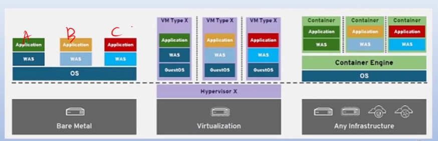

---

## 1. [OT] 도커 마스터로 가는 길
도커 학습은 전체 10개의 주제를 통해 컨테이너의 생성, 운영, 관리, 그리고 실제 애플리케이션 배포까지 전 과정을 다룹니다. 

*   **학습 구성**: 각 주제는 '이론 학습'과 '따라하며 배우는 실습' 두 가지 패턴으로 구성됩니다.
*   **주요 커리큘럼**:
    *   컨테이너의 이해 및 설치
    *   컨테이너 빌드 및 허브(Hub) 활용
    *   데이터 관리(스토리지) 및 네트워크 설정
    *   실제 애플리케이션의 컨테이너화 및 운영
*   **학습 팁**: 학습 영상을 먼저 본 후, 실습 영상을 함께 띄워놓고 직접 타이핑하며 따라 하는 방식이 권장됩니다.

## 2. 컨테이너와 도커의 핵심 개념
컨테이너는 현대 IT 인프라에서 요구하는 빠른 확장성과 효율성을 충족하기 위해 등장했습니다.

*   **컨테이너를 쓰는 이유**: 
    *   **효율성**: 가상 머신(VM)보다 용량이 작고 실행이 빠르며, 서비스 중단 없이 자유롭게 확장(Scale-out) 및 축소(Scale-in)가 가능합니다.
    *   **일관성**: 개발 환경의 설정(라이브러리, 플랫폼 등)을 컨테이너 안에 포함하므로, "개발 PC에선 됐는데 서버에선 안 된다"는 문제를 해결합니다.
*   **기술적 기반**: 도커는 리눅스 커널의 핵심 기능인 `chroot`(독립 공간), `Namespace`(격리), `Cgroups`(자원 할당)를 활용합니다.
*   **운영 환경**: 컨테이너는 리눅스 커널 기술을 사용하기 때문에 리눅스에서 가장 잘 동작하며, 윈도우나 맥에서는 하이퍼바이저를 통해 리눅스 커널을 서포팅하여 실행됩니다.

## 3. 실습 환경 준비: VirtualBox와 VM 생성
도커를 실습하기 위해 하이퍼바이저인 VirtualBox를 설치하고 가상 머신(VM)을 준비합니다.

*   **VirtualBox 설치**: 오라클 공식 사이트에서 OS에 맞는 버전을 다운로드하여 설치합니다.
*   **네트워크 설정 (NAT Network)**: 
    *   가상 머신들이 외부 인터넷과 통신하고, 호스트 PC에서 접속할 수 있도록 'NAT 네트워크'를 생성합니다.
    *   **포트 포워딩 설정**: 호스트의 특정 포트(예: 105번)로 접속하면 VM의 SSH 포트(22번)로 연결되도록 설정하여 원격 제어를 준비합니다.
*   **가상 머신 사양**: 
    *   **CPU**: 2 Cores
    *   **메모리**: 2GB (2048MB) 이상
    *   **디스크**: 20GB
    *   **대상 OS**: Ubuntu 및 CentOS용 VM을 각각 생성합니다.

## 4. 우분투(Ubuntu) 리눅스 설치 및 최적화
실습용 기본 OS로 Ubuntu 20.04 LTS를 설치하고 도커 운영에 최적화된 설정을 진행합니다.

*   **설치 과정**: ISO 이미지를 VM에 삽입하여 설치하며, 설치 중에는 원활한 진행을 위해 메모리를 일시적으로 4GB로 높이는 것이 좋습니다.
*   **주요 설정**:
    *   **네트워크**: 고정 IP(Static IP)를 할당(예: 10.100.0.105)하여 통신 안정성을 확보합니다.
    *   **원격 접속**: `openssh-server`를 설치하고 `ssh` 데몬이 실행 중인지 확인합니다.
    *   **모드 전환**: 시스템 리소스를 절약하기 위해 GUI 모드에서 텍스트 모드(Multi-user target) 부팅으로 변경합니다.
*   **스냅샷(Snapshot)**: 초기 설정이 완료된 상태를 '스냅샷'으로 저장하면, 나중에 실습 중 오류가 발생해도 언제든 깨끗한 상태로 되돌릴 수 있습니다.

## 5. 도커 설치 준비 및 유형
도커는 다양한 환경에 설치할 수 있으며, 사용자의 목적에 따라 선택 가능합니다.

*   **준비물**: 최소 사양 이상의 컴퓨터와 인터넷 연결이 필요합니다.
*   **설치 유형**:
    1.  **가상 머신 기반**: VirtualBox에 Ubuntu나 CentOS를 설치하고 그 위에 도커 엔진을 올리는 방식 (실제 운영 환경과 가장 유사함).
    2.  **데스크탑 기반**: 윈도우나 맥에 'Docker Desktop'을 직접 설치하는 방식 (빠른 실습에 용이함).

---
