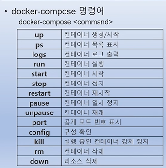

---

## 1. 컨테이너 간 통신과 네트워크 구조 (이론)
도커 컨테이너는 독립된 공간에서 실행되지만, 외부 및 컨테이너 간 통신을 위해 정교한 네트워크 구조를 가집니다.

*   **도커 0(docker0) 브리지**: 도커 데몬이 실행되면 자동으로 생성되는 가상 지능형 스위치입니다. 모든 컨테이너는 기본적으로 이 브리지에 연결되어 `172.17.0.x` 대역의 사설 IP를 할당받습니다.
*   **통신 원리**:
    *   **내부 통신**: 도커 0 브리지가 게이트웨이(`172.17.0.1`) 역할을 하며 컨테이너 간 L2 통신을 지원합니다.
    *   **외부 통신**: NAT(네트워크 주소 변환)와 IP 테이플(iptables) 룰을 통해 컨테이너의 사설 IP를 호스트의 공인 IP로 변환하여 외부로 나갑니다.
*   **포트 포워딩**: 외부 사용자가 호스트 IP의 특정 포트로 접속하면 이를 컨테이너의 포트로 연결해 주는 기술입니다. 동일한 호스트 포트를 여러 컨테이너가 공유할 수 없으므로 포트 충돌에 주의해야 합니다.
*   **사용자 정의 네트워크**: 기본 브리지 외에 사용자가 직접 네트워크를 생성하면, 컨테이너에 고정 IP(Static IP)를 할당하거나 논리적으로 격리된 환경을 구축할 수 있습니다.
*   **컨테이너 링크(--link)**: IP 주소가 유동적인 컨테이너 환경에서 별칭(Alias)을 이용해 프론트엔드(워드프레스)와 백엔드(DB) 컨테이너를 안전하게 연결하는 고전적인 방법입니다.

## 2. 도커 네트워크 실무 실습 (실습)
이론을 바탕으로 실제 네트워크를 구성하고 포트를 노출하며 멀티 티어 서비스를 구축해 봅니다.

*   **네트워크 확인 및 컨테이너 실행**:
    *   `ip addr` 또는 `brctl show` 명령으로 `docker0` 브리지의 상태를 확인합니다.
    *   컨테이너를 실행할 때마다 `172.17.0.2`, `0.3` 순으로 IP가 순차 할당되는 것을 `inspect` 명령으로 검증합니다.
*   **포트 매핑 실습**:
    *   `-p 80:80`: 호스트 80번 포트를 컨테이너 80번에 명시적으로 연결합니다.
    *   `-p 80`: 호스트의 랜덤한 빈 포트를 컨테이너 80번에 연결합니다.
    *   `-P` (대문자): Dockerfile에 `EXPOSE`로 정의된 모든 포트를 호스트의 랜덤 포트에 자동으로 연결합니다.
*   **네트워크 생성 및 고정 IP**:
    *   `docker network create --driver bridge --subnet 192.168.100.0/24 mynet` 명령으로 사용자 정의 네트워크를 만듭니다.
    *   `--ip` 옵션을 사용해 컨테이너에 특정 IP를 부여하고 통신 여부를 테스트합니다.
*   **멀티 티어 연동 실습**: MySQL 컨테이너를 먼저 실행하고, 워드프레스 컨테이너를 실행할 때 `--link` 옵션을 주어 데이터베이스와 웹 서버가 실제 통신하는 과정을 확인합니다.

## 3. 도커 컴포즈(Docker Compose)의 이해 (이론)
여러 개의 컨테이너를 하나의 서비스 단위로 정의하고 일괄 관리하기 위한 도구입니다.

*   **도커 컴포즈란?**: 복잡한 `docker run` 명령어를 일일이 입력하는 대신, YAML 형식의 설정 파일을 작성하여 문어(Compose 캐릭터)에게 명령을 내리는 것과 같습니다.
*   **YAML 파일 주요 문법**:
    *   `version`: 컴포즈 파일의 버전(예: 3.9)을 명시합니다.
    *   `services`: 실행할 컨테이너들의 목록을 정의합니다.
    *   `image` / `build`: 사용할 이미지나 빌드할 Dockerfile 경로를 지정합니다.
    *   `ports` / `volumes`: 포트 포워딩과 데이터 저장소 마운트를 설정합니다.
    *   `depends_on`: 컨테이너 간의 실행 순서(예: DB가 먼저 실행된 후 웹 실행)를 지정합니다.
*   **장점**: 한 번의 명령으로 서비스 전체를 생성, 시작, 중지, 삭제할 수 있어 빌드부터 운영까지의 효율성이 극대화됩니다.

## 4. 도커 컴포즈 활용 및 실습 (실습)
컴포즈를 설치하고 실제 애플리케이션을 배포하며 운영 기술을 익힙니다.

*   **설치 및 준비**: 리눅스 환경에서 바이너리 파일을 다운로드하고 실행 권한을 부여하여 설치를 완료합니다.
*   **예제 1: Flask + Redis 카운터 앱**: 
    *   파이썬 웹 소스와 `Dockerfile`을 준비합니다.
    *   `docker-compose.yml` 파일을 작성하여 웹과 레디스 서비스를 정의합니다.
    *   `docker-compose up -d`로 백그라운드 실행 후 웹 브라우저에서 카운트 증가를 확인합니다.
*   **운영 명령어**:
    *   `ps`: 실행 중인 서비스 목록 확인.
    *   `scale`: 특정 서비스(컨테이너)의 개수를 늘리거나 줄여 확장성을 테스트합니다.
    *   `down`: 모든 컨테이너와 네트워크를 일괄 삭제합니다.

*   **예제 2: 워드프레스 + MySQL**: 복잡한 환경 변수와 볼륨 설정을 컴포즈 파일 하나로 정리하여 단 몇 초 만에 완성된 웹 서비스를 구축합니다.

## 5. 최신 Ubuntu 22.04 환경의 도커 설치 및 관리
쿠버네티스 1.24 버전 이후의 변화에 대비하여 최신 우분투 환경에서 도커를 완벽하게 설치합니다.

*   **시스템 권장 사양**: Ubuntu 22.04 LTS, 2 Cores CPU, 4GB RAM, 50GB Disk 환경을 준비합니다.
*   **설치 프로세스 (Repository 방식)**:
    1.  `apt update` 및 필수 패키지(curl, gnupg 등) 설치.
    2.  도커 공식 GPG 키 등록 및 저장소(Repository) 추가.
    3.  `docker-ce`, `docker-ce-cli`, `containerd.io`, `docker-compose-plugin` 설치.
*   **사후 설정 (관리자 권한)**: 매번 `sudo`를 붙이지 않도록 현재 사용자를 `docker` 그룹에 추가하고 재로그인하여 권한을 적용합니다.
*   **설치 확인 및 테스트**: `docker version`으로 버전 정보를 확인하고, `nginx` 컨테이너를 실행하여 정상 작동 여부를 최종 점검합니다.
*   **라이선스 정책**: 2021년 변경된 정책에 따라 대기업 등 상업적 이용 시 유료 구독(Pro, Team, Business)이 필요할 수 있음을 숙지합니다.

---
