# [학습 정리] 패킷 지연의 이해와 웹 애플리케이션 계층 (HTTP)

---

## 1. 패킷 지연의 4가지 요소 (Four Sources of Packet Delay)

패킷이 한 노드(라우터)에서 다음 노드로 전달될 때 발생하는 총 지연 시간($d_{nodal}$)은 네 가지 요소의 합으로 결정됩니다.

1.  **노드 처리 지연 (Nodal Processing Delay):** 
    *   패킷 헤더를 조사하여 어디로 보낼지 결정하고, 비트 수준의 오류가 있는지 검사하는 시간입니다.
2.  **큐잉 지연 (Queueing Delay):** 
    *   패킷이 출력 링크로 나가기 위해 대기열(Queue)에서 기다리는 시간입니다.
    *   라우터의 혼잡도(Congestion level)에 따라 가변적으로 변하며, 대기열이 꽉 차면 패킷 손실(Loss)이 발생합니다.
3.  **전송 지연 (Transmission Delay):** 
    *   패킷의 모든 비트를 링크로 밀어내는 데 걸리는 시간입니다.
    *   공식: $d_{trans} = L/R$ ($L$: 패킷 길이(bits), $R$: 링크 대역폭(bps)).
4.  **전파 지연 (Propagation Delay):** 
    *   비트가 물리적인 매체(광케이블, 구리선 등)를 통해 다음 라우터까지 이동하는 시간입니다.
    *   공식: $d_{prop} = d/s$ ($d$: 링크의 물리적 거리, $s$: 매체 내 전파 속도 $\approx 2 \times 10^8$ m/sec).

> **💡 핵심 구분:** 전송 지연($L/R$)은 **데이터를 내보내는 속도**에 관한 것이고, 전파 지연($d/s$)은 **신호가 날아가는 속도**에 관한 것입니다.

---

## 2. 지연 시간의 비유: 자동차 행렬 (Caravan Analogy)

이해를 돕기 위해 10대의 자동차 행렬(패킷)과 톨게이트(라우터)를 예

*   **가정:** 톨게이트가 차 한 대를 처리하는 데 12초가 걸리고(전송 속도), 차는 시속 100km로 달립니다(전파 속도).
*   **전송 지연:** 10대의 차가 모두 톨게이트를 통과하는 데 걸리는 시간은 $12 \text{초} \times 10 = 120\text{초}$입니다.
*   **전체 지연:** 마지막 차가 다음 톨게이트(100km 지점)에 도착하는 시간은 전송 시간(120초) + 이동 시간(60분)을 합쳐 총 **62분**이 됩니다.

---

## 3. 네트워크 애플리케이션 구조

### 3.1 애플리케이션 작성 원칙
*   네트워크 앱은 서로 다른 엔드 시스템(Host)에서 실행되며 네트워크를 통해 통신하는 프로그램을 의미합니다.
*   **중요:** 개발자는 호스트용 소프트웨어만 작성하면 되며, **네트워크 코어 장치(라우터)용 소프트웨어는 작성할 필요가 없습니다**. 코어 장치는 사용자 애플리케이션을 실행하지 않기 때문입니다.

### 3.2 클라이언트-서버 구조 (Client-Server Architecture)
*   **서버 (Server):** 항상 켜져 있는 호스트이며, 고정된 IP 주소를 가집니다. 확장성을 위해 데이터 센터에 위치하기도 합니다.
*   **클라이언트 (Client):** 서버와 통신하며, 간헐적으로 연결될 수 있습니다. 동적 IP 주소를 가질 수 있으며, **클라이언트끼리는 직접 통신하지 않습니다**.

---

## 4. 프로세스 간 통신과 소켓 (Sockets)

### 4.1 프로세스 (Process)
*   호스트 내에서 실행되는 프로그램을 의미합니다.
*   동일 호스트 내의 프로세스는 운영체제가 정의한 통신 방식을 사용하지만, **서로 다른 호스트의 프로세스는 메시지 교환을 통해 통신합니다**.

### 4.2 소켓 (Socket): 통신의 문(Door)
*   프로세스는 **소켓**을 통해 메시지를 네트워크로 내보내거나 받습니다.
*   애플리케이션 계층과 전송 계층 사이의 인터페이스 역할을 하며, 개발자는 애플리케이션 계층을 제어하고 운영체제는 전송 계층 이하를 제어합니다.

---

## 5. 웹과 HTTP (HyperText Transfer Protocol)

### 5.1 기본 개념
*   웹 페이지는 여러 개의 **객체(Object)**(HTML 파일, 이미지, Java 애플릿 등)로 구성됩니다.
*   각 객체는 **URL**을 통해 위치를 파악하며, URL은 호스트 이름과 경로 이름으로 나뉩니다.

### 5.2 HTTP의 특징
*   **클라이언트/서버 모델:** 브라우저(클라이언트)가 요청(Request)하면 웹 서버가 응답(Response)합니다.
*   **TCP 사용:** 80번 포트를 통해 서버와 TCP 연결을 설정한 후 메시지를 주고받습니다.
*   **비상태 유지 (Stateless):** 서버는 과거 클라이언트의 요청 정보를 유지하지 않습니다.

### 5.3 지속 연결 vs 비지속 연결
1.  **비지속 HTTP (Non-persistent HTTP):** 
    *   한 번의 TCP 연결로 **단 하나의 객체**만 전송하고 연결을 끊습니다.
    *   여러 객체를 받으려면 여러 번의 연결 설정이 필요합니다.
2.  **지속 HTTP (Persistent HTTP):** 
    *   단일 TCP 연결을 통해 **여러 객체**를 연속해서 보낼 수 있습니다.

---

## 6. 응답 시간 계산: RTT (Round Trip Time)

**RTT**는 작은 패킷이 클라이언트에서 서버로 갔다가 다시 돌아오는 데 걸리는 시간입니다.

*   **비지속 HTTP의 응답 시간 구성:**
    1.  TCP 연결 설정을 위한 1 RTT.
    2.  HTTP 요청 및 데이터 첫 바이트 수신을 위한 1 RTT.
    3.  파일 전송 시간 (File Transmission Time).
*   **총 응답 시간 = $2 \text{ RTT} + \text{전송 시간}$**.

이 구조를 이해하면 웹 페이지 로딩 속도가 왜 RTT와 전송 속도에 의존하는지 명확히 알 수 있습니다. 특히 많은 이미지가 포함된 페이지에서 비지속 HTTP를 사용하면 매번 연결 설정을 위해 2 RTT가 추가되므로 비효율적입니다.


# [학습 정리] 소켓 프로그래밍과 트랜스포트 계층의 기초

## 1. 소켓(Socket)의 개념
소켓은 **애플리케이션 프로세스와 네트워크(OS 내부 구현) 간의 인터페이스**입니다. 개발자는 OS 내부의 복잡한 구현을 몰라도 OS가 제공하는 이 API(소켓)를 통해 다른 컴퓨터의 프로세스와 통신할 수 있습니다.

*   **통로 역할:** 프로세스는 소켓이라는 '문'을 통해 메시지를 내보내거나 받습니다.
*   **두 가지 타입:** OS는 트랜스포트 계층의 두 프로토콜에 맞춰 두 종류의 소켓을 제공합니다.
    1.  **SOCK_STREAM (TCP):** 신뢰성 있는 전송, 순서 보장, 연결 지향형 통신.
    2.  **SOCK_DGRAM (UDP):** 신뢰성 없는 전송, 순서 보장 없음, 비연결형 통신.

---

## 2. TCP 소켓 통신의 흐름 (Big Picture)

TCP 통신은 데이터를 주고받기 전, 클라이언트와 서버 간의 **'단단한 연결 고리'**를 형성하는 과정이 필요합니다.

### [그림: TCP 소켓 함수 호출 순서]
```text
      [TCP Server]                        [TCP Client]
        socket() <--- 소켓 생성
           |
         bind()   <--- 특정 포트 번호 할당
           |
         listen() <--- 접속 대기 상태 전환
           |
         accept() <--- 클라이언트 요청 대기 (Blocking)
           |                                socket()  <--- 소켓 생성
           |                                   |
           |<------- [Connection Request] -----connect() <--- 서버에 연결 요청
           |          (3-way handshaking)      |
    (연결 완료)                                (연결 완료)
           |                                   |
         read()   <------- [Data Request] -----write()   <--- 데이터 전송
           |                                   |
     (요청 처리)                                  |
           |                                   |
         write()  -------- [Data Reply] ------>read()    <--- 데이터 수신
           |                                   |
         close()  <--------------------------->close()   <--- 연결 종료
```

---

## 3. 핵심 소켓 API 상세 설명

### 3.1 소켓 생성 및 설정
*   **`socket(domain, type, protocol)`**: 소켓 자료구조를 생성하고 해당 소켓의 아이디(File Descriptor)를 반환합니다.
    *   `domain`: 프로토콜 가족 (예: `PF_INET`은 IPv4 사용).
    *   `type`: 소켓 타입 (`SOCK_STREAM`은 TCP, `SOCK_DGRAM`은 UDP).
*   **`bind(sockfd, myaddr, addrlen)`**: 생성된 소켓에 특정 IP 주소와 **포트 번호**를 부여합니다. 서버는 특정 포트(예: 웹 서버 80번)에서 기다려야 하므로 반드시 필요합니다.
*   **`listen(sockfd, backlog)`**: 소켓을 연결 요청을 듣는 용도로 설정합니다. `backlog`는 대기열의 크기를 의미합니다.
*   **`accept()`**: 클라이언트의 연결 요청이 올 때까지 **블로킹(대기)**하다가, 연결이 들어오면 새로운 소켓을 생성하여 반환합니다. 이때 클라이언트의 IP와 포트 정보도 함께 저장됩니다.

### 3.2 연결 및 데이터 전송
*   **`connect(sockfd, servaddr, addrlen)`**: 클라이언트가 서버의 주소와 포트 번호를 지정하여 연결을 요청합니다.
*   **`write()` / `read()`**: 연결된 소켓을 통해 데이터를 전송하거나 읽습니다. TCP의 경우 한쪽에서 쓰면 마법처럼 상대방 소켓으로 튀어나옵니다.
*   **`close(sockfd)`**: 통신이 끝나면 소켓 자원을 해제합니다.

---

## 4. 완벽한 예제 코드 (C 언어 기반)

### 4.1 서버 코드 (Server)
```c
#include <stdio.h>       // 기본 입출력 헤더
#include <stdlib.h>      // 문자열 변환, 메모리 할당, 프로세스 제어 등 표준 유틸리티 함수를 제공
#include <errno.h>      // 오류 발생 시 시스템이 설정하는 에러 번호(errno)와 관련 매크로를 정의
#include <string.h>     // strlen, strcpy 등 문자열을 처리하고 조작하는 함수들을 제공합니다.
#include <sys/types.h>   // 시스템 호출과 데이터 구조에 사용되는 다양한 기본 시스템 데이터 타입들을 정의합니다
#include <sys/wait.h>   // fork로 생성된 자식 프로세스의 종료를 기다리고 상태를 확인하는 함수를 제공합니다.
#include <sys/socket.h>  // 소켓 핵심 API 헤더
#include <netinet/in.h>  // 인터넷 프로토콜 관련 헤더

#define PORT 3490        // 서버가 사용할 포트 번호
#define BACKLOG 10       // 대기열에 담을 최대 연결 수

int main() {
    int sockfd, new_fd;            // 듣기용 소켓과 실제 연결된 새 소켓의 아이디
    struct sockaddr_in my_addr;    // 서버 자신의 주소 정보 구조체
    struct sockaddr_in their_addr; // 연결된 클라이언트의 주소 정보 구조체
    int sin_size;

    // 1. 소켓 생성 (IPv4, TCP 방식)
    // socket() 함수로 소켓을 생성하고 실패 시 -1을 반환합니다.
    if ((sockfd = socket(PF_INET, SOCK_STREAM, 0))==-1){
        // 소켓 생성 실패 이유(에러 메시지)를 콘솔에 표준 오류로 출력합니다.
        perror("socket");
        // 프로그램에 에러(1)가 발생했음을 알리고 즉시 종료합니다.
        exit(1);
    } //
    
    // 2. 주소 설정
    my_addr.sin_family = AF_INET;         // 주소 체계: IPv4
    my_addr.sin_port = htons(PORT);       // 포트 번호를 네트워크 바이트 순서로 변환
    my_addr.sin_addr.s_addr = htonl(INADDR_ANY); // 호스트의 어떤 IP로든 접속 허용

    // 3. 바인드: 소켓에 IP와 포트 할당
    if (bind(sockfd, (struct sockaddr *)&my_addr, sizeof(struct sockaddr)) == -1){
        perror("bind");
        exit(1);
    } //

    // 4. 리슨: 접속 대기 상태로 전환
    if (listen(sockfd, BACKLOG) == -1){
        perror("listen");
        exit(1);
    } //

    while(1) { // 서버는 계속해서 클라이언트를 받아들임
        sin_size = sizeof(struct sockaddr_in);
        // 5. 억셉트: 클라이언트 연결 시까지 대기(Blocking), 연결 시 새로운 소켓(new_fd) 반환
        if ((new_fd = accept(sockfd, (struct sockaddr *)&their_addr, &sin_size)) == -1){
            perror("accept");
            continue;
        } //
        
        printf("server: got connection from %s\n", inet_ntoa(their_addr.sin_addr));
        
        // 6. 데이터 전송 (생략 없이 진행 시 write/read 단계)
        // int write (int sockfd, char* buf, size_t nbytes);
        write(new_fd, "Hello World!", 12); // 연결된 소켓에 메시지 작성
        close(new_fd); // 개별 연결 종료
    }
}
```

### 4.2 클라이언트 코드 (Client)
```c
int main() {
    int sockfd;
    struct sockaddr_in their_addr; // 서버의 주소 정보를 담을 구조체

    // 1. 소켓 생성 (TCP 방식)
    if ((sockfd = socket(PF_INET, SOCK_STREAM, 0)) == -1){
        perror ("socker");
        exit(1);
    } //

    // 2. 연결할 서버의 주소 설정
    their_addr.sin_family = AF_INET; 
    their_addr.sin_port = htons(3490); // 서버의 포트 번호
    their_addr.sin_addr.s_addr = inet_addr("127.0.0.1"); // 서버의 IP 주소

    // 3. 커넥트: 서버에 연결 요청 (이때 서버 주소 정보가 필요함)
    if (connect(sockfd, (struct sockaddr *)&their_addr, sizeof(struct sockaddr)) == -1){
        perror("connect");
        exit(1);
    } //

    // 4. 데이터 수신 및 종료
    // read(sockfd, buf, sizeof(buf)); // 서버가 보낸 메시지 읽기
    // int close (int sockfd); : when finished using a socket, the socket should be closed
    close(sockfd); //
}
```

* ** 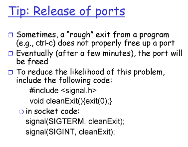
---

## 5. 다중화(Multiplexing)와 역다중화(Demultiplexing)

트랜스포트 계층의 핵심 기능 중 하나는 여러 애플리케이션의 데이터를 모으고(MUX), 받은 데이터를 알맞은 애플리케이션으로 배달하는 것(DeMUX)입니다.
*   **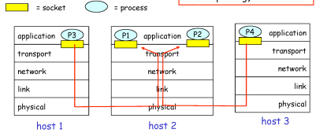
*   **다중화(Multiplexing):** 송신 호스트에서 여러 소켓으로부터 내려오는 데이터를 모아 헤더를 붙여 하위 계층으로 보내는 과정.
*   **역다중화(Demultiplexing):** 수신 호스트에서 트랜스포트 계층 세그먼트를 받아, 헤더의 정보를 보고 **정확한 소켓**으로 데이터를 전달하는 과정.

### 5.1 UDP vs TCP 역다중화 방식
*   **UDP 역다중화 (2-tuple):** **목적지 IP와 목적지 포트 번호**만 보고 판단합니다. 따라서 출발지가 달라도 목적지 정보가 같으면 같은 소켓으로 들어갑니다.
*   **TCP 역다중화 (4-tuple):** **출발지 IP, 출발지 포트, 목적지 IP, 목적지 포트** 네 가지 정보를 모두 봅니다. 이 중 하나만 달라도 다른 소켓으로 분류됩니다.
    *   이 덕분에 웹 서버는 수천 명의 클라이언트를 각각 고유한 소켓으로 관리하며 일대일 통신(Connection-oriented)이 가능합니다.
    *   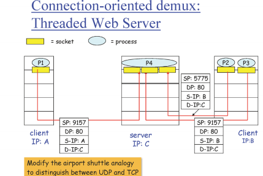

---

## 6. UDP (User Datagram Protocol) 심화

UDP는 군더더기 없는(No frills) 아주 단순한 전송 방식입니다.

### 6.1 UDP를 사용하는 이유
1.  **연결 설정 지연 없음:** 3-way handshaking 과정이 없어 즉시 전송 가능합니다.
2.  **단순함:** 상태 정보(Connection state)를 유지하지 않아 관리가 쉽습니다.
3.  **헤더 크기 작음:** TCP보다 오버헤드가 적습니다.
4.  **혼잡 제어 없음:** 애플리케이션이 원하는 속도로 데이터를 쏟아낼 수 있어 실시간 앱에 유리합니다.

### 6.2 UDP 헤더 구조 (총 8바이트)
UDP 헤더는 딱 4개의 필드(각 16비트)로 구성됩니다.
1.  **Source Port:** 보내는 쪽의 포트 번호.
2.  **Dest Port:** 받는 쪽의 포트 번호 (역다중화에 사용).
3.  **Length:** 헤더를 포함한 전체 세그먼트의 길이.
4.  **Checksum:** 데이터 전송 중 비트 오류가 발생했는지 확인하는 용도.

*   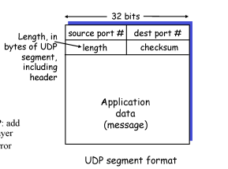

> **주의:** UDP는 아무것도 안 해주는 것 같지만, 최소한 **역다중화**와 **에러 체크(Checksum)** 기능은 제공합니다. 에러가 발견된 패킷은 상위 계층으로 올리지 않고 드랍(Drop)됩니다.

---

# 📚 신뢰성 있는 데이터 전송의 원리 (RDT)

## 1. 개요: 왜 트랜스포트 계층에서 RDT가 필요한가?

*   **애플리케이션 계층의 요구:** 프로세스 간 통신 시 데이터가 **하나도 유실되지 않고 에러 없이** 전달되기를 원하며, 이를 위해 '신뢰성 있는 채널'이라는 환상이 필요합니다.
*   **하위 계층(네트워크)의 현실:** 실제 데이터가 전송되는 경로는 라우터의 큐가 꽉 차서 발생하는 **패킷 유실(Loss)**과 케이블 문제 등으로 인한 **비트 에러(Error)**가 가득한 '비신뢰적 채널'입니다.
*   **트랜스포트 계층의 의무:** 비신뢰적인 환경 위에서 복잡한 메커니즘을 동원해 상위 계층에 신뢰성을 보장해야 합니다. 이는 마치 호수 위에 우아하게 떠 있는 백조(애플리케이션)를 위해 물속에서 쉴 새 없이 발길질하는 것과 같습니다.
*   **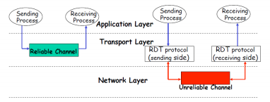

---

## 2. RDT 프로토콜의 단계적 진화 (FSM & 논리 코드)
*   **FSM 활용**: 송신측과 수신측의 복잡한 동작과 상태 변화를 명확하게 규정하기 위해 FSM 모델을 사용합니다.
*   **Stop-and-Wait(정지-대기) 프로토콜**: 송신측이 패킷을 하나 보내면, 수신측의 확인 응답(ACK)을 받을 때까지 다음 패킷을 보내지 않고 대기하는 단순한 방식을 가정합니다.
*   **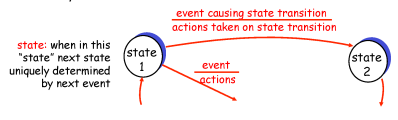

우리는 한 번에 하나의 패킷만 보내고 확인하는 **Stop-and-Wait(전송 후 대기)** 방식을 기준으로 프로토콜을 설계합니다.

### 🛠️ Rdt 1.0: 완벽한 채널 (Perfect Channel)
*   **가정:** 하위 채널에서 패킷 에러와 유실이 전혀 발생하지 않음.
*   **구현:** 송신자는 그냥 보내고, 수신자는 그냥 받으면 됩니다. 추가 장치가 필요 없습니다.

### 🛠️ Rdt 2.0: 에러 대응 (Packet Error)
*   **가정:** 패킷이 깨지는 에러는 발생하지만, 유실은 없는 상황.
*   **핵심 메커니즘:**
    1.  **에러 검출:** 패킷에 **Checksum** 비트를 추가합니다.
    2.  **피드백:** 잘 받았으면 **ACK**, 에러 시 **NAK**를 전송합니다.
    3.  **재전송:** 송신자가 NAK를 받으면 해당 패킷을 다시 보냅니다.

### 🛠️ Rdt 2.1: 피드백 에러와 순서 번호 (Sequence Number)
*   **문제:** 수신자가 보낸 **ACK/NAK 자체가 깨지면** 송신자는 판단이 불가능해져 재전송을 하게 되고, 수신자는 이것이 '새 것'인지 '중복'인지 알 수 없습니다.
*   **해결:** 패킷에 **순서 번호(0, 1)**를 붙입니다.
*   **수신자 대응:** 기다리던 번호가 아닌 중복 패킷이 오면 버리고, 송신자가 다음으로 넘어갈 수 있도록 **다시 ACK**를 보냅니다.
*   **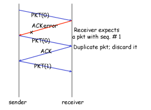

### 🛠️ Rdt 2.2: NAK-free 프로토콜
*   **방법:** NAK 없이 ACK만 사용합니다.
*   **로직:** 수신자는 ACK 전송 시 **가장 마지막으로 성공적으로 받은 패킷의 번호**를 적습니다. 송신자가 1번을 보냈는데 수신자가 `ACK 0`을 보내면 1번의 에러로 판단합니다.

---

## 3. Rdt 3.0: 유실 대응과 타이머 (The Reality)

패킷과 피드백이 공중에서 사라지는 **유실** 상황을 해결하기 위해 **타이머(Timer)**를 도입합니다.

### 📉 Rdt 3.0의 주요 작동 시나리오

**(a) 정상 동작 (No Loss)**
*   Sender: `pkt 0` 전송 → Receiver: 수신 및 `ACK 0` 전송 → Sender: `ACK 0` 확인 후 타이머 정지.
*   **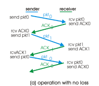

**(b) 패킷 유실 (Packet Loss)
*   **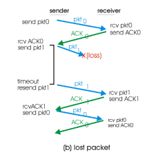

**(c) ACK 유실 (ACK Loss)**
*   Receiver가 `pkt 1`을 잘 받아 `ACK 1`을 보냈으나 유실됨 → Sender는 침묵을 견디다 못해 타임아웃 → `pkt 1` 재전송 → **Receiver는 순서 번호(1)를 보고 중복임을 감지하여 폐기**하고 다시 `ACK 1` 전송.
*   **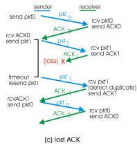

**(d) 성급한 타임아웃 (Premature Timeout)**
*   네트워크 지연으로 ACK가 늦게 옴 → Sender가 미리 타임아웃되어 재전송 → 나중에 도착한 지연된 ACK와 중복 패킷들은 순서 번호 체크를 통해 무시됨.
*   **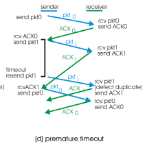
---

## 4. 완벽한 논리 코드 구현 (RDT 3.0 Sender)

교수님의 설명과 FSM 자료를 바탕으로 작성된 한 줄 주석 포함 코드입니다.

```python
# --- RDT 3.0 송신자(Sender) 로직 ---
class RDTSender:
    def __init__(self):
        self.seq_num = 0              # 보낼 패킷 번호 (0 또는 1)
        self.state = "WAIT_CALL"      # 초기 상태: 상위 호출 대기

    def rdt_send(self, data):
        """상위 계층에서 데이터 전송 요청 시 호출"""
        if self.state == "WAIT_CALL":
            # 1. 패킷 생성 (순서번호, 데이터, 체크섬 포함)
            packet = make_pkt(self.seq_num, data, checksum) 
            # 2. 비신뢰적 채널로 전송
            udt_send(packet) 
            # 3. 패킷 유실 대비 타이머 가동 (째깍째깍 시작)
            start_timer() 
            # 4. ACK를 기다리는 상태로 변경
            self.state = "WAIT_ACK"

    def receive_feedback(self, ack_pkt):
        """수신자로부터 피드백 패킷이 도착했을 때 호출"""
        if self.state == "WAIT_ACK":
            # 에러가 없고, 내가 보낸 번호(self.seq_num)에 대한 ACK라면 성공!
            if not corrupt(ack_pkt) and isACK(ack_pkt, self.seq_num):
                stop_timer()          # 정상 확인되었으니 타이머 정지
                self.seq_num = 1 - self.seq_num # 다음 번호로 교체 (0->1, 1->0)
                self.state = "WAIT_CALL" # 다시 상위 요청 대기 상태로
            else:
                # 에러가 있거나 번호가 틀리면 무시하고 타임아웃을 기다림
                pass 

    def timeout_event(self):
        """정해진 시간 내에 응답이 없어 타이머 알람이 터졌을 때 호출"""
        # "내 말 못 들었어?"라며 마지막 패킷 재전송
        udt_send(self.last_packet) 
        # 다시 타이머를 맞추고 기다림
        start_timer() 
```

---

## 5. 성능 분석: 왜 Stop-and-Wait은 안 되는가?

Rdt 3.0은 신뢰성은 완벽하지만, 성능 면에서는 **"Stinks(형편없음)"**라고 불립니다.

### 📈 성능 계산 수식
*   **전송 지연($d_{trans}$):** 패킷을 밀어내는 시간. $L$ (패킷 길이) / $R$ (전송 속도).
*   **이용률($U_{sender}$):** 전체 시간 중 실제로 데이터를 보낸 시간의 비율.
    $$U_{sender} = \frac{L/R}{RTT + L/R}$$

### 📉 실제 계산 예시
*   **조건:** 1Gbps 링크, 30ms RTT, 1KB 패킷.
*   $L/R = 8,000 \text{ bits} / 10^9 \text{ bps} = 0.008 \text{ ms}$.
*   $U_{sender} = 0.008 / (30 + 0.008) = \mathbf{0.00027}$.
*   **결과:** 실제 대역폭의 **0.027%**만 사용 중입니다. 16차선 고속도로에 차 한 대만 띄엄띄엄 보내는 꼴입니다.

---

## 6. 결론: 파이프라인 프로토콜 (Pipelining)

이 비효율성을 극복하기 위해 실제 TCP는 피드백을 기다리지 않고 여러 패킷을 **연속해서 쏟아붓는** 파이프라이닝 방식을 사용합니다.

1.  **Go-Back-N (GBN):** 유실 발생 시 유실된 패킷부터 그 이후의 모든 패킷을 통째로 재전송합니다.
2.  **Selective Repeat (SR):** 유실된 특정 패킷만 골라서 영리하게 재전송합니다.

**최종 요약:** 에러 체크(**Checksum**), 중복 구분(**Sequence #**), 유실 대응(**Timer**), 성능 확보(**Pipelining**)라는 이 핵심 원리들은 실제 TCP 헤더에 그대로 녹아들어 현대 인터넷의 신뢰성을 지탱하고 있습니다.