제공해주신 강의 자료(5.pdf)와 이석복 교수님의 5강 강의 내용을 바탕으로, **파이프라인 프로토콜의 두 가지 핵심 방식인 Go-Back-N(GBN)과 Selective Repeat(SR)**에 대해 초보자도 완벽히 이해할 수 있도록 아주 상세하게 정리해 드립니다.

---

# 🌐 [학습 정리] 파이프라인 프로토콜: Go-Back-N(GBN)과 Selective Repeat(SR)

## 1. 도입: RDT 3.0의 성능 위기와 해결책

### 1.1 RDT 3.0의 복습 및 한계
지난 시간에 신뢰성 있는 전송(RDT)을 위해 **에러 검출, 피드백, 재전송, 순서 번호, 타이머**라는 5가지 메커니즘을 배움. RDT 3.0은 완벽하게 동작하지만, **성능이 매우 낮다(Stinks)**는 치명적인 단점이 있습니다.

*   **이용률(Utilization) 계산:**
    $$U_{sender} = \frac{L/R}{RTT + L/R}$$
    *   1Gbps 링크에서 1KB 패킷을 보낼 때, 이용률은 고작 **0.00027(0.027%)**에 불과합니다.
*   **원인:** 한 번에 패킷 하나만 보내고 ACK가 올 때까지 송신자가 아무것도 안 하고 놀기 때문입니다 (Stop-and-Wait).

### 1.2 해결책: 파이프라이닝 (Pipelining)
고속도로에 차 한 대만 보내는 것이 아니라, **여러 대를 동시에 쏟아붓는 방식**입니다.
*   **개념:** 송신자가 확인 응답(ACK)을 받기 전에 여러 패킷을 **"in-flight(날아가고 있는 중)"** 상태로 유지하는 것입니다.
*   **효과:** 한 번에 $N$개의 패킷을 보내면 이용률이 약 $N$배로 증가합니다.
*   **필요 조건:** 순서 번호의 범위가 늘어나야 하며, 송신자나 수신자 측에 패킷을 저장할 **버퍼(Buffer)**가 필요해집니다.

---

## 2. Go-Back-N (GBN): "문제가 생기면 다 같이 돌아가자"

GBN은 여러 패킷을 한꺼번에 보내되, 오류가 발생하면 **해당 시점부터 보낸 모든 패킷을 재전송**하는 방식입니다.

### 2.1 주요 특징
1.  **윈도우(Window):** 피드백 없이 한꺼번에 보낼 수 있는 패킷의 최대 개수($N$)입니다.
2.  **누적 확인 응답 (Cumulative ACK):** "ACK $n$"은 **"$n$번 패킷까지 하나도 빠짐없이 잘 받았다"**는 뜻입니다. 12번을 기다리고 있다는 의미이기도 합니다.
3.  **단일 타이머:** 송신자는 가장 오래된 "확인 안 된 패킷"을 위해 **단 하나의 타이머**만 유지합니다.
4.  **단순한 수신자:** 수신자는 버퍼가 없습니다. 순서가 어긋난 패킷이 오면 그냥 버립니다.

### 2.2 GBN 송신자 로직 (FSM 기반 상세 주석)
```python
# GBN 송신자(Sender) 로직 시뮬레이션
class GBNSender:
    def __init__(self, window_size):
        self.N = window_size           # 윈도우 크기 (한 번에 보낼 수 있는 최대량)
        self.base = 1                  # 확인 안 된 가장 오래된 패킷의 번호
        self.next_seq_num = 1          # 다음에 새로 보낼 패킷의 번호
        self.packets = {}              # 재전송을 위해 보관 중인 패킷 버퍼

    def rdt_send(self, data):
        # 1. 윈도우가 가득 차지 않았는지 확인 (next_seq_num < base + N)
        if self.next_seq_num < self.base + self.N:
            # 패킷을 만들고 저장한 뒤 전송
            pkt = make_pkt(self.next_seq_num, data)
            self.packets[self.next_seq_num] = pkt
            udt_send(pkt)
            
            # 2. 가장 오래된 패킷이라면 타이머 시작
            if self.base == self.next_seq_num:
                start_timer()
            
            self.next_seq_num += 1     # 다음 번호 준비
        else:
            # 윈도우가 꽉 찼으면 상위 계층의 요청을 거절함
            refuse_data(data)

    def receive_ack(self, ack_n):
        # 3. 누적 ACK 처리: ack_n을 받으면 n번까지는 안전함
        self.base = ack_n + 1          # 윈도우의 시작점을 다음으로 옮김 (윈도우 전진)
        
        if self.base == self.next_seq_num:
            stop_timer()               # 모든 패킷이 확인되었으면 타이머 종료
        else:
            start_timer()               # 아직 확인 안 된 패킷이 남았으면 타이머 다시 시작

    def timeout_event(self):
        # 4. 타임아웃 발생 시: 윈도우 안의 모든 패킷을 다시 보냄 (Go-Back-N의 핵심)
        start_timer()
        for i in range(self.base, self.next_seq_num):
            udt_send(self.packets[i])  # base부터 끝까지 싹 다 재전송
```

### 2.3 GBN 작동 시나리오 (유실 발생 시)
*   송신자가 0, 1, 2, 3번을 보냅니다.
*   2번 패킷이 가다가 유실되었습니다.
*   수신자는 0, 1번은 잘 받아 ACK 0, ACK 1을 보냅니다.
*   수신자에게 3번이 도착하지만, 수신자는 **"나는 2번을 기다리고 있는데 3번이 왔네?"**라며 3번을 버리고 마지막으로 잘 받은 번호인 **ACK 1**을 다시 보냅니다.
*   송신자는 결국 2번에 대한 타임아웃이 터지고, **2, 3번을 모두 다시 보냅니다**.
*   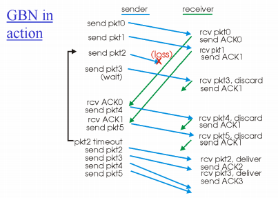

---

## 3. Selective Repeat (SR): "필요한 것만 다시 보내자"

GBN은 패킷 하나만 잘못되어도 $N$개를 다 다시 보내야 하는 낭비가 있습니다. SR은 이를 보완하여 **문제가 생긴 패킷만 골라서 재전송**합니다.

### 3.1 주요 특징
1.  **개별 확인 응답 (Individual ACK):** 패킷 하나하나에 대해 ACK를 보냅니다.
2.  **수신자 버퍼링:** 순서가 맞지 않게 도착한 패킷도 버리지 않고 일단 저장해 둡니다.
3.  **개별 타이머:** 송신자는 **모든 패킷마다 각각 타이머**를 달아 유실 여부를 체크합니다.
4.  **선택적 재전송:** 타임아웃이 터진 특정 패킷만 다시 보냅니다.

### 3.2 작동 시나리오 (유실 발생 시)
*   송신자가 0, 1, 2, 3번을 보냅니다.
*   2번이 유실됩니다.
*   수신자는 0, 1번 받고 ACK 0, ACK 1 전송. 3번이 오면 버리지 않고 **버퍼에 저장**한 뒤 ACK 3을 보냅니다.
*   송신자는 2번에 대해서만 타임아웃이 터져 **2번만 다시 보냅니다**.
*   수신자는 재전송된 2번을 받아 버퍼에 있던 3번과 합쳐서 상위 계층으로 올립니다.
*   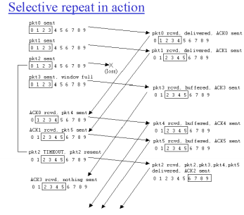
---

## 4. 시퀀스 번호의 딜레마 (중요!)

패킷의 순서 번호는 무한정 늘릴 수 없고 한정된 비트 내에서 재사용해야 합니다. 이때 **윈도우 크기($N$)와 순서 번호의 범위** 사이에는 밀접한 관계가 있습니다.

*   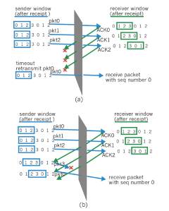
*   **문제 상황:** 윈도우 크기가 3이고 순서 번호가 0, 1, 2, 3만 있다면?
    *   송신자가 0, 1, 2번을 보내고 수신자가 다 받았지만, ACK들이 몽땅 유실되었습니다.
    *   수신자는 다음 윈도우인 3, 0, 1번을 기다립니다.
    *   송신자는 타임아웃으로 **이전 윈도우의 0번**을 재전송합니다.
    *   수신자는 이게 **새로 받아야 할 0번**인지, **옛날에 받았던 0번의 재전송**인지 구분할 수 없게 됩니다.
*   **결론:** 시퀀스 번호의 범위는 최소한 **윈도우 크기의 2배 이상**이어야 안전합니다.

---

## 5. 요약 및 TCP 예고

| 구분 | Go-Back-N (GBN) | Selective Repeat (SR) |
| :--- | :--- | :--- |
| **ACK 방식** | 누적 (Cumulative) | 개별 (Individual) |
| **타이머** | 가장 오래된 패킷용 1개 | 패킷마다 각각 1개 |
| **수신자 버퍼** | 없음 (순서 어긋나면 드랍) | 있음 (일단 저장) |
| **재전송** | 유실 패킷부터 윈도우 전체 | 유실된 특정 패킷만 |

실제 우리가 사용하는 **TCP**는 이 두 방식의 장점을 섞어서 구현되어 있습니다. 모든 패킷에 타이머를 달면 부하가 너무 크기 때문에, 실제로는 GBN처럼 **타이머 하나와 누적 ACK**를 사용하면서도, SR처럼 **영리하게 동작**하도록 설계되어 있습니다. 다음 6강부터는 본격적으로 TCP가 어떻게 이 복잡한 일들을 해내는지 배우게 됩니다.


---

# [학습 정리] TCP의 구조와 신뢰성 있는 전송 메커니즘

## 1. TCP(Transmission Control Protocol) 개요
TCP는 전송 계층의 핵심 프로토콜로, 비신뢰적인 IP 계층 위에서 신뢰성 있는 데이터를 전송하기 위해 다음과 같은 특징을 가집니다.

*   **Point-to-Point:** 단 한 쌍의 소켓 간의 통신을 관장합니다.
*   **Reliable, In-order Byte Stream:** 데이터 유실 없이 보낸 순서대로 전달하며, 메시지 경계가 없는 바이트 스트림 방식으로 데이터를 전송합니다.
*   **Full Duplex Data:** 같은 연결에서 양방향으로 데이터가 동시에 흐를 수 있습니다.
*   **Pipelined:** 성능 향상을 위해 여러 세그먼트를 한꺼번에 쏟아붓는 방식을 사용하며, 윈도우 크기에 의해 전송량이 결정됩니다.
*   **Connection-Oriented:** 데이터 교환 전 송수신자 간의 상태를 초기화하는 핸드쉐이킹 과정이 필요합니다.
*   **Flow & Congestion Control:** 수신자의 소화 능력과 네트워크 혼잡 상황에 맞춰 전송 속도를 조절합니다.
*   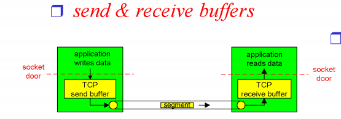
---

## 2. TCP 세그먼트 구조 (Segment Structure)
애플리케이션 메시지는 TCP 세그먼트의 **데이터(Payload)** 부분에 담기며, 앞부분에 부가 정보인 **헤더(Header)**가 붙습니다.

*   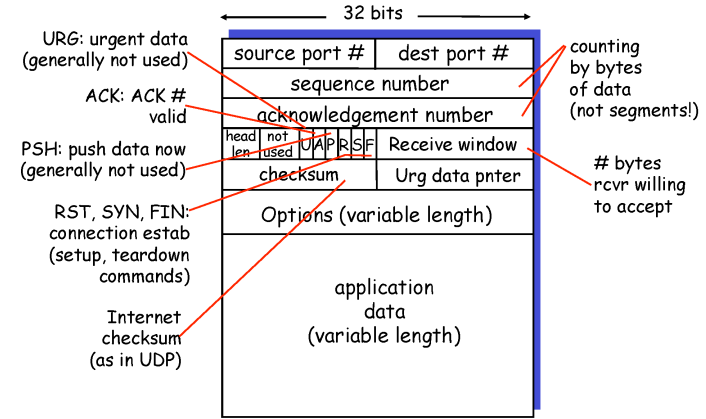

*   **포트 번호 (Source/Dest Port):** 각각 16비트로, 한 컴퓨터 내에서 최대 약 65,000개의 애플리케이션을 식별할 수 있습니다.
*   **순서 번호 (Sequence Number):** 세그먼트에 담긴 첫 번째 바이트의 바이트 스트림 번호입니다.
*   **확인 응답 번호 (Acknowledgement Number):** **누적 확인 응답(Cumulative ACK)** 방식을 사용하며, "n번까지 잘 받았으니 n번을 보내달라"는 의미입니다.
*   **체크섬 (Checksum):** 데이터 전송 중 비트 에러 발생 여부를 확인합니다.
*   **수신 윈도우 (Receive Window):** 수신 버퍼의 남은 공간을 알려주어 흐름 제어(Flow Control)를 가능하게 합니다.
*   **플래그 비트:** 연결 설정 및 종료(SYN, FIN), 응답(ACK) 등을 나타내는 비트들입니다.

---

## 3. 순서 번호와 ACK의 동작 원리
TCP는 데이터를 **바이트 단위**로 관리합니다.

*   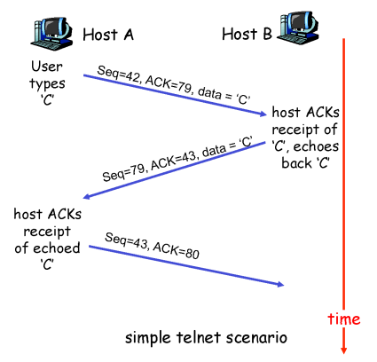
*   **Sequence Number 예시:** 100바이트의 데이터를 8바이트씩 보낸다면, 첫 번째 세그먼트의 순서 번호는 0, 두 번째는 8이 됩니다.
*   **ACK Number 예시:** 수신자가 42번 바이트까지 완벽하게 받았다면, 다음으로 기대하는 번호인 `ACK 43`을 보냅니다.
*   **에코 서버 시나리오:** 클라이언트가 'C'라는 1바이트 문자를 보낼 때 `Seq=42, ACK=79`라면, 서버는 이를 받고 `Seq=79, ACK=43`으로 응답하며 데이터를 다시 돌려줍니다.

---

## 4. 타임아웃(Timeout) 설정과 RTT 추정
재전송 타이머의 기준이 되는 타임아웃 값은 네트워크 상황에 따라 동적으로 변하는 **RTT(Round Trip Time)**를 기반으로 설정해야 합니다.

*   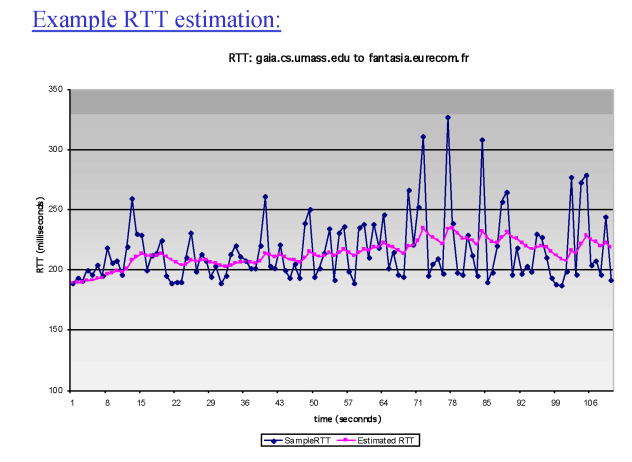

1.  **SampleRTT 측정:** 세그먼트 전송부터 ACK 수신까지의 실제 시간을 측정합니다.
2.  **EstimatedRTT 계산:** 측정값의 변동이 크므로 지수 가중 이동 평균(EWMA)을 사용하여 부드럽게 보정합니다.
    *   $EstimatedRTT = (1-\alpha) \times EstimatedRTT + \alpha \times SampleRTT$ (보통 $\alpha=0.125$)
3.  **TimeoutInterval 결정:** 여기에 안전 마진(Safety Margin)을 더해 최종 값을 정합니다.
    *   $TimeoutInterval = EstimatedRTT + 4 \times DevRTT$

---

## 5. TCP의 신뢰성 있는 데이터 전송 (Reliable Data Transfer)
TCP는 GBN과 SR의 장점을 섞은 독특한 방식을 사용합니다.

*   **단일 타이머 사용:** 현재 확인 응답을 받지 못한 가장 오래된 세그먼트에 대해서만 **하나의 타이머**를 가집니다.
*   **재전송 트리거:** 타임아웃이 발생하거나, **3개의 중복 ACK(총 4개)**를 받았을 때 발생합니다.
*   **누적 ACK의 이점:** 중간에 ACK가 유실되더라도 나중에 도착한 더 큰 번호의 ACK가 앞의 유실을 모두 메워줄 수 있습니다.

### ⚡ 빠른 재전송 (Fast Retransmit)
타임아웃은 보통 네트워크 성능을 고려해 넉넉하게 잡혀있어 유실 시 대응이 늦습니다. 이를 해결하기 위해 **빠른 재전송**을 사용합니다.
*   **원리:** 송신자가 같은 번호의 ACK를 연속으로 3번 더(총 4번) 받으면, 타이머가 터지기 전이라도 해당 패킷이 유실되었다고 판단하고 즉시 재전송합니다.
*   **장점:** 유실된 세그먼트를 훨씬 빠르게 복구하여 효율성을 높이는 최적화 기법입니다.

---

## 6. 재전송 시나리오 요약

1.  **ACK 유실:** `ACK 100`이 사라져도 타이머가 터지면 92번부터 다시 보냅니다.
2.  **성급한 타임아웃:** 타임아웃이 너무 짧아 재전송을 했어도, 나중에 도착한 `ACK 120`을 보고 윈도우를 한꺼번에 비웁니다.
3.  **누적 ACK의 힘:** `ACK 100`이 유실되었어도 뒤이어 `ACK 120`이 성공적으로 도착하면 송신자는 119번까지 모두 잘 전달된 것으로 간주합니다.

이 정리본은 6강의 핵심인 TCP 세그먼트의 구조, 시퀀스 번호 관리 방식, 그리고 효율적인 재전송을 위한 RTT 측정 및 빠른 재전송 원리를 모두 포함하고 있습니다. 
*   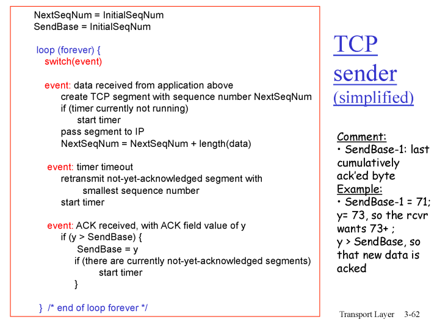
*   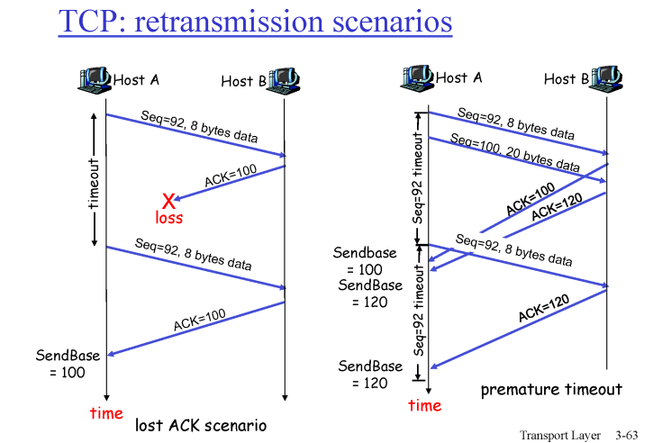
*   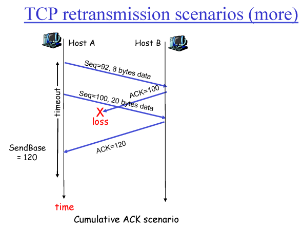
---

# [학습 정리] TCP 흐름 제어, 연결 관리 및 혼잡 제어 개요

## 1. TCP 흐름 제어 (Flow Control)
흐름 제어는 송신자가 수신자의 **데이터 처리 속도에 맞춰 전송 속도를 조절**하는 메커니즘입니다. 송신자가 수신자의 버퍼 용량보다 너무 빠르게 데이터를 보내면 데이터가 유실(Overflow)될 수 있기 때문에 이를 방지하는 것이 목적입니다.
*   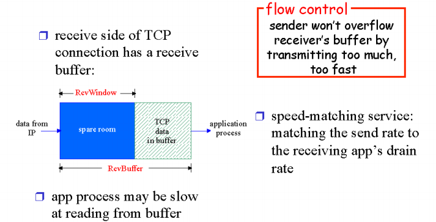
*   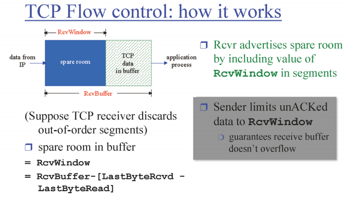

*   **동작 원리:** 수신 측은 자신의 **수신 버퍼(Receive Buffer)** 내에 남은 빈 공간의 크기인 **`RcvWindow`** 값을 TCP 헤더에 담아 송신자에게 계속 알려줍니다(Advertise).
*   **수식적 이해:** 수신자는 다음 공식을 통해 빈 공간을 계산합니다.
    *   $RcvWindow = RcvBuffer - [LastBy teRcvd - LastByteRead]$
*   **송신자의 제약:** 송신자는 아직 확인 응답(ACK)을 받지 못한 데이터의 양이 수신자가 알려준 `RcvWindow` 값을 초과하지 않도록 보낼 양을 제한합니다. 이를 통해 수신 버퍼가 넘치지 않음을 보장합니다.

### 💡 코너 케이스: 수신 윈도우가 0인 경우
수신 측의 버퍼가 가득 차서 `RcvWindow`가 0이라고 응답하면, 송신자는 전송을 멈춥니다. 하지만 이후 수신 앱이 데이터를 읽어 버퍼에 여유가 생겨도 송신자는 이를 알 방법이 없어 통신이 중단될 수 있습니다.
*   **해결책:** 송신자는 수신 윈도우가 0일 때도 **주기적으로 1바이트의 아주 작은 데이터 세그먼트**를 보냅니다. 이는 수신자가 현재 자신의 윈도우 상태를 담은 ACK를 다시 보내도록 유도하여 통신을 재개하기 위함입니다.

---

## 2. TCP 연결 관리 (Connection Management)
TCP는 데이터를 주고받기 전, 두 호스트 간에 상태 정보를 초기화하고 자원을 할당하는 과정이 필요합니다.

### 2.1 연결 설정: 3-Way Handshake
TCP는 세 번의 메시지 교환을 통해 연결을 맺습니다.
*   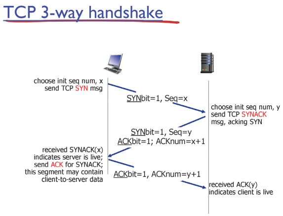
1.  **Step 1 (SYN):** 클라이언트가 서버에게 연결 요청 메시지를 보냅니다. 이때 자신의 **최초 순서 번호(Initial Seq #)**를 알려줍니다.
2.  **Step 2 (SYNACK):** 서버는 요청을 수락하며 자신의 버퍼를 할당하고, 서버의 최초 순서 번호와 함께 응답을 보냅니다. 
3.  **Step 3 (ACK):** 클라이언트가 서버의 응답을 확인했다는 메시지를 보냅니다. 이 단계부터는 실제 데이터를 포함할 수 있습니다. 

*   **왜 2번이 아니라 3번인가?** 투웨이(2-way) 방식으로는 양쪽 모두가 상대방의 상태를 완벽히 확인하고 연결될 준비가 되었는지 확신할 수 없으며, 보안 공격(SYN Flooding 등)에 취약할 수 있기 때문입니다.

### 2.2 연결 종료: Closing a Connection
연결을 끊을 때는 보통 네 번의 단계를 거칩니다.
*   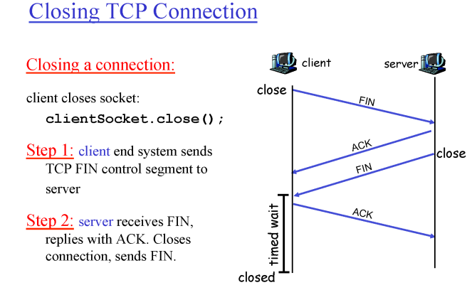
*   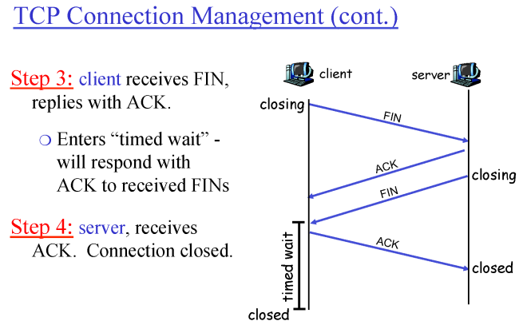
1.  클라이언트가 더 이상 보낼 데이터가 없으면 **FIN** 세그먼트를 보냅니다.
2.  서버는 이에 대해 **ACK**를 보내고, 남은 데이터를 모두 보낸 뒤 자신도 **FIN**을 보냅니다.
3.  클라이언트는 서버의 FIN을 받고 마지막 **ACK**를 보낸 후 **`TIME_WAIT`** 상태에 들어갑니다.
    *   **TIME_WAIT이 필요한 이유:** 클라이언트가 보낸 마지막 ACK가 유실될 경우를 대비하기 위해서입니다. 서버가 ACK를 못 받으면 FIN을 재전송하는데, 클라이언트가 즉시 종료해버리면 이 재전송에 응답할 수 없기 때문입니다.
*   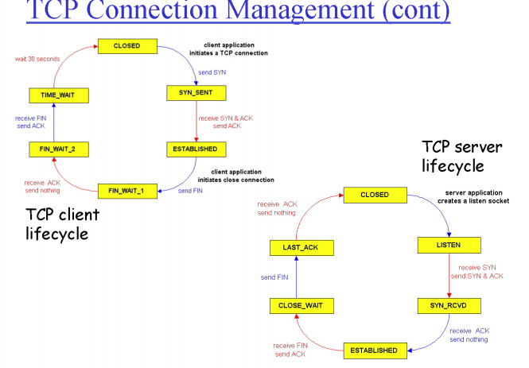
---

## 3. 혼잡 제어 (Congestion Control) 개요
혼잡 제어는 수신자가 아닌 **네트워크 내부의 상황(라우터의 정체 등)**에 맞춰 전송 속도를 조절하는 것입니다.

*   **필요성:** 네트워크는 공공 자원(Public Resource)과 같아서 모든 사용자가 자신의 이익을 위해 과도하게 데이터를 쏟아부으면 네트워크 전체가 마비(Collapse)될 수 있습니다. 
*   **TCP의 접근 방식 (End-to-End):** 현재 인터넷 라우터들은 혼잡 정보를 직접 알려주지 않으므로, TCP는 **패킷 유실이나 지연 시간의 증가**를 통해 네트워크 혼잡을 스스로 유추하여 전송 속도를 조절합니다.
*   **동작 원리:** 네트워크 상황이 좋으면 전송량을 늘리고, 유실이 발생하면 네트워크가 혼잡하다고 판단하여 즉시 전송량을 줄입니다.

---

## 4. 핵심 요약 및 비교
| 구분 | 흐름 제어 (Flow Control) | 혼잡 제어 (Congestion Control) |
| :--- | :--- | :--- |
| **제어 대상** | 수신자(Receiver)의 처리 능력 | 네트워크(Network)의 수용 능력 |
| **정보 출처** | 수신자가 직접 `RcvWindow`를 보고 | 패킷 유실/지연을 통해 스스로 유추 |
| **핵심 기법** | 윈도우 크기 기반 조절 | 전송률(Rate) 동적 조절 |

이 정리 자료는 7강에서 다룬 TCP의 상호작용 원리를 모두 포함하고 있습니다. 특히 **수신자 상황에 맞추는 흐름 제어**와 **네트워크 상황에 맞추는 혼잡 제어**의 차이를 명확히 이해하는 것이 핵심입니다.

---

# 🌐 [학습 정리] TCP 혼잡 제어 (Congestion Control)

## 1. 도입: 혼잡 제어의 필요성과 직관
혼잡 제어는 네트워크가 처리할 수 있는 양보다 더 많은 데이터를 보내서 **네트워크가 마비되는 것(Collapse)**을 막기 위한 메커니즘입니다.

*   **파이프 비유:** 네트워크는 여러 굵기의 파이프가 연결된 수로와 같습니다. 가장 중요한 지점은 **가장 얇은 파이프(병목 현상, Bottleneck)**입니다. 이 병목 구간이 감당할 수 있는 양보다 많이 보내면 파이프가 터지듯 패킷 유실이 발생합니다.
*   **정보의 부재:** 문제는 네트워크(라우터)가 우리에게 직접 "지금 막히니까 천천히 보내!"라고 알려주지 않는다는 점입니다.
*   **유추(Intuition):** 결국 송신자는 상대방(수신자)으로부터 오는 **ACK 피드백**을 통해 네트워크 상황을 조심스럽게 유추하며 속도를 조절해야 합니다.

---

## 2. 혼잡 제어의 3가지 핵심 페이즈 (Main Phases)

TCP는 네트워크 상황을 파악하기 위해 다음 세 가지 단계를 거칩니다.

### 2.1 슬로우 스타트 (Slow Start): "겸손하지만 빠르게"
처음 시작할 때는 네트워크 상황을 전혀 모르기 때문에 아주 작은 양부터 시작합니다.
*   **동작:** 처음에는 **1 MSS**(Maximum Segment Size)만 보냅니다. MSS=500bytes
*   **증가 방식:** 매 RTT마다 **전송량을 2배씩 지수적으로(Exponentially)** 늘립니다. 이름은 '슬로우'지만 실제로는 굉장히 빠르게 속도를 올리는 과정입니다.
*   **목적:** 유효한 대역폭이 어디쯤인지 빠르게 찾아내기 위함입니다.
*   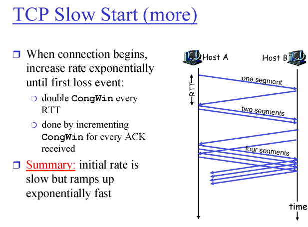

### 2.2 가산적 증가 (Additive Increase): "조심스럽게 접근"
전송량이 특정 임계치(**Threshold**)에 도달하면, 이제부터는 신중해져야 합니다.
*   **동작:** 매 RTT마다 **1 MSS씩만 리니어하게(Linearly)** 늘립니다.
*   **용어:** 이 과정을 **혼잡 회피(Congestion Avoidance)**라고도 부릅니다.

### 2.3 승수적 감소 (Multiplicative Decrease): "문제가 생기면 확 줄이기"
패킷 유실(Loss)이 감지되면 네트워크 혼잡이 발생했다고 판단하고 즉시 속도를 줄입니다.
*   **동작:** 현재 혼잡 윈도우(CongWin) 크기를 **절반으로 뚝 떨어뜨립니다**.
*   **철학:** 네트워크는 공용 자원이므로, 막혔을 때는 모든 사용자가 발을 확 빼야만 혼잡이 풀릴 수 있습니다.

*   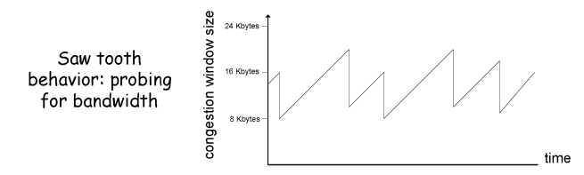

*   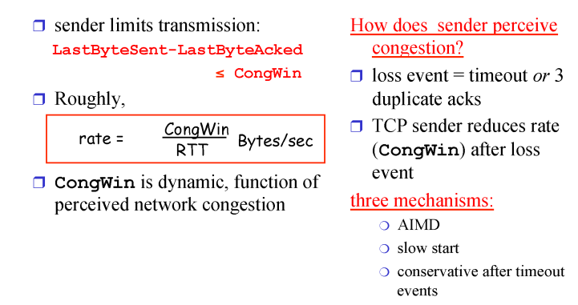
---

## 3. 혼잡 감지와 대응의 세부 로직 (Tahoe(80년대초) vs. Reno)
*   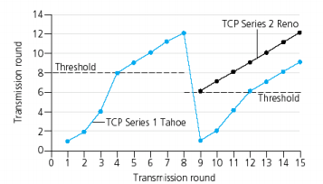
*   매우 중요한 그림(x축은 시간, y축은 congwinsize)
TCP는 패킷 유실을 감지하는 상황에 따라 다르게 대응하도록 발전해 왔습니다.

### 3.1 유실 감지의 두 가지 조건
1.  **타임아웃(Timeout):** 아예 응답이 없는 최악의 상황. 네트워크가 꽉 막혔음을 의미합니다.
2.  **3 중복 ACK (3 Duplicate ACKs):** 걔만 빼고 다른 애들은 잘 가고 있다는 뜻. 상대적으로 가벼운 혼잡입니다.

### 3.2 버전별 대응 방식
*   **TCP Tahoe (초기 버전):** 어떤 유실이든 발생하면 무조건 **밑바닥(1 MSS)**부터 다시 시작합니다.
*   **TCP Reno (현대적 버전):** 
    *   **타임아웃 시:** Tahoe처럼 1 MSS부터 다시 시작 (매우 보수적 대응).
    *   **3 중복 ACK 시:** 현재 윈도우를 **절반으로 줄이고 리니어하게 증가** (빠른 회복, Fast Recovery).

**[임계치(Threshold) 설정 규칙]**
패킷 유실이 발생한 순간의 윈도우 사이즈의 **절반**을 새로운 임계치로 설정합니다.

*   TCP Vegas 찾아보기!!!!!
---

## 4. TCP의 공평성 (Fairness)

여러 사용자가 같은 네트워크 자원을 공유할 때 TCP는 공평하게 동작할까?
*   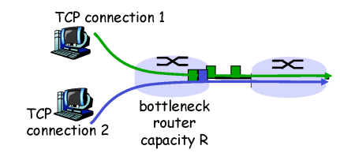
*   **결론:** 신기하게도 각자 독립적으로 혼잡 제어를 수행함에도 불구하고, 결국에는 **대역폭을 공평하게 나누어 갖는 지점**으로 수렴하게 됩니다.
*   **이유:** **AIMD**(Additive Increase Multiplicative Decrease) 방식 때문입니다. 많이 쓰는 사람은 유실 시 더 많이 줄어들고, 적게 쓰는 사람은 조금씩 늘려가며 결국 균형을 맞추게 됩니다.
*   **맹점:** TCP 커넥션을 **많이 여는 사람**이 결국 더 많은 대역폭을 가져가게 되는 구조적 한계는 존재합니다.
*   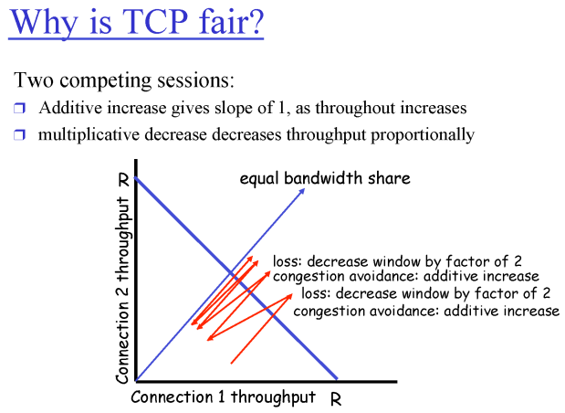
---

## 5. 핵심 메커니즘 총정리

| 상황 | 송신자의 행동 | 상태 변화 |
| :--- | :--- | :--- |
| **CongWin < Threshold** | 매 RTT마다 2배 증가 | **Slow Start** (익스포넨셜 증가) |
| **CongWin > Threshold** | 매 RTT마다 1 MSS 증가 | **Congestion Avoidance** (리니어 증가) |
| **3 Duplicate ACKs** | Threshold = CongWin / 2, CongWin = Threshold | **Fast Recovery** (Reno 기준) |
| **Timeout** | Threshold = CongWin / 2, CongWin = 1 MSS | **Slow Start**부터 다시 시작 |

**송신률(Rate) 공식:** $\text{Rate} \approx \frac{\text{CongWin}}{\text{RTT}}$ (Bytes/sec).

이로써 3장 전송 계층의 모든 내용(다중화, 신뢰성 전송, 흐름 제어, 혼잡 제어)이 마무리되었습니다. 