---

# 9강: 기존 계층 복습 및 네트워크 계층의 도입

## 1.애플리케이션 및 전송 계층 핵심 복습

### 1.1 인터넷의 기본 구조와 데이터 전송
*   **패킷 교환 방식:** 인터넷은 독립적인 단위인 '패킷' 기반의 통신을 수행하며, 이는 여러 사용자가 자원을 공유하기에 적합합니다.
*   **지연(Delay)과 로스(Loss):** 라우터의 처리 용량을 초과하는 패킷이 들어오면 **큐잉 지연(Queueing Delay)**이 발생하며, 큐(버퍼)가 가득 차면 패킷이 버려지는 **로스(Loss)**가 발생합니다.
*   **4가지 지연 요소:** 프로세싱 지연, 큐잉 지연, 전송 지연(L/R), 전파 지연(d/s)의 합으로 전체 지연이 결정됩니다.

### 1.2 애플리케이션 계층 (HTTP & DNS)
*   **HTTP 프로토콜:** 클라이언트/서버 모델이며, 상태를 저장하지 않는 **Stateless** 프로토콜입니다.
*   **연결 방식:** 하나의 TCP 연결로 여러 객체를 보내는 **Persistent HTTP**와 매번 새로 연결하는 **Non-persistent HTTP**로 나뉩니다.
*   **DNS:** UDP를 사용하며, 도메인 이름을 IP 주소로 변환하는 매우 중요한 서비스입니다.

# Sample Problems: HTTP 지연 및 TCP 재전송

*   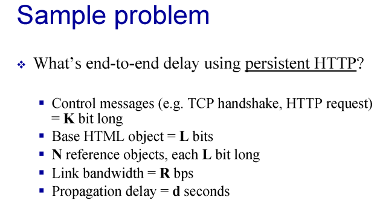
## 1. HTTP 지연 시간 계산 (Persistent HTTP without Pipelining)

이 문제는 **지속 연결(Persistent HTTP)** 방식을 사용하되, **파이프라이닝을 사용하지 않을 때** 전체 응답 시간이 어떻게 계산되는지 다룹니다,.

### 1.1 문제 설정 (Variables)
*   **K bit:** 제어 메시지(TCP 핸드셰이크, HTTP 요청 메시지 등)의 크기.
*   **L bits:** 베이스 HTML 파일 및 참조 객체 각각의 크기.
*   **N개:** 베이스 HTML 안에 포함된 참조 객체(이미지 등)의 개수.
*   **R bps:** 링크의 전송 대역폭.
*   **d seconds:** 전파 지연 시간(Propagation Delay).

### 1.2 단계별 지연 시간 계산 로직
지연 시간 계산 과정은 다음과 같습니다.

1.  **TCP 연결 설정 (Handshake 1, 2단계):**
    *   **SYN 전송:** $K/R$ (전송 지연) + $d$ (전파 지연)
    *   **SYN-ACK 수신:** $K/R$ + $d$
2.  **베이스 HTML 요청 및 수신 (Handshake 3단계 포함):**
    *   **HTTP Request (ACK와 함께 전송):** $K/R$ + $d$ (교수님은 3단계 핸드셰이크 패킷에 HTTP 요청이 포함된다고 설명하심)
    *   **Base HTML Response:** $L/R$ + $d$
    *   **베이스 HTML까지의 소계:** $3(K/R + d) + (L/R + d)$.
3.  **N개의 참조 객체 수신 (No Pipelining):**
    *   파이프라이닝을 사용하지 않으므로, 하나의 객체를 요청하고 응답받은 후 다음 객체를 요청합니다.
    *   **객체 1개당 지연:** 요청($K/R + d$) + 응답($L/R + d$)
    *   **N개 객체의 총 지연:** $N \times [(K/R + d) + (L/R + d)]$.

### 1.3 최종 결과 공식
**Total End-to-End Delay =** $3(\frac{K}{R} + d) + (\frac{L}{R} + d) + N(\frac{K}{R} + d + \frac{L}{R} + d)$.

---

*   **프록시(Proxy)**는 흔히 **웹 캐시(Web Cache)**라고도 불리며, HTTP 프로토콜을 이해하는 데 있어 **매우 중요한 핵심 개념**으로 다루어집니다.

*   **"HTTP에서 중요한 것 중 하나가 프록시(Proxy)를 사용하는 것"**

### 1. 프록시(Proxy)의 정의 및 역할
*   **중계자 역할:** 프록시 서버는 클라이언트(브라우저)와 실제 데이터를 가지고 있는 원본 서버(Origin Server) 사이에서 **중계자** 역할을 수행하는 서버입니다.
*   **클라이언트이자 서버:** 클라이언트가 웹 페이지를 요청할 때, 프록시는 클라이언트의 요청을 대신 받아 서버에 전달하므로 서버 입장에서는 클라이언트처럼 보이고, 클라이언트에게 응답을 줄 때는 서버처럼 동작합니다.

### 2. 프록시를 사용하는 주요 이유 (Web Caching)
핵심은 **캐싱(Caching)**을 통한 효율성 향상입니다.

*   **응답 시간 단축:** 자주 요청되는 웹 객체(이미지, HTML 등)를 프록시 서버의 로컬 저장소에 저장해 둡니다. 클라이언트가 다시 같은 데이터를 요청하면 멀리 있는 원본 서버까지 갈 필요 없이 프록시가 즉시 응답하므로 사용자가 느끼는 **대기 시간이 크게 줄어듭니다**.
*   **대역폭 절약:** 조직(학교, 회사 등) 내부에 프록시 서버를 두면, 외부 인터넷으로 나가는 통로(Access Link)의 트래픽을 획기적으로 줄일 수 있습니다. 동일한 데이터를 여러 명이 요청할 때 외부망을 타지 않고 내부 프록시에서 해결하기 때문입니다.
*   **서버 부하 감소:** 원본 서버 입장에서는 수많은 클라이언트의 요청을 직접 처리하는 대신 프록시가 상당 부분을 대신 처리해 주므로 서버의 부담이 줄어듭니다.

### 3. 프록시의 동작 과정
1.  **브라우저 설정:** 사용자는 브라우저가 모든 HTTP 요청을 프록시 서버로 보내도록 설정합니다.
2.  **요청 가로채기:** 클라이언트가 요청을 보내면 프록시가 이를 가로챕니다.
3.  **캐시 확인 (Cache Hit/Miss):**
    *   **Hit:** 프록시가 요청된 객체를 가지고 있다면, 원본 서버에 접속하지 않고 클라이언트에게 바로 전달합니다.
    *   **Miss:** 프록시가 객체를 가지고 있지 않다면, 원본 서버에 접속하여 객체를 가져와 클라이언트에게 전달하고, 동시에 자신의 저장소에 이를 복사해 둡니다.

### 4. 중요성
*   ***HTTP, DNS, 그리고 프록시**를 애플리케이션 계층에서 반드시 알고 넘어가야 할 3대 요소. 특히 프록시는 **비상태 유지(Stateless)** 특성을 가진 HTTP 환경에서 성능을 최적화하기 위한 아주 영리한 도구로 활용됩니다.

따라서 프록시를 사용한다는 것은 단순히 통로를 거치는 것이 아니라, **전체적인 네트워크의 응답 성능을 높이고 자원을 효율적으로 관리하기 위한 전략적 선택**이라고 이해하시면 완벽합니다.


---
### 1.3 전송 계층 (UDP & TCP)
*   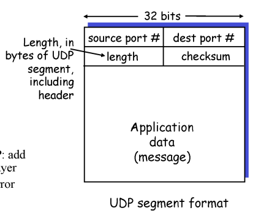
*   **UDP:** 헤더 필드가 4개뿐인 단순한 구조로, 체크섬(에러 체크)과 포트 번호(다중화/역다중화)라는 최소한의 기능만 제공합니다.

    *   **DNS가 왜 TCP가 아닌 **UDP(User Datagram Protocol)**를 사용하는지에 대한 이유**

    ### 1. 연결 설정 지연이 없음 (No Connection Establishment)
    가장 결정적인 이유는 **속도**입니다.
    *   **TCP의 오버헤드:** TCP는 데이터를 주고받기 전에 반드시 **3-way handshake**라는 연결 설정 과정을 거쳐야 합니다. 이 과정에서 최소 1 RTT(왕복 시간) 이상의 지연이 발생합니다.
    *   **UDP의 즉각성:** 반면 UDP는 연결 설정 과정이 전혀 없습니다. DNS는 웹사이트 접속 시 가장 먼저 수행되는 작업이므로, 여기서 지연이 발생하면 전체 웹 로딩 속도가 느려집니다. 따라서 DNS 설계자들은 성능 극대화를 위해 UDP를 선택했습니다.

    ### 2. 단순한 헤더 구조와 적은 오버헤드
    *   **단순성:** UDP 헤더는 단 **4개의 필드**(출발지 포트, 목적지 포트, 길이, 체크섬)로만 구성되어 매우 가볍습니다.
    *   **자원 절약:** DNS 서버는 수많은 클라이언트의 요청을 동시에 처리해야 합니다. TCP처럼 각 연결마다 상태 정보를 유지할 필요가 없는 UDP를 사용함으로써 서버의 자원 부담을 줄이고 더 많은 요청을 처리할 수 있습니다.

    ### 3. 작은 데이터 크기와 효율적인 오류 처리
    *   **단일 패킷 전송:** DNS 쿼리와 응답 메시지는 일반적으로 크기가 매우 작습니다. UDP 세그먼트 하나에 충분히 담길 수 있는 양입니다.
    *   **애플리케이션 계층에서의 신뢰성:** UDP 자체는 데이터 유실 시 재전송을 해주지 않지만, DNS와 같은 애플리케이션은 **애플리케이션 계층에서 자체적으로 에러 복구 및 재시도**를 수행할 수 있습니다. 만약 응답이 오지 않으면 클라이언트가 단순히 다시 쿼리를 던지면 되기 때문에, 복잡한 TCP 메커니즘을 사용하는 것보다 이 방식이 더 효율적입니다.

    ### 4. DNS의 중요성 및 기타 특징
    *   **도메인 주소 변환:** DNS는 사람이 읽기 쉬운 도메인 이름을 컴퓨터가 이해하는 **IP 주소로 변환**해주는 아주 중요한 서비스입니다.
    *   **애플리케이션 계층의 핵심:** 애플리케이션 계층에서 가장 중요한 두 가지 프로토콜은 **HTTP와 DNS**이며, 이 둘은 네트워크 통신의 기본이 됩니다.
    *   **신뢰성 전송의 원칙:** 비록 DNS가 비신뢰적인 UDP를 사용하지만, 그 바탕에는 패킷 에러 검출(Checksum)과 같은 기본적인 전송 계층의 기능이 포함되어 있습니다.

    요약하자면, DNS는 **"한 번의 요청과 한 번의 응답"**으로 끝나는 짧은 통신이 주를 이루기 때문에, 무거운 TCP보다는 **빠르고 가벼운 UDP**가 훨씬 적합한 선택이 된 것입니다.

*   **TCP:** 신뢰성 있는 전송을 위해 **누적 확인 응답(Cumulative ACK)**, 타이머, 순서 번호를 사용합니다.
*   **혼잡 제어:** 네트워크 상황에 따라 **Slow Start, Additive Increase, Multiplicative Decrease** 과정을 거치며 전송량을 조절합니다.

---
*   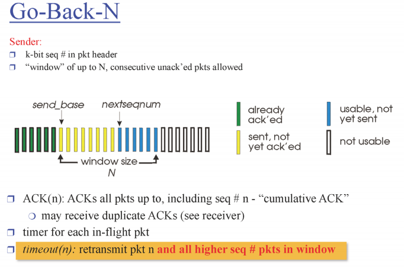
*   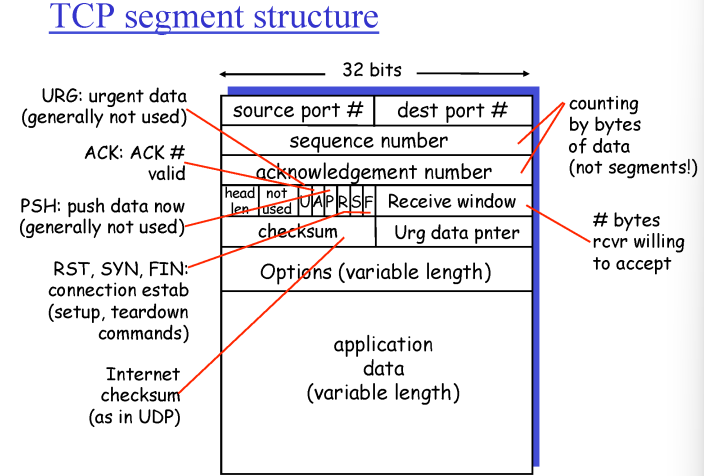

## 2. TCP 재전송 및 빠른 재전송 시나리오 (TCP Retransmission)

이 문제는 패킷 유실이 발생했을 때 **중복 ACK(Duplicate ACK)**를 통해 어떻게 **빠른 재전송(Fast Retransmit)**이 일어나는지 시각적으로 보여줍니다.

### 2.1 문제 상황 (Scenario)
*   **데이터 크기:** 총 600바이트 파일을 전송하며, 패킷당 100바이트씩 나누어 보냄 (총 6개 패킷).
*   **순서 번호 시작:** 첫 번째 패킷의 시퀀스 번호는 300번.
*   **네트워크 설정:** 윈도우 사이즈 1000, RTT 50ms, 타임아웃 500ms.
*   **특이 사항:** **두 번째 패킷(Seq 400)이 유실됨**.

### 2.2 패킷 교환 과정 상세 (Packet Exchange)

1.  **송신자(A)의 전송:** 윈도우 크기가 충분하므로 패킷 6개를 한꺼번에 쏟아붓습니다 (Seq 300, 400, 500, 600, 700, 800).
2.  **수신자(B)의 반응:**
    *   **Seq 300 수신:** 정상 수신 후 **ACK 400**을 보냅니다.
    *   **Seq 400 유실:** 수신자는 아무것도 받지 못합니다.
    *   **Seq 500 수신:** 400번을 기다리는데 500번이 왔으므로, 버퍼에 저장하고 다시 **ACK 400**을 보냅니다 (1번째 중복 ACK).
    *   **Seq 600 수신:** 여전히 400번이 비어있으므로 다시 **ACK 400**을 보냅니다 (2번째 중복 ACK).
    *   **Seq 700 수신:** 다시 **ACK 400**을 보냅니다 (3번째 중복 ACK).
3.  **송신자(A)의 빠른 재전송:**
    *   A는 같은 번호의 ACK를 총 4개(원래 것 + 중복 3개) 받게 됩니다.
    *   이때 타임아웃(500ms)이 터지기 전이라도 유실을 확신하고 **Seq 400을 즉시 재전송**합니다.
4.  **최종 수신:**
    *   B가 재전송된 Seq 400을 받으면, 버퍼에 쌓여있던 500~800번과 합쳐서 상위 계층으로 올립니다.
    *   마지막으로 **ACK 900**을 보내며 모든 데이터 수신을 완료합니다.

---

---

## 2. 네트워크 계층(Network Layer)의 이해

이제 통신의 '블랙박스'였던 네트워크 코어 내부를 들여다볼 차례입니다. 전송 계층이 두 호스트 프로세스 간의 논리적 통신을 담당했다면, 네트워크 계층은 **출발지 호스트에서 목적지 호스트까지 패킷을 배송**하는 일을 담당합니다.

### 2.1 네트워크 계층의 핵심 기능
라우터가 수행하는 가장 중요한 일은 다음 두 가지로 구분됩니다.

1.  **포워딩(Forwarding):** 패킷이 라우터의 입력 링크로 들어왔을 때, 이를 적절한 출력 링크로 이동시키는 **지역적인(Local)** 작업입니다. 이는 라우터 내부의 **포워딩 테이블**을 참조하여 이루어집니다.
*   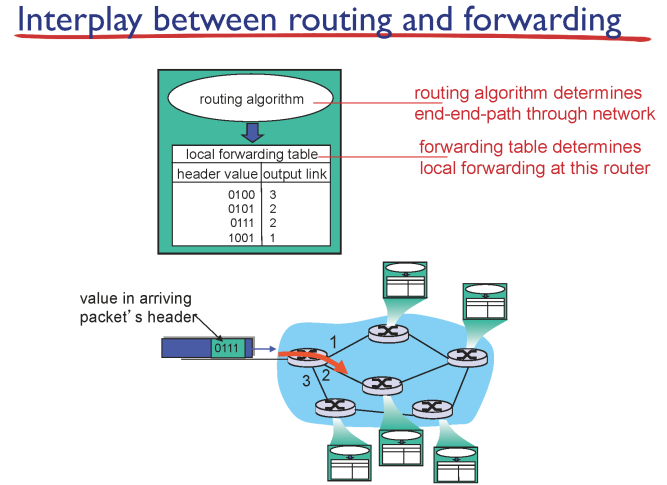

*   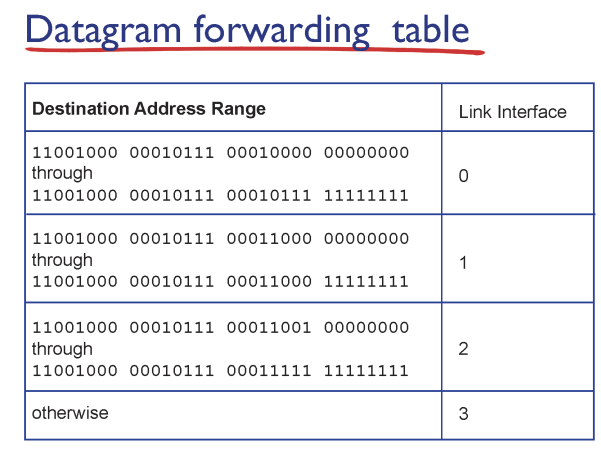

2.  **라우팅(Routing):** 패킷이 출발지에서 목적지까지 가는 **전체적인 경로(End-to-End Path)**를 결정하는 작업입니다. 라우팅 알고리즘(Dijkstra 등)을 통해 최적의 경로를 계산하고 포워딩 테이블을 생성합니다.

> **💡 비유:** **라우팅**이 여행 전체의 경로(서울에서 부산까지 어떤 고속도로를 탈지)를 계획하는 것이라면, **포워딩**은 고속도로 나들목(IC)에서 어느 방향 표지판을 보고 나갈지 결정하는 것과 같습니다.

### 2.2 데이터그램 네트워크와 포워딩 테이블
인터넷은 연결 설정 과정이 없는 **데이터그램 네트워크** 방식을 사용합니다.
*   라우터는 모든 개별 IP 주소를 테이블에 저장할 수 없으므로(전 세계 약 40억 개), **주소 범위(Address Range)**를 기준으로 포워딩 테이블을 관리합니다.
*   예를 들어, "IP 주소 A부터 B까지는 3번 인터페이스로 내보내라"는 식으로 기록됩니다.

---

## 3. 핵심 메커니즘: 가장 긴 프리픽스 일치 (Longest Prefix Matching)

포워딩 테이블에서 목적지 주소 범위를 검색할 때, 주소가 여러 범위에 동시에 해당할 수 있습니다. 이때 사용하는 원칙이 **Longest Prefix Matching**입니다.
*   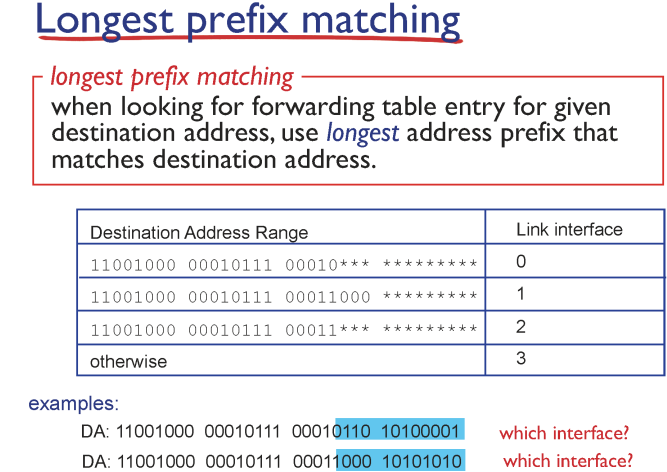
*   **원칙:** 목적지 주소와 **가장 길게 일치하는 앞부분(Prefix)**을 가진 엔트리를 선택하여 포워딩합니다.
*   **이유:** 더 구체적인 주소 정보를 가진 경로를 우선시하기 위함입니다.
*   **예시:**
    *   목적지 주소: `11001000 00010111 00011000 ...`
    *   엔트리 1: `11001000 00010111 00011***` (일치 길이 19)
    *   엔트리 2: `11001000 00010111 00011000` (일치 길이 24)
    *   **결과:** 더 길게 일치하는 **엔트리 2**의 인터페이스로 패킷을 보냅니다.

---

## 4. 9강 요약 로직 및 주석 (Conceptual Logic)

라우터가 패킷을 처리하는 과정을 논리적으로 설명하면 다음과 같습니다.

```python
# 라우터의 패킷 포워딩 가상 로직
def router_forwarding_process(packet):
    # 1. 패킷 도착 및 헤더 분석 (Processing Delay 발생)
    dest_ip = packet.header.destination_address #
    
    # 2. 포워딩 테이블 참조 (Longest Prefix Matching 적용)
    # 테이블에는 주소 범위별 출력 인터페이스가 저장되어 있음
    matched_interface = forwarding_table.find_longest_prefix(dest_ip) #
    
    # 3. 출력 큐로 이동
    # 만약 다른 패킷이 전송 중이면 기다려야 함 (Queueing Delay 발생)
    # 큐가 가득 차면 패킷을 버림 (Packet Loss 발생)
    if output_queue.is_full():
        drop(packet) #
    else:
        output_queue.push(packet)
        
    # 4. 링크로 패킷 전송 (Transmission & Propagation Delay 발생)
    transmit_to_link(matched_interface, packet)
```

**네트워크 계층이 왜 필요한지, 라우터가 내부적으로 포워딩 테이블을 어떻게 사용하여 패킷을 배송하는지**에 대한 핵심 원리를 다루고 있습니다. 

---

# [학습 정리] 네트워크 계층 2: IP 프로토콜과 주소 체계

## 1. IP 데이터그램 형식 (IP Datagram Format)

네트워크 계층의 전송 단위는 **패킷(Packet)** 또는 **데이터그램(Datagram)**입니다. IP 헤더는 기본적으로 **20바이트**의 크기를 가지며, 주요 필드는 다음과 같습니다.
*   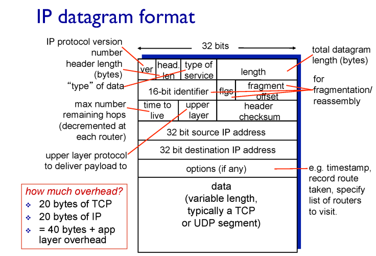
*   **버전(Ver):** 현재 주로 사용하는 버전은 **IPv4**입니다.
*   **TTL (Time To Live):** 패킷이 네트워크상에 무한히 도는 것을 방지하기 위한 '생존 시간'입니다. 라우터를 거칠 때마다 1씩 감소하며, **0이 되면 패킷은 버려집니다**.
*   **상위 계층 프로토콜 (Upper Layer):** 데이터 부분에 담긴 것이 **TCP인지 UDP인지**를 명시하여 수신 측에서 알맞은 계층으로 전달하게 합니다.
*   **IP 주소 (Source/Dest IP Address):** 각각 32비트로 구성된 출발지와 최종 목적지의 주소입니다.
*   **오버헤드(Overhead):** TCP 헤더(20바이트)와 IP 헤더(20바이트)를 합치면 기본적으로 **40바이트의 오버헤드**가 발생합니다.

---

## 2. IP 주소 체계 (IP Addressing)

### 2.1 인터페이스(Interface)를 지칭하는 주소
IP 주소는 단순히 '컴퓨터'를 지칭하는 것이 아니라, 컴퓨터 내부에 있는 **네트워크 인터페이스(NIC)**를 지칭합니다.
*   일반 PC는 보통 인터페이스가 하나라 IP도 하나지만, **라우터**는 여러 네트워크에 걸쳐 있기 때문에 **인터페이스 개수만큼 여러 개의 IP 주소**를 가집니다.
*   IPv4는 **32비트** 주소 체계를 사용하며, 사람이 읽기 편하게 8비트씩 끊어서 10진수로 표현합니다 (예: 12.34.158.5).

### 2.2 계층적 주소 구조 (Hierarchical Addressing)
*   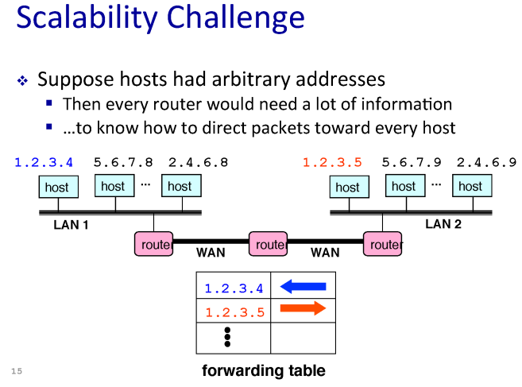

포워딩 테이블의 크기를 줄이기 위해 IP 주소는 두 부분으로 나뉩니다.
*   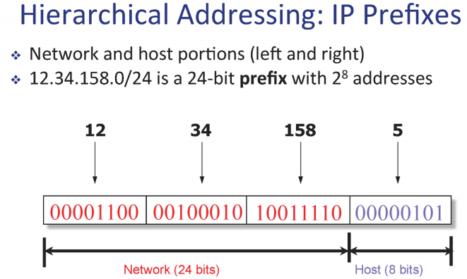
*   **네트워크 부분(Prefix / Subnet ID):** 같은 네트워크(서브넷)에 속한 기기들이 공유하는 앞부분입니다.
*   **호스트 부분(Host ID):** 해당 네트워크 내에서 개별 기기를 식별하는 뒷부분입니다.

---

## 3. CIDR과 서브넷 (Subnet)

### 3.1 CIDR (Classless Inter-Domain Routing)
과거에는 A, B, C 클래스로 나누어 주소를 고정된 크기로 배분했으나, 이는 주소 낭비가 심했습니다. 현재는 **CIDR** 방식을 사용하여 네트워크 크기에 맞춰 **프리픽스(Prefix) 길이를 자유롭게 조절**합니다.
*   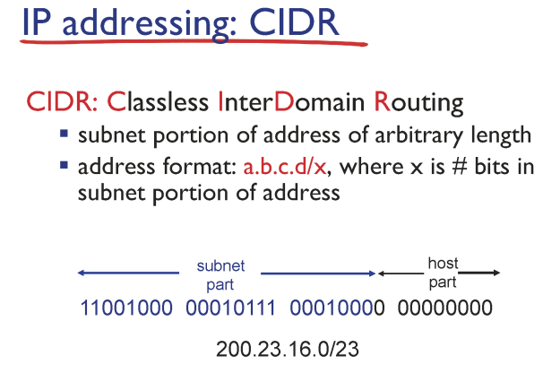
*   **표기법:** `a.b.c.d/x` (여기서 x는 네트워크 아이디의 비트 수).
*   **서브넷 마스크:** 어디까지가 네트워크 아이디인지 기계가 알 수 있도록 1로 채워진 비트맵입니다 (예: /24는 255.255.255.0).

### 3.2 서브넷의 정의
*   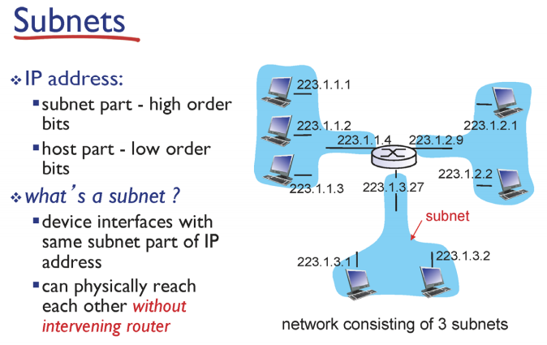
*   서브넷은 **라우터를 거치지 않고 직접 물리적으로 통신이 가능한** 인터페이스들의 집합입니다. 라우터는 이러한 여러 서브넷을 연결하는 교집합 역할을 수행합니다.
*   같은 프리픽스를 가진 인터페이스의 집합

---

## 4. 라우터의 핵심: 가장 긴 프리픽스 일치 (Longest Prefix Matching)

라우터가 패킷을 어디로 보낼지 결정할 때, 포워딩 테이블에서 목적지 주소와 일치하는 엔트리가 여러 개일 수 있습니다. 이때 **가장 구체적으로(가장 길게) 일치하는 경로**를 선택합니다.

**[작동 예시 로직]**
```text
목적지 IP: 201.10.6.17
포워딩 테이블 엔트리:
1. 201.10.0.0/21 (21비트 일치)
2. 201.10.6.0/23 (23비트 일치) -> 더 길게 일치하므로 이 경로(인터페이스) 선택!
```

---

## 5. NAT (Network Address Translation)

IPv4 주소 공간(약 40억 개)이 부족해지자 이를 극복하기 위해 만든 **주소 공유 트릭**입니다.

### 5.1 동작 원리
*   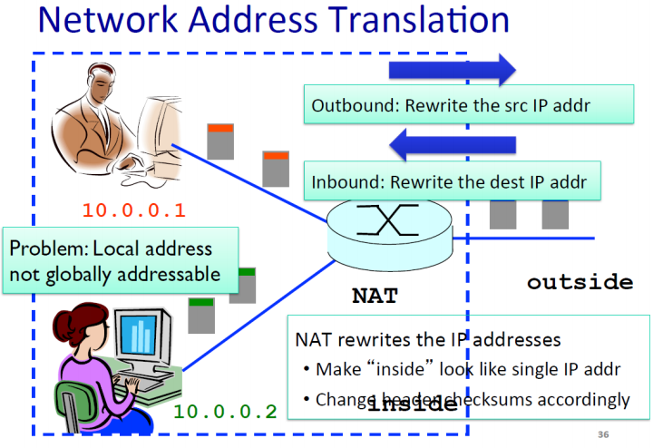
*   **내부 네트워크:** 10.0.0.x와 같은 사설 IP를 사용하여 내부적으로만 유일하게 통신합니다.
*   **외부 전송 시:** 패킷이 밖으로 나갈 때 NAT 라우터가 **출발지 IP 주소와 포트 번호**를 전 세계에서 유일한 자신의 공인 IP와 새로운 포트 번호로 **바꾸어서** 내보냅니다.
*   **응답 수신 시:** 돌아오는 패킷의 포트 번호를 보고 원래 어떤 내부 기기가 요청했는지 찾아내어 다시 주소를 바꿔 전달합니다.

### 5.2 NAT의 문제점
1.  **계층 위반 (Layer Violation):** 네트워크 계층 장비인 라우터가 전송 계층의 정보(포트 번호)를 건드리는 것은 원칙에 어긋납니다.
2.  **서버 운영의 어려움:** 외부에서는 내부 사설 IP를 직접 알 수 없으므로, NAT 내부에서 웹 서버 등을 운영하려면 추가적인 설정(포트 포워딩 등)이 필요합니다.

*   포트 사용 용도는 원래 프로세스를 찾기위함인데 host 찾는데 사용함.
---

### 💡 보완 설명: 32비트의 한계와 IPv6
32비트 주소는 2011년에 이미 고갈되었지만, **NAT**라는 트릭 덕분에 지금까지 버티고 있습니다. 근본적인 해결을 위해 주소를 **128비트**로 늘린 **IPv6**가 디자인되었으며, 이는 지구상의 모래알 개수보다 많은 주소를 제공할 수 있습니다.


---

# 🌐 [강의 노트] 11강. 네트워크 계층 (NAT, DHCP, IP Fragmentation)

---

## 1. 네트워크 주소 변환 (NAT: Network Address Translation)

### 1.1 배경 및 목적
*   **IPv4 주소 고갈:** 32비트 주소 체계($2^{32}$)로는 전 세계 모든 기기에 고유한 주소를 부여하기 부족해졌습니다.
*   **해결책 (트릭):** **IP 주소 재사용**을 통해 여러 기기가 하나의 공인 IP 주소를 공유하게 함으로써 주소 부족 문제를 일시적으로 해결합니다.

### 1.2 동작 원리
*   **내부 네트워크 (Inside):** 각 호스트는 내부에서만 유일한 **사설 IP(Local Address)**를 가집니다 (예: 10.0.0.x). 외부에서는 이 주소로 직접 찾아올 수 없습니다.
*   **게이트웨이 라우터 (NAT 장비):** 내부 패킷이 외부(Outside)로 나갈 때, 라우터는 소스 IP를 전 세계적으로 유일한 자신의 **퍼블릭 IP**로 바꾸고, **포트 번호**도 새롭게 할당하여 변환 테이블에 기록합니다.
*   **역변환:** 외부에서 응답 패킷이 돌아오면, 라우터는 **변환 테이블(Translation Table)**을 참조하여 포트 번호를 보고 원래 어떤 내부 호스트의 패킷이었는지 찾아내어 주소를 다시 바꿔 전달합니다.

### 1.3 NAT의 문제점 (비판)
1.  **계층 위반 (Layer Violation):** 라우터는 네트워크 계층 장비이므로 IP 헤더만 봐야 하는데, NAT는 전송 계층의 정보인 **포트 번호**까지 파고들어 수정합니다.
2.  **엔드 투 엔드(End-to-End) 원칙 위배:** 네트워크 노드(라우터)는 패킷을 수정하지 않고 전달만 해야 한다는 원칙을 어깁니다.
3.  **서버 운영의 어려움:** 외부에서 내부 사설 IP로 직접 연결할 방법이 없으므로, 내부에서 웹 서버 등을 운영하기가 매우 까다롭습니다.

---

## 2. 동적 호스트 설정 프로토콜 (DHCP)
*   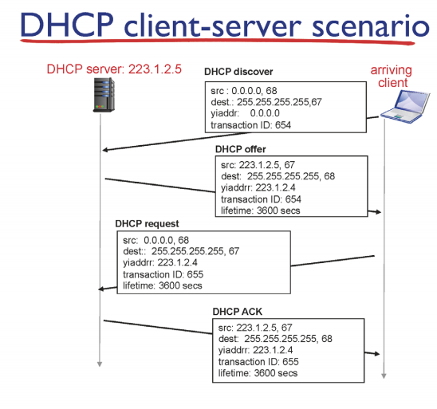
### 2.1 개념
*   **플러그 앤 플레이 (Plug-and-Play):** 호스트가 네트워크에 접속했을 때 자동으로 IP 주소, 서브넷 마스크, 게이트웨이 주소, DNS 서버 주소를 할당받는 프로토콜입니다.
*   **유동 IP 관리:** 고정 IP를 할당하는 대신, **주소 풀(Address Pool)**을 두고 필요한 시점에만 임대(Lease)해주고 회수하여 주소 자원을 효율적으로 사용합니다.
*   브로드캐스트를 사용하므로 UDP를 사용

### 2.2 동작 과정 (4단계)
1.  **DHCP Discover:** 클라이언트가 주변에 DHCP 서버가 있는지 찾기 위해 **브로드캐스트(255.255.255.255)** 메시지를 보냅니다.
2.  **DHCP Offer:** 서버가 사용 가능한 IP 주소와 임대 시간 등을 담아 응답합니다.
3.  **DHCP Request:** 클라이언트가 제안받은 주소를 사용하겠다고 요청합니다.
4.  **DHCP ACK:** 서버가 최종적으로 승인하여 할당을 완료합니다.

---

## 3. IP 데이터그램 형식과 단편화 (Fragmentation)
*   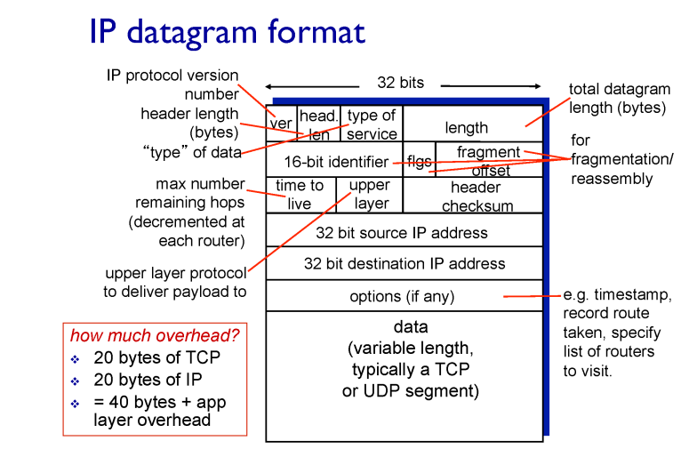
*   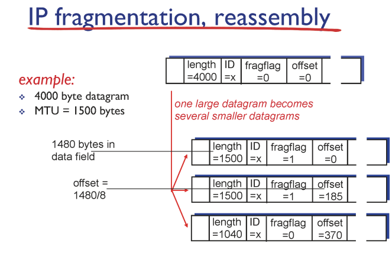
### 3.1 IP 헤더의 구성 (중요 필드)
*   **TTL (Time To Live):** 라우터를 거칠 때마다 감소하며, 0이 되면 패킷을 버려 무한 루프를 방지합니다.
*   **Upper Layer:** 데이터에 담긴 프로토콜(TCP/UDP)을 식별합니다.
*   **ID, Flags, Offset:** 패킷을 쪼개고 합칠 때 사용하는 필드입니다.

### 3.2 IP 단편화와 재조립
*   **MTU (Maximum Transfer Unit):** 각 링크(이더넷, 와이파이 등)가 한 번에 보낼 수 있는 최대 데이터 크기입니다.
*   **단편화:** 라우터는 들어온 패킷이 나가는 링크의 MTU보다 크면 여러 개의 작은 패킷으로 쪼갭니다.
*   **재조립:** 쪼개진 패킷들은 **최종 목적지 호스트**에서만 다시 합쳐집니다.

### 3.3 단편화 계산 예시 (4000바이트 데이터그램, MTU 1500)
| 구분 | 1번 조각 | 2번 조각 | 3번 조각 (마지막) |
| :--- | :--- | :--- | :--- |
| **길이 (Length)** | 1500 (20+1480) | 1500 (20+1480) | 1040 (20+1020) |
| **ID** | x | x | x |
| **Fragflag** | 1 (뒤에 더 있음) | 1 (뒤에 더 있음) | 0 (내가 마지막) |
| **Offset** | 0 | 185 (1480/8) | 370 (2960/8) |

*   **주의:** 오프셋(Offset) 값은 비트 수를 줄이기 위해 **8바이트 단위**로 나누어 기록합니다.

---

## 💡 요약 및 결론
*   **NAT**는 비록 지저분한 '트릭'일지라도 IPv4 주소 부족 문제를 해결하는 필수적인 기술로 자리 잡았습니다.
*   **DHCP**를 통해 우리는 설정 없이도 인터넷을 편리하게 이용할 수 있습니다.
*   **IP 단편화**는 다양한 링크 특성을 수용하기 위한 유연한 전송 방식이지만, 중간에 한 조각만 잃어버려도 전체를 재전송해야 하는 위험이 있습니다.


---

# 🌐 12강. 네트워크 계층: ICMP, IPv6 및 라우팅 알고리즘 (LS)

## 1. ICMP (Internet Control Message Protocol)
*   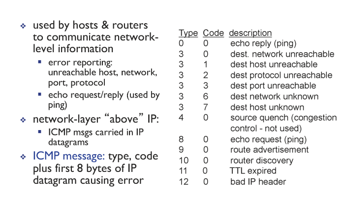
IP 프로토콜은 사용자 데이터를 운반하는 데 집중하지만, 네트워크상에서 발생하는 다양한 이벤트나 에러를 보고하기 위해 **ICMP**라는 별도의 컨트롤 메시지 프로토콜을 사용합니다.

*   **정의 및 역할:** 호스트와 라우터가 네트워크 계층의 정보를 주고받기 위해 사용하며, 주로 **에러 리포팅**(도달 불가능한 호스트/포트 등)이나 **에코 요청/응답**(Ping)에 활용됩니다.
*   **캡슐화:** ICMP 메시지는 IP 데이터그램의 데이터 부분에 실려 전송되므로, 구조상 IP의 상위에 위치하는 것처럼 보입니다.
*   **주요 메시지 타입:**
    *   **Type 0, Code 0:** Echo Reply (Ping 응답)
    *   **Type 8, Code 0:** Echo Request (Ping 요청)
    *   **Type 11, Code 0:** **TTL expired** (패킷의 TTL이 0이 되어 라우터에서 드랍됨)
    *   **Type 3, Code 3:** Destination port unreachable (목적지 호스트에 해당 포트가 열려 있지 않음)

### 📍 Traceroute의 원리
우리가 흔히 쓰는 `traceroute` 유틸리티는 바로 이 ICMP를 이용한 것입니다.
1.  송신자가 TTL을 1로 설정한 패킷을 보냅니다. 첫 번째 라우터에서 TTL이 0이 되어 패킷이 드랍되면서 **ICMP 타입 11(TTL expired)** 메시지를 송신자에게 돌려줍니다.
2.  다음에는 TTL을 2로 설정하여 보내 두 번째 라우터 정보를 알아냅니다.
3.  이 과정을 반복하다가 최종 목적지 호스트에 도달하여 **ICMP 타입 3, Code 3(Port unreachable)** 메시지가 돌아오면 멈춥니다.

---

## 2. IPv6: 차세대 IP 프로토콜

IPv4 주소 고갈 문제와 헤더 처리 속도 향상을 위해 도입된 프로토콜입니다.

*   **주요 특징:**
    *   **방대한 주소 공간:** 주소 길이가 **128비트**로 늘어나 주소 부족 문제를 근본적으로 해결합니다.
    *   **고정 길이 헤더(40바이트):** 헤더 구조를 단순화하여 라우터에서의 처리 속도를 높였습니다.
    *   **단편화 금지:** IPv6 라우터는 패킷 단편화를 수행하지 않으며, 너무 큰 패킷은 드랍하고 ICMPv6로 알립니다.
    *   **체크섬 제거:** 각 홉에서의 처리 시간을 줄이기 위해 헤더 체크섬을 완전히 삭제했습니다.
*   **전환 기술 - 터널링(Tunneling):** 전 세계의 모든 라우터를 한꺼번에 IPv6로 바꿀 수 없으므로, IPv4 라우터 구간을 지나갈 때 **IPv6 데이터그램을 IPv4 패킷의 데이터 부분에 쏙 집어넣어(캡슐화)** 전송하는 '터널링' 기법을 사용합니다.

---

## 3. 라우팅 알고리즘 (Routing Algorithms)

라우팅의 목적은 **출발지부터 목적지까지 최소 비용(Least Cost)의 경로**를 찾는 것입니다.

### 3.1 네트워크의 그래프 추상화
라우팅 문제를 풀기 위해 네트워크를 그래프 $G = (N, E)$로 봅니다. 여기서 $N$은 **라우터(노드)**의 집합이고, $E$는 라우터 사이의 **링크(에지)** 집합입니다. 각 링크에는 거리나 대역폭 등에 따른 **링크 코스트**가 존재합니다.

### 3.2 알고리즘 분류
1.  **링크 상태(Link State, LS) 알고리즘:** 모든 라우터가 전체 네트워크의 구성 정보를 알고 시작하는 **Global** 방식입니다. 대표적으로 **다익스트라(Dijkstra)** 알고리즘이 있습니다.
2.  **거리 벡터(Distance Vector, DV) 알고리즘:** 이웃 라우터와만 정보를 교환하여 전체 경로를 유추하는 **Decentralized** 방식입니다. **벨만-포드(Bellman-Ford)** 식을 기반으로 합니다.

---

이 알고리즘의 핵심은 **$N'$ (N-prime)**이라는 집합을 확장해 나가며, 출발지에서 각 목적지까지의 **최단 거리가 확정된 노드**를 하나씩 추가하는 것입니다.
*   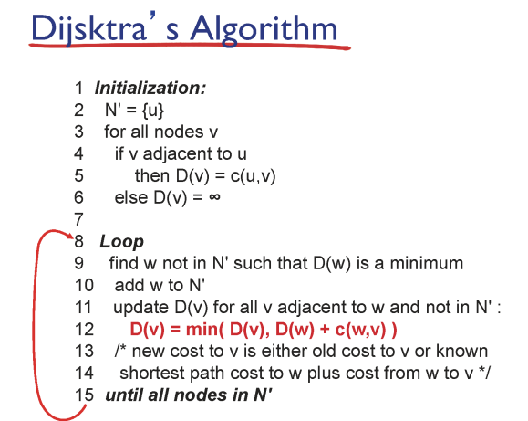
*   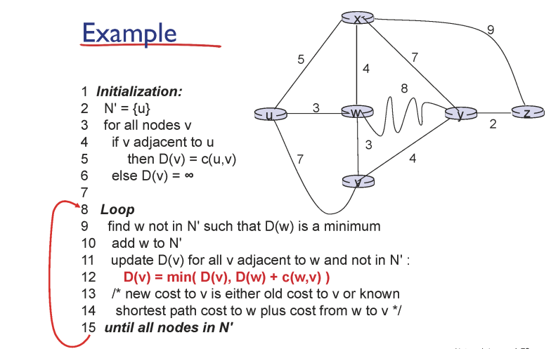
---

### 1. 알고리즘 시작 전 준비 (노테이션)

*   **$N'$**: 현재까지 소스 노드로부터의 최단 경로가 확실히 알려진 노드들의 집합입니다.
*   **$D(v)$**: 현재 단계에서 소스 노드로부터 목적지 $v$까지의 코스트 값입니다.
*   **$p(v)$**: 소스 노드에서 목적지 $v$까지 가는 최단 경로상에서 $v$ 바로 직전에 위치한 노드(Predecessor)입니다.
*   **$c(x, y)$**: 노드 $x$와 $y$ 사이의 직접적인 링크 코스트입니다. 연결되어 있지 않으면 무한대($\infty$)입니다.

---

### 2. 다익스트라 알고리즘 실행 표 (예제: 소스 노드 $u$)
*   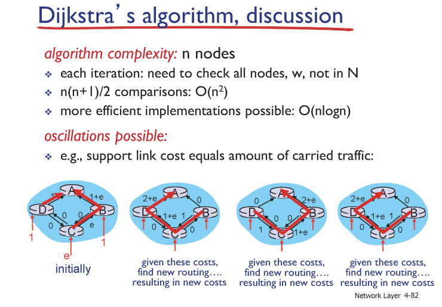
이 표는 라우터 **$u$**가 전체 네트워크 지형도를 알고 있는 상태에서 다른 노드들($v, w, x, y, z$)로 가는 최단 경로를 계산하는 과정을 보여줍니다.

| Step | $N'$ | $D(v), p(v)$ | $D(w), p(w)$ | $D(x), p(x)$ | $D(y), p(y)$ | $D(z), p(z)$ |
| :--- | :--- | :--- | :--- | :--- | :--- | :--- |
| **0 (초기화)** | $u$ | $7, u$ | **$3, u$** | $5, u$ | $\infty$ | $\infty$ |
| **1** | $uw$ | **$6, w$** | | $5, u$ | $11, w$ | $\infty$ |
| **2** | $uwx$ | $6, w$ | | | **$11, w$** | $14, x$ |
| **3** | $uwxv$ | | | | **$10, v$** | $14, x$ |
| **4** | $uwxvy$ | | | | | **$12, y$** |
| **5** | $uwxvyz$ | | | | | |

*(참고: 표의 굵은 글씨는 각 단계에서 $N'$에 추가하기 위해 선택된 최솟값입니다.)*

---

### 3. 단계별 상세 설명 (교수님의 풀이 로직)

#### **Step 0: 초기화**
*   출발지 $u$만 $N'$에 넣고 시작합니다 ($N'=\{u\}$).
*   $u$와 직접 연결된 이웃들의 거리를 적습니다. $v$는 7, $w$는 3, $x$는 5입니다.
*   직접 연결되지 않은 $y, z$는 무한대($\infty$)입니다.
*   이 중 가장 작은 값은 **$w$의 3**입니다.

#### **Step 1: $w$ 확정 및 업데이트**
*   $w$를 $N'$에 추가합니다 ($N'=\{uw\}$). 이제 $u$에서 $w$까지의 최단 거리는 **3**으로 확정되었습니다.
*   새로 들어온 $w$를 거쳐서 다른 곳으로 가는 게 더 빠른지 확인(업데이트)합니다.
    *   $v$의 경우: 원래 $u \to v$는 7이었는데, $u \to w \to v$는 $3+3=6$입니다. 더 짧으므로 **$6, w$**로 업데이트합니다.
    *   $y$의 경우: 무한대에서 $u \to w \to y$인 **$11, w$**로 업데이트됩니다.
*   남은 노드($v, x, y, z$) 중 가장 작은 값은 **$x$의 5**입니다.

#### **Step 2: $x$ 확정 및 업데이트**
*   $x$를 $N'$에 추가합니다 ($N'=\{uwx\}$). $x$까지의 최단 거리는 **5**로 확정됩니다.
*   $x$를 통해 $z$로 가는 경로가 새로 생깁니다 ($u \to x \to z$ = $5+9=14$). $z$를 **$14, x$**로 업데이트합니다.
*   남은 값들 중 가장 작은 것은 **$v$의 6**입니다.

#### **Step 3: $v$ 확정 및 업데이트**
*   $v$를 $N'$에 추가합니다 ($N'=\{uwxv\}$).
*   $v$를 거쳐서 $y$로 가는 경로를 확인합니다. 기존 $y$의 거리는 11이었는데, $u \to w \to v \to y$는 $6+4=10$입니다. 더 짧으므로 **$10, v$**로 업데이트합니다.
*   남은 값들 중 작은 것은 **$y$의 10**입니다.

#### **Step 4 & 5: 최종 확정**
*   **Step 4:** $y$를 추가하고 ($N'=\{uwxvy\}$), $y$를 거쳐 $z$로 가는 경로($10+2=12$)를 확인하여 $z$를 **$12, y$**로 업데이트합니다.
*   **Step 5:** 마지막 남은 **$z$**를 추가하면 모든 노드의 최단 경로 계산이 끝납니다.

---

### 4. 결과 활용: 포워딩 테이블 작성

교수님은 이 표의 **$p(v)$(Predecessor)** 정보를 거꾸로 따라가면(Back-checking) 실제 경로 트리를 그릴 수 있고, 이를 통해 **포워딩 테이블**을 채운다고 설명하셨습니다.

*   **예시 (목적지가 $z$일 때):**
    1.  $z$의 직전은 $y$입니다.
    2.  $y$의 직전은 $v$입니다.
    3.  $v$의 직전은 $w$입니다.
    4.  $w$의 직전은 $u$입니다.
    *   **경로:** $u \to w \to v \to y \to z$
    *   따라서 라우터 $u$의 포워딩 테이블에서 목적지가 $z$라면, **넥스트 홉(Next Hop)은 $w$**가 됩니다.

이와 같이 모든 라우터는 각자의 입장에서 이 알고리즘을 돌려 자신만의 포워딩 테이블을 완성하게 됩니다.


## 4. 다익스트라(Dijkstra) 알고리즘 상세 (LS 방식)

모든 노드가 전체 지형도를 알고 있다는 전제하에, 특정 노드에서 다른 모든 노드까지의 최단 경로를 구합니다.

*   **동작 과정:**
    1.  **초기화:** 시작 노드를 확정 집합($N'$)에 넣고, 이웃 노드들까지의 거리(코스트)를 기록합니다. 직접 연결되지 않은 노드 거리는 무한대($\infty$)로 둡니다.
    2.  **반복:** 아직 확정되지 않은 노드들 중 거리가 **가장 짧은 노드**를 선택해 $N'$에 추가합니다.
    3.  **업데이트:** 새로 추가된 노드를 거쳐서 가는 것이 기존 경로보다 짧다면 거리를 업데이트합니다.
    4.  모든 노드가 $N'$에 포함될 때까지 반복합니다.

*   **포워딩 테이블 생성:** 다익스트라 계산이 끝나면 각 목적지로 가기 위한 **넥스트 홉(Next Hop)**이 결정되며, 이를 라우터의 포워딩 테이블에 저장합니다.

*   **주의점 - 진동(Oscillation) 문제:** 만약 링크 코스트를 트래픽 양으로 설정할 경우, 트래픽이 적은 쪽으로 모든 경로가 쏠렸다가 다시 반대쪽으로 쏠리는 '경로 진동' 현상이 발생할 수 있습니다.

---

### 💡 12강 요약 및 한 줄 평
12강은 네트워크의 상태를 보고하는 **ICMP**, 주소 고갈을 해결하는 **IPv6**, 그리고 라우팅의 근본 원리인 **링크 상태 알고리즘**을 다룹니다. 특히 **"라우팅 알고리즘이 계산한 결과가 포워딩 테이블을 채운다"**는 두 기능 사이의 관계를 이해하는 것이 가장 중요합니다. 다음 시간에는 이웃과 정보를 나누며 경로를 찾는 **거리 벡터(DV) 알고리즘**을 심도 있게 다루게 됩니다.

### 1. 디스턴스 벡터(DV) 알고리즘의 기초: 벨만-포드 방정식
DV 알고리즘의 수학적 기반은 **벨만-포드(Bellman-Ford) 방정식**입니다.

*   **방정식:** $d_x(y) = \min_v \{c(x,v) + d_v(y)\}$
    *   $d_x(y)$: 노드 $x$에서 목적지 $y$까지의 최단 거리.
    *   $c(x,v)$: 노드 $x$에서 이웃 노드 $v$까지의 직접적인 링크 코스트.
    *   $d_v(y)$: 이웃 노드 $v$에서 목적지 $y$까지의 최단 거리.
*   **핵심 원리:** $x$에서 $y$로 가는 최단 경로는 결국 **이웃 $v$로 가는 비용과 그 이웃에서 $y$까지 가는 최단 거리의 합** 중 최소가 되는 경로를 선택하는 것입니다,.

### 2. 알고리즘의 동작 특성
DV 알고리즘은 다음과 같은 세 가지 주요 특성을 가집니다:

1.  **분산적(Distributed):** 각 노드는 전체 그래프를 보지 못하며, 오직 **직접 연결된 이웃으로부터 받은 정보**에만 의존합니다,.
2.  **반복적(Iterative):** 정보 교환과 계산이 더 이상 변화가 없을 때(안정화될 때)까지 반복됩니다,.
3.  **비동기적(Asynchronous):** 모든 노드가 동시에 계산할 필요가 없으며, 링크 코스트가 변하거나 이웃으로부터 업데이트된 정보를 받았을 때만 계산을 수행합니다,.

### 3. 정보 교환 및 업데이트 과정
각 노드는 자신이 알고 있는 모든 목적지까지의 최단 거리 리스트인 **디스턴스 벡터(Distance Vector)**를 관리합니다,.

*   **정보 전송:** 자신의 디스턴스 벡터 값이 하나라도 **업데이트**되거나 **링크 코스트가 변경**되면, 이 정보를 이웃 노드들에게 전달합니다,.
*   **업데이트 루프:** 이웃으로부터 새 벡터를 받으면 벨만-포드 방정식을 통해 자신의 테이블을 재계산하고, 변화가 있으면 다시 이웃에게 알립니다,,.
*   **안정화:** 더 이상 업데이트가 발생하지 않는 상황이 되면 라우팅 계산이 완료된 상태가 됩니다,.

### 4. 링크 코스트 변화와 "무한대 카운트" 문제
네트워크 상황 변화에 따른 알고리즘의 반응은 상황에 따라 크게 다릅니다.

*   **기분 좋은 소식(Good news travels fast):** 링크 코스트가 **감소**하는 경우, 알고리즘은 매우 빠르게 수렴하여 최단 경로를 찾아냅니다,.
*   **기분 나쁜 소식(Bad news travels slow):** 링크 코스트가 **증가**하는 경우, 노드들이 서로의 이전 정보를 바탕으로 잘못된 계산을 반복하며 코스트를 조금씩 올리는 **무한대 카운트(Count to Infinity)** 문제가 발생합니다,.
    *   **원인:** 특정 노드가 사실은 자신을 거쳐가는 경로를 "좋은 경로"라고 광고하는 경우, 이웃 노드가 그 정보에 의존하여 루프(Loop)에 빠지기 때문입니다,.

### 5. 해결책: 포이즌 리버스 (Poisoned Reverse)
무한대 카운트 문제를 해결하기 위해 **포이즌 리버스** 기법을 사용합니다.

*   **방법:** 만약 노드 $z$가 $y$를 거쳐서 $x$로 가는 경로를 선택했다면, $z$는 $y$에게 **"나는 $x$까지 가는 거리가 무한대($\infty$)다"**라고 거짓 정보를 보냅니다.
*   **효과:** 이를 통해 $y$가 $z$를 거쳐 다시 자신에게 돌아오는 잘못된 경로를 선택하지 않도록 원천 차단하여 루프를 방지합니다. 다만, 3개 이상의 노드가 얽힌 복잡한 루프는 해결하지 못할 수 있습니다.

### 6. 라우팅의 범위: 자율 시스템 (Autonomous Systems)
강의 마무리에서는 이러한 알고리즘들이 적용되는 범위에 대해 설명합니다.

*   **인트라-라우팅 (Intra-routing):** LS나 DV 알고리즘은 보통 한양대학교나 SKT와 같이 **하나의 관리 기관이 통제하는 내부 네트워크(Autonomous System, AS)** 내에서 사용됩니다.
*   **자치권:** 각 AS는 자신의 입맛에 맞게 LS나 DV 중 어떤 알고리즘을 사용할지 결정할 수 있는 자치권을 가집니다. 전 세계적인 인터넷 라우팅을 위해서는 이러한 개별 AS들을 연결하는 또 다른 방식이 필요함을 예고하며 강의가 끝납니다.


| 항목 | LS (다익스트라) | DV (벨만-포드) |
|------|-------------|-------------|
| 정보 범위 | 전체 네트워크 | 이웃 노드만 |
| 방식 | Global | Decentralized |
| 수렴 속도 | 빠름 | 느림 |
| 문제점 | 진동 | Count to Infinity |
| 사용 예 | OSPF | RIP |
---

# 🌐 [강의 노트] 14강. 네트워크 계층 (DV의 한계와 계층적 라우팅)

## 1. 디스턴스 벡터(DV)의 문제점과 해결책

### 1.1 카운트 투 인피니티 (Count to Infinity)
디스턴스 벡터 알고리즘은 분산적인 특성 때문에 링크 상태 변화에 따라 다르게 반응합니다.
*   **좋은 소식은 빨리 퍼진다:** 링크 코스트가 감소하면 알고리즘은 즉시 새로운 최단 경로를 찾아내어 빠르게 안정화됩니다.
*   **나쁜 소식은 느리게 퍼진다:** 링크 코스트가 크게 증가하거나 끊길 경우, 노드들이 서로의 이전 정보를 바탕으로 잘못된 계산을 반복하며 코스트를 1씩 계속 증가시키는 현상이 발생합니다. 이를 **카운트 투 인피니티**라고 부르며, 안정화될 때까지 수십 번의 반복(Iteration)이 필요할 수 있습니다.

### 1.2 포이즌 리버스 (Poisoned Reverse)
위 문제를 해결하기 위한 트릭으로, 잘못된 경로 정보를 이웃에게 넘겨주지 않도록 하는 기법입니다.
*   **원리:** 만약 노드 Z가 X로 가기 위해 Y를 거쳐간다면($Z \to Y \to X$), Z는 Y에게 **"나는 X까지 가는 거리가 무한대($\infty$)다"**라고 거짓 정보를 보냅니다.
*   **효과:** Y가 Z를 거쳐 다시 자신에게 돌아오는 **리버스 패스(Reverse Path)**를 선택하지 않도록 원천 차단하여 루프 형성을 방지합니다.

---

## 2. 계층적 라우팅 (Hierarchical Routing)

전 세계 수억 개의 목적지를 가진 인터넷에서는 모든 라우터 정보를 하나의 테이블에 담는 것이 불가능합니다. 이를 해결하기 위해 **계층화**가 도입되었습니다.

### 2.1 필요성
*   **스케일(Scale):** 6억 개 이상의 목적지 정보를 모두 저장할 수 없으며, 라우팅 테이블 교환만으로도 링크가 마비될 수 있습니다.
*   **관리적 자치권(Administrative Autonomy):** 각 네트워크 관리자는 자신의 네트워크 내부를 독립적으로 운영하고 제어하기를 원합니다.

### 2.2 AS (Autonomous Systems)
라우터들을 지역별로 묶어 관리하는 자치적 단위를 **AS**라고 부릅니다.
*   **인트라-AS (Intra-AS):** 동일한 AS 내의 라우터들은 같은 라우팅 프로토콜을 사용합니다. 우리가 배운 링크 스테이트(OSPF)나 디스턴스 벡터(RIP)가 여기에 해당합니다.
*   **인터-AS (Inter-AS):** 서로 다른 AS 간의 라우팅을 담당하며, 오늘날의 인터넷은 **BGP**를 표준으로 사용합니다.
*   **AS 번호(ASN):** 전 세계 모든 AS는 16비트의 고유 번호를 가집니다. (예: 한양대학교는 9322).

---

## 3. AS 간의 경제적 관계와 정책

인터넷의 연결은 단순한 기술적 결합이 아니라 **돈의 논리**와 **정책**에 의해 결정됩니다.

### 3.1 공급자-고객 관계 (Provider-Customer)
*   서비스를 제공하는 AS를 **프로바이더**, 사용하는 AS를 **커스터머**라고 합니다.
*   커스터머는 인터넷 접속을 위해 프로바이더에게 **비용을 지불**합니다 (예: 한양대학교 - SKT).

### 3.2 피어링 관계 (Peering)
*   비슷한 체급의 AS끼리는 서로 돈을 주고받지 않고 트래픽을 교환하는 **피어링** 관계를 맺기도 합니다.
*   피어링은 지름길 역할을 하여 성능을 높이지만, 제3자의 트래픽을 대신 배달해 주지는 않습니다 (돈이 안 되기 때문).

---

## 4. BGP (Border Gateway Protocol)

BGP는 AS 사이의 경로를 결정하는 **정책 기반(Policy-Based)** 프로토콜입니다.

*   **목적:** 최단 경로가 아닌, **경제적/정치적으로 가장 유리한 경로**를 선택하는 것입니다.
*   **동작:** AS 패스(AS Path)라는 필드에 거쳐온 AS 번호들을 기록하며 광고합니다.
*   **경로 선택 순서:**
    1.  **돈이 되는 경로:** 내가 갑이 되어 돈을 벌 수 있는 경로(커스터머 링크)를 최우선으로 선택합니다.
    2.  그다음으로 비용이 안 드는 피어 경로, 가장 마지막으로 돈을 내야 하는 프로바이더 경로를 선택합니다.

**결론적으로**, 인터넷의 데이터 배송은 AS 내부에서는 **최단 경로**로 움직이지만, AS 사이에서는 **가장 경제적인 경로**를 따라가는 아주 현실적인 방식으로 이루어집니다.