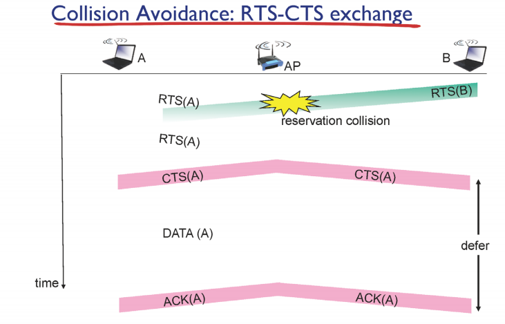
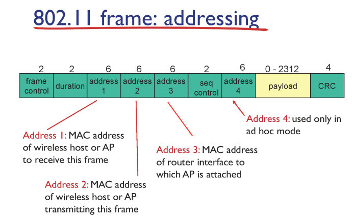
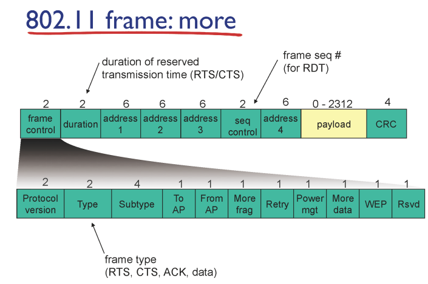
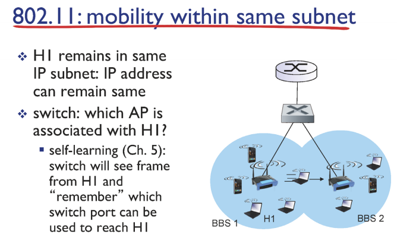
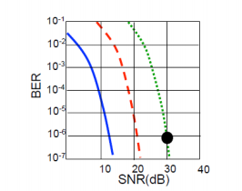
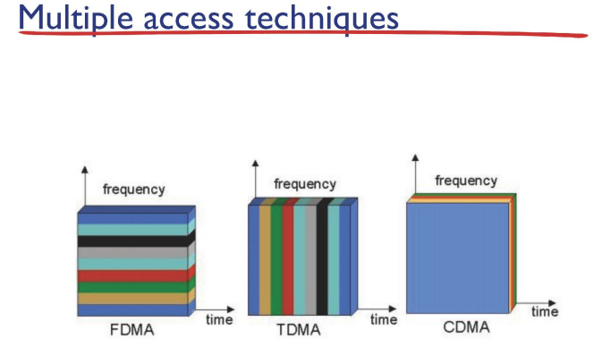
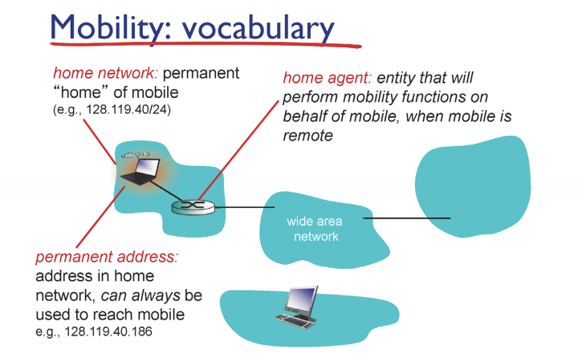
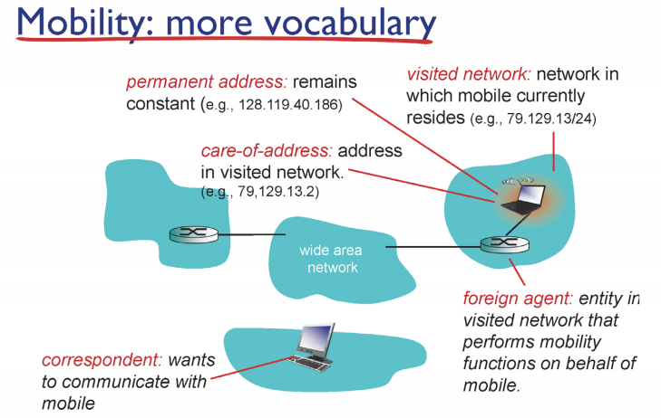

---

# 🌐 [학습 정리] 18강. 무선 및 이동 네트워크 1 (Wi-Fi와 CSMA/CA)

18강은 링크 계층의 연속선상에서, 유선이 아닌 **무선 링크** 환경에서 발생하는 특수한 문제들과 이를 해결하기 위한 **Wi-Fi** 기술을 중점적으로 다룹니다.

## 1. 무선(Wireless) vs 이동성(Mobility)의 구분

강의에서는 '무선'과 '이동성'을 명확히 구분하는 것으로 시작합니다.

*   **무선(Wireless):** 단순히 **선이 없는 링크**를 통해 통신하는 물리적인 상태를 의미합니다. 예를 들어, 강의실에서 노트북으로 와이파이를 쓰는 것은 무선 상태이지만, 네트워크 관점에서는 하나의 액세스 포인트(AP)에 고정된 상태이므로 이동성(Mobility)이 있다고 보지 않습니다.
*   **이동성(Mobility):** 사용자가 통신을 유지하면서 **한 네트워크에서 다른 네트워크로 이동**하거나 접속 지점(AP)을 바꾸는 상황을 의미합니다. 버스나 기차에서 스마트폰을 쓰며 기지국을 계속 옮겨 다니는 경우가 진정한 의미의 모빌리티입니다.

## 2. 무선 링크의 특징과 문제점

무선 링크는 공기라는 공유 매체를 사용하기 때문에 유선 이더넷보다 훨씬 통신이 어렵습니다.

*   **신호 세기 감쇠 (Path Loss):** 유선은 케이블 내에서 신호가 보호되지만, 무선 신호는 거리가 멀어짐에 따라 지수적으로 급격히 약해집니다.
*   **외부 간섭 (Interference):** 2.4GHz와 같은 비면허 대역은 전자레인지나 무선 전화기 등 수많은 기기가 공유하므로 노이즈와 간섭이 매우 심합니다.
*   **다중 경로 전파 (Multipath Propagation):** 신호가 벽이나 바닥에 반사되어 수신기에 서로 다른 시간에 도착함으로써 신호가 왜곡됩니다.
*   **숨은 터미널 문제 (Hidden Terminal Problem):** 호스트 A와 C가 서로의 신호 범위 밖에 있어 서로를 인지하지 못하지만, 중간에 있는 B에게 동시에 패킷을 보내 충돌이 발생하는 문제입니다.

## 3. IEEE 802.11 (Wi-Fi)의 구조와 접속

우리가 흔히 쓰는 **Wi-Fi**는 IEEE 802.11 표준을 따르며, 인프라스트럭처 모드(Infrastructure Mode)가 일반적입니다.

*   **기본 서비스 세트 (BSS):** 하나의 액세스 포인트(AP)와 그에 연결된 무선 호스트들의 집합을 의미합니다.
*   **AP 스캐닝 (Scanning):** 호스트가 주변 AP를 찾아 연결하는 과정입니다.
    *   **수동 스캐닝 (Passive Scanning):** AP가 주기적으로 보내는 **비콘(Beacon)** 프레임을 받아 정보를 확인하고 연결합니다. 대부분 이 방식을 씁니다.
    *   **능동 스캐닝 (Active Scanning):** 호스트가 먼저 **프로브 요청(Probe Request)** 프레임을 브로드캐스트하여 응답을 유도합니다.

## 4. 무선 매체 접근 제어: CSMA/CA

무선 환경에서는 유선에서 쓰던 **CSMA/CD를 사용할 수 없습니다**.

*   **사용 불가 이유:** 무선 노드는 자신이 전송하는 동안에는 자신의 신호가 너무 커서 주변에서 발생하는 충돌을 감지(Collision Detection)할 수 없기 때문입니다.
*   **대안: CSMA/CA (Collision Avoidance):** 충돌을 감지할 수 없으므로, 최대한 **충돌을 피하는(Avoidance)** 방식을 사용합니다.
*   **링크 계층 ACK의 필요성:** 충돌 감지가 안 되므로 패킷이 제대로 갔는지 알 수 없습니다. 따라서 수신자는 패킷을 잘 받으면 즉시 **링크 계층 ACK**를 보내주어야 합니다.

### 🛠 CSMA/CA 동작 순서:
1.  **감지:** 채널이 비어 있는지 확인합니다 (**DIFS** 시간 동안 대기).
2.  **전송:** 채널이 계속 비어 있으면 프레임 전체를 전송합니다.
3.  **백오프:** 채널이 사용 중이면, 조용해질 때까지 기다린 후 **랜덤한 시간만큼 추가로 대기(Backoff)**한 뒤 전송하여 다른 노드와의 동시 충돌을 피합니다.(**SIFS**)

## 5. RTS/CTS를 이용한 충돌 방지 최적화

숨은 터미널 문제를 해결하고 큰 데이터 프레임이 충돌하여 낭비되는 것을 막기 위해 **RTS/CTS** 교환 방식을 추가로 사용할 수 있습니다.

1.  **RTS (Ready to Send):** 데이터를 보내기 전, 아주 작은 크기의 예약 메시지를 보냅니다.
2.  **CTS (Clear to Send):** AP가 이를 받고 주변 모든 노드에게 "A가 보낼 예정이니 다들 조용히 해라"라고 방송합니다.
3.  **효과:** 이 예약을 통해 숨어 있던 다른 노드들도 일정 시간 동안 전송을 멈추게 되어 안전한 데이터 전송이 가능해집니다.
*   하지만 사람이 많아질수록 계속해서 경쟁하고, CTS를 받기위한 경쟁의 연속이다.
*   ACK오는것을 횟수로 정해두고 횟수가 다차면 다음 프레임으로 넘어감
*   포기된 프레임은 평생 재전송이 되지 않는것이 아니라 위계층(TCP)에서 다시 재전송해줌

## 6. Wi-Fi 프레임과 주소 체계 (Addressing)

802.11 프레임은 특이하게 **4개의 주소 필드**를 가지고 있으며, 보통 3개가 핵심적으로 사용됩니다.

*   **Address 1:** 프레임을 직접 받는 수신자(주로 AP)의 MAC 주소.
*   **Address 2:** 프레임을 전송하는 송신자(무선 호스트)의 MAC 주소.
*   **Address 3:** 데이터가 최종적으로 전달될 유선 네트워크 쪽 라우터 인터페이스의 MAC 주소.
*   **이유:** AP는 무선과 유선을 이어주는 **브릿지(Bridge)** 역할을 수행하기 때문입니다. 무선 구간(CSMA/CA)과 유선 구간(CSMA/CD) 사이에서 프레임 형식을 변환하며 주소를 관리해야 합니다.
*   

# 🌐 [학습 정리] 19강. 무선 및 이동 네트워크 2

### 1. 와이파이 프레임 구조와 주소 체계 (802.11 Frame Addressing)
와이파이 프레임은 유선 이더넷과 달리 **4개의 주소 필드**를 가지고 있으며, 일반적인 인프라 모드에서는 3개의 주소를 핵심적으로 사용합니다.
*   **주소 필드의 구성:**
    *   **Address 1:** 이 무선 프레임을 직접 수신하는 인터페이스의 MAC 주소 (주로 무선 호스트나 AP).
    *   **Address 2:** 이 무선 프레임을 실제로 전송하는 인터페이스의 MAC 주소.
    *   **Address 3:** 이 프레임에 담긴 IP 패킷을 처리할 **라우터 인터페이스의 MAC 주소**.
*   **AP(Access Point)의 특수성:** AP는 무선 쪽에서는 MAC 주소를 가지는 인터페이스로 보이지만, 유선 쪽(인터넷 방향)에서 보면 주소가 없는 **스위치(L2 장비)**처럼 동작합니다. 즉, 라우터 입장에서는 중간에 스위치가 있는 것처럼 보여서 AP의 존재를 인지하지 못하고 바로 호스트(H1)와 통신한다고 생각합니다.
*   **세 개의 주소가 필요한 이유:** AP는 링크 계층 장비이므로 IP 패킷을 해석할 능력이 없습니다. 따라서 호스트가 프레임을 보낼 때 "일단 AP(Addr 1) 네가 받아서, 최종적으로 저 라우터(Addr 3)에게 전달해 줘"라고 명시적으로 알려주어야 합니다.
*   

### 2. 네트워크 접속 및 주소 획득 과정 (DHCP & ARP)
새로운 환경(예: 카페)에서 노트북을 켰을 때 통신이 가능해지기까지의 실제 과정은 다음과 같습니다.

*   **DHCP 과정:** 호스트는 자신의 IP를 모르기 때문에 **DHCP Discover** 메시지를 브로드캐스트합니다. 이때 무선 프레임의 Address 1은 AP의 MAC 주소이고, Address 3은 브로드캐스트 주소(`FF-FF-FF-FF-FF-FF`)가 됩니다. 서버로부터 응답을 받으면 내 IP, 서브넷 마스크, 게이트웨이 라우터 IP 등을 알게 됩니다.
*   **ARP 과정:** 라우터의 IP는 알았지만, 프레임을 완성하기 위한 **라우터의 MAC 주소**는 모르는 상태입니다. 이때 **ARP 쿼리**를 보내 라우터의 MAC 주소를 알아내고 이를 Address 3 필드에 채우게 됩니다.

### 3. 동일 서브넷 내에서의 이동성 (Mobility within Same Subnet)
사용자가 한 네트워크(예: 한양대학교 캠퍼스) 내에서 이동하며 연결된 AP가 바뀌더라도 유튜브 영상이 끊기지 않는 원리는 다음과 같습니다.

*   
*   **TCP 연결의 유지:** TCP 커넥션은 **4-튜플(Source IP/Port, Dest IP/Port)**로 식별됩니다. 동일 서브넷 내에서 AP만 옮길 경우 호스트의 **IP 주소가 바뀌지 않기 때문에** 기존 TCP 커넥션이 그대로 유지됩니다.
*   **스위치 테이블 업데이트 (셀프 러닝):** 호스트가 새로운 AP로 이동하면, 데이터를 보내던 스위치는 여전히 이전 포트로 데이터를 보내려 할 것입니다. 이를 해결하기 위해 이동한 호스트는 새로운 AP를 통해 **더미 메시지**를 라우터 방향으로 보냅니다.
*   **경로 수정:** 이 프레임의 소스 MAC 주소를 본 스위치들은 "아, 이 호스트가 이제 이쪽 포트로 옮겨왔구나"라고 **셀프 러닝**을 통해 스위치 테이블을 업데이트하여 경로를 즉시 수정합니다.

### 4. 무선 링크의 보조 메커니즘
*   **RTS/CTS 교환:** 충돌은 피할 수 없으므로 큰 데이터가 충돌해 낭비되는 것을 막기 위해, 작은 제어 프레임인 RTS/CTS를 먼저 주고받아 **채널을 예약**한 뒤 안전하게 데이터를 전송합니다.
*   **채널 관리:** 2.4GHz 대역은 11개의 채널로 나뉩니다. 인접한 AP들이 서로 겹치지 않는 채널(예: 3번과 11번)을 선택하면 간섭 없이 동시에 통신할 수 있어 **충돌 도메인이 분리**되는 효과를 얻습니다.

결론적으로 19강은 와이파이 환경에서 **프레임 주소 3개가 협력하여 유/무선을 잇는 과정**과, IP가 변하지 않는 범위 내에서 **스위치의 셀프 러닝을 이용해 끊김 없는 이동성을 보장**하는 원리를 핵심적으로 다루고 있습니다.

---

# 🌐 [강의 노트] 20강. 무선 및 이동 네트워크: 고급 기능 및 이동성 원리

## 1. 와이파이(802.11)의 고급 기능

### 1.1 전송률 적응 (Rate Adaptation)
와이파이는 주변 환경에 따라 데이터 전송 속도를 동적으로 조절합니다.
*   **SNR(Signal-to-Noise Ratio):** 노이즈 대비 시그널의 비율을 의미하며, 값이 높을수록 채널 성능이 좋습니다. 보통 액세스 포인트(AP)와 가까울수록 SNR이 높고, 멀어질수록 낮아집니다.
*   **동작 원리:** 
    *   **SNR이 높을 때:** 채널 상태가 좋으므로 **높은 코딩 레이트(High Data Rate)**를 사용하여 더 많은 데이터를 빠르게 보냅니다.
    *   **SNR이 낮을 때:** 채널 상태가 나쁘면 에러 발생 확률인 **BER(Bit Error Rate)**이 높아집니다. 이때는 데이터를 더 견고하게 실어 보내는 **낮은 데이터 레이트** 방식으로 전환하여 에러를 줄입니다.
*   **성능 영향:** 에러가 발생하면 수신 측에서 해석을 못 하므로 ACK가 오지 않고, 결국 재전송과 백오프 과정이 반복되어 성능이 급격히 저하됩니다.
*   

### 1.2 전력 관리 (Power Management)
무선 통신은 계산 과정보다 데이터를 주고받을 때 전력 소모가 훨씬 크기 때문에 효율적인 관리가 필요합니다.
*   **낮잠 모드(Dosing/Sleep):** 전송이나 수신을 하지 않을 때 무선 어댑터의 회로를 꺼서 전력을 절약합니다.
*   **RTS/CTS 활용:** 다른 노드가 채널을 예약(RTS/CTS)한 기간 동안, 해당 전송과 관련 없는 노드들은 자신이 활동할 필요가 없음을 알고 그 시간 동안 회로를 오프(Off)하여 전력을 아낍니다.

---

## 2. 셀룰러 네트워크 (Cellular Networks)

### 2.1 기본 구조
전체 지역을 **셀(Cell)**이라는 단위로 나누고, 각 셀마다 **기지국(Base Station, BS)**을 두어 사용자를 관리합니다.
*   **구성 요소:** 모바일 사용자, 기지국, 그리고 여러 기지국을 관리하고 유선 전화망과 연결하는 **MSC(Mobile Switching Center)**로 구성됩니다.
*   **계층적 아키텍처:** 기지국 위에는 **RNC**(무선 네트워크 컨트롤러)가 있고, 그 위로 **SGSN, GGSN**이 피라미드 구조로 연결되어 있습니다.
*   **GGSN의 역할:** 셀룰러 망의 끝판왕(게이트웨이)으로, 인터넷으로 나가는 관문 역할을 합니다. 이곳에서 **IP 주소 할당(DHCP), 주소 변환(NAT), DNS 서비스**가 이루어집니다.

### 2.2 매체 접근 기술 (MAC)
*   **2G 시대:** 채널을 시간이나 주파수로 딱딱 나누는 **FDMA/TDMA** 방식을 사용하여 충돌을 방지했습니다.
*   **3G 시대 (CDMA):** 코드 분할 다중 접속 방식을 도입했습니다. 시간이나 주파수를 나누지 않고 모두가 섞여서 보내되, 각 사용자에게 부여된 **고유한 코드**를 통해 자신의 데이터만 증폭시켜 해석하는 방식입니다.
*   

### 2.3 네트워크의 진화 (2G~4G)
세대(Generation) 구분은 주로 **데이터 전송 속도**에 의해 정의됩니다.
*   **4G 시장의 경쟁:** 1Gbps 이상의 속도를 목표로 **LTE**와 **와이브로(WiBro)**가 경쟁했습니다.
*   **LTE의 승리:** 기술력 차이보다는 기존 GSM(유럽 방식) 인프라와의 호환성과 소프트웨어 업그레이드 중심의 낮은 구축 비용, 그리고 더 큰 정치적 세력의 지지를 얻어 시장을 독점하게 되었습니다.

---

## 3. 이동성(Mobility)의 원리

### 3.1 이동성의 스펙트럼
네트워크 관점에서 이동성은 세 단계로 나뉩니다.
1.  **이동성 없음:** 한 AP에 고정되어 통신함.
2.  **낮은 이동성:** 접속을 끊고 다른 네트워크로 이동해 다시 접속함 (DHCP로 새 IP 할당, TCP 끊김).
3.  **높은 이동성:** 통신(TCP 연결)을 유지하며 여러 네트워크를 넘나듦.

### 3.2 통신 유지의 핵심 원리
네트워크를 옮겨도 TCP 커넥션을 유지하려면 **4-튜플(IP/포트 번호)** 중 클라이언트의 IP 주소가 바뀌지 않아야 합니다. 하지만 실제 인터넷에서는 네트워크를 옮기면 IP가 바뀌어 연결이 끊어집니다. 이를 해결하기 위한 **가상의 개념**이 아래의 원리들입니다.

*   **주요 용어:**
    *   **홈 네트워크/홈 에이전트:** 사용자의 본래 주소와 위치를 관리하는 본진.
    *   **비지트 네트워크/포린 에이전트:** 현재 방문 중인 타 네트워크와 그곳의 관리자.
    *   **영구 주소(Permanent Address):** 어디를 가든 변하지 않는 고유 주소.
    *   **Care-of-address (COA):** 방문한 네트워크에서 임시로 할당받은 실제 주소.

*   **라우팅 방식:**
    *   **간접 라우팅 (Indirect Routing):** 상대방이 영구 주소로 패킷을 보내면 홈 에이전트가 이를 가로채 현재 위치(COA)로 배달해 줍니다. **사용자에게 투명**하지만 경로가 길어지는 **삼각형 라우팅** 지연 문제가 있습니다.
    *   **직접 라우팅 (Direct Routing):** 상대방이 홈 에이전트에게 현재 위치를 물어본 뒤, 그다음부터는 현재 위치(COA)로 직접 데이터를 보냅니다. 효율적이지만 상대방도 이 복잡한 프로토콜을 이해해야 한다는 단점이 있습니다.

*   
*   
**결론적으로**, 동일 서브넷 내에서의 이동은 **스위치의 셀프 러닝**으로 해결되지만, 서브넷을 넘나드는 고도의 이동성 처리는 현재 인터넷에서 이론적으로만 제안(Mobile IP)되었을 뿐 실제로는 구현되지 않은 상태입니다. 