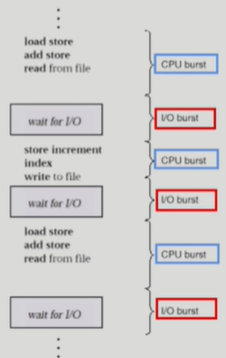
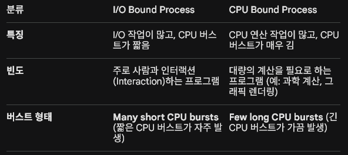
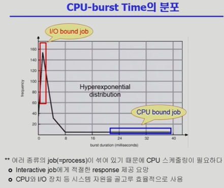

1. 프로그램 실행과 버스트 (Bursts in Program Execution)
    
    프로그램이 실행될 때는 CPU에서 코드를 실행하는 단계와 I/O(입출력) 작업을 기다리는 단계가 번갈아 가며 나타납니다.

        - CPU Burst (CPU 버스트): 프로그램이 CPU를 잡고 명령어를 실행하는 단계 (예: 연산, 메모리 접근, load/store, add store 등).
        
        - I/O Burst (I/O 버스트): 프로그램이 파일 읽기/쓰기, 키보드 입력, 화면 출력 등 입출력 작업을 수행하며 기다리는 단계 (read from file, wait for I/O 등).

        - 특징: 모든 프로그램은 이러한 CPU burst와 I/O burst의 연속(Sequence)으로 이루어져 있습니다. 프로그램의 종류에 따라 각 버스트가 차지하는 비중이 크게 달라집니다.

2. 프로세스의 분류: I/O Bound vs CPU Bound
    
    CPU 버스트의 길이와 빈도에 따라 프로세스는 크게 두 가지 종류로 나뉩니다.

    

    - 스케줄링의 필요성: 여러 종류의 프로세스가 섞여서 실행되기 때문에 CPU를 누구에게 먼저 줄 것인가가 매우 중요. 
    - 특히, 대화형 프로그램(I/O bound)이 CPU를 너무 오래 기다리지 않게 하려면 효율적인 CPU 스케줄링이 필수적입니다.

3. CPU Scheduler & Dispatcher
    CPU 스케줄링을 담당하는 운영체제 커널의 핵심 코드 영역입니다.
    
    - ① CPU Scheduler (CPU 스케줄러)
        역할: 메모리의 Ready 상태(CPU를 얻기 위해 대기 중인 상태)에 있는 프로세스들 중에서 어떤 프로세스에게 CPU를 줄지 결정.
   
    - ② Dispatcher (디스패처)
        역할: CPU 스케줄러가 선택한 프로세스에게 실제로 CPU의 제어권을 넘겨주는(Give control) 역할을 합니다.

        문맥 교환 (Context Switch): 디스패처가 작동할 때, 이전에 실행 중이던 프로세스의 상태를 PCB에 저장하고 새 프로세스의 상태를 PCB에서 복구하는 과정이 일어납니다. 이 과정에 소요되는 시간을 Dispatcher Latency(디스패처 지연 시간)라고 합니다.

4. CPU 스케줄링이 필요한 시점 (Scheduling Criteria)
    CPU 스케줄링은 프로세스의 상태가 변화할 때 발생하며, 성격에 따라 비선점형과 선점형으로 나눔.

    1) Running ➔ Blocked (비선점형): 예) I/O 요청하는 시스템 콜이 발생했을 때

    2) Running ➔ Ready (선점형): 예) 할당된 시간(Time slice)이 만료되어 타이머 인터럽트가 발생했을 때

    3) Blocked ➔ Ready (선점형): 예) I/O 작업이 완료되어 인터럽트가 발생했고, 이 프로세스의 우선순위가 더 높을 때

    4) Terminate (비선점형): 프로세스가 종료되어 다음 프로세스를 골라야 할 때

    * Non-preemptive (비선점형): 프로세스가 스스로 CPU를 반납할 때까지 강제로 빼앗지 않는 방식 (위의 1, 4번 케이스)

    * Preemptive (선점형): 운영체제가 강제로 CPU를 빼앗아 다른 프로세스에게 줄 수 있는 방식 (현대 운영체제가 주로 채택, 위의 2, 3번 케이스)

