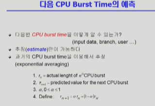
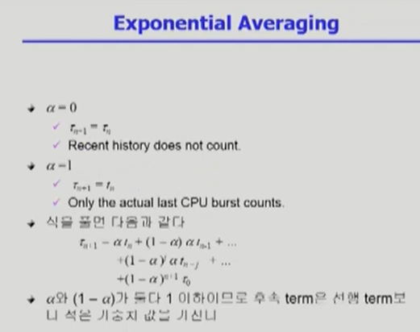
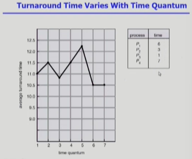
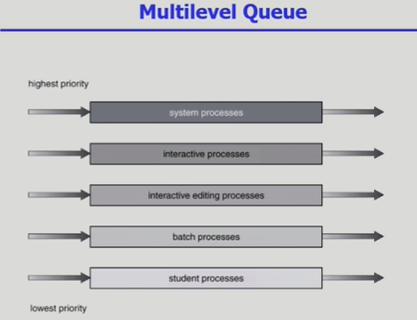
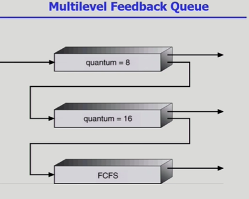
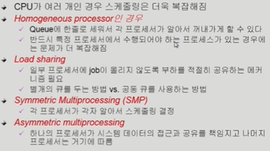
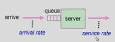

4. Scheduling Criteria (스케줄링 성능 척도)
    스케줄링 알고리즘의 성능을 평가하는 기준은 크게 시스템 관점과 이용자(프로세스) 관점으로 나뉩니다.

    시스템 관점 (공장장 마인드 - 효율성 극대화)
        1) CPU Utilization (CPU 이용률): 전체 시간 중 CPU가 놀지 않고 일한 시간의 비율 (높을수록 좋음).

        2) Throughput (처리량): 단위 시간당 완료된 프로세스의 개수 (많을수록 좋음)
    
    고객 관점 (고객 마인드 - 시간 최소화) : 프로세스 입장
        1) Turnaround Time (소요 시간/반환 시간): 프로세스가 Ready Queue에 들어와서 CPU를 다 쓰고 나갈 때까지 걸린 총 시간 (Ready Queue 대기 시간 + 실제 CPU 실행 시간).
        
        2) Waiting Time (대기 시간): 프로세스가 Ready Queue에서 CPU를 얻기 위해 순수하게 기다린 시간의 총합 (선점형의 경우 뺏겼다 다시 기다리는 시간 모두 포함).
        
        3) Response Time (응답 시간): Ready Queue에 들어온 후, 처음으로 CPU를 얻어 첫 번째 응답(첫 실행)이 나올 때까지 걸린 시간 (인터랙션 시스템에서 매우 중요).

5. CPU Scheduling Algorithms (기초)
    1) FCFS (First-Come, First-Served)
        - 특징: 비선점형(Nonpreemptive). 먼저 온 순서대로 처리.

        - 문제점 (Convoy Effect): CPU Burst가 매우 긴 프로세스가 먼저 오면, 뒤에 있는 짧은 프로세스들이 오랜 시간 기다려야 하므로 평균 대기 시간이 매우 길어지는 현상이 발생합니다.

    2) SJF (Shortest-Job-First)
        - 특징: CPU Burst가 가장 짧은 프로세스에게 CPU를 먼저 할당하는 방식.

        - 장점: 최적(Optimal) 알고리즘으로, 주어진 프로세스들에 대해 최소 평균 대기 시간(Minimum Average Waiting Time)을 보장합니다.

        - 종류
            - 비선점형 (Nonpreemptive): 일단 CPU를 잡으면 더 짧은 프로세스가 와도 빼앗기지 않음.

            - 선점형 (Preemptive / SRTF - Shortest Remaining Time First): 새로 들어온 프로세스의 잔여 시간이 현재 실행 중인 프로세스의 잔여 시간보다 짧으면 CPU를 빼앗음.

        - 문제점:
            - Starvation (기아 현상): CPU Burst가 긴 프로세스는 평생 CPU를 잡지 못할 수 있음.

            - CPU Burst Time 예측 불가능: 다음 CPU 버스트 시간을 정확히 알 수 없음 (과거 기록을 토대로 지수 이동 평균(Exponential Smoothing) 기법을 사용해 추정만 가능).
            
            

    3) Priority Scheduling (우선순위 스케줄링)
        - 특징: 각 프로세스마다 우선순위(Priority Number)를 부여하여, 가장 높은 우선순위를 가진 프로세스에게 CPU 할당 (보통 숫자가 작을수록 고우선순위).

        - 종류: 선점형과 비선점형 모두 가능.

        - 문제점: Starvation (기아 현상) - 우선순위가 낮은 프로세스는 영원히 실행되지 못함.

        - 해결책 (Aging): Ready Queue에서 기다린 시간이 길어질수록 프로세스의 우선순위를 점진적으로 높여주는 방식.

    4) Round Robin (RR)
        - 특징: 현대적인 선점형(Preemptive) 스케줄링. 각 프로세스는 동일한 크기의 할당 시간(Time Quantum / Time Slice)을 가짐.

        - 작동 방식: 할당 시간이 지나면 타이머 인터럽트가 발생하여 CPU를 빼앗기고 Ready Queue의 맨 뒤로 이동함.

        - 장점:
            - Response Time(응답 시간)이 매우 짧아짐. 어떤 프로세스든 조금만 기다리면 첫 응답을 받을 수 있음.

            - 대기 시간이 CPU Burst 시간에 비례하므로 공평함.

        - 할당 시간 설정의 중요성:
            - 너무 큰경우 : FCFS(First-Come, First-Served)와 다를 바 없어지므로, CPU 버스트 시간이 긴 프로세스가 선점하여 대기 시간이 길어집니다.

            - 너무 작은 경우 :  문맥 교환(Context Switch) 오버헤드가 너무 커져 시스템 전체가 삐걱거림. (적절한 상용 오버헤드 조율 필요)
            

            그래프의 시사점: 할당량을 키운다고 해서 무조건 평균 반환 시간이 선형적으로 줄어들거나 늘어나지 않습니다. 일반적으로는 CPU 버스트 시간이 제각각인 프로세스들이 섞여 있을 때, 대부분의 프로세스가 한 번의 할당량 내에 처리를 끝내고 나갈 수 있는 수준의 적절한 크기를 찾아야 최적의 평균 반환 시간을 얻을 수 있습니다.
    
5.  다중 큐 스케줄링 (Multilevel Queue / Multilevel Feedback Queue)
    1) Multilevel Queue
        - Ready 큐를 여러 개로 분할하여 관리합니다. 
        (예: 대화형 작업을 위한 Foreground 큐, 일괄 처리를 위한 Background 큐)

            - 각 큐는 독자적인 스케줄링 알고리즘을 가집니다. 
            (Foreground = RR, Background = FCFS)

            - 큐 자체에도 우선순위가 있어, 상위 큐가 비어있지 않으면 하위 큐의 프로세스는 CPU를 잡지 못하는 기아 현상(Starvation)이 발생할 수 있습니다.
        
        

    2) Multilevel Feedback Queue (MFQ)
        - Multilevel Queue의 기아 문제를 해결하기 위해, 프로세스가 다른 큐로 이동할 수 있게 만든 방식입니다.

        - 처음 들어오는 프로세스는 우선순위가 가장 높은 큐(Time Quantum이 매우 짧음)에 배치됩니다.

        - 할당량 내에 작업을 끝내지 못하면 한 단계 아래 우선순위 큐(Time Quantum이 조금 더 김)로 강등됩니다.

        - 결과적으로 CPU 버스트 시간이 짧은 대화형 프로세스에게 높은 우선순위를 주고, 긴 프로세스는 아래로 내려가며 마지막엔 FCFS로 처리됩니다.
        

    3) 특수 환경에서의 스케줄링
        - Multi-Processor Scheduling (다중 처리기 스케줄링)
            : CPU가 여러 개일 때는 스케줄링이 복잡해집니다. 특정 CPU만 일하지 않도록 부하 균등화(Load Balancing)가 필요하며, 한 프로세스가 가급적 같은 CPU에서 실행되도록 하는 CPU 친화성(Processor Affinity)도 고려해야 합니다.
            
        
        -  Real-Time Scheduling (실시간 스케줄링)
            - * Hard Real-time: 정해진 데드라인(Deadline)을 반드시 지켜야 하며, 지키지 못하면 시스템 전체에 치명적인 오류가 발생합니다.
            
            - Soft Real-time: 데드라인을 지키는 것이 좋지만, 지키지 못해도 시스템이 멈추지는 않고 성능 저하만 일어납니다. (예: 동영상 스트리밍 서비스)

        - Thread Scheduling
            - Local Scheduling : User level thread의 경우 사용자 수준의 thread library에 의해 어떤 thread를 스케줄할지 결정

            - Global Scheduling : Kernel level thread의 경우 일반 프로세스와 마찬가지로 커널의 단기 스케쥴러가 어떤 thread를 스케줄할지 결정

6. Algorithm Evaluation

    
    
    - Queueing models : 확률 분포로 주어지는 arrival rate와 service rate등을 통해 각종 performance index 값을 계산

    - Implementation(구현) & Measurement(성능 측정) : 실제 시스템에 알고리즘을 구현하여 실제 작업(workload)에 대해서 성능을 측정 비교

    - Simulation(모의 실험) : 알고리즘을 모의 프로그램으로 작성 후 trace를 입력으로 하여 결과 비교
