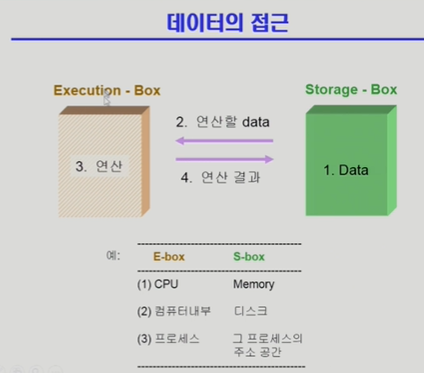
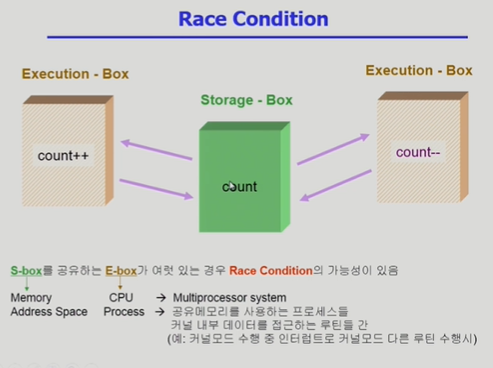
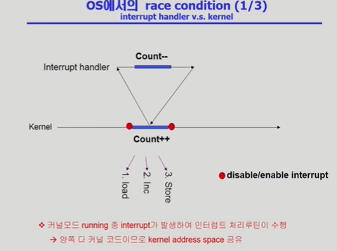
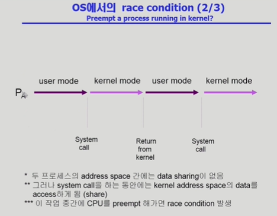
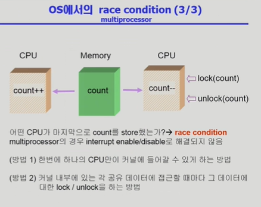
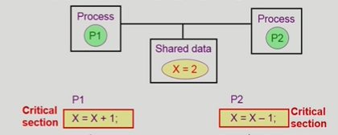

1. Process Synchronization (프로세스 동기화)
    

    

    - 데이터 접근과 Race Condition (경쟁상태)
    : 컴퓨터 시스템 내에서 여러 프로세스(혹은 스레드)가 공유 데이터에 동시에 접근하여 수정할 때, 접근 순서에 따라 실행 결과가 달라지는 상황

        * Race Condition이 발생하는 대표적인 상황
        1) 커널 모드 수행 중 인터럽트가 발생하여 커널 코드가 중복 실행될때
        

        2) 프로세스가 시스템 콜을하여 커널 모드로 실행 중인데, 다른 프로세스로 문맥 교환이 일어날 때
        

        3) 멀티프로세서 환경에서 여러 CPU가 하나의 공유 메모리(Kernel Data)에 동시에 접근할 때
        

2. Process Synchronization 문제
    1) 공유 데이터(shared data)의 동시 접근(concurrent access)은 데이터의 불일치 문제(inconsistency)를 발생시킬 수 있다.

    2) 일관성(consistency)유지를 위해서는 협력 프로세스(cooperating process)간의 실행 순서(orderly execution)를 정해주는 메커니즘 필요

    3) Race Condition
        : 여러 프로세스들이 동시에 공유 데이터를 접근하는 상황
        : 데이터의 최종 연산 결과는 마지막에 그 데이터를 다룬 프로세스에 따라 달라짐

    4) race condition을 막기 위해서는 concurrent process는 동기화(synchronize)되어야 한다. 

3. The Critical-Section Problem
    - n개의 프로세스가 공유 데이터를 동시에 사용하기를 원하는 경우
    - 각 프로세스의 code segment에는 공유 데이터를 접근하는 코드인 critical section이 존재
    - Problem
        - 하나의 프로세스가 critical section에 있을 때 다른 모든 프로세스는 critical section에 들어갈 수 없어야 한다.
        
    
