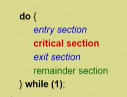

1. Initial Attempts to Solve problem
    - 두개의 프로세스가 있다고 가정 P0,P1
    - 프로세스들의 일반적인 구조
    

    - 프로세스들은 수행의 동기화(synchronize)를 위해 몇몇 변수를 공유할 수 있다. => synchronization variable

2. 프로그램적 해결법의 충족 조건
    - Mutual Exclusion (상호배제)
        : 프로세스 Pi가 critical section부분을 수행중이면 다른 모든 프로세스들은 그들의 critical section에 들어가면 안된다.
    - Progress(진행)
        : 아무도 critical section에 있지 않은 상태에서 critical section에 들어가고자 하는 프로세스가 있으면 critical section에 들어가게 해주어야 한다.
    - Bounded Waiting(유한대기)
        : 프로세스가 critical section에 들어가려고 요청한 후부터 그 요청이 허용될 때까지 다른 프로세스들이 critical section에 들어가는횟수에 한계가 있어야한다.
    
    * 가정 
        1) 모든 프로세스의 수행속도는 0보다 크다
        2) 프로세스들 간의 상대적인 수행속도는 가정하지 않는다.

3. 알고리즘
    1) 알고리즘 1

        (P0 기준)
        
        turn을 사용하여 누구의 차례인지를 구분
            - 동기화 변수 
                : int turn; (초기값 0) => turn==1이면 프로세스 Pi가 critical section에 들어갈 수 있음
        

        do {
        while (turn != 0); /* 내 차례가 올 때까지 대기 (Busy Waiting) */
        critical section    /* 임계구역 진입 */
        turn = 1;          /* 상대방(P1)에게 차례를 넘김 */
        remainder section  /* 나머지 코드 실행 */
        } while (1);

        <평가>
        - Mutual Exclusion(상호배제) 만족
            : 상대방의 flag가 꺼져있어야만 진입하므로 동시 진입 안됨
        
        - Progress(진행) 불만족
            : 과잉 양보가 발생. 반드시 한번씩 번갈아 가며 들어가야만 합니다. 만약 P0는 critical section에 자주 들어가야하고, P1은 한번만 들어가고 더이상 안들어간다면, P1이 turn=0을 해주지 않으므로 P0은 영원히 critical section에 진입할 수 없다.

    2) 알고리즘 2 (flag사용)

        상대방이 critical section에 들어갈 의사가 있는지를 확인하는 flag배열 사용하는 방식
            - 동기화 변수 : boolean flag[2];(초기값은 모두 false) => flag[i] == true이면 Pi가 critical section에 들어가겠다는 의사를 표현한것

        (Pi기준)
        do {
         flag[i] = true;    /* 나 들어가고 싶다고 표시 */
         while (flag[j]);   /* 상대방(Pj)의 flag가 true이면 대기 */
            critical section
            flag[i] = false;   /* 나 다 썼다고 표시 */
            remainder section
        } while (1);

        <평가>
        - Mutual Exclusion (상호 배제) 만족: 상대방의 flag가 꺼져 있어야만 진입하므로 동시 진입을 막습니다.

        - Progress (진행) 불만족: 두 프로세스가 동시에 들어가고 싶어서 각자의 flag를 true로 바꾼 직후 CPU를 CPU 스케줄링에 의해 서로 양보하게 되면, 두 프로세스 모두 while (flag[j]) 또는 while (flag[i])에서 무한 대기하는 교착 상태(Lock)에 빠질 수 있습니다.
        
    3) 알고리즘 3(Peterson's Algorithm)

        알고리즘1의 turn과 알고리즘2의 flag를 모두 결합하여 critical section문제를 완벽하게 해결한 알고리즘

        (Pi기준)
        
        do {
            flag[i] = true;          /* 나 들어가고 싶어 */
            turn = j;             /* 일단 상대방 차례로 설정 (양보) */
            while (flag[j] && turn == j); /* 상대가 들어가고 싶어하고, 실제로 상대 차례면 대기 */
            critical section
            flag[i] = false;         /* 나 이제 끝났어 */
            remainder section
        } while (1);

        <평가>
        - 세 가지 조건(Mutual Exclusion, Progress, Bounded Waiting)을 모두 만족하는 완벽한 소프트웨어적 해결책입니다.
        - 단점: while문에서 조건을 만족할 때까지 CPU를 계속 소모하며 기다리는 Busy Waiting(또는 Spin Lock) 문제가 존재하여 컴퓨터 자원이 낭비됩니다.
    
    4) 하드웨어적 해결법(Test-and-Set)
        - 데이터를 읽고 쓰는 동작"이 CPU 내부에서 분리되어 일어나기 때문에 위의 문제들이 발생함

        - 값을 읽어오면서 동시에 쓰는 작업이 하나의 명령어로 한번에(Atomic하게) 처리된다면 문제가 쉽게 해결됨

        - 많은 현대 CPU는 Test_and_Set 이라는 하드웨어 명령어를 제공

            - 동기화 변수 : boolean lock=false;
            
        (구조)

        do {
            while (Test_and_Set(lock)); /* lock이 false였으면 true로 바꾸고 진입, 이미 true였으면 대기 */
            critical section
            lock = false;
            remainder section
        } while (1);
        
        - 특징 : 하드웨어의 도움을 받아 critical section 문제를 간단하게 해결, But, 기다리는 동안 CPU를 소모하는 Busy Waiting문제가 있음. 이를 극복하기 위해 추후 세마포어(Semaphore) 등의 개념이 등장.
        
