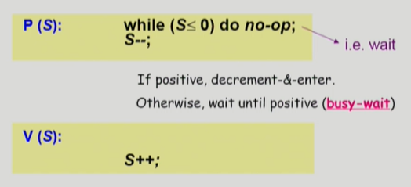
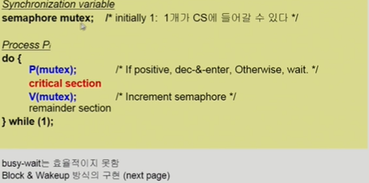
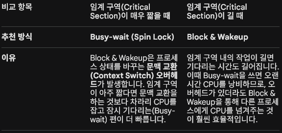

1. Semaphores(세마포어)
    - 앞의 방식들을 추상화시킴
    - Semaphore S
        - 정수값
        - P연산(획득)과 V연산(반납) : (atomic연산)
            

        

        1) P(S) 연산 
            : 자원 획득 (wait)임계 구역에 들어가기 전에 자원이 있는지 확인하고, 자원을 획득하는 연산입니다.
            
            P(S) : while (S <= 0) do no-op; S--;
                동작 원리
                 - 만약 S값이 0 이하라면, 사용할 수 있는 자원이 없다는 뜻이므로 자원이 생길 때까지 아무것도 하지 않고 기다립니다(no-op)
                
                    - 만약 S값이 양수라면, 조건문을 통과하여 S값을 1 감소시키고 임계 구역(자원 사용)으로 진입합니다.
                
                특징: 자원이 없을 때 반복문을 돌며 기다리는 방식을 바쁜 대기(Busy-wait) 또는 스핀락(Spin Lock)이라고 부릅니다.
        
        2) V(S) 연산 : 자원 반납 (signal)
            : 임계 구역에서 작업을 마치고 나오면서 자원을 반납하는 연산입니다.
            
            V(S) : S++;
                동작 원리
                - 사용이 끝난 자원을 반납하므로 S값을 1 증가시킵니다. 이제 대기하고 있던 다른 프로세스가 P(S)의 조건문을 통과하여 자원을 얻을 수 있게 됩니다.
            
        * 주의 (원자성, Atomicity): > P(S)와 V(S) 내의 모든 연산은 중간에 CPU를 빼앗기지 않고 단번에 실행되는 **원자적 연산(Atomic Operation)**임이 보장되어야 합니다.

        3) 세마포어의 활용예시(critical section 상호 배제)
            공유 자원 critical section이 하나만 존재할 때, 세마포어 초기값 S를 1로 설정하여 상호 배제(Mutual Exclusion)를 구현하는 구조.

            // 초기 상태: S = 1;

            do {
                P(S);  // 자원이 1이므로 통과하며 S를 0으로 만듦 (다른 프로세스 진입 차단)
    
                /* Critical Section (임계 구역) */
    
                V(S);  // 작업을 마치고 S를 다시 1로 늘려줌 (다른 프로세스 진입 허용)
    
                /* Remainder Section (나머지 구역) */
            } while (1);

        4) 현재 방식의 한계점과 다음 과제
        자원이 없을 때 while 루프를 돌며 CPU스케줄링 시간을 낭비하는 바쁜 대기(Busy-wait)방식을 사용하고 있음
            - 문제점 : 자원을 기다리는 프로세스가 CPU를 잡고 계속 조건을 검사하므로, CPU사이클이 무의미하게 낭비됨
            
            - 해결책 : 자원이 없다면 프로세스를 Block 상태로 만들어 잠재우고(Wait Queue에 삽입), 자원이 생기면 깨우는(Wakeup) Block & Wakeup(Sleep lock) 방식으로 발전시켜 해결

2. Busy-wait(Spin Lock)방식
    세마포어를 구현할때, 자원이 없어서 기다려야하는 상황을 처리하는 방식은 크게 두가지

    1) Busy-wait(Spin lock) 방식
        - 개념 : 자원이 없을 때, while 루프를 돌며 CPU를 계속 소모하면서 대기하는 방식
        - 단점 : 자원이 곧바로 나오지 않는다면, 대기하는 프로세스가 CPU스케줄링 시간을 무의미하게 낭비
    
    2) Block & Wakeup(Sleep Lock) 방식
        - 개념 : 자원을 기다릴때, CPU를 반납하고 스스로 Block(Sleep)상태로 들어가 대기 큐(Wait Queue)에서 기다리는 방식. 자원이 생기면 다른 프로세스가 깨워줌

        - 프로세스 상태변화 
            - 자원이 없으면 : running->blocked (공유자원의 Resource queue에 삽입)
            - 자원이 반납되면 : Blocked->Ready (Ready Queue로 이동하여 CPU를 기다림)

3. Block & WakeUP 
    1) 구조체 정의 
        typedef struct {
            int value;           // 세마포어 변수 (자원의 개수 또는 대기 프로세스 수)
            struct process *L;   // 자원을 기다리는 프로세스들이 연결된 큐 (Wait Queue)
        } semaphore;

        block과 wakeup을 다음과 같이 가정
            - block : 커널은 block을 호출한 프로세스를 suspend 시킴
                    : 이 프로세스의 PCB를 semaphore에 대한 wait queue에 넣음
            - wakeup(P) : block된 프로세스 P를 wakeup시킴
                        : 이 프로세스의 PCB를 ready queue로 옮김
    
    2) P(S) 연산(자원획득)
        void P(semaphore S) {
            S.value--;        // 자원을 사용하겠다고 먼저 선언 (1 감소)
            if (S.value < 0) {  // 만약 음수라면 여분의 자원이 없다는 뜻
                /* 이 프로세스를 S.L (대기 큐)에 추가 */
                block();     // 프로세스를 Block 상태로 전환 (CPU 반납)
            }
        }
    
    3) V(S) 연산(자원 반납)
        void V(semaphore S) {
            S.value++;           // 자원을 반납했으므로 1 증가
            if (S.value <= 0) {  // 만약 0 이하라면 대기 큐에 기다리는 프로세스가 존재함
                /* S.L (대기 큐)에서 프로세스 P를 제거 */
                wakeup(P);      // Block된 프로세스 P를 깨움 (Ready Queue로 이동)
            }
        }

    ** 핵심 차이점(Value의 의미) **
    - Busy-wait 방식: S.value가 무조건 0 이상이며, 현재 사용 가능한 자원의 개수를 뜻합니다.

    - Block & Wakeup 방식: S.value가 음수일 수 있습니다. 만약 음수라면 그 절대값($|S.value|$)은 현재 자원을 기다리며 잠들어 있는 프로세스의 개수를 의미합니다.

※ 일반적으로는 Block & Wakeup 방식이 CPU 효율성 측면에서 더 좋기 때문에 대형 운영체제에서는 기본적으로 이 방식을 채택합니다.

4. 세마포어의 종류(두가지)
    1) 계수 세마포어(Counting Semaphore)
        - 특징 : 초기 자원의 개수가 2 이상인 정수 값을 가질 수 있습니다.
        - 용도 : 여러 개의 여유 자원이 있는 자원 관리(Resource Counting)에 사용됩니다.
    2) 이진 세마포어(Binary Semaphore)
        - 특징 : S.value가 오직 0 또는 1 두 가지만 가질 수 있는 세마포어입니다.
        - 용도 : 주로 상호 배제(Mutual Exclusion, Lock/Unlock)를 구현할 때 사용되며, 하드웨어의 Mutex와 유사한 역할을 합니다.

5. 세마포어 사용시 주의할점
    1) Deadlock(교착상태)
        : 두 개 이상의 프로세스가 서로 상대방이 가진 세마포어 자원을 깨워주기를 영원히 기다리며 멈춰버리는 현상입니다. (예: P_0가 S를 잡고 Q를 기다리는데, P_1이 Q를 잡고 S를 기다리는 상황)
    
    2) Starvation(기아상태) (Indefinite Blocking)
        : 특정 프로세스가 영원히 세마포어 큐에서 빠져나오지 못하고 자원을 얻지 못하는 불평등 현상입니다.
    
