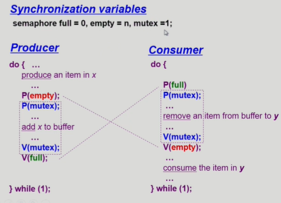
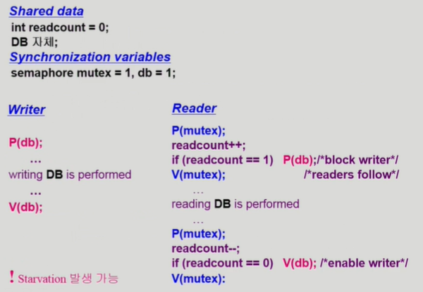
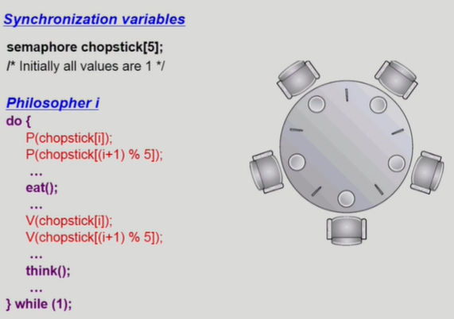
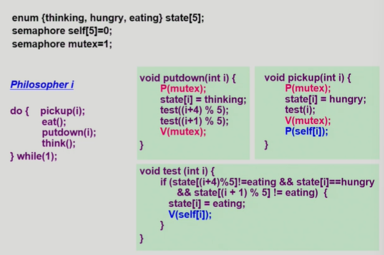
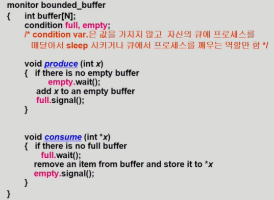
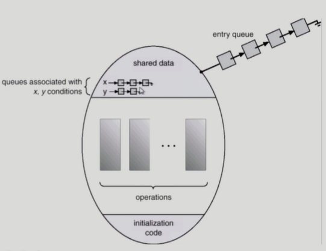

1. Classical Problems of Synchronization
    1) Bounded-Buffer Problem(Producer-Consumer Problem)
        - 버퍼의 크기가 유한한 환경에서 생산자, 소비자 문제
        - Producer : 공유 버퍼에 데이터를 넣는 역할
        - Consumer : 공유 버퍼의 데이터를 꺼내가는 역할
        - 비어있는버퍼 하나의 생산자가 동시에 여러개 넣으려고 하면 문제 생김 =>lock으로 해결
        - 두 소비자가 동시에 하나의 데이터를 꺼내가려함 => lock을 걸어서 해결
        - 버퍼가 유한하기 때문에 생기는 문제
          : (빈 버퍼가 없고, 소비자도 없을때 => 생산자 프로세서는 계속 기다려야함)
        - 모두 다 비어있는 버퍼인경우 => 소비자 프로세서 계속 기다려야함
       
        * 세마포어를 이용헤 해결해야하는 것
            1) lock : 한번에 하나의 생산자/소비자만 접근 가능
            2) counting semaphore : 자원의 개수를 카운팅 하기 위해 필요
        - 

        * mutex = 1 => 하나의 프로세스만 접근 가능하게 함

    2) Readers and Writers Problem
        - 프로세스가 2종류(Reader, Writer)
        - write 중일 때 다른 프로세스가 접근 하면 안됨
        - read는 동시에 여럿이 접근 가능
        - soultion
            1) writer가 db에 접근 허가를 아직 얻지 못한 상태에서는 모든 대기중인 reader들을 다 db에 접근하게 해줌
            2) writer는 대기 중인 reader가 하나도 없을 때 db접근이 허용
            3) 일단 writer가 db접근 중이면 reader들은 접근 금지
            4) writer가 db에서 빠져나가야만 reader 접근 허용
        
        - shared data
            - db 자체
            - readcount; (현재 db에 접근 중인 reader의 수)
        - Synchronization Variables
            - mutex : 공유 변수 readcount를 접근하는 코드(critical section)의 mutual exclusion 보장을 위해 사용 (lock을 걸어주는 역할)
            - db : reader와 writer가 공유 db자체를 올바르게 접근하게 하는 역할
        
        - 
        - writer는 reader가 모두 다 읽을 때까지 기다려야함. 근데 또 이어서 추가 reader들이 더 들어오면 더기다려야함. 따라서 Starvation문제 발생가능하다.

    3) Dining-Philosophers Problem 
        - 생각하는 일, 밥먹는일 2가지 업무
        - 
        - Deadlock이 발생하는 잘못된 코드
        - 해결  
            1) 4명의 철학자만이 테이블에 동시에 앉을수 있도록 한다.
            2) 젓가락을 2개모두 집을 수 있을때에만 젓가락을 집을 수 있게함
            3) 비대칭 : 짝수(홀수) 철학자는 왼쪽(오른쪽) 젓가락부터 집도록 설정
        - 

2. Monitor
    - Semaphore의 문제점
        1) 코딩하기 힘듬
        2) 정확성의 입증이 어렵다.
        3) 자발적 협력이 필요하다.
        4) 한번의 실수가 모든 시스템에 치명적
    
    - Monitor는 공유데이터를 접근하기 위해서는 내부의 procedure를 통해서만 접근할 수 있게함.
    - lock을 걸 필요가 없음.(애초에 동시접근을 못하게 내부에 짜여짐)
    - 따라서 semaphore에 비해 편리함.
    - 프로세스가 모니터 안에서 기다릴 수 있도록 하기 위해 condition variable 사용(condition x,y;)
    - condition variable은 wait과 signal연산에 의해서만 접근 가능
        1) x.wait();
        x.wait()을 invoke한 프로세스는 다른 프로세스가 x.signal()을 invoke하기 전까지 suspend된다.
        2) x.signal();
        x.signal()은 정확하게 하나의 suspend된 프로세스를 resume한다.
        suspend된 프로세스가 없으면 아무 일도 일어나지 않는다. 
    
    - 
    => 세마포어를 이용한 생산자-소비자 코드를 모니터를 이용해서 작성한 코드
    => 모니터 코드 내부에 공유버퍼 변수 설정.
    => lock을 거는 코드 없음
    - 