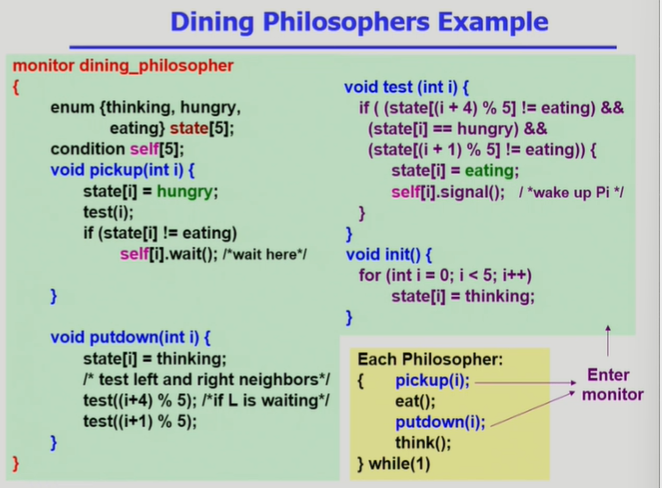

# Process Synchronization = 프로세스 동기화
# Concurrency Control = 병행 제어
# 2개 다 같은 말

# 세마포어는 P연산,V연산 사용
# 모니터는 프로그래밍 언어 차원에서 설정(세마포어 문제 해결)

- 
- 객체 지향 언어쪽에서 많이들 이용
- 세마포어에서는 P,V연산으로 인해 값의 변화가 있음.
- 모니터는 값의 변화는 없음.
- 애초에 세마포어와 모니터의 목적이 다름
- 모니터 : 동시접근을 모니터 차원에서 막는것을 위함
- 세마포어 : 자원획득을 위함

- 
- 모니터로 짠 철학자 문제
- self[i].signal() : 깨워주는 역할
- 세마포어 코드랑 비교해보기!!!!
