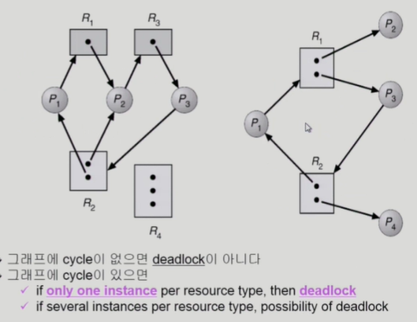
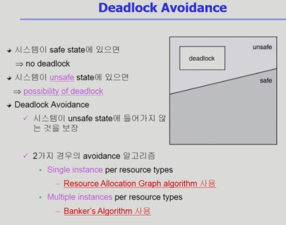
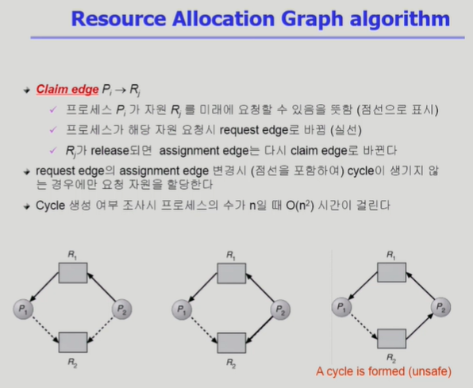
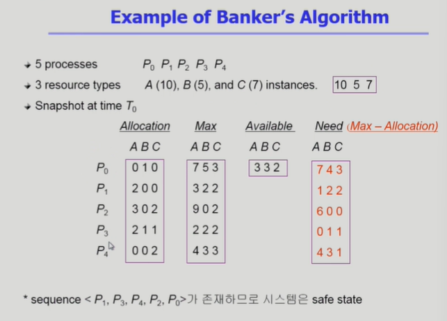
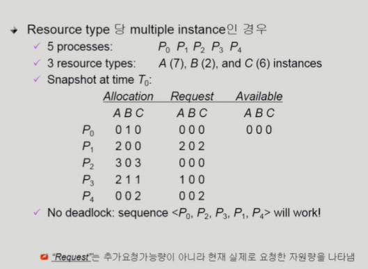
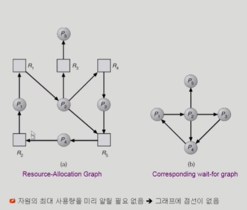

1. Deadlock(교착상태)
 - 일련의 프로세스들이 서로가 가진 자원을 기다리며 block된 상태
 - Resource(자원)
    : 하드웨어, 소프트웨어 등을 포함하는 개념
    : ex) I/O device, CPU cycle, memory space, semaphore 등
    : 프로세스가 자원을 사용하는 절차
        * request, allocate, use, release

2. Deadlock 발생의 4가지 조건
    1) Mutual excludion(상호배제)
        : 매 순간 하나의 프로세스만이 자원을 사용할 수 있음
    2) No preemption(비선점)
        : 프로세스는 자원을 스스로 내어놓을 뿐 강제로 뺏기지 않음
    3) Hold and wait(보유대기)
        : 자원을 가진 프로세스가 다른 자원을 기다릴 때 보유 자원을 놓지 않고 계속 가지고 있음.
    4) Circular wait
        : 자원을 기다리는 프로세스 간에 사이클이 형성되어야함.
        : 프로세스 P0,P1,....,Pa이 있을때
        P0는 P1이 가진 자원을기다림
        P1는 P2가 가진 자원을 기다림
        Pn은 P0가 가진 자원을 기다림

3. deadlock발생했는지 알기 위해 Resource_allocation graph(자원할당그래프)사용
    - 
    - 왼쪽그림 : 2번 자원은 인스턴스가 2개 있지만 진행 불가 => Deadlock 상태
    - 오른쪽그림 : 여분자원이 P2,P4프로세스에 있지만 Deadlock사이클에 연류안된 프로세스들이기 때문에 Deadlock 상태 아님

4. Deadlock의 처리방법
    1) Deadlock Prevention
        - 자원 할당 시 Deadlock의 4가지 필요조건 중 어느 하나가 만족되지 않도록 하는것
            1) Mutual Excludion
                : 공유해서는 안되는 자원의 경우 반드시 성립해야함
            2) Hold and wait
                : 프로세스가 자원을 요청할 때 다른 어떤 자원도 가지고 있지 않아야한다.
                : 방법1) 프로세스 시작시 모든 필요한 자원을 할당받게 하는 방법(자원에대한 비효율성 생김)
                : 방법2) 자원이 필요한 경우 보유 자원을 모두 놓고 다시 요청
            3) No Preemption
                : process가 어떤 자원을 기다려야 하는 경우 이미 보유한 자원이 선점됨
                : 모든 필요한 자원을 얻을 수 있을때만 그 프로세스는 다시 시작된다.
                : State를 쉽게 Save하고 Restore할 수 있는 자원에서 주로 사용(CPU,memory)
            4) Curcular Wait
                : 모든 자원 유형에 할당 순서를 정하여 정해진 순서대로만 자원 할당
                : 예를 들어 순서가 3인 자원 Ri를 보유 중인 프로세스가 순서가 1인 자원 Rj를 할당 받기 위해서는 우선 Ri를 release 해야한다.
            * => Utilization 저하, throuput 감소, starvation문제
            * => 생기지도 않은 deadlock 때문에 미리 너무 많은 제약사항

    2) Deadlock Avoidance
        - 자원 요청에 대한 부가적인 정보를 이용해서 deadlock의 가능성이 없는 경우에만 자원을 할당
        - 프로세스가 나중에 필요할거까지 해서 최대 필요자원을 선언(declare)
        - 시스템 state가 원래 state로 돌아올 수 있는 경우에만 자원할당
            1) safe state
                : 시스템 내의 프로세스들에 대한 safe sequence가 존재하는 상태
            2) safe sequence
                : 프로세스의 sequence<P1,P2,...,Pn>이 safe하려면 Pi(1<=ni<=n)의 자원 요청이 "가용자원 + 모든 Pj (j<i) 의 보유자원"에 의해 충족되어야함.
                : 조건을 만족하면 다음 방법으로 모든 프로세스의 수행을 보장
                    - Pi의 자원요청이 즉시 충족될 수 없으면 모든 Pj(j<i)가 종료될 때까지 기다린다.
                    - Pi-1이 종료되면 Pi의 자원요청을 만족시켜 수행한다.
            - 

            - 
            - 점선은 지금아니지만 언젠가 이프로세스가 자원을 사용할것이라고 예상
            => 자원당 인스턴스가 1개일때 사용

            - 자원당 인스턴스가 여러개인 경우 = Banker's 알고리즘 사용
                - 
                - 가용자원이 0이되어도 deadlock은 안되지만 최악의 상태를 항상 생각하므로 가능한 최대 필요량이 가용 가능한 자원을 넘어가면 자원을 주지 않는다.
                - 쓰고있는 자원들이 반환되면 가용가능 자원이 많아지고 그때마다 상황 판단 후에 자원을 준다.
                * => 자원이 많이 있지만 주지 않으므로 비효율적

    3) Deadlock Detection and Recovery
        - Deadlock발생은 허용하되 그에 대한 detection루틴을 두어 Deadlock발견시 recover
        - Deadlock Detection
            : Resource type당 single instance인 경우
                - 자원할당 그래프에서의 cycle이 곧 deadlock을 의미
            : Resource type당 multiple instance인 경우
                - Banker's 알고리즘과 유사한 방법 사용
                - 

        - Wait-for Graph 사용
            : Resource type당 single instance인 경우
            : Wait-for graph
                - 자원 할당 그래프의 변형
                - 프로세스만으로 node 구성
                - Pj가 가지고 있는 자원을 Pk가 기다리는 경우 Pk->Pj
            : 알고리즘
                - Wait-for graph에 사이클이 존재하는지를 주기적으로 조사
                - O(n^2)
        - 

        - Deadlock detection 이후 deadlock이 발결되면 Recovery 실행
            - Process termination(프로세스 종료하는 과정)
                : Deadlock상태인 모든 프로세스를 한꺼번에 강제종료
                : Deadlock이 제거될때(사이클이 종료)까지 프로세스를 한번에 하나씩 차례대로 종료한다.
            - Resource Preemption(자원을 뺏어오는 과정)
                : 비용을 최소화할 victim의 선정
                : safe state로 rollback하여 process를 restart
                : Starvation문제
                    - 동일한 프로세스가 계속해서 victim으로 선정되는 경우
                    - cost factor에 rollback횟수도 같이 고려

    4) Deadlock Ignorance(현대 많이 사용)
        - Deadlock을 시스템이 책임지지 않음
        - UNIX를 포함한 대부분의 OS가 채택(미연에 방지하면 오버헤드 크기 때문)
            : Deadlock이 매우 드물게 발생하므로 Deadlock에 대한 조치 자체가 더 큰 overhead일 수 있음
            : 만약, 시스템에 deadlock이 발생한 경우 시스템이 비정상적으로 작동하는 것을 사람이 느낀 후 직접 process를 죽이는 등의 방법으로 대처