# 메모리는 주소를 통해 접근하는매체
# 주소의 종류 2개
1. Logical(논리주소) vs. Physical(물리주소)
    - Logical Address (=Virtual Address)
        : 프로세스마다 독립적으로 가지는 주소공간
        : 각 프로세스마다 0번지부터 시작
        : CPU가 보는주소는 logical address
    - Physical Address
        : 메모리에 실제 올라가는 위치
    
    * 주소 바인딩 : 주소를 결정하는것
    * Symbolic address -> logical address -> Physical address
    * Symbolic address : 변수 또는 이름으로 된 주소

2. 주소 바인딩(Address Binding) 언제 일어나나
    1) Compile time binding
        - 물리적 메모리 주소가 컴파일 시 알려짐
        - 시작 위치 변경시 재컴파일
        - 컴파일러는 절대 코드(absolute code)생성
        - 미리 결정해야하므로 비효율적(메모리 주소 재설정하려면 컴파일 다시해야함)
    2) Load time binding
        - Loader의 책임하에 물리적 메모리 주소 부여
        - 컴파일러가 재배치가능코드(relocatable code)를 생성한 경우 가능
    3) Execution time binding(=Run time binding)
        - 수행이 시작된 이후에도 프로세스의 메모리 상 위치를 옮길 수 있음
        - CPU가 주소를 참조할때마다 binding을 점검(address mapping table)
        - 하드웨어적인 지원이 필요(e.g. base and limit register,MMU)
            * Memory-Management Unit(MMU)
                - logical address를 physical address로 매핑해주는 Hardware device
                - MMUscheme
                    : 사용자 프로세스가 CPU에서 수행되며 생성해내는 모든 주소값에 대해 base register(=relocation register,접근할 수 있는 물리적 메모리 주소의 최소값)의 값을 더 한다.
                    : limit register(프로그램의 크기=논리적 주소의 범위를 저장)도 함께 이용
                    - 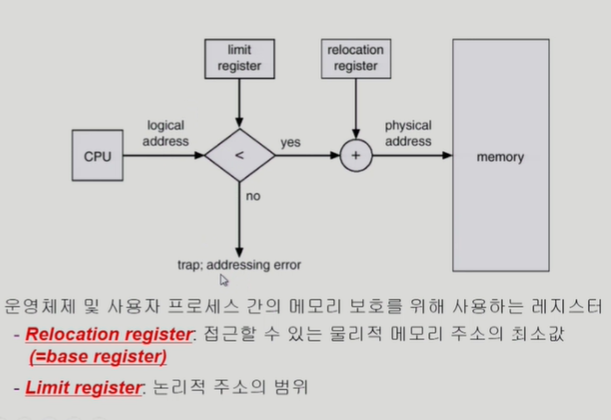

                - user program
                    : logical address만을 다룬다.
                    : 실제 physical address를 볼 수 없으며 알 필요가 없다.
        - 현대 컴퓨터 시스템에서 많이 채택

    - 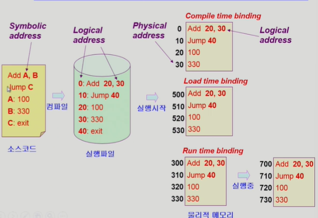

3. 용어
    1) Dynamic Loading
        - 프로세스 전체를 메모리에 미리 다 올리는 것이 아니라 해당 루틴이 불려질때 메모리에 load하는 것
        - memory utilization의 향상
        - 가끔씩 사용되는 많은 양의 코드의 경우 유용
            ex) 오류 처리 루틴
        - 운영체제의 특별한 지원 없이 프로그램 자체에서 구현 가능
        - OS는 라이브러리를 통해 지원 가능(페이징 시스템과 구분해야함)
        * Loading : 메모리로 올리는 것

    2) Dynamic Linking
        - Linking을 실행 시간(execution time)까지 미루는 기법
        - Static Linking
            : 라이브러리가 프로그램의 실행 파일 코드에 포함됨
            : 실행 파일의 크기가 커짐
            : 동일한 라이브러리를 각각의 프로세스가 메모리에 올리므로 메모리 낭비(e.g. printf함수의 라이브러리 코드)
        - Dynamic Linking
            : 라이브러리(Shared library파일)가 실행시 연결(link)됨
            : 라이브러리 호출 부분에 라이브러리 루틴의 위치를 찾기 위한 stub(포인터 역할)이라는 작은 코드를 둠
            : 라이브러리가 이미 메모리에 있으면 그 루틴의 주소로 가고 없으면 디스크에서 읽어옴
            : 운영체제의 도움이 필요함

    3) Overlays
        - 메모리에 프로세스의 부분 중 실제 필요한 정보만을 올림
        - 프로세스의 크기가 메모리보다 클 때 유용
        - 운영체제의 지원없이 사용자에 의해 구현
        - 작은 공간의 메모리를 사용하던 초창기 시스템에서 수작업으로 프로그래머가 구현
            : Manual Overlays
            : 프로그램 구현 어려움

    4) Swapping
        1) Swapping 
            : 프로세스를 일시적으로 메모리에서 backing store로 쫓아내는 것
        2) Backing store(=swap area)
            : 디스크
                - 많은 사용자의 프로세스 이미지를 담을 만큼 충분히 빠르고 큰 저장 공간
        3) Swap in/Swap out
            : 일반적으로 중기 스케줄러(swapper)에 의해 swap out 시킬 프로세스 선정
            : priority-based CPU scheduling algorithm
                - priority가 낮은 프로세스를 swapped out 시킴
                - priority가 높은 프로세스를 메모리에 올려놓음
            : Compile time 혹은 load time binding에서는 원래 메모리 위치로 swap in 해야함
            : Execution time binding(Runtime binding)에서는 추후 빈 메모리 영역 아무곳에나 올릴 수 있음
            : swap time은 대부분 transfer time (swap되는 양에 비례하는 시간)임
        
        - 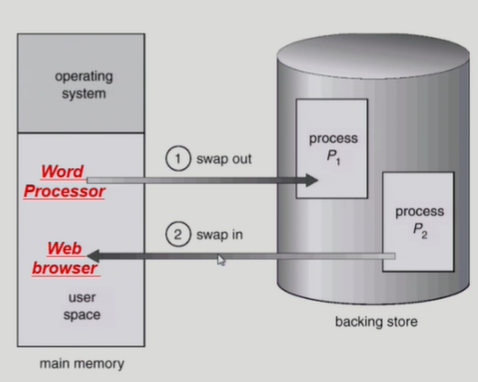

4. Allocation of Physical Memory
    - 메모리는 일반적으로 두 영역으로 나뉘어 사용
    - 
        
        1) OS 상주 영역
            : interrupt vector와 함께 낮은 주소 영역 사용
        2) 사용자 프로세스 영역
            : 높은 주소 영역 사용
    - 사용자 프로세스 영역의 할당 방법
        1) Contiguous allocation (연속 할당)
            : 각각의 프로세스가 메모리의 연속적인 공간에 적재되도록 하는것
            - 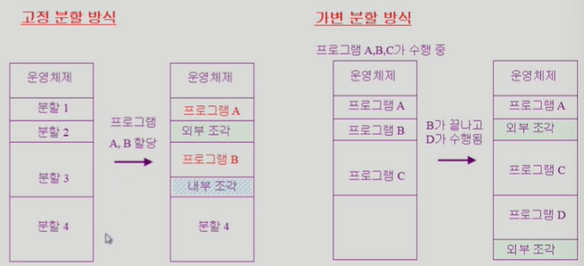

            - Fixed partition allocation (고정 분할 방식)
                : 물리적 메모리를 몇개의 영구적 분할(partition)로 나눔
                : 분할의 크기가 모두 동일한 방식과 서로 다른 방식이 존재
                : 분할당 하나의 프로그램 적재
                : 융통성이 없음
                    - 동시에 메모리에 load되는 프로그램의 수가 고정됨
                    - 최대 수행 가능 프로그램 크기 제한
                : Internal/External fragmentation발생
                    - Internal fragmentation
                        : 프로그램 크기보다 분할의 크기가 큰경우
                        : 하나의 분할 내부에서 발생하는 사용되지 않는 메모리 조각
                        : 특정 프로그램에 배정되었지만 사용되지 않는 공간
                    - External fragmentation
                        : 프로그램 크기보다 분할의 크기가 작은경우
                        : 아무 프로그램도 배정되지 않은 빈 곳인데도 프로그램이 올라갈 수 없는작은 분할
            - Variable partition allocation(가변 분할 방식)
                : 프로그램의 크기를 고려해서 할당
                : 분할의 크기, 개수가 동적으로 변함
                : 기술적 관리 기법 필요
                : External fragmentation 발생
            
            * Hole
                - 가용 메모리 공간
                - 다양한 크기의 hole들이 메모리 여러곳에 흩어져 있음
                - 프로세스가 도착하면 수용가능한 hole을 할당
                - 운영체제는 다음의 위치 정보를 유지
                    a)할당공간 b)가용공간(hole)
                - 여러 hole중에 어디에 프로그램을 할당할건가?
                    * Dynamic Storage-Allocation Problem
                        : 가변 분할 방식에서 size n인 요청을 만족하는 가장 적절한 hole을 찾는 문제
                        1) First-fit
                            : Size가 n 이상인 것 중 최초로 찾아지는 hole에 할당
                        2) Best-fit
                            : Size가 n 이상인 가장 작은 hole을 찾아서 할당
                            : hole들의 리스트가 크기순으로 정렬되지 않은 경우 모든 hole리스트를 탐색해야함
                            : 많은 수의 아주 작은 hole들이 생성됨
                        3) Worst-fit
                            : 가장 큰 hole에 할당
                            : 역시 모든 리스트를 탐색해야함
                            : 상대적으로 아주 큰 hole들이 생성됨
                        * First-fit과 best-fit이 worst-fit보다 속도와 공간 이용률 측면에서 효과적인 것으로 알려짐

            * Compaction
                - external fragmentation 문제를 해결하는 한가지 방법
                - 사용중인 메모리 영역을 한군데로 몰고 hole들을 다른 한곳으로 몰아 큰 block을 만드는 것
                - 매우 비용이 많이 드는 방법
                - 최소한의 메모리 이동으로 compaction하는 방법
                - compaction은 프로세스의 주소가 실행 시간에 동적으로 재배치 가능한 경우에만 수행될 수 있다.
                       
        2) Noncontiguous allocation (불연속 할당)
            : 하나의 프로세스가 메모리의 여러 영역에 분산되어 올라갈수 있음(현대 시스템에서 많이 사용)
            - Paging
                - 프로세스의 virtual memory를 동일한 사이즈의 page 단위로 나눔
                - virtual memory의 내용이 page단위로 noncontiguous하게 저장됨
                - 일부는 backing storage에, 일부는 physical memory에 저장
                    1) physical memory를 동일한 크기의 frame으로 나눔
                    2) logical memory를 동일 크기의 page로 나눔(frame과 같은 크기)
                    3) 모든 가용 frame들을 관리
                    4) page table을 사용하여 logical address를 physical address로 변환
                - external fragmentation 발생 안함
                - internal fragmentation 발생 가능

                - 각각의 페이지 별로 물리 메모리에 올려주는 기법
                - 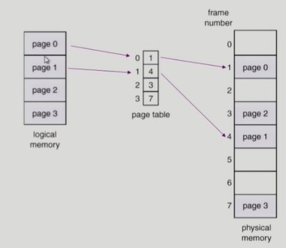
                - 페이지 테이블을 이용
                    - 메인 메모리에 상주
                    - Page-table base register(PTBR)가 page table을 가리킴
                    - Page-table length register(PTLR)가 테이블 크기를 보관
                    - 모든 메모리 접근 연산에는 2번의 memory access 필요
                    - Page table 접근 1번, 실제 data/instruction 접근 1번
                    - 속도 향상을 위해 associative register/translation look-aside buffer(TLB)라 불리는 고속의 lookup hardware cache사용
                - 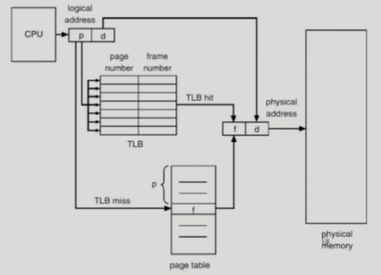
                - Assosiative Register(TLB) : parallel search가 가능
                    : TLB에은 page table 중 일부만 존재
                - Address translation
                    - page table 중 일부가 associative register에 보관되어 있음
                    - 만약 해당 page #가 associative register에 있는 경우 곧바로 frame #을 얻음
                    - 그렇지 않은 경우 main memeory에 있는 page table로 부터 frame #을 얻음
                    - TLB는 context switch 때 flush(remove old entries)
                - 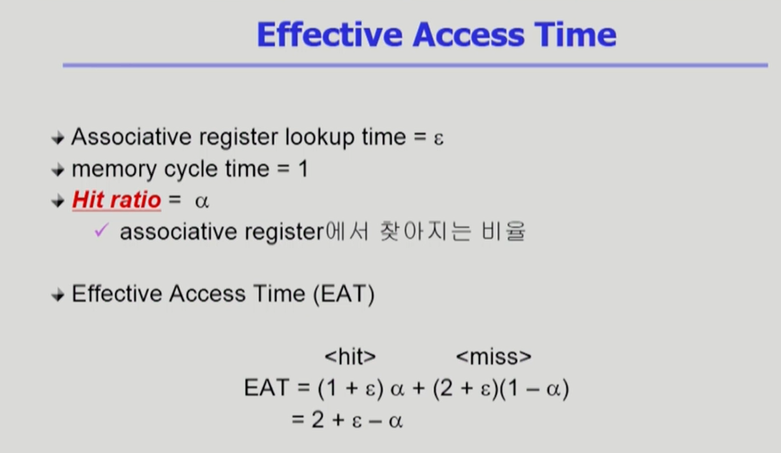

                - 2단계 페이지 테이블 (Two-level page table)
                    - 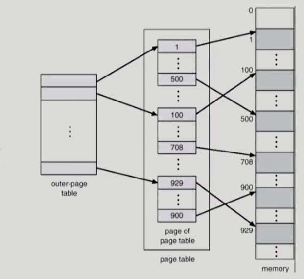
                    - 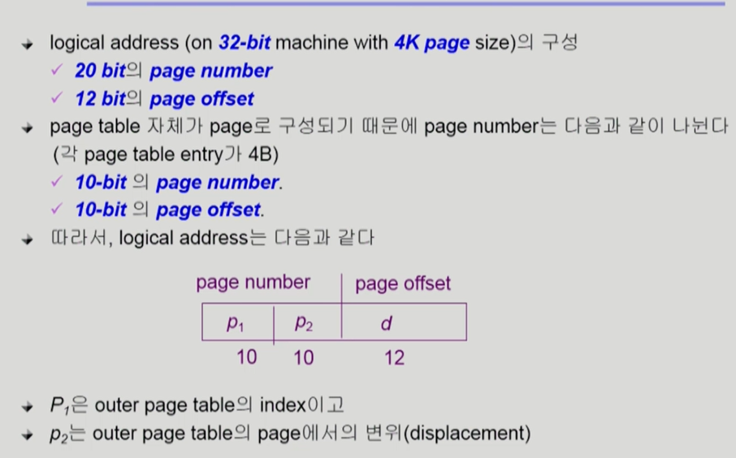
                    - 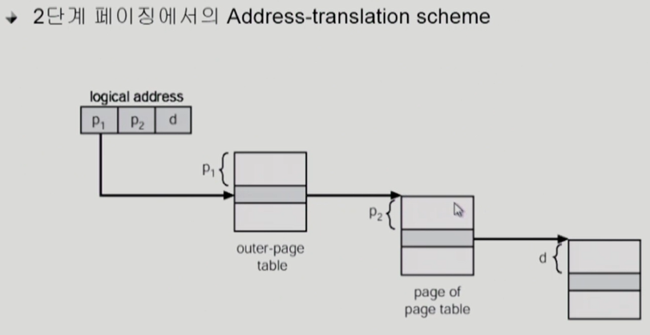
                    - 현대의 컴퓨터는 address space가 매우 큰 프로그램 지원
                        - 32비트 주소 사용시 : 2^32(4G)의 주소 공간
                            - page size가 4K 시 1M개의 page table entry 필요
                            - 각 page entry가 4B시 프로세스당 4M의 page table 필요
                            - 그러나, 대부분의 프로그램은 4G의 주소공간 중 지극히 일부분만 사용하므로 page table공간이 심하게 낭비됨
                        - page table 자체를 page로 구성
                        - 사용되지 않는 주소 공간에 대한 outer page table의 엔트리값은 NULL(대응하는 inner page table이 없음)
                        - 가상 주소(Virtual Address)의 구조 분해
                            - 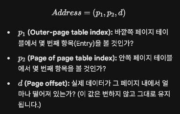

                            * 32비트 주소체계, 4바이트 엔트리 크기, 4kb페이지 크기
                            * 기억해야할 공식
                                1) 단위 변환: 1KB = 2^10 Byte = 1024 Byte
                                2) 비트와 개수의 관계: 
                                    N개의 비트가 있으면 2^N개의 서로 다른 주소(또는 항목)를 표현할 수 있습니다.
                                    반대로 말하면, "표현해야 하는 개수가 2^N개면 필요한 비트 수는 N비트"가 됩니다.
                            1) 페이지 오프셋(d) 비트수 구하기
                                - 조건: 페이지 하나의 크기가 4KB
                                - 계산: 4KB를 바이트 단위로 쪼개면 2^12바이트 
                                - 결론: 2^12개의 위치를 구분해야하므로 d영역은 12비트
                            2) 안쪽 테이블(p2) 비트수 구하기
                                - 조건: 페이지 테이블 한 칸(entry)크기가 4바이트
                                - 질문: 4kb크기의 페이지 안에 4바이트짜리 칸을 몇개 넣을수 있는가
                                - 4kb/4byte= 1024 = 2^10개
                                - 결론: 안쪽 페이지 테이블은 총 2^10개의 칸을 가짐. 이 2^10개의 칸을 서로 구분하려면 몇비트가 필요한가? 10비트
                                - 따라서 안쪽 테이블 비트수는 10비트
                            3) 바깥쪽 테이블(p1) 비트수 구하기
                                - 전체 가상주소가 몇비트인가?
                                - 조건: 시스템이 32비트 주소체계를 사용한다고 가정
                                - 게산: 전체주소(32비트) = p1 + p2(10비트) + d(12비트)
                                    p1=32-10-12=10비트
                                - 결론: p1도 10비트
                            - 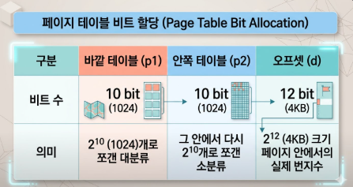

                - Multilevel paging and performance
                    - address space가 더 커지면 다단계 페이지 테이블 필요
                    - 각 단계의 페이지 테이블이 메모리에 존재하므로 logical address의 physical address 변환에 더 많은 메모리 접근 필요
                    - TLB를 통해 메모리 접근 시간을 줄일 수 있음
                    - 4단계 페이지 테이블을 사용하는 경우
                        : 메모리 접근시간 : 100ns, TLB 접근시간 : 20ns, TLB hit ratio=98%
                        : effective memory access time = 0.98 * 120 + 0.02*520(4단계이므로 100*4 + 실제 접근 시간 100 + tlb체크 시간 20) = 128ns
                        : 결과적으로 주소변환을 위해 28ns만 소요

                - valid/invalid bit
                    - Protection bit : page에 대한 접근 권한(read/write/read-only)
                    - valid bit : 해당 주소의 frame에 그 프로세스를 구성하는 유효한 내용이 있음을 뜻함(접근허용)
                    - invalid bit : 해당 주소의 frame에 유효한 내용이 없음을 뜻함 (접근 불허)
                                    - 프로세스가 그 주소 부분을 사용하지 않는 경우
                                    - 해당 페이지가 메모리에 올라와 있지 않고 swap area(backing storage)에 있는 경우

                - Inverted page table (물리주소를 이용해 논리주소로 변환하는 꼴)
                    - page table이 매우 큰 이유
                        - 모든 프로세스 별로 그 logical address에 대응하는 모든 page에 대해 page table entry가 존재
                        - 대응하는 page가 메모리에 있든 아니든 간에 page table에는 entry로 존재
                    - inverted page table
                        - page frame 하나당 page table에 하나의 entry를 둔것(system-wide)
                        - 각 page table entry는 각각의 물리적 메모리의 page frame이 담고 있는 내용 표시(process-id, process의 logical address)
                        - 단점 : 테이블 전체를 탐색해야함
                        - 조치 :  associative register 사용(expensive)
                        - 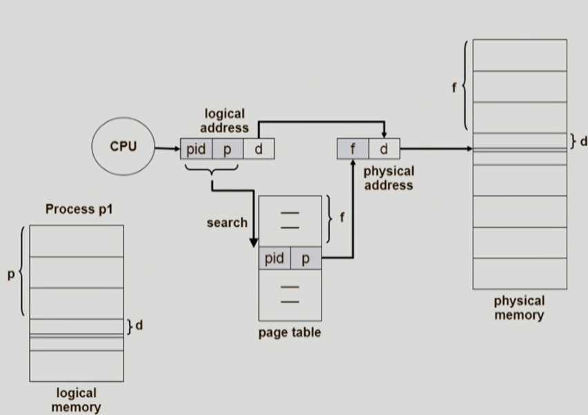
                        - 공간을 줄이긴 하지만 너무 overhead가 크다.
                
                - Shared page
                    - shared code
                        - re-entrant code(=pure code)
                        - read-only로 하여 프로세스 간에 하나의 code만 메모리에 올림
                        - e.g, text editors, compilers, window systems
                        - shared code는 모든 프로세스의 logical address space에서 동일한 위치에 있어야함
                    - Private code and data
                        - 각 프로세스들은 독자적으로 메모리에 올림
                        - private data는 logical address space의 아무곳에 와도 무방

            - Segmentation
                - 프로그램은 의미 단위(code, data, stack)인 여러개의 segment로 구성
                    - 작게는 프로그램을 구성하는 함수 하나하나를 세그먼트로 저으이
                    - 크게는 프로그램 전체를 하나의 세그먼트로 정의 가능
                    - 일반적으로는 code, data, stack부분이 하나씩의 세그먼트로 정의됨
                - segment는다음과 같은 logical unit 들이다.
                    - main(),
                    - function,
                    - global variables,
                    - stack,
                    - symbol table, arrays
                - logical address는 다음의 두 가지로 구성
                    - <segment-number, offset>
                - segment table
                    - each table entry has:
                        1) base - starting physical address of the segment
                        2) limit - length of the segment
                - segment-table base register(STBR)
                    - 물리적 메모리에서의 segment table의 위치
                - segment-table length register(STLR)
                    - 프로그램이 사용하는 segment의 수
                    - segment number s is legal if s<STLR
                - 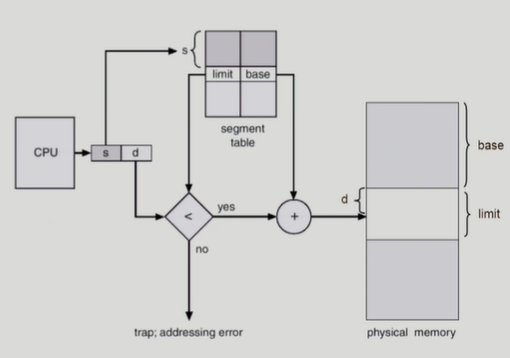
                - 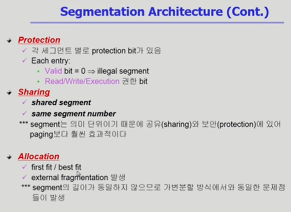

            ** 의미 단위로 해야하는일(공유,보안 등)에서는 segment 기법이 유리
            ** 동일한 크기 단위로 잘라서 해야하는 일에서는 page 기법이 유리
            
            - Paged Segmentation
                - pure segmentation과의 차이점
                    - segment-table entry가 segment의 base address를 가지고 있는 것이 아니라 segment를 구성하는 page table의 base address를 가지고 있음
                    - 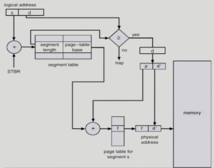
                    - hole들이 생기는 문제는 없어짐(allocation문제 안생김)
    
* ******* 모두 하드웨어적인 물리주소 관리내용이었음*********
* 운영체제 역할 없음.(I/O 접근 같은 경우는 운영체제가 일을 함)
