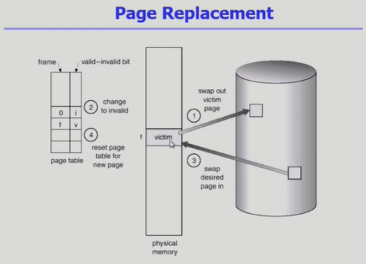
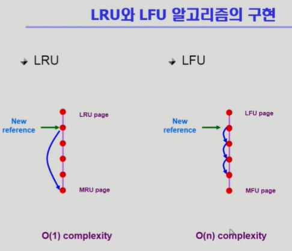
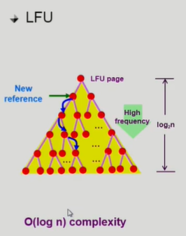
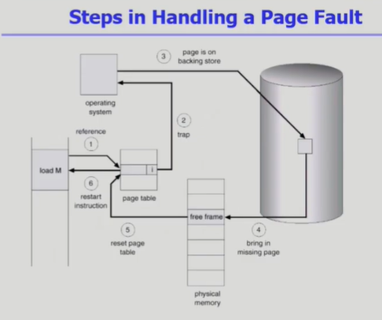

## 물리적인 메모리의 주소변환에서는 운영체제 역할 없음

1. Demand Paging
    - 실제로 필요할 때 page를 메모리에 올리는 것
        - 효과
            1) I/O 양의 감소
            2) Memory 사용량 감소
            3) 빠른 응답 시간
            4) 더 많은 사용자 수용
    - Valid/Invalid Bit 의 사용
        - Invalid의 의미
            - 사용되지 않는 주소 영역인 경우
            - 페이지가 물리적 메모리에 없는 경우
        - 처음에는 모든 page entry가 invalid로 초기화
        - address translation 시에 invalid bit이 set되어 있으면 : "page fault". => cpu는 운영체제로 넘어가고, I/O작업 실행(하드디스크에서 메모리로 데이터 옮김)
        - Page fault
            - invalid page를 접근하면 MMU가 trap을 발생시킴(page fault trap)
            - Kernel mode로 들어가서 page fault handler가 invoke됨
            - 아래 순서로 page fault 처리
                1) invalid reference?(bad address, protection violation)
                    => abort process.
                2) get an empty page frame(없으면 뺏어온다: replace)
                    - page replacement
                        - 어떤 frame을 뺏어올지를 결정
                        - 곧바로 사용되지 않을 page를 쫓아내는 것이 좋음
                        - 동일한 페이지가 여러번 메모리에서 쫓겨났다가 다시 들어올수 있음
                    - replacement algorithm
                        - page-fault rate을 최소화 하는것이 목표
                        - 알고리즘의 평가
                            - 주어진 page reference string에 대해 page fault를 얼마나 내는지 조사
                        - 
                        - Optimal 알고리즘(page fault를 가장 적게내는 알고리즘)
                            : 가장 먼 미래에 참조되는 page를 replace
                            : 실제 시스템에 사용은 힘들다(미래 예측이 힘듬)
                            : 참고로 사용하는 알고리즘
                        - 실제 사용 가능한 알고리즘
                            1) FIFO 알고리즘 : FirstIn FirstOut(frame많아질수록 fault 잦음)
                            2) LRU 알고리즘 : Least Recently Used
                            (가장 오래전에 참조된것을 지움)
                            3) LFU 알고리즘 : Least Frequently Used
                            (참조 횟수가 가장 적은 페이지를 지움)
                                - 여럿있을경우 아무거나 참조함
                                - 성능 높일려면 더 오래전에 참조한것 지움
                             -  
                             -  

                3) 해당페이지를 disk에서 memory로 읽어옴
                    1) disk I/O가 끝나기까지 이 프로세스는 CPU를 preempt당함(block)
                    2) disk read가 끝나면 page tables entry 기록, valid/invalid bit='valid'
                    3) ready queue에 process를 insert => dispatch later
                4) 이 프로세스가 CPU를 잡고 다시 running
                5) 아까 중단되었던 instructio을 재개
            - 
