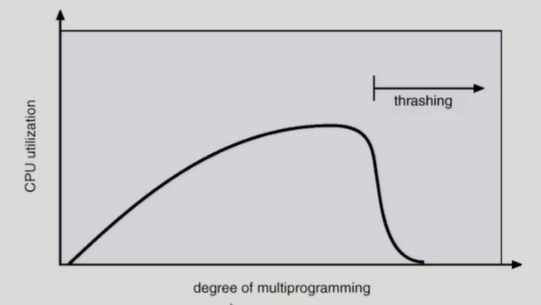
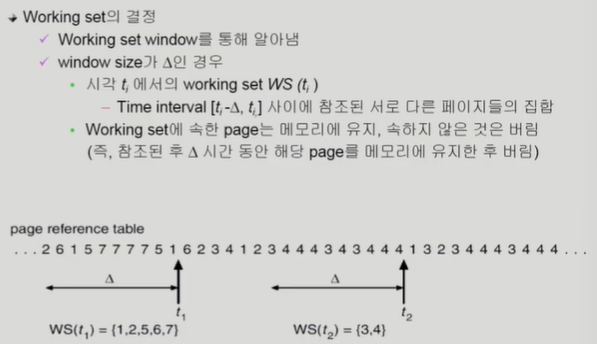
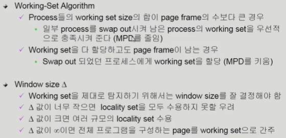
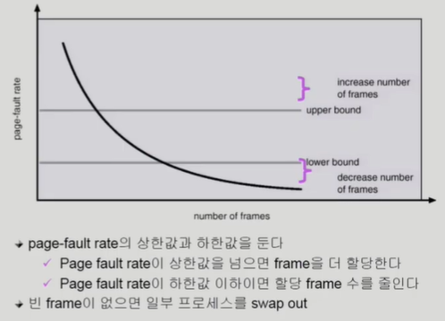

1. 다양한 캐싱 환경
    - 캐싱 기법
        - 한정된 빠른 공간(캐시)에 요청된 데이터를 저장해 두었다가 후속 요청시 캐시로부터 직접 서비스하는 방식
        - paging system 외에도 cache memory, buffer caching, Web caching등 다양한 분야에서 사용
    - 캐시 운영 시간 제약
        - 교체 알고리즘에서 삭제할 항목을 결정하는 일에 지나치게 많은 시간이 걸리는 경우 실제 시스템에서 사용할 수 없음
        - Buffer Caching이나 Web caching의 경우
            - O(1)에서 O(logn) 정도까지 허용
        - Paging system인 경우
            - page fault인경우에만 OS가 관여함
            - 페이지가 이미 메모리에 존재하는 경우 참조시각 등의 정보를 OS가 알 수 없음
            - O(1)인 LRU의 list 조작조차 불가능

2. Clock 알고리즘
    - 클락 알고리즘
        - LRU 의 근사알고리즘
        - 여러 명칭으로 불림
            - Second chance 알고리즘
            - NUR(Not Used Recently) 또는 NRU(Not Recently Used)
        - Reference bit을 사용해서 교체 대상 페이지 선정(circular list)
        - reference bit가 0인 것을 찾을 때까지 포인터를 하나씩 앞으로 이동
        - 포인터 이동하는 중에 reference bit 1은 모두 0으로 바꿈
        - Reference bit이 0인 것을 찾으면 그 페이지를 교체
        - 한바퀴 되돌아와서도 (=second chance) 0이면 그때에는 replace당함
        - 자주 사용되는 페이지라면 second chance가 올때 1
    
    - Clock 알고리즘의 개선
        - reference bit과 modified bit(dirty bit)을 함께 사용
        - reference bit=1 : 최근에 참조된 페이지
        - modified bit=1 : 최근에 변경된 페이지 (I/O를 동반하는 페이지)
            : 하드디스크에 수정된 데이터 저장한 후에 지워야함.
            : 보통 modified bit이 0인것을 지움

3. Page Frame의 Allocation
    - Allocation problem : 각 process에 얼마만큼의 page frame을 할당할 것인가?
    - Allocation의 필요성
        - 메모리 참조 명령어 수행시 명령어, 데이터 등 여러 페이지 동시 참조
            - 명령어 수행을 위해 최소한 할당되어야 하는 frame의 수가 있음
        - Loop를 구성하는 page들은 한꺼번에 allocate 되는 것이 유리함
            - 최소한의 allocation이 없으면 loop마다 page fault
    - Allocation Scheme
        - Equal allocation : 모든 프로세스에 똑같은개수 할당
        - Proportional allocation : 프로세스 크기에 비례하여 할당
        - Priority Allocation : 프로세스의 priority에 따라 다르게 할당

4. Global vs. Local Replacement
    - Global replacement
        - replace 시 다른 process에 할당된 frame을 빼앗아 올 수 있다.
        - process별 할당량을 조절하는 또 다른 방법임
        - FIFO, LRU, LFU 등의 알고리즘을 global replacement로 사용시에 해당
        - Working set, PFF 알고리즘 사용
    
    - Local replacement
        - 자신에게 할당된 frame 내에서만 replacement
        - FIFO, LRU, LFU 등의 알고리즘을 process 별로 운영시

5. Thrashing
    - 
    - 프로세스의 원할한 수행에 필요한 최소한의 page frame수를 할당 받지 못한 경우에 발생
    - Page fault rate이 매우 높아짐
    - CPU utilization이 낮아짐
    - OS는 MPD(Multiprogramming degree)를 높여야 한다고 판단
    - 또 다른 프로세스가 시스템에 추가됨(higher MPD)
    - 프로세스 당 할당된 frame의 수가 더욱 감소
    - 프로세스는 page의 swap in/swap out 으로 매우 바쁨
    - 대부분의 시간에 CPU는 한가함
    - low throughput
    * multiprogramming degree를 낮춰줘야함
        - Working-set model
            1) Locality of reference
                - 프로세스는 특정 시간 동안 일정 장소만을 집중적으로 참조한다.
                - 집중적으로 참조되는 해당 page들의 집합을 locality set이라 함
            2) working-set model
                - locality에 기반하여 프로세스가 일정 시간 동안 원활하게 수행되기 위해 한꺼번에 메모리에 올라와 있어야하는 page들의 집합을 working set이라 정의함
                - working set 모델에서는 process의 working set 전체가 메모리에 올라와 있어야 수행되고 그렇지 않을 경우 모든 frame을 반납한 후 swap out(suspend)
                - Thrashing 을 방지함
                - Multiprogramming degree를 결정함
            3) Working-Set Algorithm
                - 
                - 

        - PFF(Page-Fault Frequency) Scheme
            - 

6. Page Size 의 결정
    - page size를 감소시키면
        - 페이지 수 증가
        - 페이지 테이블 크기 증가
        - internal fragmentation감소
        - disk transfer의 효율성 감소
            : seek/rotation vs. transfer
        - 필요한 정보만 메모리에 올라와 메모리 이용이 효율적
            : locality의 활용 측면에서는 좋지 않음
    
    - trend : larger page size