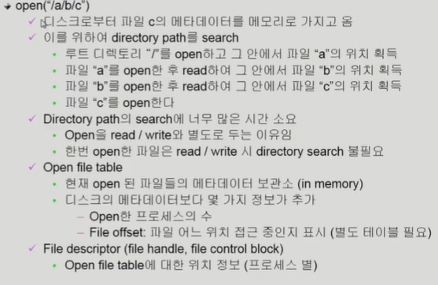
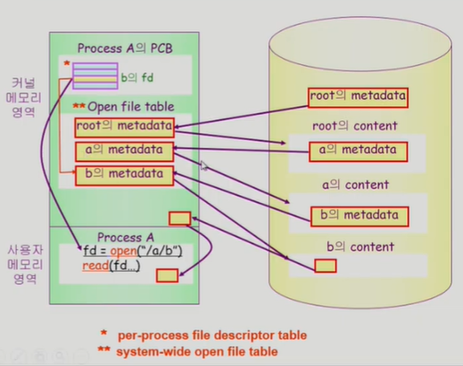
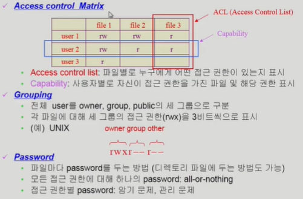
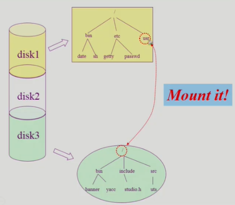

1. File and File System
    - File
        - A named collection of related information
        - 일반적으로 비휘발성의 보조기억장치에 저장
        - 운영체제는 다양한 저장 장치를 file이라는 동일한 논리적 단위로 볼 수 있게 해줌
        - Operation 
            - create, read, write, reposition(lseek), delete, open, close 등
    - File attribute(혹은 파일의 metadata)
        - 파일 자체의 내용이 아니라 파일을 관리하기 위한 각종 정보들
            - 파일이름, 유형, 저장된 위치, 파일 사이즈
            - 접근 권한(읽기/쓰기/실행), 시간(생성/변경/사용), 소유자 등
    - File system
        - 운영체제에서 파일을 관리하는 부분
        - 파일 및 파일의 메타데이터, 디렉토리 정보 등을 관리
        - 파일의 저장 방법 결정
        - 파일 보호 등

2. Directory and Logical Disk
    - Directory
        - 파일의 메타데이터 중 일부를 보관하고 있는 일종의 특별한 파일
        - 그 디렉토리에 속한 파일 이름 및 파일 attribute들
        - operation
            - search for a file, create a file, delete a file
            - list a directory, rename a file, traverse the file system
    - Partition(=Logical Disk)
        - 하나의 (물리적) 디스크 안에 여러 파티션을 두는게 일반적
        - 여러 개의물리적인 디스크를 하나의 파티션으로 구성하기도 함
        - (물리적) 디스크를 파티션으로 구성한 뒤 각각의 파티션에 file system을 깔거나 swapping 등 다른 용도로 사용할 수 있음

3. open()
    - 
    - 

4. File Protection
    - 각 파일에 대해 누구에게 어떤 유형의 접근(읽기,쓰기,실행)을 허락할 것인가?
    - Access Control의 방법
    - 
    - Access control Matrix : 오버헤드 큼 
    - Password 도 문제 많이 발생
    - 일반적으로 Grouping을 많이 사용

5. File System의 mounting
    - 

6. 파일 접근 방법
    1) 순차접근(sequential access)
        - 카세트 테이프를 사용하는 방식처럼 접근
        - 읽거나 쓰면 offset은 자동적으로 증가
    2) 직접접근(direct access, random access)
        - LP 레코드 판과 같이 접근하도록 함
        - 파일을 구성하는 레코드를 임의의 순서로 접근할 수 있음
        