1. Allocation of File Data in Disk
    - Contiguous Allocation(연속 할당)
        - 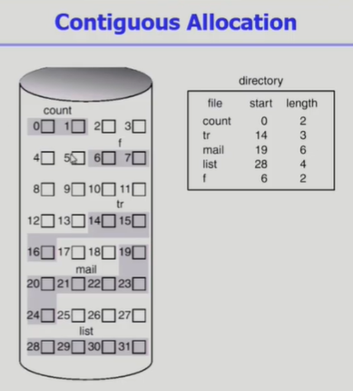
        - 단점 
            - external fragmentation
            - file grow 가 어려움
                - file 생성시 얼마나 큰 hole을 배당할 것인가?
                - grow 가능 vs 낭비 (internal fragmentation)
        - 장점
            - Fast I/O
                - 한번의 seek/rotation으로 많은 바이트 transfer
                - Realtime file용으로, 또는 이미 run 중이던 process의 swapping용
            - Direct Access(=random access)가능
    - Linked Allocation
        - 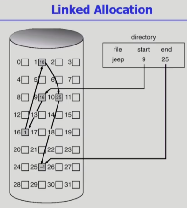
        - 장점
            - hole 발생 줄어듬(external fragmentation 줄어듬)
        - 단점
            - Direct Access 불가능
            - Reliability 문제
                - 한 sector가 고장나 pointer가 유실되면 많은 부분을 잃음
            - Pointer를 위한 공간이 block의 일부가 되어 공간 효율성을 떨어뜨림
                - 512 bytes/sector, 4 bytes/pointer
        - 변형
            - File-allocation table(FAT) 파일 시스템
                - 포인터를 별도의 위치에 보관하여 reliability와 공간 효율성 문제 해결 
    - Indexed Allocation
        - 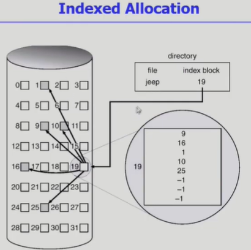
        - 장점
            - external fragmentation 발생 안함
            - direct access 가능
        - 단점
            - small file의 경우 공간 낭비(실제로 많은 file들이 small)
            - Too Large file의 경우 하나의 block으로 index를 저장하기에 부족
                - 해결방안
                    1) linked scheme
                    2) multi-level index

2. 실제 파일시스템에서의 구조
    - UNIX 파일시스템의 구조 (indexed allocation이랑 거의 비슷)
        - 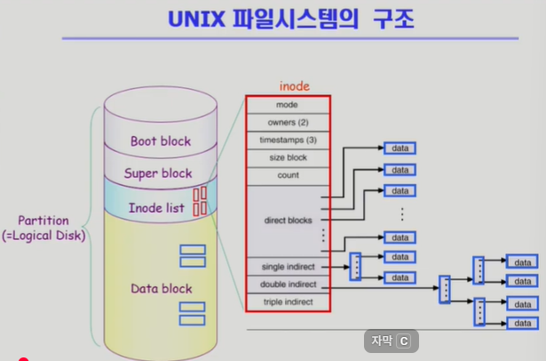
        - 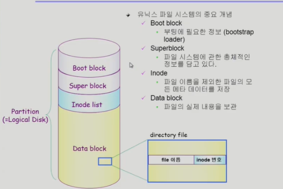
        1) Boot block : 부팅에 필요한 정보(bootstrap loader)
        2) Super block : 파일 시스템에 관한 총채적인 정보를 담고 있음
        3) Inode list : 파일 이름을 제외한 파일의 모든 메타 데이터 저장
            - large file을 위해 single/double/triple indirect 이용
        4) Data block : 파일의 실제 내용을 보관
    
    - FAT File System(Linked allocation 활용)
        - 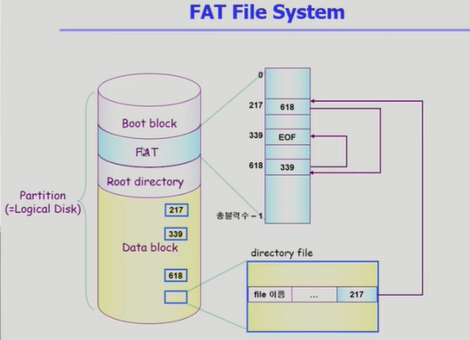
        - data 블록에 n개의 블럭이 있다면 fat 배열은 n-1까지 존재
        - FAT(데이터의 위치를 담고있음) 만 확인하면 그파일의 다음 위치가 무엇인지 알 수 있음
        - Direct Access 가능
        - Linked Allocation의 단점을 해결함

3. Free Space Management(할당되지 않고 비어있는 블록 관리)
    - Bit map or bit vector(비트맵의 크기는 블록의 개수만큼 설정)
        - 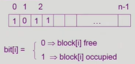
        - Bit map은 부가적인 공간을 필요로 함
        - 연속적인 n개의 free block을 찾는데 효과적
    - linked list
        - 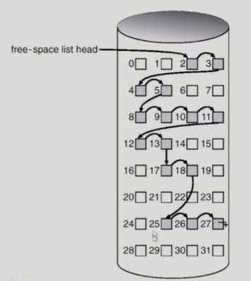
        - 모든 free block들을 링크로 연결(free list)
        - 연속적인 가용공간을 찾는 것은 쉽지 않다.(단점)
        - 공간의 낭비가 없다 (장점)
    - Grouping
        - linked list 방법의 변형
        - 첫번째 free block이 n개의 pointer를 가짐
            - n-1 pointer는 free data block을 가리킴
            - 마지막 pointer가 가리키는 block은 또 다시 n pointer를 가짐
        - 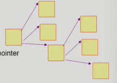
    - Counting
        - 프로그램들이 종종 여러 개의 연속적인 block을 할당하고 반납한다는 성질에 착안
        - (first free block, # of contiguous free blocks)을 유지

4. Directory Implementation
    - 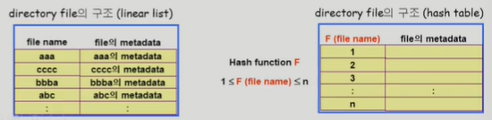
    - Linear list
        - <file name, file의 metadata>의 list
        - 구현이 간단
        - 디렉토리 내에 파일이 있는지 찾기 위해서는 linear search 필요(time-consuming)
    - Hash Table
        - linear list + hashing
        - hash table은 file name을 이 파일의 linear list의 위치로 바꿔줌
        - search time을 없앰
        - collision 발생 가능

    - File의 metadata의 보관 위치
        - 디렉토리 내에 직접보관
        - 디렉토리에는 포인터를 두고 다른곳에보관(inode, FAT등)
    
    - Long File Name의 지원
        - <file name, file의 metadata> 의 list에서 각 entry는 일반적으로 고정
        - file name이 고정 크기의 entry길이보다 길어지는 경우 entry의 마지막 부분에 이름의 뒷부분이 위치한 곳의 포인터를 두는 방법
        - 이름의 나머지 부분은 동일한 directory file의 일부에 존재
        - 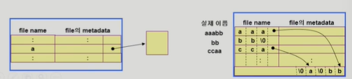

    - VFS and NFS
        - 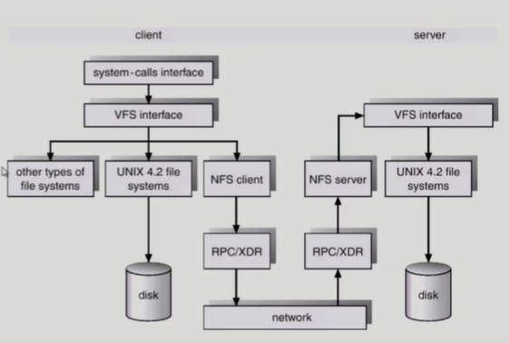
        - Virtual File System (VFS)
            - 서로 다른 다양한 file system에 대해 동일한 시스템 콜 인터페이스 (API)를 통해 접근할 수 있게 해주는 OS의 layer
        - Network File System (NFS)
            - 분산 시스템에서는 네트워크를 통해 파일이 공유될 수 있음
            - NFS는 분산 환경에서의 대표적인 파일 공유 방법
    
    - Page Cache and Buffer Cache
        - 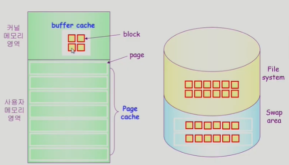
        - Page Cache
            - Virtual memory의 paging system에서 사용하는 page frame을 caching의 관점헤서 설명하는 용어
            - memory-mapped I/O를 쓰는 경우 file의 I/O에서도 Page cache사용
        - Memory-Mapped I/O(memory-mapped file)
            - File의 일부를 virtual memory에 mapping시킴
            - kernel의 도움을 받지않아도 됨
            - 매핑시킨 영역에 대한 메모리 접근 연산은 파일의 입출력을 수행하게 함
        - Buffer Cache
            - 파일시스템을 통한 I/O 연산은 메모리의 특정 영역인 buffer cache사용
            - File 사용의 locality 활용
                - 한번 읽어온 block에 대한 후속 요청시 buffer cache에서 즉시 전달
            - 모든 프로세스가 공용으로 사용
            - replacement algorithm 필요(LRU,LFU등)
        - Unified Buffer Cache
            - 최근의 OS에서는 기존의 buffer cache가 page cache에 통합됨
        - 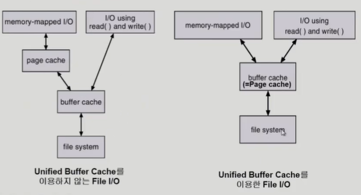
    
    - 프로그램의 실행
    - 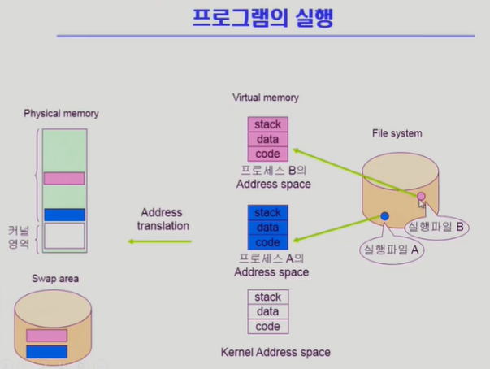
    - code부분은 file system에있는 내용 매핑되어있기 때문에 swap영역에서 올리지 않고, file system 이용
    - 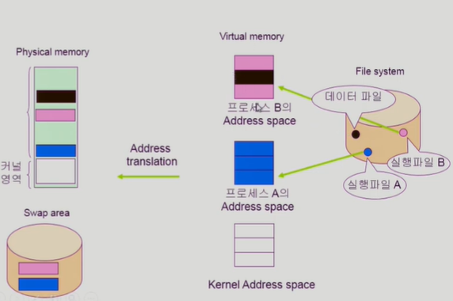