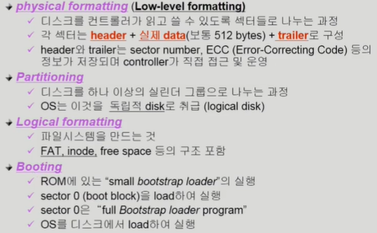
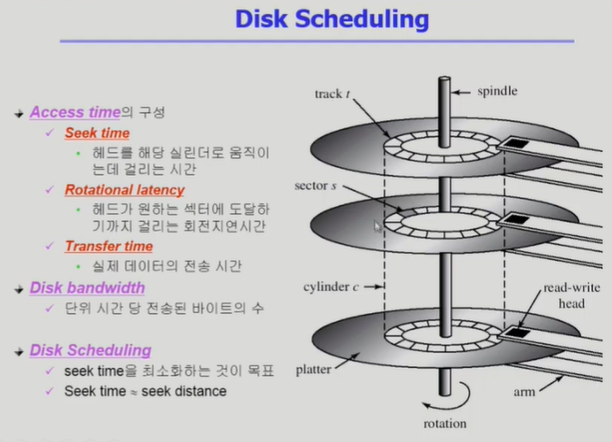
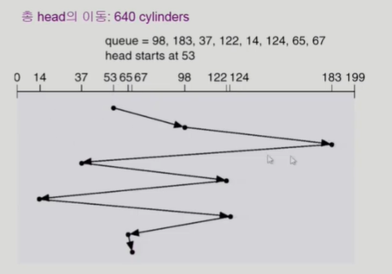
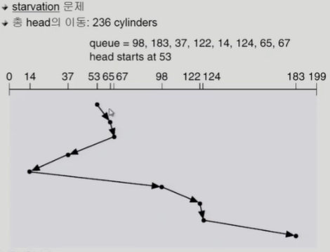
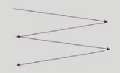
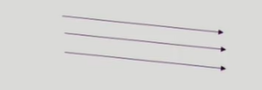
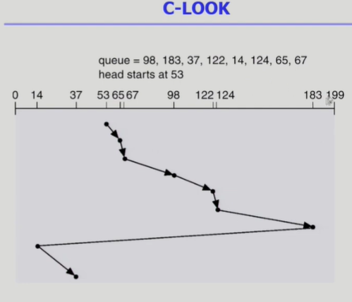
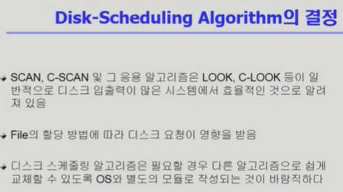
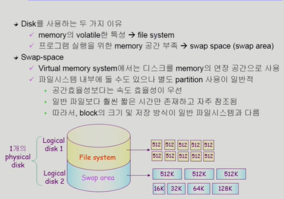
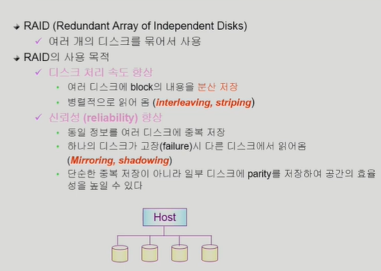

1. Disk Structure (logical block과 sector 서로 mapping되어있음)
    - logical block
        - 디스크의 외부에서 보는 디스크의 단위 정보 저장 공간들
        - 주소를 가진 1차원 배열처럼 취급
        - 정보를 전송하는 최소 단위
    - sector
        - logical block이 물리적인 디스크에 매핑된 위치
        - sector 0은 최외곽 실린더의 첫 트랙에 있는 첫번째 섹터이다.

2. Disk Management
    - 

3. Disk Scheduling
    - 
    - seek time이 가장 오래걸림
    - seek time을 최소화하는것이 disk scheduling의 목표
    - Disk Scheduling Algorithm
        1) FCFS(First Come First Service)
            - 
            - 비효율적
        2) SSTF(Shortest Seek Time First)
            - 
            - 가까이에있는것부터 처리하니까 효율적이긴한데
            - Starvation 문제 생길수있음
        3) SCAN (엘리베이터 알고리즘)
            - 
            - disk arm이 디스크 한쪽 끝에서 다른쪽 끝으로 이동하며 가는 길목에 있는 모든 요청을 처리한다.
            - 다른 한쪽 끝에 도달하면 역방향으로 이동하며 오는 길목에 있는 모든 요청을 처리하며 다시 반대쪽 끝으로 이동
            - 문제점 : 실린더 위치에 따라 대기 시간이 다르다.
        4) C-SCAN(Circular Scan)
            - 
            - 헤드가 한쪽 끝에서 다른쪽 끝으로 이동하며 가는 길목에 있는 모든 요청을 처리
            - 다른쪽 끝에 도달했으면 요청을 처리하지 않고, 곧바로 출발점으로 다시 이동(이동거리는 다소 길어질수있음)
            - SCAN보다 균일한 대기 시간을 제공
        5) N-SCAN
            - arm이 한방향으로 움직이기 시작하면 그 시점 이후에 도착한 job은 되돌아올때 service
        6) LOOK, C-LOOK
            - 
            - SCAN이나 C-SCAN은 헤드가 디스크 끝에서 끝으로 이동
            - LOOK이나 C-LOOK은 헤드가 진행 중이다가 그 방향에 더 이상 기다리는 요청이 없으면 헤드의 방향을 즉시 반대로 이동한다.
        * 

4. Swap-Space Management(하드디스크에서 swap space의 관리)
    - 

5. RAID
    - 