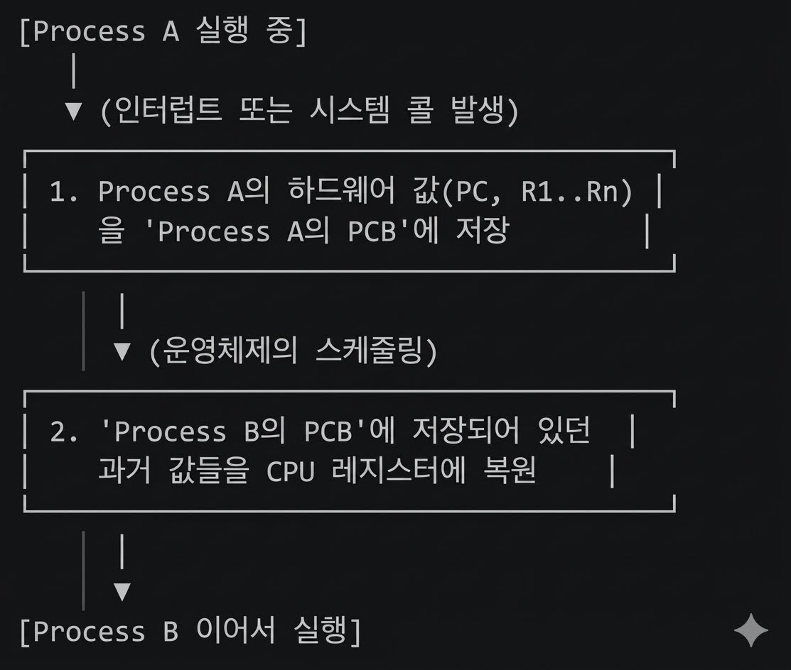
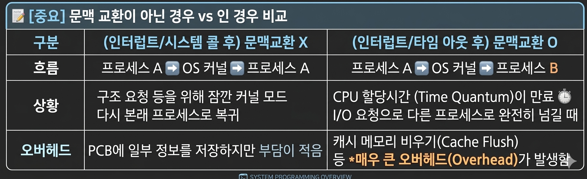
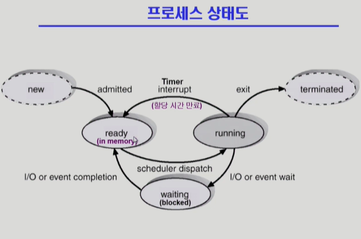
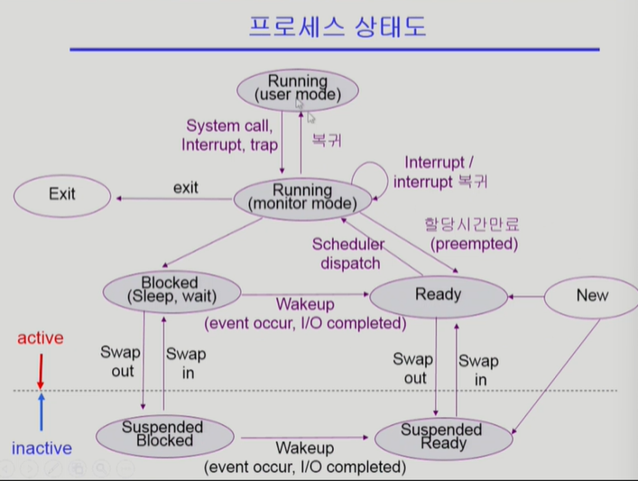

1) context : 프로세스의 문맥
    - CPU 수행상태를 나타내는 하드웨어 문맥
        - 프로그램 카운터(PC)가 어딜 가리키고 있는지
        - 코드의 어디까지 실행했는지
        - 각종 레지스터를 확인 어디까지 실행했는지
    - 프로세스의 주소 공간(메모리와 관련)
        - code, data, stack
    - 프로세스 관련 커널 자료 구조
        - PCB(Process Control Block)
        - Kernel stack
2) Process State(상태)
    - Running : CPU를 잡고 instruction을 수행중인 상태
    - Ready : CPU를 기다리는 상태(메모리 등 다른 조건을 모두 만족한 상태)
    - Blocked(wait,sleep)
        : CPU를 주어도 당장 instruction을 수행할 수 없는 상태
        : Process 자신이 요청한 event(예:I/O)가 즉시 만족되지 않아 이를 기다리는 상태
        (ex) 디스크에서 file을 읽어와야 하는 경우
    - New : 프로세스가 생성중인 상태
    - Terminated : 수행(execution)이 끝난 상태
3) 다양한 큐(Queue)의 종류와 역할
    - Ready Queue(준비 큐) : cpu를 얻기위해 기다리는 프로세스들이 줄을서있는곳
    - Resource Queue / Blocked Queue (자원 큐/봉쇄 큐) 
        : 특정 조건이나 자원을 기다리는 프로세스들이 줄을 서는곳
        : 공유데이터(Shared Data) : 여러 프로세스가 동시에 접근하면 안되는 공유 데이터에 접근하기 위해 resource queue에서 대기    
    - I/O Device Queue (입출력 장치 큐)
        : Disk I/O queue : 디스크 읽기/쓰기
        : Keyboard I/O queue : 키보드 입력 기다림
    - Job Queue (작업 큐)
        : 현재 시스템내에 있는 모든 프로세스의 집합
        : 메모리에 올라온 프로세스뿐만 아니라, 아직 메모리를 할당받지 못하고 디스크에 대기중인 프로세스까지 전부 포함하는 가장 큰 개념

4) PCB (Process Control Block)
    - 운영체제가 각 프로세스를 관리하기 위해 프로세스당 유지하는 정보입니다.
    - 구조: 커널(Kernel) 내에 구조체(Structure) 형태로 존재하며, 프로세스가 생성될 때 만들어지고 수행이 완료되면 삭제됩니다.
    - PCB의 4가지 주요 구성 요소
        1) OS가 관리상 사용하는 정보:운영체제의 스케줄러가 프로세스를 관리하고 순서를 실행하기 위해 필요한 정보
            - Process state: 프로세스의 현재 상태 (Ready, Running, Blocked 등)
            - Process ID (PID): 프로세스를 식별하기 위한 고유 번호
            - Scheduling information, Priority: 스케줄러가 다음 실행할 프로세스를 정할 때 사용하는 우선순위 및 스케줄러 정보
        2) CPU 수행 관련 하드웨어 값
            : 프로세스가 CPU에서 실행되다가 다른 프로세스로 넘어갈 때(Context Switch), 어디까지 실행했는지 기억해 두는 정보입니다. 나중에 다시 실행될 때 이 값을 CPU 레지스터에 복원하여 이어서 작업합니다.
            - Program counter (PC): 다음에 실행할 메모리의 명령어 주소
            - Registers: CPU 레지스터(상태 레지스터, 범용 레지스터 등)에 들어있던 값들
        3) 메모리 관련 정보 : 프로세스가 메모리의 어느 위치에 올라와 있는지 나타내는 정보입니다.
            - Code, data, stack의 위치 정보: 프로세스의 가상 메모리 주소 및 실제 물리 메모리 매핑 정보(Base, Limit 레지스터 값 또는 Page Table 포인터 등)
        4) 파일관련 정보(자원 관련 정보) : 프로세스가 사용 중인 하드웨어나 자원에 대한 정보입니다.
            - Open file descriptors: 현재 프로세스가 열어서 읽고 쓰기 작업을 하고 있는 파일들의 목록 정보
5) 문맥교환(Context Switch)
    - 정의: CPU를 한 프로세스에서 다른 프로세스로 넘겨주는 과정입니다.
    - 핵심 역할: 운영체제는 CPU가 다른 프로세스로 넘어갈 때 다음 작업을 수행합니다.
        1) CPU를 내어주는 프로세스의 상태를 그 프로세스의 PCB에 저장합니다.
        2) CPU를 새롭게 얻는 프로세스의 상태를 PCB에서 읽어와 CPU 레지스터에 복원합니다.
    

    💡 쉽게 이해하기: > 하던 일을 잠시 멈추고 메모장(커널)을 켰다가 다시 내 일을 하는 것은 문맥 교환이 아닙니다. **내 책상을 통째로 치우고 다른 사람의 책상 서랍을 열어 세팅하는 과정(A -> B)**이 진정한 문맥 교환입니다.

6) 스케줄러(Scheduler)의 종류
    - 장기 스케줄러 (Long-term scheduler 또는 Job scheduler)
        : 어떤 프로세스에게 메모리(Memory)를 줄지 결정하는 스케줄러. (시작 프로세스 중 어떤 것을 Ready Queue로 보낼지 결정)
        : Degree of Multiprogramming(메모리에 올라간 프로세스의 수)을 제어합니다.
        : 현대 시분할 시스템(Time Sharing System)에서는 보통 장기 스케줄러를 두지 않고, 프로그램이 시작되면 곧바로 메모리에 올립니다.
    - 단기 스케줄러 (Short-term scheduler 또는 CPU scheduler)
        : 어떤 프로세스에게 CPU를 줄지 결정하는 스케줄러입니다. (Ready Queue에 있는 프로세스 중 선택)
        : 밀리초($ms$) 단위로 매우 빈번하고 빠르게 호출됩니다.
    - 중기 스케줄러 (Medium-term scheduler 또는 Swapper):
        : 현대 운영체제에서 장기 스케줄러 대신 사용하는 매우 중요한 스케줄러입니다.
        : 메모리에 프로세스가 너무 많이 올라와 있으면 시스템 성능이 떨어지므로, 일부 프로세스를 통째로 메모리에서 쫓아내(Swap out) 디스크로 보냅니다.
        : 이를 통해 Degree of Multiprogramming을 유동적으로 조절합니다.
7) 중기 스케줄러로 인해 추가되는 프로세스 상태
    : 중기 스케줄러가 프로세스를 메모리에서 디스크로 쫓아내면서, 앞서 배운 상태 외에 새로운 상태가 추가됩니다.
    - Suspended (중단/정지 상태)
        : 외부적인 이유(중기 스케줄러의 Swap out, 사용자의 Ctrl+Z 등)로 프로세스의 수행이 정지된 상태입니다.
        : 메모리를 완전히 빼앗기고 디스크로 Swap out 된 상태를 의미합니다.
    - Blocked vs Suspended 차이점
        : Blocked: 프로세스가 자발적으로 I/O 같은 이벤트를 기다리는 상태 (메모리에는 여전히 남아있음).
        : Suspended: 외부(OS)에 의해 강제로 정지되어 메모리에서 쫓겨난 상태.
    
    monitor mode:kernel mode