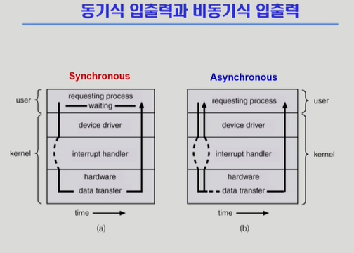
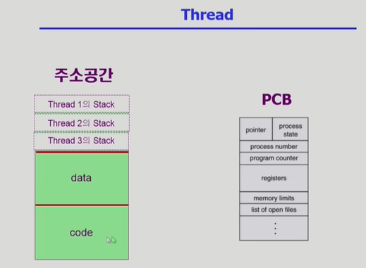
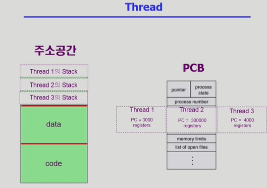

동기식 입출력과 비동기식 입출력

1) 동기식 입출력 (Synchronous I/O)
개념: I/O 요청 후, 해당 작업이 완전히 끝나 데이터가 완전히 넘어온 것을 확인한 뒤에야 사용자 프로그램에 CPU 제어권이 다시 넘어가는 방식입니다.

구현 방법 (2가지):

방법 1 (비효율적): I/O가 끝날 때까지 CPU를 아무것도 안 시키고 낭비하며 기다리게 합니다. (매우 비효율적이어서 실제로는 쓰이지 않음)

방법 2 (실제 방식): I/O를 요청한 프로세스를 즉시 Blocked 상태(Waiting)로 바꾸어 CPU를 빼앗고, ready queue에 있는 다른 프로세스에게 CPU를 넘겨줍니다. I/O 장치 작업이 끝나면 하드웨어 인터럽트를 발생시켜 해당 프로세스를 다시 Ready 상태로 깨웁니다.

2) 비동기식 입출력 (Asynchronous I/O)
개념: I/O 요청을 한 직후, 작업 완료를 기다리지 않고 CPU 제어권을 사용자 프로그램에 즉시 반환하는 방식입니다.

특징: 프로세스는 I/O가 진행되는 동안 그것과 상관없는 다른 명령어(Instruction)를 아래로 내려가며 계속 수행합니다. 주로 Write(저장) 작업이나, 당장 읽어온 데이터가 없어도 다음 처리를 할 수 있는 작업에 쓰입니다.

공통점: 두 방식 모두 "I/O가 완료되었음"을 알리는 수단은 하드웨어 인터럽트(Interrupt)를 사용합니다.

2. 스레드 (Thread)
강의 후반부의 메인 주제로, 프로세스 내부의 실행 단위인 '스레드'를 다룹니다.

1) 스레드의 정의
"A thread (or lightweight process) is a basic unit of CPU utilization."

개념: 하나의 프로세스 안에 CPU 수행 단위(기능)만 여러 개 두는 것을 의미합니다.

동일한 프로그램을 여러 개 실행할 때, 프로세스를 별도로 독립되게 여러 개 만들면 주소 공간(Code, Data, Stack)이 각각 생성되어 메모리가 심각하게 낭비됩니다. 이를 해결하기 위해 주소 공간은 하나만 유지하되, 실행 트랙(CPU가 가리키는 곳.PC(program counter))만 여러 개 두는 것이 스레드입니다.

2) 프로세스 내부에서 스레드가 가지는 구조
스레드들은 프로세스의 자원을 최대한 공유하지만, CPU를 독립적으로 수행하기 위해 각자 별도로 유지해야 하는 정보가 있습니다.

각 스레드가 "독립적"으로 가지는 것 (CPU 수행 관련):

    Program Counter (PC): 현재 코드의 어느 부분을 실행하고 있는지 가리키는 포인터

    Register Set: CPU 레지스터에 저장된 데이터 값들

    Stack Space: 함수 호출 및 리턴 정보를 저장하는 독립적인 메모리 공간

동료 스레드와 "공유"하는 부분 (Task 영역):

    Code Section (프로그램 코드)

    Data Section (전역 변수 등)

    OS Resources (오픈된 파일, 디바이스 등 환경 자원)

3. 스레드의 4대 장점 (Benefits)
응답성 (Responsiveness): * 웹 브라우저에서 스레드 A가 네트워크를 통해 이미지를 읽어오는(I/O) 동안 프로세스 전체가 블록되지 않고, 스레드 B가 이미 읽어온 텍스트를 화면에 먼저 보여줄 수 있어 사용자 체감 속도가 빨라집니다. (비동기식 입출력의 이점 활용)

자원 공유 (Resource Sharing): * 하나의 프로세스 안에서 Code, Data, OS 자원을 모두 공유하므로 메모리를 훨씬 효율적으로 사용할 수 있습니다.

경제성 (Economy): * 프로세스를 새로 생성하거나 문맥 교환(Context Switch)을 하는 것은 오버헤드가 큽니다. 반면, 스레드를 생성하거나 스레드 간 전환을 하는 것은 훨씬 빠르고 비용이 적게 듭니다. (캐시 메모리를 비울 필요가 없기 때문)

다중 처리기 구조에서의 이점 (Utilization of MP Architectures): * CPU(코어)가 여러 개인 멀티프로세서 환경에서, 각각의 스레드가 서로 다른 CPU에서 동시에 병렬(Parallel)적으로 작업을 수행할 수 있어 대규모 연산 효율이 극대화됩니다.
