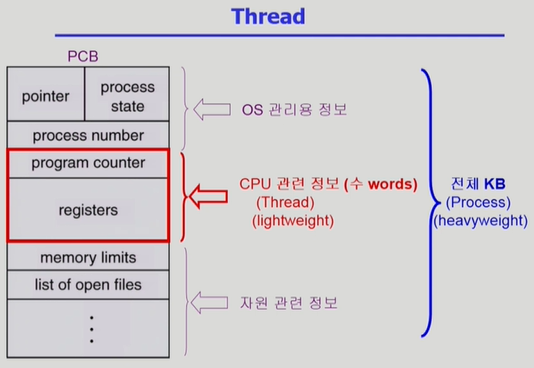
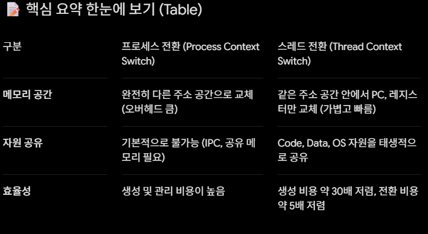

1. 스레드(Thread)란 무엇인가?
스레드는 프로세스 내부의 CPU 수행 단위 또는 경량 프로세스(Lightweight Process)라고 부릅니다.

하나의 프로그램(프로세스)을 실행하면서 동시에 여러 작업을 처리해야 할 때, 프로세스를 여러 개 만드는 대신 프로세스 내부의 메모리 공간을 공유하면서 CPU 수행 길만 여러 개를 두는 방식입니다.

💡 프로세스 내에서 공유하는 부분 vs 독립적인 부분
공유하는 부분 (Process State): * Code: 프로그램의 실제 기계어 코드
    Data: 전역 변수 등이 저장되는 공간
    OS 리소스: 오픈한 파일(File descriptor), 네트워크 소켓 등

독립적으로 가지는 부분 (Thread State): * PC (Program Counter): 현재 스레드가 코드의 어느 부분을 실행하고 있는지 가리키는 주소
    Register set: CPU 연산을 위해 스레드가 현재 사용 중인 레지스터 값들
    Stack: 함수 호출 시 필요한 지역 변수 및 리턴 주소

2. 스레드의 4대 장점 (Benefits of Threads)
강의 화면에 제시된 스레드의 주요 장점 4가지를 step-by-step으로 나누어 자세히 정리합니다.

① 응답성 (Responsiveness)
개념: 하나의 스레드가 무거운 작업(예: 네트워크 요청, 디스크 I/O) 때문에 차단(Blocked)되더라도, 다른 스레드가 계속 실행되어 사용자에게 빠른 반응을 제공할 수 있습니다.

대표적인 예시 (다중 스레드 웹 브라우저):
    스레드 A: 웹 페이지의 이미지나 텍스트 데이터를 네트워크를 통해 가져오는 중 (Blocked 상태)
    
    스레드 B: 이미 다운로드된 텍스트나 기본 화면 레이아웃을 곧바로 화면에 디스플레이(Display)해 줌

    사용자 입장에서는 브라우저가 멈추지 않고 계속 작동하는 것처럼 느껴지므로 응답성이 극대화됩니다.

② 자원 공유 (Resource Sharing)
개념: 동일한 프로세스 내의 스레드들은 바이너리 코드(Code), 데이터(Data), 그리고 프로세스의 자원(Resource)들을 모두 공유합니다.

만약 독립된 프로세스 여러 개가 같은 데이터를 쓰려고 하면 번거로운 IPC(inter-process communication) 기법을 써야 하지만, 스레드는 별도의 노력 없이도 프로세스 내의 자원을 효율적으로 함께 사용할 수 있습니다.

③ 경제성 (Economy)
개념: 프로세스를 새로 만들거나(Creation), CPU가 프로세스를 바꿀 때(Context Switching) 발생하는 오버헤드에 비해, 스레드를 생성하고 스레드 간 전환(Switching)을 하는 오버헤드가 훨씬 적습니다.

    운영체제 성능 비교 예시 (Solaris OS 기준):

        프로세스를 생성하는 것이 스레드를 생성하는 것보다 대략 30배 정도의 오버헤드가 더 듭니다.

        문맥 전환(Context Switching) 역시 프로세스 간 전환보다 스레드 간 전환이 대략 5배 정도 더 빠르고 가볍습니다. (메모리 주소 공간을 바꿀 필요가 없기 때문)

④ 다중 처리기 아키텍처의 활용 (Utilization of MP Architectures)
개념: 컴퓨터에 CPU(또는 코어)가 여러 개 있는 멀티프로세서(Multi-Processor) 환경일 때 그 진가가 드러납니다.

효과: 각각의 스레드가 서로 다른 CPU(프로서세)에서 병렬(Parallel)로 동시에 실행될 수 있습니다. 이를 통해 멀티코어 하드웨어의 성능을 100% 이끌어내어 대량의 연산을 훨씬 빠르게 처리할 수 있습니다.

