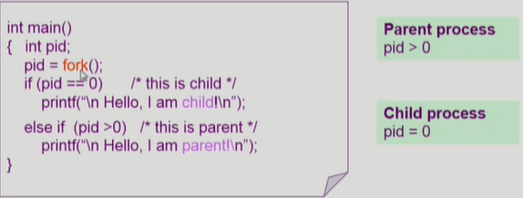
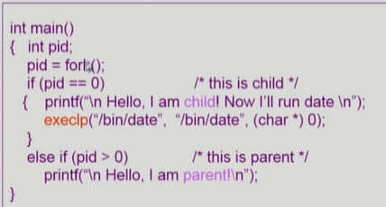
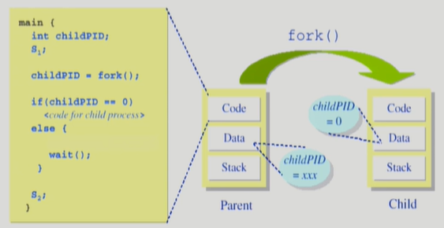
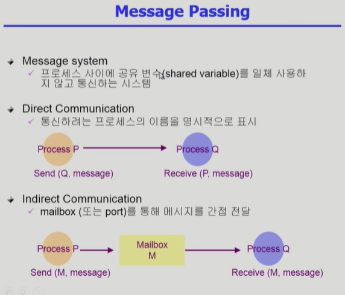
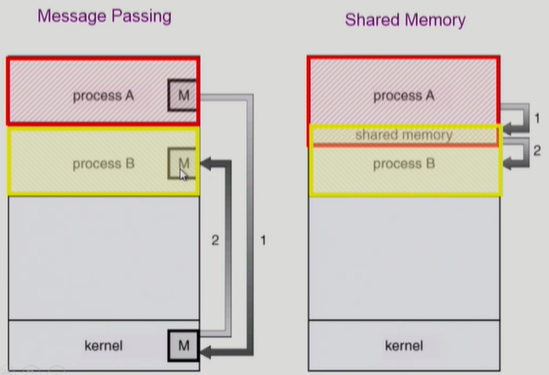

1) fork() 시스템 콜

    
    자식 프로세스는 pid=fork()구문이후부터 실행
    부모프로세스는 return값이 양수, 자식프로세스는 return값이 0
    => 부모와 자식 구분 가능
2) exec() 시슽템 콜
    
    execlp가 시스템 콜
    함수안에 들어온 명령어로 새로 덮어씀.

    int main()
        printf("1");
        execlp("echo", "echo","3",(char*)0); => echo,echo:함수이름, 3만 프린트
        printf("2");

3) wait() 시스템 콜
    
    프로세스 A가 wait() 시스템 콜 호출
    => 커널은 child가 종료될 때까지 프로세스 A를 sleep(block 상태)
    => Child process가 종료되면 커널은 프로세스 A를 깨운다(ready상태)

4) exit() 시스템 콜
    - 자발적 종료
        : 마지막 statement 수행 후 exit() 시스템 콜을 통해
        : 프로그램에 명시적으로 적어주지 않아도 main함수가 리턴되는 위치에 컴파일러가 넣어줌
    - 비자발적 종료
        : 부모 프로세스가 자식 프로세스를 강제 종료시킴
            - 자식 프로세스가 한계치를 넘어서는 자원 요청
            - 자식에게 할당된 태스크가 더 이상 필요하지 않음
        : 키보드로 kill, break등을 친 경우
        : 부모가 종료하는 경우
            - 부모 프로세스가 종료하기 전에 자식들이 먼저 종료됨

<프로세스간 협력>
1) 독립적 프로세스(Independent Process)
    : 프로세스는 각자의 주소 공간을 가지고 수행되므로 원칙적으로 하나의 프로세스는 다른 프로세스의 수행에 영향을 미치지 못함

2) 협력 프로세스(Cooperating Process)
    : 프로세스 협력 메커니즘을 통해 하나의 프로세스가 다른 프로세스의 수행에 영향을 미칠 수 있음

3) 프로세스 간 협력 메커니즘(IPC : Interprocess Communication)
    : 메시지를 전달하는 방법 
        - massage-passing(커널을 통해 메시지 전달)
        
    
    : 주소 공간을 공유하는 방법 
        - shared-memory : 서로다른 프로세스간에도 일부 주소공간을 공유
        - thread :thread는 사실상 하나의 프로세스이므로 프로세스 간협력으로 보기는 어렵지만 동일한 process를 구성하는 thread들 간에는 주소공간을 공유하므로 협력 가능

    

