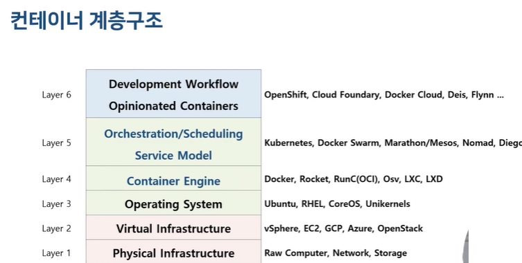
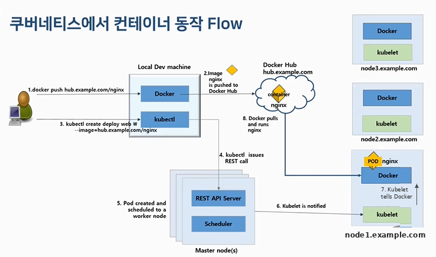
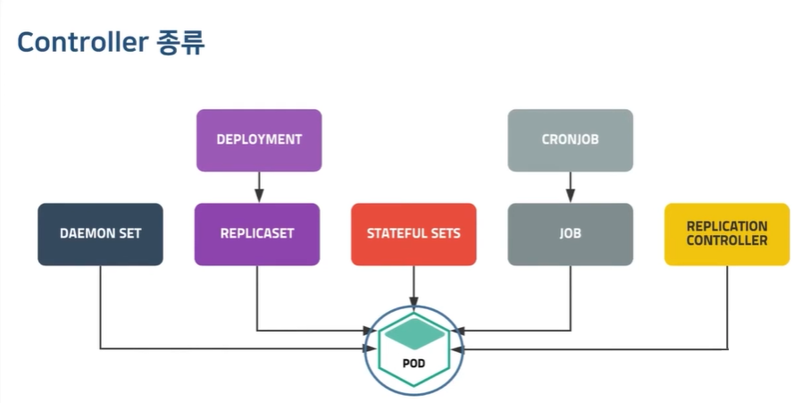

# K8S_STUDY — 따배쿠 입문 정리

---

## 1장. 쿠버네티스 소개

### 왜 오케스트레이션인가

Docker까지 배우면 컨테이너 하나를 만들고 돌리는 건 할 수 있다. 문제는 그 다음이다.

- 컨테이너가 죽으면? → 누가 다시 띄우나
- 트래픽이 몰리면? → 누가 개수를 늘리나
- 서버가 10대면? → 어느 서버에 어떤 컨테이너를 둘지 누가 정하나
- 새 버전 배포는? → 중단 없이 하나씩 교체하는 걸 누가 하나

이걸 사람이 하면 새벽에 전화 받고 일어나야 한다. **컨테이너 오케스트레이션 = 이 운영 작업 전부를 자동화하는 것**이고, 그 사실상 표준이 쿠버네티스다. (경쟁자였던 Docker Swarm, Mesos는 사실상 정리됨)

### 컨테이너 계층구조 (1-1강)



강의 슬라이드. 지금까지 쌓아온 스택이 이 그림의 어느 층인지 그대로 대응된다:

```
Layer 1~2  물리/가상 인프라   AWS EC2          ← Terraform이 만드는 층
Layer 3    OS               Ubuntu           ← Ansible이 구성하는 층
Layer 4    컨테이너 엔진      Docker
Layer 5    오케스트레이션     Kubernetes       ← 지금 여기
Layer 6    개발 워크플로      OpenShift 등     ← K8s를 감싸 상품화한 층
```

**[지금은]** 슬라이드의 이름들이 세월을 보여준다. Layer 5에 Kubernetes와 나란히 있던 Docker Swarm·Marathon/Mesos·Nomad·Diego 중 살아남아 표준이 된 건 Kubernetes뿐. Layer 4의 Rocket(rkt)은 프로젝트 종료됐고, Layer 6의 Deis·Flynn·Docker Cloud도 사라졌다(생존자는 OpenShift 정도). 이 슬라이드가 2016~17년경 생태계 스냅샷인 셈 — 오케스트레이션 전쟁이 끝났기 때문에 지금은 K8s 하나만 배우면 된다.

### 쿠버네티스가 하는 일

구글이 내부에서 15년간 쓰던 Borg를 오픈소스화한 것(2014). 핵심 기능:

- **스케줄링** — 컨테이너를 어느 노드에 둘지 자동 배치
- **자동 복구(self-healing)** — 죽은 컨테이너 자동 재시작, 응답 없는 노드의 파드 재배치
- **스케일링** — 수동/자동(HPA)으로 파드 개수 조절
- **롤아웃/롤백** — 무중단 배포와 되돌리기
- **서비스 디스커버리·로드밸런싱** — 파드들 앞에 고정 진입점 제공
- **설정·시크릿 관리** — 앱과 설정의 분리

### 핵심 철학: 선언형 + desired state

쿠버네티스에 내리는 명령은 "이거 실행해"(명령형)가 아니라 **"이 상태를 유지해"(선언형)** 다.

```
나:  "nginx 파드 3개가 떠 있는 상태를 원한다" (YAML로 선언)
K8s: 현재 상태를 감시 → 2개뿐이네? → 1개 더 띄움 (조정 루프, reconcile)
```

Terraform(선언한 인프라로 수렴)·Ansible(멱등성)과 같은 철학인데, 차이는 **쿠버네티스는 24시간 상시 감시하며 유지**한다는 것. Ansible은 실행할 때만 맞춰주지만 K8s의 컨트롤러는 항상 돌고 있다.

### 클러스터 구조 한 장

```
                 ┌─────────────────────────────┐
                 │   Control Plane (관리 노드)  │
                 │  etcd·apiserver·scheduler·  │
                 │  controller-manager         │
                 └──────────────┬──────────────┘
                                │ 지시
          ┌─────────────────────┼─────────────────────┐
          ▼                     ▼                     ▼
   ┌─────────────┐       ┌─────────────┐       ┌─────────────┐
   │ Worker 노드1 │       │ Worker 노드2 │       │ Worker 노드3 │
   │ kubelet     │       │ kubelet     │       │ kubelet     │
   │ [pod][pod]  │       │ [pod][pod]  │       │ [pod]       │
   └─────────────┘       └─────────────┘       └─────────────┘
```

- **Control Plane**: 결정을 내리는 두뇌. 어디에 뭘 띄울지, 상태가 맞는지 감시
- **Worker**: 실제 컨테이너(파드)가 도는 손발
- minikube는 이 전체를 Docker 컨테이너 1개 안에 압축한 것 (1노드가 control plane 겸 worker)

### 설치 없이 실습하기 (1-2강)

강의에서는 Katacoda와 Play with Kubernetes를 소개한다.

**[지금은]** Katacoda는 2022년 서비스 종료. 대체는 **Killercoda**(killercoda.com) — 어차피 CKA 연습 때 쓸 곳. 로컬에 minikube 있으니 브라우저 실습은 보조 수단.

---

## 2장. 클러스터 설치 (2-x강)

강의에서는 VM 2~3대(master 1 + worker 2)를 만들고 kubeadm으로 직접 클러스터를 구성한다.
minikube로 대체했으므로([SETUP.md](SETUP.md)) 이 장은 "kubeadm 설치가 어떤 흐름인지"만 잡고 넘어간다. 직접 설치는 CKA 준비(8월) 때.

### kubeadm 설치 흐름 (개념만)

모든 노드 공통 사전 작업:

```
1. swap 비활성화        — kubelet이 메모리 계산을 정확히 하기 위한 요구사항
2. 커널 모듈·네트워크    — br_netfilter, ip_forward 등
3. 컨테이너 런타임 설치  — 강의: docker / [지금은] containerd
4. kubeadm·kubelet·kubectl 설치
```

클러스터 구성:

```
[master]  kubeadm init          → control plane 부품들 기동, join 토큰 출력
[master]  CNI 플러그인 설치      → 파드 네트워크 (calico, flannel 등)
[worker]  kubeadm join <토큰>    → 클러스터 합류
```

CNI 플러그인 = 모든 파드에 IP를 주고 노드 간 파드 통신을 만들어주는 파드 네트워크 층.
K8s 본체에는 구현이 안 들어 있어서 kubeadm 설치 시 하나를 골라 **반드시 설치**해야 한다
(강의는 weave net). 안 깔면 노드 NotReady + coredns Pending에 머문다.
minikube는 기본 CNI까지 포함해서 구성해주므로 따로 설치할 것 없음 — 처음부터 Ready였던 이유.

### [지금은] 이 장에서 강의와 크게 달라진 것

- **Docker 런타임 제거**: v1.24부터 dockershim 삭제 → 런타임은 containerd(또는 CRI-O). 강의에서 노드에 docker를 설치하고 `docker ps`로 컨테이너를 확인하는 장면은 지금은 재현 안 됨. 노드 레벨 확인은 `crictl ps` (kubectl 관점만 쓰면 무관)
- **master → control-plane**: 명칭·라벨·taint 전부 변경 (`node-role.kubernetes.io/control-plane`)
- minikube는 이 사전작업~init~CNI 전 과정을 자동으로 해준다. 그래서 학습용

### 노드 확인

```bash
kubectl get nodes             # STATUS Ready, ROLES control-plane
kubectl get nodes -o wide     # 내부 IP·OS·런타임 버전까지 (CONTAINER-RUNTIME: containerd 확인)
```

---

## 3장. kubectl (3-1, 3-2강)

### 명령 구조

```
kubectl [command] [TYPE] [NAME] [flags]
         │         │      │      │
         │         │      │      └ -o wide, -n 네임스페이스, ...
         │         │      └ 오브젝트 이름 (생략하면 전체)
         │         └ 오브젝트 타입 (pod, deployment, service, node, ...)
         └ 동작 (get, describe, create, apply, delete, exec, logs, ...)
```

예: `kubectl get pod webserver -o wide -n default`

### 자주 쓰는 command

```
조회      get(목록·상태) / describe(상세+이벤트) / logs(컨테이너 출력)
생성      run(파드 1개 즉석) / create(리소스 생성) / apply(YAML 적용·갱신)
변경      edit(라이브 수정) / scale(개수 조절) / rollout(배포 관리)
삭제      delete
진입      exec -it <pod> -- <명령>
포워딩    port-forward <pod> 로컬포트:파드포트
정보      api-resources(타입 목록·약어) / explain <타입>(필드 문서)
```

약어: `po`(pod), `deploy`(deployment), `svc`(service), `rs`(replicaset), `ns`(namespace), `no`(node), `cm`(configmap)

### 알아두면 계속 쓰는 것 3가지

**1. `-o` 출력 포맷**

```bash
kubectl get pod -o wide    # IP·배치된 노드까지
kubectl get pod -o yaml    # 오브젝트 전체 YAML (K8s가 채운 기본값 포함)
```

**2. `--dry-run`으로 YAML 템플릿 뽑기** — YAML을 맨손으로 치지 않는다. 실무·CKA 공통 표준 기술:

```bash
kubectl run webserver --image=nginx --dry-run=client -o yaml > pod.yaml
# 실제로 만들지는 않고(--dry-run=client) YAML만 출력 → 파일로 저장 → 수정 → apply
```

**3. 자동완성**

```bash
echo 'source <(kubectl completion bash)' >> ~/.bashrc
echo 'alias k=kubectl' >> ~/.bashrc
echo 'complete -o default -F __start_kubectl k' >> ~/.bashrc
```

### [지금은] kubectl run의 동작 변경 — 이 강의 최대 함정

강의 시절 `kubectl run`은 **Deployment**를 만들었다. v1.18부터 **단일 Pod만** 만든다.

```bash
# 강의:   kubectl run nginx --image=nginx  → deployment 생성 (구버전)
# 지금:   kubectl run nginx --image=nginx  → pod 1개 생성
# 지금 Deployment를 원하면:
kubectl create deployment nginx --image=nginx
```

또 하나: `kubectl exec 파드명 명령` 옛 문법은 제거됨. 지금은 `--` 필수:

```bash
kubectl exec -it webserver -- /bin/bash
```

---

## 4장. 아키텍처 (4-1, 4-2, 4-3강)

### 4-1. 동작 원리 — 부품별 역할

이 장이 따배쿠 전체에서 가장 중요하다. 이후 모든 장이 이 그림 위에서 돈다.

```
┌────────────────────── Control Plane ──────────────────────┐
│                                                            │
│  etcd ◄──────── kube-apiserver ────────► scheduler         │
│  (상태 저장소)      (모든 요청의 관문)       (배치 결정)      │
│                        ▲    ▲                              │
│                        │    └────────► controller-manager  │
│                        │                (상태 유지 루프)     │
└────────────────────────┼───────────────────────────────────┘
                kubectl  │  kubelet(각 노드)
┌────────────────────────┼─────────── Worker 노드 ───────────┐
│                        ▼                                   │
│   kubelet ──► 컨테이너 런타임(containerd) ──► [pod][pod]     │
│   kube-proxy (서비스 네트워크 규칙)                          │
└────────────────────────────────────────────────────────────┘
```

**마스터 컴포넌트** (결정을 내리는 쪽):

- **etcd** — 클러스터의 모든 상태가 저장되는 key-value 장부. 여기가 날아가면 클러스터가 날아감 (CKA에서 백업/복구 필수 출제)
- **kube-apiserver** — 유일한 관문. kubectl도, 내부 부품끼리도 전부 apiserver를 통해서만 대화. 요청의 인증·인가·유효성 검증 담당
- **kube-scheduler** — "이 파드를 어느 노드에 둘까" 결정만 함 (실행은 kubelet이). 판단 기준: 리소스 요구량, nodeSelector, affinity 등
- **kube-controller-manager** — 파드를 관찰하며 "선언된 상태 = 실제 상태" 유지 루프 모음. 파드 3개 선언했는데 2개면 1개 만들라고 요청. Ansible 멱등성의 24시간 상주 버전

**워커 노드 컴포넌트** (실행하는 쪽 — 모든 노드에 있음):

- **kubelet** — 각 노드의 K8s 에이전트. apiserver를 감시하다 자기 노드에 배정된 파드를 런타임 시켜 실행, 상태 보고, 프로브 실행. **유일하게 파드가 아니라 노드의 데몬(systemd 서비스)으로 돈다** — 파드를 띄우는 주체라서 자기가 파드일 수 없음
- **kube-proxy** — 각 노드의 네트워크 규칙 담당. Service로 온 트래픽을 파드로 보내는 iptables rule을 구성 (Service의 실체, 7장)
- **컨테이너 런타임** — kubelet의 지시로 컨테이너를 실제 실행하는 엔진. docker/containerd, 그 최하층에서 최종 실행하는 건 runc

**애드온** (필수는 아니지만 사실상 다 씀):

- 네트워크(CNI) — calico, flannel 등 (2장). 클러스터 필수에 가까움
- DNS — coreDNS. 서비스 이름을 IP로 풀어줌 (7장)
- 대시보드 — 웹 UI
- 자원 모니터링 — cAdvisor (kubelet에 내장돼 컨테이너 CPU·메모리 수집. 8월에 배울 Prometheus가 긁어가는 소스가 이것)
- 클러스터 로깅 — 컨테이너·K8s 운영 로그를 중앙화. ELK/EFK 스택, DataDog 등 (EFK는 8월 Observability에서 실습)

### 파드 하나가 뜨기까지 (전체 흐름)

`kubectl create deployment web --image=nginx --replicas=3` 을 치면:

```
1. kubectl  → apiserver에 REST 요청 (인증·검증)
2. apiserver → etcd에 "deployment web, replicas 3" 기록 (여기까지가 접수)
3. controller-manager → 감시 중 새 deployment 발견 → ReplicaSet 생성 → Pod 오브젝트 3개 생성
   (아직 어느 노드인지는 미정 = Pending)
4. scheduler → 노드 미정 파드 발견 → 조건 맞는 노드 선택 → apiserver에 기록
5. 해당 노드 kubelet → 자기 노드 배정 발견 → containerd에 컨테이너 실행 지시
6. kubelet → 상태를 apiserver에 보고 → etcd 갱신 → kubectl get pod에 Running
```

포인트: **부품끼리 직접 명령하지 않는다.** 전부 "apiserver에 기록 → 담당자가 감시하다 자기 일을 한다" 방식(watch 기반). 그래서 부품 하나가 잠깐 죽어도 복구되면 이어서 동작한다.

강의(4-1) 슬라이드 버전 — 위 흐름 앞뒤로 이미지 레지스트리까지 붙인 전체 그림:



- 1~2: 개발자가 이미지를 빌드해 레지스트리(Docker Hub)에 push — K8s 바깥의 사전 준비
- 3~4: kubectl create → apiserver에 REST 호출 (위 흐름의 1~2단계)
- 5: 파드 생성 + scheduler가 워커 노드 배정 (위 3~4단계)
- 6~7: 배정된 노드의 kubelet이 통지받고 런타임에 실행 지시 (위 5단계)
- 8: **노드의 런타임이 레지스트리에서 직접 이미지를 pull** 해서 컨테이너 실행

8번이 이 그림에서 새로 얻는 포인트: 클러스터에 이미지를 업로드하는 게 아니라 **각 노드가 레지스트리에서 알아서 받아온다.** 그래서 이미지는 반드시 노드가 접근 가능한 레지스트리에 있어야 하고, 없는 이미지명을 쓰면 노드가 pull에 실패하면서 ImagePullBackOff(5장)가 뜨는 것.

### 4-2. Namespace — 클러스터 안의 논리적 분리

한 클러스터를 용도별로 나눠 쓰는 칸막이. 물리 분리가 아니라 논리 분리다.

```bash
kubectl get namespaces                  # 기본 4개
# default          지정 안 하면 여기
# kube-system      K8s 시스템 파드 (건드리지 말 것)
# kube-public      모든 사용자가 읽기 가능한 공용
# kube-node-lease  노드 하트비트용

kubectl create namespace blue           # 생성
kubectl get pod -n kube-system          # 특정 ns 조회
kubectl get pod -A                      # 전체 ns 조회 (--all-namespaces)
kubectl delete namespace blue           # ★ 안의 리소스 전부 같이 삭제됨. 주의
```

YAML로 만들 때는 `metadata.namespace`로 소속을 지정한다.

용도: 팀별(dev/ops), 환경별(dev/staging/prod) 분리 + ResourceQuota로 ns별 자원 상한 + RBAC로 ns별 권한.

주의: **namespace로 나뉘지 않는 것도 있다** — node, PersistentVolume 같은 클러스터 범위 오브젝트 (`kubectl api-resources`의 NAMESPACED 컬럼이 false인 것들).

### 4-3. YAML 템플릿과 API

모든 K8s 오브젝트 YAML은 필수 4필드로 시작한다:

```yaml
apiVersion: v1          # 이 오브젝트 타입이 속한 API 그룹/버전
kind: Pod               # 오브젝트 타입
metadata:               # 이름·네임스페이스·라벨 등 식별 정보
  name: webserver
spec:                   # 원하는 상태 선언 (타입마다 구조 다름 — 본체)
  containers:
  - name: nginx-container
    image: nginx:1.25
```

(생성 후 K8s가 채우는 `status` 필드까지 합쳐 5개 — status는 내가 쓰는 게 아니라 시스템이 기록)

apiVersion은 타입마다 다르다. 외우지 말고 조회한다:

```bash
kubectl api-resources           # 타입별 apiVersion·약어·NAMESPACED 여부
kubectl explain pod             # 필드 문서
kubectl explain pod.spec.containers   # 점으로 파고들기
```

자주 쓰는 것만: Pod/Service/ConfigMap/Secret/Namespace = `v1`, Deployment/ReplicaSet/DaemonSet/StatefulSet = `apps/v1`, Job/CronJob = `batch/v1`, Ingress = `networking.k8s.io/v1`

YAML 문법에서 실수 잦은 곳: 들여쓰기는 스페이스만(탭 금지), 리스트는 `-`, 문자열 숫자는 따옴표(`"80"` vs 80이 다른 의미가 되는 필드가 있음).

---

## 5장. Pod (5-1 ~ 5-7강)

### 5-1-1. Pod 개념 — 왜 컨테이너가 아니라 Pod인가

**Pod = 쿠버네티스의 최소 배포 단위.** K8s는 컨테이너를 직접 다루지 않고 항상 Pod로 감싸서 다룬다.

Pod 안에는 컨테이너가 1개 이상 들어가고, **같은 Pod 안 컨테이너들은 다음을 공유한다:**

- **IP 주소** — Pod당 IP 1개. 안의 컨테이너들은 localhost로 서로 통신
- **스토리지(volume)** — 같은 볼륨을 마운트해 파일 공유 가능
- 같은 노드에 함께 배치되고, 함께 생성·삭제됨

```
┌───────── Pod (IP: 10.244.0.5) ─────────┐
│  ┌──────────┐  ┌──────────┐            │
│  │ 컨테이너A │  │ 컨테이너B │  ← localhost로 통신
│  └────┬─────┘  └────┬─────┘            │
│       └── 공유 볼륨 ──┘                  │
└─────────────────────────────────────────┘
```

왜 이런 단위가 필요한가: "항상 붙어 다녀야 하는 컨테이너 묶음"(앱 + 로그수집기 같은)을 하나의 생명주기로 관리하기 위해. 단, **기본은 1 Pod = 1 컨테이너**다. Multi-container는 5-7강의 패턴처럼 명확한 이유가 있을 때만.

생성 두 방식:

```bash
# 명령형 — 즉석 실험용
kubectl run webserver --image=nginx:1.25 --port=80

# 선언형 — 실무 표준. 파일이 남아 재현·리뷰·버전관리 가능
kubectl apply -f pod-nginx.yaml
```

```yaml
# pod-nginx.yaml
apiVersion: v1
kind: Pod
metadata:
  name: webserver
spec:
  containers:
  - name: nginx-container
    image: nginx:1.25
    ports:
    - containerPort: 80
```

관찰 4종 세트:

```bash
kubectl get pod -o wide                     # 상태·IP·노드
kubectl describe pod webserver              # 상세 + 하단 Events (진단 1순위)
kubectl logs webserver                      # 컨테이너 stdout (-f 팔로우)
kubectl exec -it webserver -- /bin/bash     # 컨테이너 안 진입
kubectl port-forward webserver 8080:80      # localhost:8080 → 파드 80
kubectl delete pod webserver                # 삭제 (혹은 -f pod-nginx.yaml)
```

multi-container pod는 `spec.containers` 리스트에 두 번째 항목을 추가하면 된다. 이때 `logs`·`exec`는 `-c 컨테이너명`으로 대상을 지정한다.

### 5-1-2. Pod 동작 flow — 상태 읽는 법

```
Pending ──► Running ──► Succeeded (정상 종료, Job류)
   │                └─► Failed
   └ 스케줄 대기 or 이미지 받는 중
```

`kubectl get pod`의 STATUS에서 실제로 만나는 것들:

```
ContainerCreating   이미지 다운로드·볼륨 마운트 중. 오래 걸리면 describe
ImagePullBackOff    이미지를 못 받아옴 — 이미지명 오타, 없는 태그, 프라이빗 레지스트리 인증
ErrImagePull        위와 같은 원인의 첫 시도 실패 표시
CrashLoopBackOff    컨테이너가 뜨자마자 죽기를 반복 — 앱 자체 문제. logs로 확인
Completed           정상 종료 (restartPolicy에 따라 재시작 안 한 상태)
```

진단 순서 습관화: **get(무슨 상태) → describe의 Events(왜) → logs(앱 내부는)**. nginx -t 판독 훈련의 K8s 버전이다.

`spec.restartPolicy`: `Always`(기본, 계속 재시작) / `OnFailure`(실패 시만) / `Never`. 재시작은 kubelet이 **같은 파드 안에서 컨테이너만** 다시 띄우는 것 — RESTARTS 카운트가 올라간다.

### 5-2. livenessProbe — self-healing Pod

컨테이너 프로세스는 살아 있는데 앱이 먹통(데드락, 무한루프)인 경우, K8s는 기본적으로 모른다. **livenessProbe = kubelet이 주기적으로 건강검진을 하고, 실패하면 컨테이너를 재시작**하는 장치.

검사 방식 3가지:

```yaml
spec:
  containers:
  - name: nginx-container
    image: nginx:1.25
    livenessProbe:
      httpGet:              # 1) HTTP GET — 응답코드 200~399면 통과 (웹앱 표준)
        path: /
        port: 80
      # tcpSocket:          # 2) TCP 연결 — 포트가 열리면 통과 (DB 등)
      #   port: 3306
      # exec:               # 3) 명령 실행 — exit 0이면 통과
      #   command: ["ls", "/data/health"]
      initialDelaySeconds: 5   # 시작 후 첫 검사까지 대기 (앱 기동 시간 고려)
      periodSeconds: 10        # 검사 주기
      timeoutSeconds: 1        # 응답 대기 한도
      successThreshold: 1      # 성공 몇 번이면 건강 판정
      failureThreshold: 3      # 연속 실패 몇 번이면 재시작
```

동작 확인: 일부러 실패시키면 (`path: /없는경로`) describe Events에 `Liveness probe failed` → RESTARTS 증가가 보인다.

짝 개념 **readinessProbe**: liveness는 "죽었으면 재시작", readiness는 "준비 안 됐으면 **트래픽만 차단**"(Service 연결에서 제외, 재시작 안 함). 배포 직후 워밍업 중 요청 유입을 막는 용도. 문법은 동일하고 이름만 다르다. PF2 Go 서버의 `/health` 엔드포인트가 바로 이 프로브들이 때릴 자리다.

### 5-3. init container — 본 컨테이너 전 초기화

`spec.initContainers`에 선언. **main 컨테이너가 시작되기 전에, 선언 순서대로, 각각 성공(exit 0)해야** 다음으로 넘어간다. 하나라도 실패하면 main은 영영 안 뜬다 (STATUS가 `Init:0/2` 같은 형태로 표시).

```yaml
spec:
  initContainers:
  - name: wait-for-db
    image: busybox
    command: ['sh', '-c', 'until nslookup mydb; do sleep 2; done']
  containers:
  - name: app
    image: myapp
```

용도: DB 뜰 때까지 대기, 설정 파일 다운로드, 마이그레이션 등 "앱 시작 전 반드시 끝나야 하는 일". 앱 이미지에 초기화 로직을 섞지 않고 분리할 수 있는 게 장점.

### 5-4. infra container (pause)

파드를 만들면 내가 선언한 컨테이너 외에 **pause라는 컨테이너가 자동으로 하나 더** 생긴다. 역할: **파드의 IP·네트워크 네임스페이스를 붙들고 있는 뼈대.** 내 컨테이너가 재시작돼도 파드 IP가 유지되는 이유가 이것이다. 같은 파드 컨테이너들이 localhost를 공유하는 것도 pause의 네임스페이스에 얹혀 있기 때문.

**[지금은]** 강의에서는 노드에서 `docker ps`로 pause 컨테이너를 직접 보여주는데, 런타임이 containerd로 바뀌어 그 장면은 재현 불가. 굳이 보려면 `minikube ssh` 후 `sudo crictl ps` — 개념만 알면 충분하다.

### 5-5. static Pod — kubelet이 직접 관리하는 파드

일반 파드는 apiserver에 요청해서 만들지만, **static pod는 노드의 특정 디렉토리에 YAML을 놓으면 그 노드의 kubelet이 알아서 띄운다.** apiserver를 거치지 않는다 (apiserver에는 읽기전용 미러만 보임).

- 경로: kubelet 설정의 `staticPodPath` — 관례상 `/etc/kubernetes/manifests/`
- 파일을 넣으면 생성, 지우면 삭제. `kubectl delete`로 지워도 kubelet이 다시 만든다
- **control plane 자체(etcd·apiserver·scheduler·controller-manager)가 static pod로 뜬다.** 그래서 `kubectl get pod -n kube-system`에서 이 파드들 이름 뒤에 노드명이 붙어 있다 (`etcd-minikube` 처럼)

닭-달걀 해법인 셈: apiserver가 아직 없는데 apiserver 파드를 어떻게 띄우나 → kubelet이 파일만 보고 띄운다.

확인: `minikube ssh` → `ls /etc/kubernetes/manifests/` → 4개 YAML이 보인다.

### 5-6. Pod에 리소스 할당 — requests / limits

선언 안 하면 파드가 노드 자원을 무제한으로 먹을 수 있다. 컨테이너마다 두 값을 준다:

```yaml
spec:
  containers:
  - name: app
    image: nginx
    resources:
      requests:          # 최소 보장량 — scheduler가 배치 판단에 쓰는 값
        cpu: 200m        # 1000m = 1코어. 200m = 0.2코어
        memory: 250Mi
      limits:            # 최대 허용량 — 초과 시 제재
        cpu: 500m        #   CPU 초과 → throttle (죽이진 않고 속도 제한)
        memory: 500Mi    #   메모리 초과 → OOMKilled (컨테이너 강제 종료·재시작)
```

- **requests는 스케줄링 기준**: 노드의 남은 requests 합계로 배치 여부 결정. 실제 사용량이 아니라 "예약량"
- **CPU와 메모리의 제재가 다르다**: CPU는 압축 가능 자원(느려질 뿐), 메모리는 불가(터짐). RESTARTS 원인에 OOMKilled가 자주 나온다 — `describe`의 Last State에서 확인
- requests만 있고 limits 없으면 무제한 사용 가능, limits만 있으면 requests=limits로 간주

### 5-7. 환경변수와 실행 패턴

**환경변수**:

```yaml
spec:
  containers:
  - name: app
    image: nginx
    env:
    - name: DB_HOST
      value: "mydb.example.com"
```

확인은 `kubectl exec 파드 -- env`. PF3에서 SLACK_WEBHOOK_URL을 `-e`로 주입했던 것의 K8s 버전이고, 나중에 ConfigMap/Secret(10·11장)에서 값을 코드 밖으로 완전히 빼게 된다.

**multi-container 실행 패턴** — 보조 컨테이너를 붙이는 3가지 정형 패턴:

```
sidecar     본 컨테이너를 돕는 조수.  예: 앱 + 로그 수집기 (볼륨 공유)
adapter     외부 ↔ 앱의 출력 형식 변환.  예: 앱 메트릭 → Prometheus 포맷 변환기
ambassador  앱의 바깥 통신 대리.  예: 앱은 localhost만 보고, 프록시가 실제 DB 라우팅
```

셋 다 "같은 파드 = 같은 IP·볼륨 공유" 성질을 이용한다. Istio의 사이드카 프록시(8월 학습)가 이 패턴의 대표 실전 사례.

---

## 6장. Controller (6-x강)

### 공통 개념 — Controller가 하는 일

파드를 맨몸으로(`kind: Pod`) 띄우면 죽었을 때 아무도 다시 안 살린다 (kubelet의 restartPolicy는 같은 노드 안 재시작일 뿐, 노드가 죽으면 끝). **Controller = "파드 N개가 떠 있는 상태"를 감시하고 유지하는 관리자.**

모든 컨트롤러의 공통 구조:

```
selector (어떤 파드를 내 관리 대상으로 볼 것인가 — label로 식별)
replicas (몇 개를 유지할 것인가)
template (부족하면 이 설계도로 새로 만든다 — 파드 YAML이 통째로 들어감)
```

그래서 실무에서 파드를 직접 만드는 일은 거의 없고, 항상 컨트롤러(주로 Deployment)를 통해 만든다.

컨트롤러 전체 지도 — 종류는 달라도 결국 전부 파드를 관리하는 물건이다:



- 왼쪽 축(상시 실행): DaemonSet / Deployment→ReplicaSet / StatefulSet — "계속 떠 있어야 하는" 워크로드
- 오른쪽 축(한 번 실행): CronJob→Job — "끝나면 종료되는" 배치 작업
- ReplicationController는 ReplicaSet으로 대체된 1세대 (아래 절 참고)

### ReplicationController → ReplicaSet

- **ReplicationController(RC)**: 1세대. 지금은 안 씀
- **ReplicaSet(RS)**: RC의 후속. 차이는 selector 표현력 — RC는 등호 매칭만, RS는 집합 매칭(`matchExpressions`: In, NotIn, Exists)까지

```yaml
apiVersion: apps/v1
kind: ReplicaSet
metadata:
  name: rs-nginx
spec:
  replicas: 3
  selector:
    matchLabels:
      app: webui          # ← 이 label 달린 파드를 관리
  template:               # ← 파드 설계도
    metadata:
      labels:
        app: webui        # ← selector와 반드시 일치해야 함
    spec:
      containers:
      - name: nginx
        image: nginx:1.25
```

동작 확인 실험:

```bash
kubectl apply -f rs.yaml && kubectl get pod        # 3개 생성됨
kubectl delete pod <그중 하나>                      # 지우면
kubectl get pod                                    # 즉시 새 파드 보충 — self-healing
kubectl scale rs rs-nginx --replicas=5             # 개수 조절
```

재미있는 성질: RS는 **label만 본다.** 같은 label의 파드를 수동으로 하나 더 만들면 "4개네? 1개 초과" 하고 지워버린다. 반대로 기존 파드의 label을 떼면 RS 관리에서 빠져 고아가 된다.

단 정확히는 "label이 맞으면서 **주인이 없는** 파드만 입양한다"이다. 컨트롤러가 만든 파드에는 metadata에 ownerReferences(소유자 표시)가 박혀서, 같은 label의 RC와 RS를 동시에 띄워도 서로의 파드를 뺏지 않고 각자 replicas만큼 공존한다. 수동으로 만든 파드가 정리당하는 건 주인이 없는 고아라서다.

그런데 RS를 직접 쓰는 일도 없다. 이유는 다음 절.

### Deployment — 실무의 기본 단위

**Deployment = ReplicaSet의 관리자.** RS가 하는 일(개수 유지)에 **버전 교체(rolling update)와 롤백**을 얹었다.

```
Deployment ──관리──► ReplicaSet(v1) ──관리──► pod, pod, pod
                └──► ReplicaSet(v2)  ← 새 버전 배포 시 새 RS를 만들어 점진 교체
```

YAML은 ReplicaSet에서 `kind`만 바꾸면 될 정도로 같다 (`kind: Deployment`, apiVersion `apps/v1`).

**Rolling Update — 무중단 배포:**

```bash
kubectl create deployment web --image=nginx:1.24 --replicas=3
kubectl set image deployment/web nginx=nginx:1.25    # 이미지 교체 트리거
kubectl rollout status deployment/web                # 진행 상황 실시간
kubectl rollout history deployment/web               # 리비전 이력
kubectl rollout undo deployment/web                  # 직전으로 롤백
kubectl rollout undo deployment/web --to-revision=1  # 특정 리비전으로
kubectl rollout pause / resume deployment/web        # 배포 일시정지/재개
```

교체 과정: 새 RS 만들고 새 파드 1개 추가 → 준비되면 옛 파드 1개 제거 → 반복. 속도 조절은 strategy로:

```yaml
spec:
  strategy:
    type: RollingUpdate       # 기본값 (다른 값: Recreate — 전부 죽이고 새로. 다운타임 있음)
    rollingUpdate:
      maxSurge: 25%           # 교체 중 replicas 초과 허용량 (여유 자원으로 새것 먼저)
      maxUnavailable: 25%     # 교체 중 결원 허용량
```

옛 RS는 replicas=0으로 남아 롤백 대비용으로 보관된다 (`revisionHistoryLimit`, 기본 10).

**[지금은]** 강의의 `--record` 플래그(history에 명령 기록)는 deprecated. 대신 `kubectl annotate deployment/web kubernetes.io/change-cause="1.25로 업데이트"` 방식.

### DaemonSet — 노드당 정확히 1개

replicas 개념이 없다. **모든 노드(또는 selector에 맞는 노드)에 파드를 1개씩** 깐다. 노드가 추가되면 자동으로 거기에도 뜨고, 노드가 빠지면 같이 사라진다.

용도가 명확하다: 노드마다 있어야 하는 것들 — 로그 수집기(fluentd), 모니터링 에이전트(node-exporter), 네트워크(kube-proxy·CNI). 실제로 `kubectl get ds -n kube-system` 하면 kube-proxy가 DaemonSet이다.

YAML은 ReplicaSet에서 `kind: DaemonSet`, replicas 줄만 빠진 형태. 업데이트 전략도 rolling update 지원.

### StatefulSet — 이름과 순서가 보장되는 파드

Deployment의 파드는 이름이 `web-7d9f...-x2k4j` 처럼 랜덤이고 서로 대체 가능하다(가축). DB처럼 **각자 정체성과 자기 데이터가 있는 앱**(애완동물)에는 안 맞는다. StatefulSet은:

- 파드 이름 고정: `mysql-0`, `mysql-1`, `mysql-2` — 재생성돼도 같은 이름
- 순차 기동/역순 종료: 0이 준비돼야 1이 뜬다
- **파드별 전용 스토리지**: `volumeClaimTemplates`로 파드마다 자기 PVC — 재생성돼도 자기 데이터에 다시 붙음
- headless Service(7장)와 짝: `mysql-0.mysql.default.svc...` 처럼 파드별 고정 DNS

PF-K8s에서 Redis/Postgres를 StatefulSet으로 직접 띄워볼 것 (PV/PVC랑 같이).

### Job — 끝나야 하는 작업

웹서버는 계속 떠 있어야 하지만, 배치 작업(백업, 마이그레이션)은 **완료가 목표**다. Job은 파드가 정상 종료(exit 0)할 때까지 책임진다. 실패하면 재시도.

```yaml
apiVersion: batch/v1
kind: Job
metadata:
  name: backup-job
spec:
  completions: 1        # 성공 몇 번이 목표인가
  parallelism: 1        # 동시에 몇 개 돌릴 것인가
  backoffLimit: 4       # 재시도 한도 (넘으면 Job 실패 처리)
  template:
    spec:
      restartPolicy: Never     # ★ Job은 Always 불가 — Never 또는 OnFailure
      containers:
      - name: backup
        image: busybox
        command: ["sh", "-c", "echo backup done"]
```

완료된 파드는 `Completed` 상태로 남는다 (로그 확인용). 정리는 `ttlSecondsAfterFinished`.

### CronJob — Job의 예약 실행

crontab 문법으로 Job을 주기 생성. **PF3의 "5분마다 모니터링"을 K8s 방식으로 하면 바로 이것.**

```yaml
apiVersion: batch/v1          # [지금은] 강의 시절엔 batch/v1beta1 — 지금 그대로 쓰면 에러
kind: CronJob
metadata:
  name: monitor-cron
spec:
  schedule: "*/5 * * * *"     # 분 시 일 월 요일
  concurrencyPolicy: Allow    # 이전 실행이 안 끝났을 때: Allow / Forbid(스킵) / Replace(교체)
  successfulJobsHistoryLimit: 3
  jobTemplate:
    spec:
      template:
        spec:
          restartPolicy: OnFailure
          containers:
          - name: monitor
            image: pf3-monitor
```

### cron 표기법 읽는 법

`*/5 * * * *`가 암호처럼 보이지만, 다섯 칸이 각각 시간 단위 하나씩이다:

```
┌───────── 분 (0~59)
│ ┌─────── 시 (0~23)
│ │ ┌───── 일 (1~31)
│ │ │ ┌─── 월 (1~12)
│ │ │ │ ┌─ 요일 (0~6, 0=일요일)
* * * * *
```

읽는 규칙: `*`=매(조건 없음) / `*/n`=n마다(값이 n의 배수일 때) / `a-b`=범위 / `a,b`=나열. 그리고 **다섯 칸은 전부 AND 조건**이다 — cron은 매분 시계를 보며 "지금의 분·시·일·월·요일이 다섯 칸에 전부 맞나"를 검사하고, 다 맞으면 실행한다. `30 2 * * *`이 하루 한 번인 이유(분=30 AND 시=2, 나머지는 아무거나).

```
*/5 * * * *          5분마다
0 * * * *            매시 정각
30 2 * * *           매일 02:30
0 9 * * 1            매주 월요일 09:00
0 0 1 * *            매월 1일 자정
*/10 9-18 * * 1-5    평일 9~18시 사이 10분마다
```

리눅스 crontab에서 온 문법이라 한 번 익히면 GitHub Actions schedule·Jenkins 트리거까지 전부 같은 걸 쓴다. 덤 하나: CronJob이 만드는 Job 이름 뒤의 숫자(`cj-date-29736763`)는 랜덤이 아니라 **스케줄 시각의 분 단위 unix time**이다(×60이 그 시각의 epoch초).

---

## 7장. Service (7-x강)

### 왜 필요한가

파드 IP는 휘발성이다 — 재생성될 때마다 바뀐다. 게다가 replicas 3이면 IP가 3개다. 클라이언트가 "지금 살아 있는 파드 IP"를 추적하는 건 불가능하다.

**Service = label selector로 묶은 파드 집합 앞에 놓는 고정 진입점(가상 IP) + 로드밸런서.**

```
                     ┌── Service (ClusterIP: 10.96.100.50, 불변) ──┐
   클라이언트 ──────► │            label: app=webui 인 파드에게 분배  │
                     └───────┬──────────────┬──────────────┬──────┘
                             ▼              ▼              ▼
                          pod (죽고)      pod            pod (새로 떠도)
                                                          ← selector만 맞으면 자동 편입
```

파드가 죽고 새로 떠도 label만 맞으면 자동으로 뒤에 붙는다. Deployment(개수 유지)와 Service(진입점)가 짝을 이뤄 "몇 개든, 어디 있든, 항상 접속 가능"이 완성된다.

### 타입 4가지

```yaml
apiVersion: v1
kind: Service
metadata:
  name: web-svc
spec:
  type: ClusterIP          # ← 여기가 4가지
  selector:
    app: webui
  ports:
  - port: 80               # Service가 여는 포트
    targetPort: 80         # 파드 컨테이너 포트
```

```
ClusterIP     기본값. 클러스터 내부 전용 가상 IP. 파드끼리의 통신용 (앱→DB 등)
NodePort      모든 노드의 동일 포트(30000~32767)를 열어 외부 접근 허용
              외부 → 노드IP:30080 → Service → 파드.  ClusterIP 기능 포함
LoadBalancer  클라우드(AWS 등)의 실제 LB를 자동 생성해 연결. NodePort 기능 포함
              minikube에서는 클라우드가 없으므로 `minikube tunnel`로 흉내
ExternalName  파드 연결이 아니라 외부 도메인의 DNS 별명(CNAME)
              예: db-svc → rds-instance.ap-northeast-2.rds.amazonaws.com
```

포함 관계: LoadBalancer ⊃ NodePort ⊃ ClusterIP. 실무 외부 노출은 대부분 LoadBalancer 또는 Ingress(8장).

```bash
kubectl expose deployment web --port=80 --target-port=80    # 명령형 생성
kubectl get svc                                             # CLUSTER-IP·PORT 확인
kubectl get endpoints web-svc    # ★ Service 뒤에 실제 연결된 파드 IP 목록
                                 #   비어 있으면 selector/label 불일치 — 단골 장애 원인
```

**[지금은]** `get endpoints`를 치면 deprecated 경고가 나온다(v1.33+) — Endpoints 오브젝트가 EndpointSlice로 세대교체 중이라서다. 확인 용도로는 아직 그대로 쓰면 되고, 경고의 이유만 알면 된다.

### 포트 3형제 — port · targetPort · nodePort

Service yaml에서 제일 헷갈리는 부분. 셋 다 "포트"인데 열리는 곳이 다르다:

```
외부 ──► 노드IP:nodePort (30000~32767, 모든 노드에 열림)
           └─► ClusterIP:port (Service 가상 IP에 열림)
                  └─► 파드IP:targetPort (컨테이너 포트)
```

- **port**: Service 자신이 여는 포트. 클러스터 안에서 `서비스명:port`로 접근하는 그 포트
- **targetPort**: 트래픽이 최종 도착하는 컨테이너 포트. 생략하면 port와 같다고 간주
- **nodePort**: NodePort/LoadBalancer 타입일 때 노드에 열리는 포트. 지정 안 하면 30000~32767 범위에서 자동 할당 — `get svc`의 `80:32500/TCP` 표기가 "port 80, nodePort 32500"이라는 뜻

### headless Service — LB 없이 파드 IP 직접

`clusterIP: None`으로 만들면 가상 IP를 안 만든다. 대신 **DNS 조회 시 파드 IP들이 직접** 반환된다. StatefulSet과 짝: `mysql-0.mysql-svc.default.svc.cluster.local`처럼 **파드 개별 DNS 주소**가 생긴다 — "0번 DB(프라이머리)에만 붙고 싶다" 같은 요구에 필수.

### kube-proxy — Service의 실체

Service는 실체가 있는 프로세스가 아니다. ClusterIP로 온 패킷을 파드 IP로 바꿔치기하는 **NAT 규칙**이고, 그 규칙을 각 노드에 심는 것이 kube-proxy다.

- **iptables 모드**(기본): Service/Endpoint 변경을 감시하다 iptables 규칙 갱신. 파드 선택은 랜덤 분배
- IPVS 모드: 대규모 클러스터용, 커널 레벨 LB(라운드로빈 등 알고리즘 선택 가능)
- **[지금은]** nftables 모드가 추가돼 GA (iptables의 후속). 기본값은 여전히 iptables

그래서 "Service에 접속이 안 된다" 진단은: endpoints 확인(selector 문제?) → kube-proxy 파드 정상?(DaemonSet) → 네트워크 순.

### 클러스터 DNS

coredns(kube-system의 그 파드)가 서비스 이름을 IP로 풀어준다:

```
<서비스명>.<네임스페이스>.svc.cluster.local
예: web-svc.default.svc.cluster.local
같은 네임스페이스 안에서는 그냥 `web-svc`만으로 접속 가능
```

앱 설정에 IP 대신 서비스 이름을 쓰는 이유. `kubectl exec`로 파드에 들어가 `nslookup web-svc` 해보면 ClusterIP가 반환되는 걸 볼 수 있다.

---

## 8장. Ingress

### Service만으로 부족한 이유

NodePort/LoadBalancer는 L4(포트 단위)다. 서비스가 10개면 LB 10개(비용) 또는 포트 10개(관리지옥)가 필요하다. **Ingress = L7(HTTP) 라우터** — 진입점 1개를 두고 도메인·URL 경로를 보고 뒤의 Service로 분배한다.

```
                        ┌──────────── Ingress ────────────┐
   www.example.com ───► │  host: www.example.com          │
   api.example.com ───► │    path: /      → web-svc:80    │
                        │    path: /shop  → shop-svc:80   │
                        │  host: api.example.com          │
                        │    path: /      → api-svc:8080  │
                        └─────────────────────────────────┘
```

### 리소스와 컨트롤러는 별개다 (중요)

- **Ingress 리소스**: "이 규칙으로 라우팅해줘"라는 선언(YAML). 이것만 만들면 아무 일도 안 일어난다
- **Ingress Controller**: 그 규칙을 읽어 실제로 트래픽을 처리하는 구현체 — 별도 설치 필요. 대표: **nginx ingress controller** (그 외 traefik, AWS ALB controller 등)

D5에서 손으로 만졌던 nginx가 여기서 재등장한다 — ingress controller의 실체가 nginx 리버스 프록시이고, Ingress 리소스가 nginx 설정(server 블록·location)으로 번역되는 구조다.

```bash
minikube addons enable ingress          # minikube는 애드온 한 줄로 설치
kubectl get pod -n ingress-nginx        # controller 파드 확인
```

### YAML

```yaml
apiVersion: networking.k8s.io/v1        # [지금은] 강의 시절 extensions/v1beta1 — 지금 쓰면 에러
kind: Ingress
metadata:
  name: web-ingress
spec:
  ingressClassName: nginx               # [지금은] 어느 controller가 처리할지 — 필드로 지정
  rules:                                #   (강의 시절엔 annotation kubernetes.io/ingress.class)
  - host: www.example.com
    http:
      paths:
      - path: /
        pathType: Prefix                # [지금은] 필수 필드: Prefix / Exact
        backend:
          service:
            name: web-svc
            port:
              number: 80
```

로컬 테스트: `/etc/hosts`에 `$(minikube ip) www.example.com` 추가 후 curl. (WSL 브라우저 테스트에서 안 되면 D5 때처럼 curl로 구간 분리부터)

hosts 수정 없이 더 빠른 방법: `curl -H "Host: www.example.com" http://$(minikube ip)/` — Ingress는 HTTP 요청의 Host 헤더를 보고 분기하므로 헤더만 맞으면 라우팅된다. 반대로 Host 헤더 없이 치면 매칭되는 rule이 없어 controller의 **default backend가 404**를 준다. "Ingress가 host 기준으로 분기한다"의 가장 싼 증명이 이 404다.

pathType 두 가지의 차이: `Prefix`는 하위 경로 전부 매칭(`/shop`이면 `/shop/cart`도), `Exact`는 딱 그 경로 하나. 애매하면 Prefix.

TLS: `spec.tls`에 인증서 Secret을 지정하면 HTTPS 종단. 인증서 자동 발급(cert-manager + Let's Encrypt)은 PF-K8s 스펙에 있다 — D5에서 KT가 평문 HTTP를 가로챘던 경험이 "왜 TLS가 기본이어야 하는가"의 답.

**[지금은]** Ingress의 후속으로 **Gateway API**가 표준화 진행 중 — 아직 Ingress가 주류지만 면접에서 아는 척할 가치는 있는 키워드.

---

## 9장. Label · Annotation · nodeSelector (9-x강)

### Label — 쿠버네티스를 관통하는 연결 고리

지금까지 나온 것들이 서로를 어떻게 찾았는지 돌아보면 전부 label이다:

```
ReplicaSet ──selector──► label 달린 파드   (개수 유지 대상)
Service    ──selector──► label 달린 파드   (트래픽 분배 대상)
Deployment ──selector──► label 달린 RS/파드
```

**K8s 오브젝트끼리는 이름이나 ID가 아니라 label로 느슨하게 연결된다.** 이게 K8s 설계의 핵심 관용구다.

```yaml
metadata:
  labels:
    app: webui          # key: value 쌍, 여러 개 가능
    tier: frontend
    env: prod
```

```bash
kubectl get pod --show-labels                  # label 표시
kubectl label pod webserver env=dev            # 추가
kubectl label pod webserver env=prod --overwrite   # 수정
kubectl label pod webserver env-                # 제거 (key 뒤 마이너스)

# selector로 필터 — 운영에서 매일 쓰는 기술
kubectl get pod -l app=webui                   # 등호
kubectl get pod -l 'env in (dev,stage)'        # 집합
kubectl get pod -l app=webui,tier=frontend     # AND
kubectl delete pod -l app=test                 # 필터 대상 일괄 삭제
```

관례적인 label key: `app`, `tier`(frontend/backend), `env`(dev/prod), `release`, `version`.

직접 단 것 말고 시스템이 다는 label도 있다 — Deployment 파드에 `--show-labels`를 쳐보면 `pod-template-hash=c77955c54`가 붙어 있다. 파드 이름 중간의 그 RS 해시가 label로도 달려 있는 것. RS의 selector가 이 해시를 포함하기 때문에 롤링업데이트 중 신·구 RS가 서로의 파드를 침범하지 않는다.

### Annotation — 식별용이 아닌 메타데이터

문법은 label과 같은 key-value인데 **selector로 검색할 수 없다.** 용도가 다르다:

- label = 오브젝트를 **선택·그룹핑**하기 위한 것 (짧은 식별자)
- annotation = 사람이나 도구가 읽을 **참고 정보** (설명, 빌드 정보, 담당자, 도구 설정)

```yaml
metadata:
  annotations:
    kubernetes.io/change-cause: "nginx 1.25로 업데이트"   # rollout history에 표시
    builder: "jeongsy0127@gmail.com"
```

Ingress에서 nginx controller 동작을 annotation으로 조정하는 것처럼, **도구에게 주는 설정 통로**로도 많이 쓰인다.

### node label + nodeSelector — 파드를 특정 노드로

노드에도 label을 달 수 있고, 파드 spec의 `nodeSelector`로 "이 label 있는 노드에만 배치"를 강제할 수 있다.

```bash
kubectl label node worker1 gpu=true
kubectl get nodes -L gpu                # -L: 해당 label 컬럼 표시
```

```yaml
spec:
  nodeSelector:
    gpu: "true"          # gpu=true 노드에만 스케줄됨. 없으면 Pending으로 대기
  containers: ...
```

용도: GPU 노드, SSD 노드, 특정 존 등. 더 정교한 제어(선호도·반발)는 nodeAffinity·taint/toleration인데 입문 범위 밖 — CKA에서 다룬다.

지금 클러스터는 3노드라 실습이 그대로 된다 — m02에만 `disk=ssd`를 달고 nodeSelector 파드를 던지면 정확히 m02에 안착한다(PRACTICE.md 7/16). 조건에 맞는 노드가 하나도 없으면 파드는 **Pending으로 무한 대기**한다는 것도 기억할 것.

---

## 10장. ConfigMap

### 설정을 코드(이미지) 밖으로

환경마다 다른 설정값(DB 주소, 로그 레벨)을 이미지에 굽으면 환경별 이미지를 따로 만들어야 한다. **ConfigMap = 설정만 담는 오브젝트. 이미지 하나 + 환경별 ConfigMap**으로 분리하는 게 목적이다. PF3에서 웹훅 URL을 코드에서 빼 환경변수로 만든 것과 같은 원리의 클러스터 버전.

### 만들기 3가지

```bash
# 1) 리터럴로
kubectl create configmap app-config --from-literal=LOG_LEVEL=info --from-literal=DB_HOST=mydb

# 2) 파일로 — 파일명이 key, 내용이 value가 됨 (nginx.conf 같은 설정파일 통째로)
kubectl create configmap nginx-config --from-file=nginx.conf

# 3) YAML로
```

```yaml
apiVersion: v1
kind: ConfigMap
metadata:
  name: app-config
data:
  LOG_LEVEL: "info"
  DB_HOST: "mydb.default.svc.cluster.local"
```

확인: `kubectl get cm`, `kubectl describe cm app-config`

### 쓰기 3가지

```yaml
spec:
  containers:
  - name: app
    image: myapp
    env:
    - name: LOG_LEVEL                  # 1) 하나만 골라 환경변수로
      valueFrom:
        configMapKeyRef:
          name: app-config
          key: LOG_LEVEL
    envFrom:                           # 2) 전부 환경변수로 (key가 그대로 변수명)
    - configMapRef:
        name: app-config
    volumeMounts:                      # 3) 파일로 마운트 (key=파일명, value=내용)
    - name: config-vol
      mountPath: /etc/config
  volumes:
  - name: config-vol
    configMap:
      name: app-config
```

**변경 반영의 차이 (실무 함정):** ConfigMap을 수정하면 —

- volume 마운트 → 파일 내용이 잠시 후 자동 갱신됨 (앱이 파일을 다시 읽는지는 앱 책임)
- env 방식 → **이미 뜬 파드에는 반영 안 됨.** 파드를 재시작(rollout restart)해야 함

D5의 "파일 수정 ≠ 적용" 교훈이 K8s에서도 형태만 바꿔 반복된다.

volume 마운트 주의 하나: mountPath로 지정한 디렉토리는 **기존 내용이 가려지고 ConfigMap의 key들이 파일로 대체**한다(리눅스 mount와 같은 동작). 컨테이너가 원래 쓰던 경로에 마운트하면 앱이 깨질 수 있다 — 기존 디렉토리에 파일 하나만 끼워 넣고 싶으면 `subPath`를 쓴다.

---

## 11장. Secret

### ConfigMap과 무엇이 다른가

구조와 사용법은 ConfigMap과 거의 같고, **민감정보(패스워드·토큰·인증서) 전용**이라는 목적이 다르다. K8s가 다르게 취급해주는 것들: etcd에 저장될 때 암호화 설정 가능, 파드에 전달 시 디스크가 아닌 메모리(tmpfs)에 마운트, 크기 1MB 제한.

### base64는 암호화가 아니다 (면접 단골)

```bash
kubectl create secret generic db-secret --from-literal=password='p@ssw0rd!'
kubectl get secret db-secret -o yaml
```

```yaml
data:
  password: cEBzc3cwcmQh        # base64 인코딩일 뿐
```

`echo cEBzc3cwcmQh | base64 -d` 하면 바로 원문이 나온다. **인코딩 ≠ 암호화.** YAML에 특수문자·바이너리를 안전하게 담기 위한 표기법일 뿐이다. 그래서:

- Secret이 담긴 YAML을 **레포에 커밋하면 평문 노출과 같다** (PF3 웹훅 사고와 동일 유형)
- 진짜 보호는 etcd 암호화(EncryptionConfiguration) + RBAC로 조회 권한 제한 + 외부 시크릿 매니저(HashiCorp Vault — D4에서 개념 정리한 것) 연동으로 한다

yaml로 만들 때 base64 수동 인코딩이 귀찮으면 `stringData` 필드를 쓴다 — 평문으로 적으면 저장 시 K8s가 알아서 인코딩한다(조회하면 `data`에 base64로 보임). 물론 평문이 적힌 이 yaml을 커밋하면 안 되는 건 동일하다:

```yaml
apiVersion: v1
kind: Secret
metadata:
  name: db-secret
stringData:
  DB_PASSWORD: "p@ssw0rd123"
```

"메모리(tmpfs) 마운트"는 말로만이 아니라 확인 가능하다 — 파드 안에서 `df -h /etc/secret`을 치면 Filesystem이 tmpfs로 나온다. 디스크가 아니라 램에 얹혀 있다는 실물 증거.

### 타입과 사용

```
Opaque             기본값, 임의 key-value
docker-registry    프라이빗 레지스트리 인증 (imagePullSecrets로 사용)
tls                인증서+키 쌍 (Ingress TLS에서 사용)
```

파드에서 쓰는 법은 ConfigMap과 동일 3종 — env(`secretKeyRef`), envFrom(`secretRef`), volume(`secret:`). 관례상 **일반 설정=ConfigMap, 민감정보=Secret**으로 갈라 담는다:

```yaml
env:
- name: DB_PASSWORD
  valueFrom:
    secretKeyRef:
      name: db-secret
      key: password
```

---

## 부록 A. 구버전 강의 vs 현재 v1.35 대조표

```
강의 (v1.15~1.19 시절)                현재 (v1.35)
------------------------------------  ------------------------------------------
kubectl run → Deployment 생성          단일 Pod 생성. Deployment는 create deployment
kubectl exec 파드 명령                  -- 구분자 필수: exec -it 파드 -- bash
노드 역할 master                       control-plane (라벨·taint 포함 전부)
런타임 docker, 노드에서 docker ps       containerd. 노드 확인은 crictl (kubectl은 동일)
CronJob: batch/v1beta1                batch/v1
Ingress: extensions/v1beta1           networking.k8s.io/v1 + pathType 필수
Ingress class: annotation 지정         spec.ingressClassName 필드
rollout --record                      deprecated → change-cause annotation
Katacoda 실습                          서비스 종료 → Killercoda
PodSecurityPolicy                     제거됨 → Pod Security Admission (입문 범위 밖)
```

변하지 않은 것: kubectl 문법 체계, YAML 4필드 구조, Pod/Deployment/Service/ConfigMap/Secret의 개념과 apps/v1·v1 버전 — 강의의 95%는 그대로 유효하다.

## 부록 B. kubectl 치트시트 (입문 범위)

```bash
# 조회
kubectl get pod|deploy|rs|svc|cm|secret|ns|node [-o wide|yaml] [-n ns|-A] [-l key=val] [--show-labels]
kubectl describe pod <이름>            # Events가 진단 1순위
kubectl logs <파드> [-c 컨테이너] [-f]
kubectl explain <타입>.<필드경로>

# 생성·변경
kubectl run <이름> --image=<이미지> [--dry-run=client -o yaml]
kubectl create deployment <이름> --image=<이미지> --replicas=N
kubectl apply -f <파일.yaml>           # 선언형 표준
kubectl edit <타입> <이름>
kubectl scale deploy <이름> --replicas=N
kubectl set image deploy/<이름> <컨테이너>=<이미지:태그>
kubectl rollout status|history|undo|restart deploy/<이름>
kubectl expose deploy <이름> --port=80 --target-port=8080 [--type=NodePort]
kubectl label pod <이름> key=value [--overwrite | key-]
kubectl delete -f <파일> | pod <이름> | pod -l key=val

# 디버깅
kubectl exec -it <파드> [-c 컨테이너] -- /bin/bash
kubectl port-forward <파드|svc/이름> 로컬:원격
kubectl get endpoints <svc>            # Service-파드 연결 확인
kubectl get events --sort-by=.metadata.creationTimestamp

# minikube
minikube start | stop | status
minikube addons enable ingress
minikube ssh | minikube ip | minikube tunnel
```

## 부록 C. 복습 질문

먼저 안 보고 답해보고, 막히면 해당 장으로 돌아가기.

**1장. Ansible과 K8s의 "상태 유지"는 뭐가 다른가**
→ 둘 다 선언한 상태로 수렴시키지만, Ansible은 플레이북을 실행하는 순간에만 맞춰주고 끝난다. K8s는 컨트롤러가 24시간 상주하며 감시-조정 루프를 돌린다. 실행 시점 수렴 vs 상시 수렴.

**3장. `--dry-run=client -o yaml`을 왜 쓰는가**
→ YAML을 맨손으로 치지 않기 위해. 실제로 만들지는 않고 뼈대 YAML만 뽑아 파일로 저장 → 수정 → apply. 오타 없는 시작점을 얻는 표준 기술이고 CKA에서도 시간 절약 핵심.

**4장. kubectl create 이후 파드가 뜨기까지 부품 순서를 말로**
→ kubectl → apiserver(인증·검증) → etcd 기록 → controller-manager가 RS·Pod 오브젝트 생성 → scheduler가 노드 배정 → 그 노드 kubelet이 감지해 containerd로 컨테이너 실행 → 상태 보고가 etcd에 반영. 부품끼리 직접 명령하지 않고 전부 apiserver 경유.

**5장. livenessProbe와 readinessProbe의 차이 / OOMKilled는 왜 나는가**
→ liveness 실패 = 컨테이너 재시작(죽은 앱 살리기), readiness 실패 = Service 트래픽에서 제외만(재시작 없음, 워밍업 보호). / OOMKilled는 메모리 limits 초과 시 — CPU는 압축 가능해서 throttle로 끝나지만 메모리는 뺏을 수 없어서 커널이 컨테이너를 죽인다.

**6장. Deployment는 왜 RS를 직접 안 쓰고 한 겹 더 감쌌나**
→ RS는 개수 유지만 할 줄 안다. 버전 교체는 "새 RS를 만들어 점진 교체하고, 옛 RS를 롤백용으로 보관"하는 상위 관리자가 필요 — 그게 Deployment(롤링업데이트·롤백·리비전 이력).

**7장. Service에 접속 안 될 때 첫 확인 명령은**
→ `kubectl get endpoints <svc>`. 비어 있으면 selector와 파드 label 불일치가 원인 — 네트워크 파기 전에 이것부터.

**8장. Ingress 리소스만 만들고 controller가 없으면**
→ 아무 일도 일어나지 않는다. 리소스는 라우팅 규칙 선언일 뿐이고 트래픽을 실제로 처리하는 건 controller(nginx 등). 규칙만 있고 실행자가 없는 상태.

**10장. ConfigMap을 고쳤는데 env로 주입한 파드에 반영이 안 되는 이유**
→ 환경변수는 컨테이너 시작 시점에 박제된다. 반영하려면 `rollout restart`로 파드 재생성. volume 마운트 방식이었으면 파일은 자동 갱신됐다 (앱이 다시 읽는지는 별개).

**11장. base64가 암호화가 아니라면 Secret의 진짜 보호는**
→ etcd 저장 시 암호화 설정 + RBAC로 조회 권한 제한 + 외부 시크릿 매니저(Vault) 연동. 그리고 Secret YAML을 레포에 커밋하지 않는 것 — base64는 `base64 -d` 한 줄이면 원문이다.
