# K8S 실습 기록

개념은 [K8S_STUDY.md](K8S_STUDY.md), 환경은 [SETUP.md](SETUP.md) 참조. 여기는 날짜별 실습 로그.
환경: minikube 3노드 (마스터 minikube + 워커 m02·m03).

사용한 yaml 파일들은 이 폴더에 그대로 있음:

```
webserver.pod.yaml   run으로 만든 파드를 --dry-run -o yaml로 뽑아 저장한 것
nginx.yaml           mypod (namespace 실습용, 포트 80/443)
orange-ns.yaml       Namespace를 dry-run으로 뽑은 것
practice-pod.yaml    선언형 Pod 생성용 (yaml-pod)
liveness-pod.yaml    livenessProbe 실패 유도 실습
init-pod.yaml        init container 실습
resource-pod.yaml    requests/limits 실습
env-pod.yaml         환경변수 주입 실습
rc-nginx.yaml        ReplicationController 실습 (replicas 3, selector app=webui)
deploy-nginx.yaml    Deployment 실습 — 같은 스펙, kind만 Deployment
deployment-exam1.yaml  롤링업데이트 실습 (app-deploy, 컨테이너명 web)
deployment-exam2.yaml  strategy 필드 실습용 — maxSurge·maxUnavailable·change-cause annotation
rs-nginx.yaml        ReplicaSet 실습 — RC와 같은 스펙, selector만 matchLabels 문법
redis.yaml           RC 라벨 실험용 — 일부러 같은 app=webui 라벨을 단 파드
```

---

## 7/7 — Namespace와 Context (4-2강)

### ns 만들기 두 가지 — 명령형, 그리고 dry-run으로 yaml 뽑기

blue는 명령형으로 바로 만들고, orange는 yaml을 뽑아서 만들었다:

```bash
kubectl create namespace blue
kubectl create namespace orange --dry-run -o yaml > orange-ns.yaml
kubectl create -f orange-ns.yaml
```

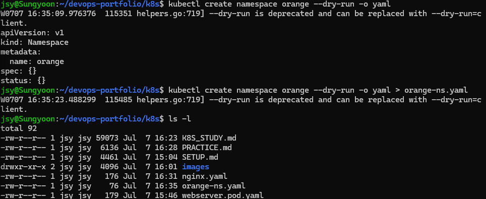

`--dry-run`만 쓰면 deprecated 경고가 뜬다 — 지금은 `--dry-run=client`가 정식 표기 (강의 시절 문법과의 차이).

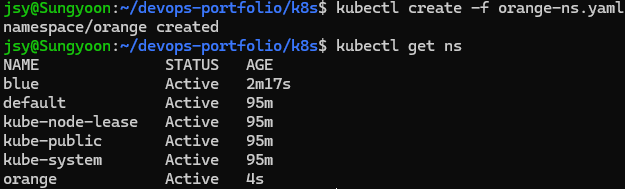

`kubectl get ns` 하면 기본 4개(default·kube-system·kube-public·kube-node-lease) 옆에 blue·orange가 나란히 선다.

### 매번 -n 붙이기 귀찮으면 — context

특정 ns에서 계속 작업할 거면 그 ns를 기본값으로 하는 context를 만들 수 있다:

```bash
kubectl config set-context blue@minikube --cluster=minikube --user=minikube --namespace=blue
kubectl config view          # contexts에 blue@minikube 추가된 것 확인
```

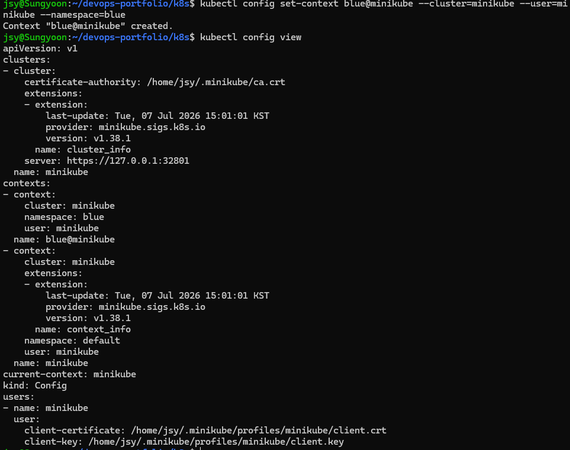
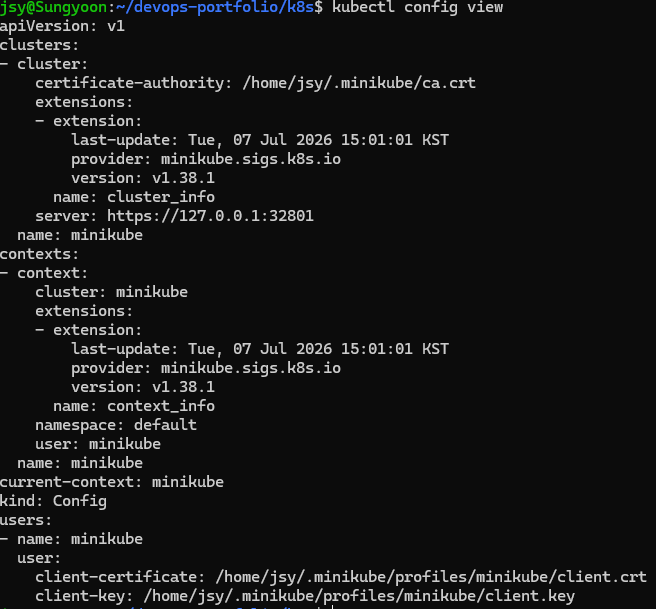

config view로 보면 kubeconfig의 3층 구조가 보인다 — **clusters**(접속할 apiserver 주소·인증서) / **users**(내 인증 정보) / **contexts**(cluster + user + namespace 조합). context = "어느 클러스터에, 누구로, 어느 ns를 기본으로" 세트.

```bash
kubectl config current-context               # minikube
kubectl config use-context blue@minikube     # 전환
kubectl config current-context               # blue@minikube — 이제 -n 없이도 blue가 기본
```

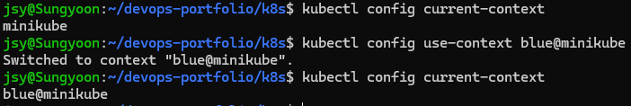

### 다른 namespace에 파드 만들기

```bash
kubectl create -f nginx.yaml -n blue
kubectl get pods -n blue
```

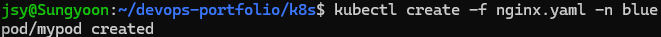
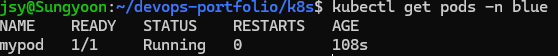

### namespace에 따라 조회 결과가 완전히 달라진다

```bash
kubectl get pods -n default
kubectl get pods -n kube-system
kubectl get pods --all-namespaces    # = -A
```

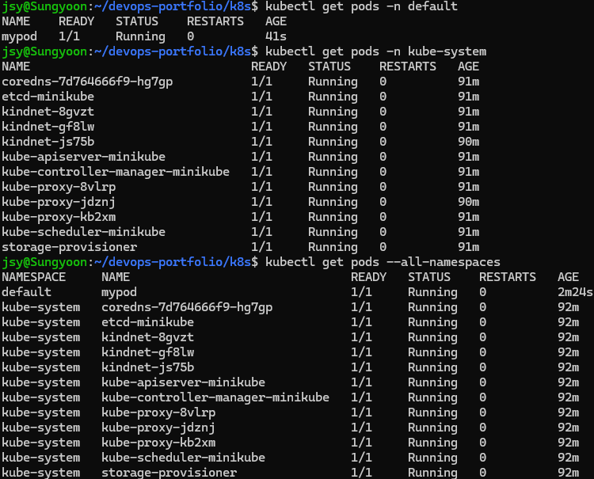

kube-system을 보면서 얻어걸린 확인 하나 — **kindnet(CNI)과 kube-proxy가 정확히 3개씩** 있다. 노드가 3개니까. "모든 노드에 하나씩"은 6장에서 배울 DaemonSet의 동작이고, control plane 4종(etcd·apiserver·controller-manager·scheduler)은 이름 뒤에 노드명(-minikube)이 붙은 채 마스터에만 1개씩 있다.

### ns 삭제 — 안의 것들도 같이 죽는다

```bash
kubectl delete ns orange
```

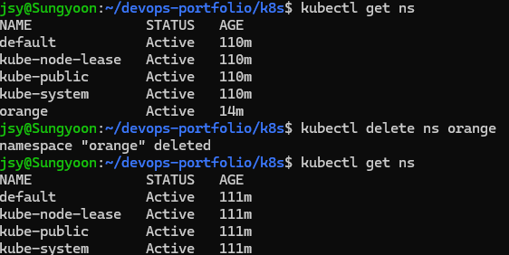

ns를 지우면 그 안의 리소스가 통째로 같이 삭제된다. 실습 후 blue도 정리하고 context는 원복:

```bash
kubectl config use-context minikube
```

---

## 7/7 — Pod·Deployment 기본 (5-1강 + 6장 예습)

### 명령형으로 Pod 2개 (nginx, httpd)

```bash
kubectl run nginx-pod --image=nginx --port=80
kubectl run httpd-pod --image=httpd --port=80
kubectl get pods -o wide
```
```
NAME        READY   STATUS    RESTARTS   AGE   IP           NODE
httpd-pod   1/1     Running   0          22s   10.244.1.4   minikube-m02
nginx-pod   1/1     Running   0          22s   10.244.2.6   minikube-m03
```

같은 명령인데 nginx는 m03, httpd는 m02로 갔다 — scheduler가 알아서 분산 배치한다는 걸 눈으로 확인.

`describe`의 Events를 보면 상태 흐름이 그대로 찍힌다: `Scheduled → Pulling → Pulled(19.9초, 이미지 161MB) → Created → Started`. 5장 "Pod 동작 flow"의 그 단계다.

### 클러스터 안에서 curl 확인

WSL에서 파드 IP로 바로 curl은 안 되니(파드 네트워크는 클러스터 내부 전용) 노드 안에서 확인:

```bash
minikube ssh -- curl -s 10.244.2.6 | head -3    # nginx 기본 페이지
minikube ssh -- curl -s 10.244.1.4 | head -3    # httpd 기본 페이지
```

둘 다 각 웹서버의 기본 환영 페이지 HTML이 반환됨.

### index.html 수정 — 수정이 즉시 반영되는지

```bash
kubectl exec nginx-pod -- sh -c 'echo "<h1>7/7 K8s Pod 실습 - 정성윤</h1>" > /usr/share/nginx/html/index.html'
minikube ssh -- curl -s 10.244.2.6
```
```
<h1>7/7 K8s Pod 실습 - 정성윤</h1>
```

컨테이너 안 파일을 고치면 재시작 없이 바로 반영 — D5에서 nginx html 고치던 것과 같은 원리(파일은 요청마다 새로 읽힘). 다만 파드가 재생성되면 사라지는 임시 수정이라는 것도 같이 기억할 것 (10장 ConfigMap이 정식 해법).

### YAML로 선언형 Pod 생성

[practice-pod.yaml](practice-pod.yaml)로:

```bash
kubectl apply -f practice-pod.yaml
```
```
pod/yaml-pod created
```

명령형(`run`)과 결과는 똑같은 Pod지만, 파일이 남아 재현·리뷰가 가능하다는 차이.

### Deployment — replicas 3 → self-healing → replicas 5

```bash
kubectl create deployment web-deploy --image=nginx --replicas=3
kubectl get deployment,rs,pods -l app=web-deploy -o wide
```
```
NAME                         READY   UP-TO-DATE   AVAILABLE
deployment.apps/web-deploy   3/3     3            3

NAME                                   DESIRED   CURRENT   READY
replicaset.apps/web-deploy-5fcbd96c7   3         3         3

NAME                             STATUS    IP            NODE
web-deploy-5fcbd96c7-lks85       Running   10.244.0.4    minikube
web-deploy-5fcbd96c7-nbc4r       Running   10.244.1.5    minikube-m02
web-deploy-5fcbd96c7-z52xb       Running   10.244.2.8    minikube-m03
```

3개가 마스터·워커1·워커2에 하나씩.

self-healing — 파드 하나를 직접 지워본다:

```bash
kubectl delete pod web-deploy-5fcbd96c7-z52xb
kubectl get pods -l app=web-deploy -o wide
```
```
NAME                          STATUS              AGE   NODE
web-deploy-5fcbd96c7-lks85    Running             52s   minikube
web-deploy-5fcbd96c7-nbc4r    Running             52s   minikube-m02
web-deploy-5fcbd96c7-x9vbm    ContainerCreating   6s    minikube-m03   ← 새로 생긴 것
```

지운 지 몇 초 만에 이름이 다른 새 파드가 채워진다 — ReplicaSet이 "3개 유지"를 계속 감시한다는 증거.

`kubectl edit deployment web-deploy`로 replicas 3→5로 고치면 파드가 5개로 늘어난다. `scale`로도 같은 결과:

```bash
kubectl scale deployment web-deploy --replicas=5
```
```
NAME                          STATUS    NODE
web-deploy-5fcbd96c7-dpvr7    Running   minikube
web-deploy-5fcbd96c7-lks85    Running   minikube
web-deploy-5fcbd96c7-nbc4r    Running   minikube-m02
web-deploy-5fcbd96c7-x9vbm    Running   minikube-m03
web-deploy-5fcbd96c7-xmdfn    Running   minikube-m03
```

`edit`이든 `scale`이든 결국 같은 `spec.replicas` 필드를 바꾸는 것.

### 파드 전체 삭제 — 그런데 Deployment 파드는 되살아난다

```bash
kubectl delete pod --all
kubectl get pods -o wide
```
```
NAME                          STATUS    AGE   NODE
web-deploy-5fcbd96c7-7p7dv    Running   7s    minikube-m02   ← 방금 다시 생성됨
web-deploy-5fcbd96c7-fk4wt    Running   7s    minikube-m03
web-deploy-5fcbd96c7-frtbv    Running   7s    minikube-m03
web-deploy-5fcbd96c7-sbnhs    Running   7s    minikube-m02
web-deploy-5fcbd96c7-vm7vx    Running   7s    minikube
```

독립 파드들은 지운 대로 사라졌는데, Deployment 소속 5개는 삭제하자마자 새 이름으로 전부 재생성됐다. `delete pod`는 파드만 지울 뿐 "5개를 유지하라"는 선언(Deployment)이 살아있기 때문:

```bash
kubectl delete deployment web-deploy    # 컨트롤러째 지워야 진짜로 없어짐
```

핵심 결론: **"파드를 지운다"와 "그 파드를 관리하는 컨트롤러를 지운다"는 다른 일이다.**

---

## 7/7 — Pod 심화: livenessProbe · init · static · 리소스 · 환경변수 (5-2 ~ 5-7강)

yaml 4개를 한 번에 던지고 관찰:

```bash
kubectl apply -f liveness-pod.yaml -f init-pod.yaml -f resource-pod.yaml -f env-pod.yaml
kubectl get pods
```
```
NAME           READY   STATUS              RESTARTS   AGE
env-pod        0/1     ContainerCreating   0          4s
init-pod       0/1     Init:0/1            0          4s      ← init 단계
liveness-pod   0/1     ContainerCreating   0          4s
resource-pod   1/1     Running             0          4s
```

### init container — main보다 먼저, 성공해야 다음

init-pod만 STATUS가 `Init:0/1` — init 컨테이너(sleep 10)가 도는 동안 main(nginx)은 시작 대기. 10초 뒤 Running으로 넘어갔고, init 로그도 남는다:

```bash
kubectl logs init-pod -c wait-something
```
```
init 작업 시작
init 완료
```

### livenessProbe — 일부러 실패시켜 self-healing 보기

[liveness-pod.yaml](liveness-pod.yaml)은 nginx에 없는 경로 `/healthz`를 검사시킨 것. 404 → 연속 3회 실패 → kubelet이 컨테이너 재시작. RESTARTS가 실제로 올라간다:

```bash
kubectl get pod liveness-pod
```
```
NAME           READY   STATUS    RESTARTS      AGE
liveness-pod   1/1     Running   2 (17s ago)   58s
```

describe Events에 이유가 그대로 찍힌다:

```
Normal  Killing  17s (x2 over 37s)  kubelet  Container nginx failed liveness probe, will be restarted
```

파드가 재생성되는 게 아니라 **같은 파드 안에서 컨테이너만** 다시 뜬다(RESTARTS 카운트 증가, 파드 이름·IP 유지). 실무라면 여기서 probe 경로를 앱의 진짜 헬스 엔드포인트로 고치면 끝 — PF2 Go 서버의 `/health`가 정확히 이 자리에 꽂힐 물건.

### 리소스 requests/limits — scheduler의 장부에 기록된다

[resource-pod.yaml](resource-pod.yaml)로 requests(cpu 200m/mem 128Mi)를 준 파드를 만들고, 배치된 노드의 장부를 확인:

```bash
kubectl describe node minikube-m03 | grep -A8 "Allocated resources"
```
```
  Resource           Requests    Limits
  --------           --------    ------
  cpu                300m (2%)   600m (5%)
  memory             178Mi (2%)  306Mi (3%)
```

내가 예약한 200m가 노드 합계에 반영돼 있다(나머지는 kindnet 등 시스템 몫). **실제 사용량이 아니라 예약량** — scheduler는 이 장부를 보고 다음 파드를 어디 둘지 정한다.

### static pod — control plane의 실체

마스터 노드에 들어가 kubelet의 manifests 디렉토리를 직접 확인:

```bash
minikube ssh -- ls /etc/kubernetes/manifests/
```
```
etcd.yaml            kube-controller-manager.yaml
kube-apiserver.yaml  kube-scheduler.yaml
```

이 yaml 4개가 곧 control plane이다. kubelet이 이 디렉토리를 감시하다 직접 띄우는 static pod라서, kube-system 조회에서 이름 뒤에 노드명이 붙는다:

```
etcd-minikube                      1/1   Running
kube-apiserver-minikube            1/1   Running
kube-controller-manager-minikube   1/1   Running
kube-scheduler-minikube            1/1   Running
```

### 환경변수 주입

[env-pod.yaml](env-pod.yaml)로 넣고 컨테이너 안에서 확인:

```bash
kubectl exec env-pod -- env | grep -E "DB_HOST|APP_MODE"
```
```
DB_HOST=pf-db.example.com
APP_MODE=dev
```

PF3에서 `-e SLACK_WEBHOOK_URL`로 주입하던 것의 K8s 문법. 값을 yaml에 직접 박는 건 임시고, 정식으로는 ConfigMap/Secret(10·11장)에서 가져온다.

실습 후 `kubectl delete -f`로 4개 전부 정리, default 네임스페이스 비움 확인.

---

## 7/8 — ReplicationController (6-1강)

### RC 생성과 조회

[rc-nginx.yaml](rc-nginx.yaml)로 생성 — replicas 3, selector `app: webui`, 템플릿은 nginx:1.14. RC는 selector가 ReplicaSet처럼 matchLabels 블록이 아니라 등호 매칭 한 줄이라는 것도 yaml에서 확인.

```bash
kubectl create -f rc-nginx.yaml
kubectl get replicationcontrollers   # 풀네임
kubectl get rc                       # 축약형, 같은 결과
```

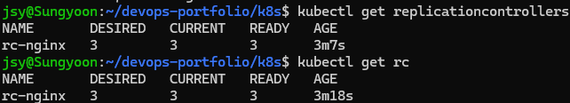

DESIRED 3 / CURRENT 3 / READY 3. describe로 속을 보면 selector·라벨·Pod Template이 그대로 보이고, Events에 replication-controller가 파드 3개를 SuccessfulCreate한 기록이 남는다:

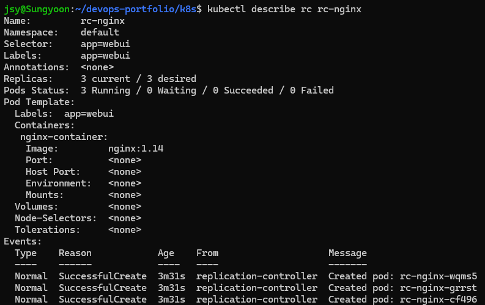

파드 이름이 `rc-nginx-wqms5`처럼 랜덤 suffix로 만들어지는 것 확인 — 템플릿의 `name: nginx-pod`는 무시되고 RC 이름 + 랜덤 문자열이 붙는다.

### 라벨 실험, edit vs scale, 삭제 후 보충

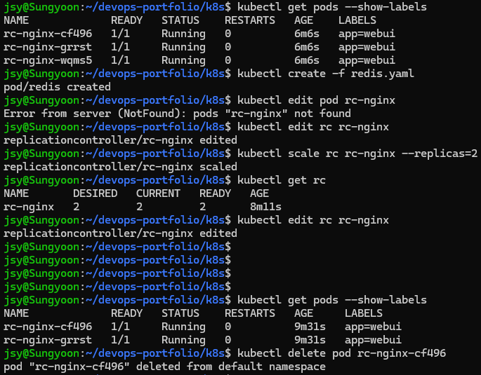

순서대로 한 것:

```bash
kubectl get pods --show-labels        # 3개 전부 app=webui
kubectl create -f redis.yaml          # 일부러 app=webui 라벨을 단 redis 파드 투입
kubectl edit pod rc-nginx             # → NotFound 에러
kubectl edit rc rc-nginx              # 실행 중인 RC 스펙을 vi로 직접 수정
kubectl scale rc rc-nginx --replicas=2
kubectl get rc                        # DESIRED 2 / CURRENT 2 / READY 2
kubectl delete pod rc-nginx-cf496     # 파드 하나 삭제 → RC가 즉시 새로 보충
```

여기서 얻은 것 세 가지.

**RC는 라벨만 본다.** redis 파드에 같은 `app=webui`를 달아 투입하면 RC 입장에선 관리 대상이 4개가 된 것 — 초과분을 바로 죽인다. redis라는 이름도, 이미지가 다르다는 것도 안 본다. 이후 `get pods --show-labels`에 redis가 없는 이유.

**`edit pod rc-nginx`는 NotFound.** rc-nginx는 RC 이름이지 파드 이름이 아니다. 파드는 랜덤 suffix가 붙은 이름으로 존재하니까, 고치려면 컨트롤러(`edit rc rc-nginx`)를 고쳐야 한다.

**edit vs scale.** edit는 스펙 전체(이미지 버전 등)를 열어서 고치는 범용 수단, scale은 replicas 숫자 하나만 바꾸는 단축 명령. 결과는 같은 원리 — RC가 desired와 current의 차이를 보고 맞춘다. 마지막에 파드를 지워도 RC가 desired 2를 유지하려고 즉시 보충하는 것까지 확인(어제 Deployment self-healing과 같은 동작, 이번엔 1세대 컨트롤러로).

### ReplicaSet — 같은 내용을 2세대 문법으로

[rs-nginx.yaml](rs-nginx.yaml)은 rc-nginx.yaml과 완전히 같은 스펙(replicas 3, app=webui, nginx:1.14)이고 다른 건 문법뿐 — apiVersion이 `apps/v1`, selector가 `matchLabels` 블록. 생성·조회·scale·삭제 전부 RC와 똑같이 동작한다 (`kubectl get rs`).

### RC와 RS를 같은 라벨로 동시에 — 서로 안 싸운다?

RS 파드 3개가 떠 있는 상태에서 같은 `app=webui` selector의 RC를 만들어봤다:

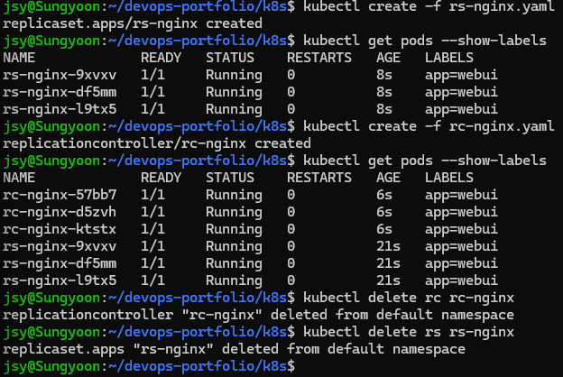

예상은 "라벨만 보니까 둘이 싸우겠지"였는데, 결과는 **6개 공존** — RS 것 3개(21s) + RC 것 3개(6s)가 전부 Running. redis는 초과분이라고 바로 죽였으면서 왜 서로의 파드는 안 건드리나.

답은 **ownerReferences**. 컨트롤러가 만든 파드에는 metadata에 소유자 표시가 박힌다(`kubectl get pod <이름> -o yaml`에서 `ownerReferences` 확인 가능). 컨트롤러는 selector에 맞는 파드 중 **자기 소유거나 주인이 없는(고아) 파드만** 관리 대상으로 센다. 그래서:

- redis 파드 = 라벨은 맞고 주인은 없음 → RC가 입양 → desired 초과 → 정리됨
- RS 소속 파드 = 라벨은 맞지만 주인이 RS → RC는 자기 것만 3개 새로 만들고 남의 것은 무시

"컨트롤러는 라벨만 본다"의 정확한 버전: **라벨이 맞으면서 주인이 없는 파드만 입양한다.**

마무리는 컨트롤러째 삭제 — 소속 파드도 같이 사라진다:

```bash
kubectl delete rc rc-nginx
kubectl delete rs rs-nginx
```

### Deployment — 3층 구조 눈으로 확인 (6-2강)

[deploy-nginx.yaml](deploy-nginx.yaml)은 rs-nginx.yaml에서 kind만 Deployment로 바꾼 것. 생성하고 세 층을 한 번에 조회:

```bash
kubectl create -f deploy-nginx.yaml
kubectl get deploy,rs,rc      # rc는 없음 — 빈 결과
kubectl get deploy,rs,pod
```

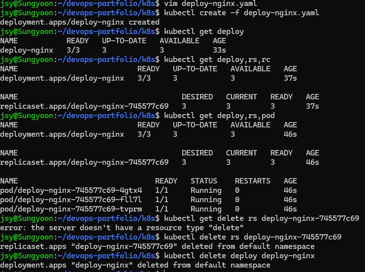

**Deployment는 파드를 직접 만들지 않는다.** deploy-nginx가 ReplicaSet `deploy-nginx-745577c69`를 만들고, RS가 파드 3개를 만든다. 파드 이름을 뜯어보면 구조가 그대로 보인다: `deploy-nginx`(Deployment) + `745577c69`(RS 해시) + `4gtx4`(랜덤). 이 RS 해시가 나중에 롤링업데이트에서 버전 구분자 역할을 한다.

곁다리 오타 교훈: `kubectl get delete rs ...`라고 치면 `the server doesn't have a resource type "delete"` — kubectl은 동사(get) 다음 인자를 리소스 타입으로 해석한다.

정리는 두 단계로 해봤다. `delete rs`로 RS만 지워도 Deployment가 살아 있는 한 새 RS를 만들어 되살린다(파드 지우면 RS가 보충하던 것과 같은 원리, 한 층 위). 그래서 진짜 삭제는 `delete deploy`.

### 롤링업데이트 — set image, rollout history/status/pause (6-2강 계속)

[deployment-exam1.yaml](deployment-exam1.yaml)로 app-deploy 생성(nginx:1.14, 컨테이너 이름 web). 처음 만들 땐 서버가 이런 에러를 뱉었다:

```
strict decoding error: unknown field "spec.template.spec.containers[0].ports[0].contaierPort"
```

containerPort에서 n이 빠진 오타. `unknown field "경로"`는 따옴표 안이 곧 범인 위치라 에러 메시지만 제대로 읽으면 바로 잡힌다.

**--record와 CHANGE-CAUSE.** 그냥 만들면 rollout history의 CHANGE-CAUSE가 `<none>`이다. 지우고 `--record`를 붙여 다시 만들면 어떤 명령으로 이 리비전이 생겼는지가 남는다:

```bash
kubectl create -f deployment-exam1.yaml --record
kubectl set image deployment app-deploy web=nginx:1.15 --record
kubectl rollout history deployment app-deploy
```
```
REVISION  CHANGE-CAUSE
1         kubectl create --filename=deployment-exam1.yaml --record=true
2         kubectl set image deployment app-deploy web=nginx:1.15 --record=true
```

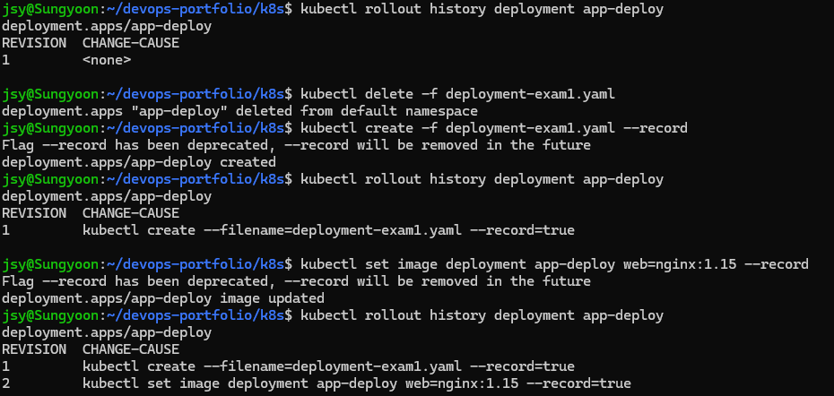

`--record`는 deprecated 경고가 뜨지만 아직 동작한다(부록A 참고 — 요즘은 change-cause annotation을 직접 다는 쪽).

**롤링업데이트가 실제로 굴러가는 모습.** 1.15→1.16으로 한 번 더 올리면서 `rollout status`로 지켜봤다:

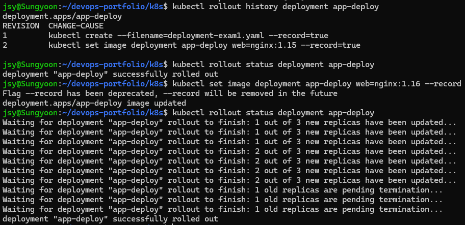

```
1 out of 3 new replicas have been updated...
2 out of 3 new replicas have been updated...
1 old replicas are pending termination...
deployment "app-deploy" successfully rolled out
```

새 버전 파드를 하나 만들고 → 준비되면 옛 파드 하나 죽이고 → 반복. 전체가 한 번에 내려가는 구간이 없어서 서비스가 안 끊긴다. 이게 Deployment가 RS를 하나 더 만들어서 하는 일 — 새 RS(1.16)를 0→3으로 키우고 옛 RS(1.15)를 3→0으로 줄이는 과정이다.

**pause/resume**도 해봤다(스크린샷은 안 남김): `kubectl rollout pause deployment app-deploy` 상태에서는 set image를 해도 롤아웃이 시작되지 않고, `rollout resume` 하는 순간 쌓인 변경이 반영된다. 여러 변경을 모아서 한 번의 롤아웃으로 내보낼 때 쓰는 것.

### 롤링업데이트 전략 필드 — maxSurge · maxUnavailable (6-3강, 강의 정리)

이건 직접 돌린 건 아니고 강의 내용 정리. 위에서 set image로 굴렸던 롤링업데이트가 "어떤 규칙으로" 교체되는지를 yaml에 명시하는 부분이다. [deployment-exam2.yaml](deployment-exam2.yaml)로 만들어둠:

```yaml
spec:
  progressDeadlineSeconds: 600
  revisionHistoryLimit: 10
  strategy:
    type: RollingUpdate
    rollingUpdate:
      maxSurge: 25%
      maxUnavailable: 25%
```

핵심은 strategy 두 필드. replicas 3 기준으로 계산하면:

- **maxSurge 25%**: 교체 중 desired를 초과해서 만들 수 있는 최대치. 3×0.25=0.75 → **올림 1** → 파드가 순간 최대 4개까지 뜰 수 있다
- **maxUnavailable 25%**: 교체 중 동시에 죽어 있어도 되는 최대치. 3×0.25=0.75 → **내림 0** → 가용 파드가 3개 밑으로 절대 안 내려간다

그러니까 25%/25% 기본값에서 replicas 3이면 "새 것 1개 추가(4개) → 준비되면 옛 것 1개 제거(3개) → 반복"이 된다. 위 rollout status 화면에서 정확히 하나씩 교체됐던 이유가 이 계산. maxSurge를 키우면 교체가 빨라지는 대신 순간 자원을 더 먹고, maxUnavailable을 키우면 자원은 아끼지만 가용량이 출렁인다.

나머지 필드:

- **revisionHistoryLimit 10**: 옛 ReplicaSet을 10개까지 보관 — rollout undo로 돌아갈 수 있는 범위
- **progressDeadlineSeconds 600**: 600초 안에 롤아웃이 진전 없으면 실패로 판정
- **annotations의 kubernetes.io/change-cause**: deprecated된 --record의 정식 대체. yaml에 박아두면 apply할 때마다 rollout history의 CHANGE-CAUSE에 이 문구가 남는다 (버전 올릴 때 image와 change-cause를 같이 고쳐서 apply)

강의 흐름은 apply → vi로 image 1.15 + change-cause 수정 → 재apply(선언형 업데이트) → `rollout history` → `rollout undo`(롤백). undo는 아직 안 해봤으니 이 yaml로 직접 돌려볼 것.

### 롤백 — undo · --to-revision, 그리고 annotate 방식 change-cause (6-3강)

deployment-exam1.yaml로 리비전 3개(1.14→1.15→1.16, 전부 --record)를 다시 쌓아놓고 롤백을 굴려봤다.

**undo는 "직전"으로.** 1.16에서 `rollout undo` 하면 1.15로 돌아간다:

```bash
kubectl rollout undo deployment app-deploy
kubectl rollout history deployment app-deploy
```
```
REVISION  CHANGE-CAUSE
1         kubectl create --filename=deployment-exam1.yaml --record=true
3         kubectl set image deployment app-deploy web=nginx:1.16 --record=true
4         kubectl set image deployment app-deploy web=nginx:1.15 --record=true
```

리비전 2가 사라지고 4로 재등장 — **돌아간 리비전은 번호를 재사용하지 않고 맨 뒤 번호를 새로 받는다.**

**특정 리비전으로 가려면 --to-revision.** 처음(1.14)으로:

```bash
kubectl rollout undo deployment app-deploy --to-revision=1
```
```
REVISION  CHANGE-CAUSE
3         kubectl set image deployment app-deploy web=nginx:1.16 --record=true
4         kubectl set image deployment app-deploy web=nginx:1.15 --record=true
5         kubectl create --filename=deployment-exam1.yaml --record=true
```

이미지 확인하면 nginx:1.14. 리비전 1이 5번으로 옮겨간 것도 같은 규칙.

**annotate 방식 change-cause — 그리고 함정 하나.** --record 없이 1.17로 올리고 history를 봤더니:

```
REVISION  CHANGE-CAUSE
5         kubectl create --filename=deployment-exam1.yaml --record=true
6         kubectl create --filename=deployment-exam1.yaml --record=true
```

리비전 6은 set image로 만든 건데 CHANGE-CAUSE가 create라고 거짓말을 한다. change-cause는 Deployment 오브젝트에 붙은 annotation이 새 리비전에 **그대로 복사**되는 구조라서, 갱신 없이 새 롤아웃을 하면 옛 문구를 물려받기 때문. 그래서 annotate로 제대로 박아준다:

```bash
kubectl annotate deployment app-deploy kubernetes.io/change-cause="nginx 1.17로 업데이트 - annotate 방식"
```
```
REVISION  CHANGE-CAUSE
6         nginx 1.17로 업데이트 - annotate 방식
```

정리하면 — --record는 deprecated고, annotate 방식은 "롤아웃 후 change-cause를 갱신"까지가 한 세트다. 안 그러면 history가 거짓말한다.

실습 후 app-deploy 삭제, minikube stop으로 마감.

## 7/16 — DaemonSet 실물 확인 · Job · CronJob (6장 마무리)

### DaemonSet — 새로 만들 필요 없이 이미 돌고 있다

DaemonSet은 "노드마다 1개씩"이 전부라서, 만들어보기 전에 클러스터에 이미 있는 실물부터 확인했다:

```bash
kubectl get daemonset -n kube-system
kubectl get pods -n kube-system -o wide --no-headers | grep -e kindnet -e kube-proxy
```
```
NAME         DESIRED   CURRENT   READY   UP-TO-DATE   AVAILABLE   NODE SELECTOR
kindnet      3         3         3       3            3           <none>
kube-proxy   3         3         3       3            3           kubernetes.io/os=linux
```

kindnet(CNI)과 kube-proxy가 둘 다 DaemonSet이고, DESIRED가 replicas 설정값이 아니라 **노드 수 3**이다. -o wide로 보면 파드가 minikube·m02·m03에 정확히 1개씩 — RC/RS/Deployment가 "총 몇 개"를 보장한다면 DaemonSet은 "어느 노드에나 있음"을 보장한다. 그래서 spec에 replicas 필드 자체가 없다. 네트워크 에이전트·로그 수집기·모니터링 에이전트가 전부 이 패턴인 이유.

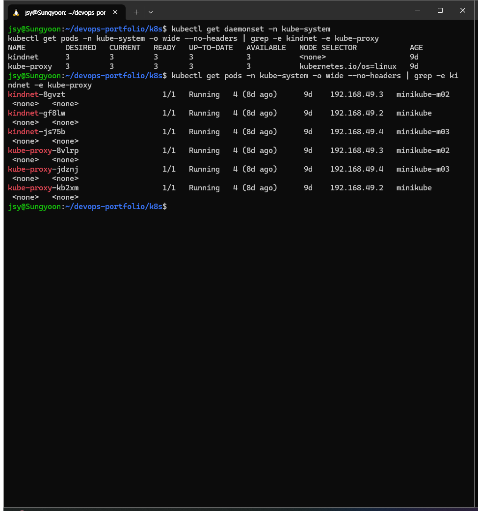

### Job — 끝나는 게 정상인 워크로드

지금까지의 컨트롤러는 전부 "계속 떠 있게"였는데 Job은 반대로 "완료까지"를 보장한다. job-hello.yaml:

```yaml
apiVersion: batch/v1
kind: Job
metadata:
  name: job-hello
spec:
  backoffLimit: 2
  template:
    spec:
      containers:
      - name: hello
        image: busybox:1.36
        command: ["sh", "-c", "echo hello from job; sleep 15"]
      restartPolicy: Never
```

apply 직후 Running 0/1 → 15초 뒤:

```
NAME                  STATUS     COMPLETIONS   DURATION   AGE
job.batch/job-hello   Complete   1/1           23s        34s

NAME                  READY   STATUS      RESTARTS   AGE
pod/job-hello-5psj6   0/1     Completed   0          34s
```

관찰 포인트 셋. 파드가 끝나도 **삭제되지 않고 Completed로 남는다**(로그 조회용 — `kubectl logs job/job-hello`가 잡 이름으로 바로 된다). RESTARTS 0 — Deployment였다면 컨테이너가 끝나는 순간 되살렸을 텐데 Job은 정상 종료로 친다. 그리고 template의 restartPolicy가 **Never/OnFailure만 허용**된다 — Always면 "완료"라는 개념 자체가 성립 안 하니까. backoffLimit 2는 실패 시 재시도 한도.

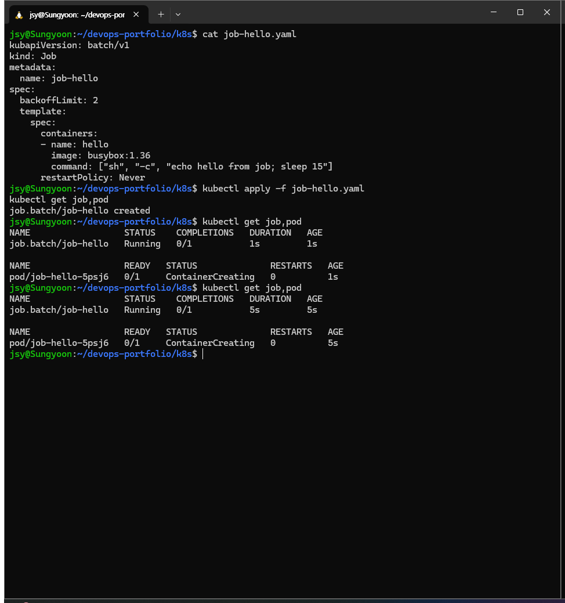
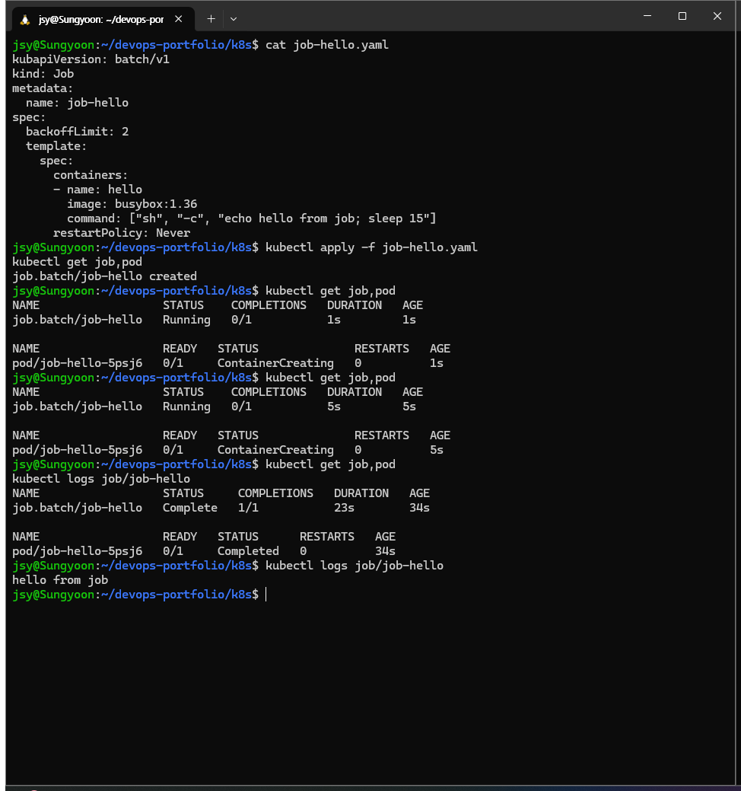

### CronJob — Job 위에 스케줄 한 겹

yaml이 3중 중첩이다: CronJob spec 안에 jobTemplate(Job spec 그대로), 그 안에 template(Pod spec). 컨트롤러가 컨트롤러를 만드는 구조가 yaml에도 그대로 보인다.

```yaml
apiVersion: batch/v1
kind: CronJob
metadata:
  name: cj-date
spec:
  schedule: "*/1 * * * *"
  successfulJobsHistoryLimit: 3
  jobTemplate:
    spec:
      template:
        spec:
          containers:
          - name: date
            image: busybox:1.36
            command: ["sh", "-c", "date"]
          restartPolicy: OnFailure
```

매분 실행으로 걸어두고 2분 기다렸더니:

```
NAME                          STATUS     COMPLETIONS   DURATION   AGE
job.batch/cj-date-29736763    Complete   1/1           7s         94s
job.batch/cj-date-29736764    Complete   1/1           3s         34s
```

로그를 찍어보면 `Thu Jul 16 12:43:04 UTC 2026` / `Thu Jul 16 12:44:00 UTC 2026` — 정확히 1분 간격. Job 이름 뒤에 붙는 숫자 29736763은 랜덤이 아니라 **스케줄 시각의 분 단위 epoch**(×60 하면 그 시각의 unix time). successfulJobsHistoryLimit 3이라 완료된 Job은 3개까지만 남고 오래된 것부터 정리된다.

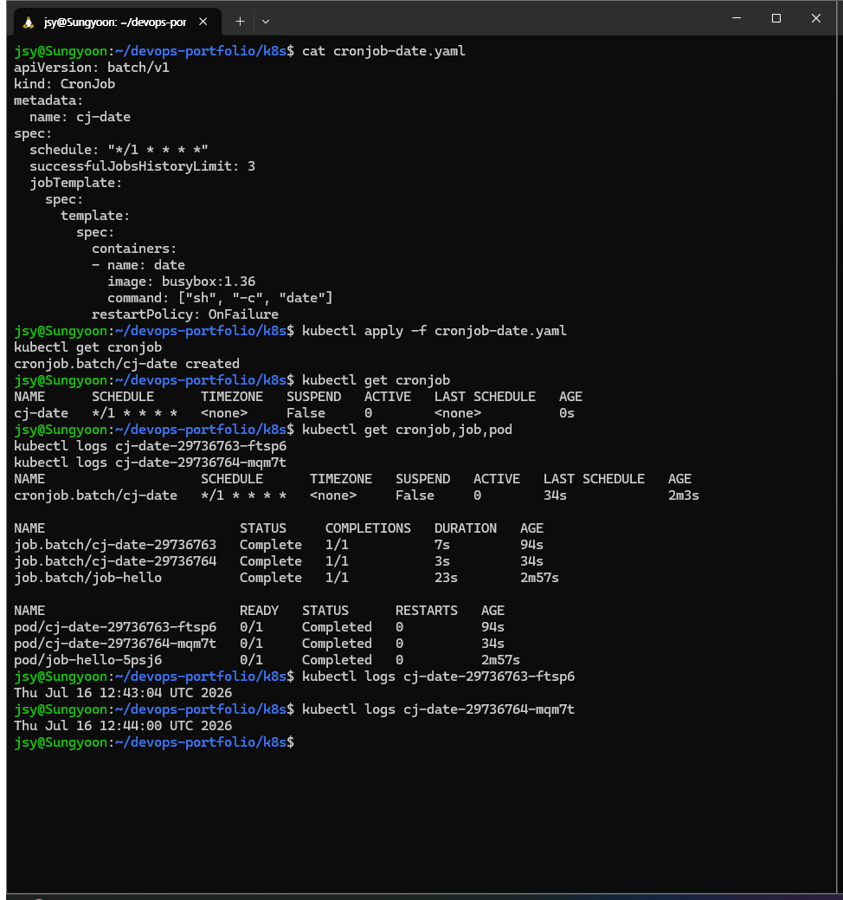

실습 후 `kubectl delete -f`로 둘 다 삭제. 클러스터는 7장 Service 실습 이어가야 하니 그대로 둠.
