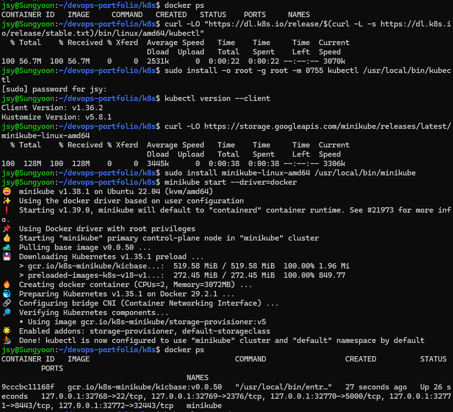
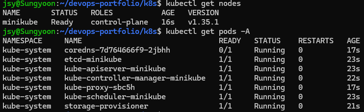

# K8s 실습 환경 구축 (7/6)

K8s 학습 시작(7/7) 전날에 환경만 미리 세팅. WSL2 Ubuntu 22.04 + Docker 위에 minikube 단일 노드 클러스터.

| 구성 | 버전 |
|------|------|
| kubectl | v1.36.2 |
| minikube | v1.38.1 (driver: docker) |
| Kubernetes | v1.35.1 |

## 왜 minikube인가

진짜 K8s 클러스터는 서버 여러 대(컨트롤플레인 + 워커)에 부품을 나눠 설치해야 한다.
minikube는 그 과정을 대신해서 **Docker 컨테이너 하나를 가상 서버 삼아 1노드 클러스터**를 만들어준다.
`docker ps` 치면 `minikube` 컨테이너 한 개가 보이는데, 그 상자 안에서 K8s 전체가 돈다.

kubectl 사용법은 클러스터가 뭐든 동일하다 — minikube로 배운 게 그대로 실무·EKS·CKA로 이어진다.
(스펙트럼: minikube/kind = 로컬 학습용 → kubeadm = 실서버 직접 설치 → EKS = AWS 관리형)

## 설치

```bash
# kubectl — 클러스터에 명령을 쏘는 CLI (리모컨)
curl -LO "https://dl.k8s.io/release/$(curl -L -s https://dl.k8s.io/release/stable.txt)/bin/linux/amd64/kubectl"
sudo install -o root -g root -m 0755 kubectl /usr/local/bin/kubectl

# minikube — 로컬 미니 클러스터 생성 도구
curl -LO https://storage.googleapis.com/minikube/releases/latest/minikube-linux-amd64
sudo install minikube-linux-amd64 /usr/local/bin/minikube

# 클러스터 기동 (첫 실행은 이미지 다운로드로 몇 분 소요, CPU 2개·메모리 3GB 자동 할당)
minikube start --driver=docker
```



## 검증

```bash
kubectl get nodes     # STATUS Ready 확인
kubectl get pods -A   # 시스템 파드 확인
```



kube-system 네임스페이스에 뜬 것들이 K8s의 부품 실물이다:

- `etcd` — 클러스터의 모든 상태가 저장되는 장부
- `kube-apiserver` — kubectl 명령의 수신부. 모든 요청이 여기로
- `kube-scheduler` — 파드를 어느 노드에 둘지 배치 결정
- `kube-controller-manager` — "선언된 상태 = 실제 상태" 상시 유지 (Ansible 멱등성의 24시간 실행 버전)
- `kube-proxy` — 노드의 네트워크 규칙 담당
- `coredns` — 클러스터 내부 DNS (기동 직후 0/1이었다가 곧 1/1)
- `storage-provisioner` — minikube 부가기능, PV 자동 생성용

## 일상 운영

```bash
minikube stop     # 재우기 — 상태 보존, 안 쓸 때 CPU·메모리 절약
minikube start    # 깨우기 — 첫 설치보다 훨씬 빠름
kubectl get nodes # 아침 학습 시작 전 Ready 확인
```

`minikube delete`는 클러스터 통째 삭제라 실수 금지.

## 메모

- 다운로드한 설치 파일(kubectl 59MB, minikube 134MB)은 `sudo install`로 /usr/local/bin에 복사된 뒤 삭제 — 레포에 바이너리 커밋 금지
- 따배쿠 강의는 VM 여러 대로 클러스터를 구성하지만 학습엔 minikube 단일 노드로 충분. 멀티노드는 CKA 준비 때
- 다음: Pod → Deployment → Service 순서로 실습 (7/7~)
