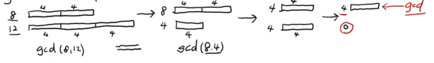

자료구조와 알고리즘

자료 : data => 저장공간(memory) + 연산(읽기, 쓰기, 삽입, 삭제, 탐색) 할 수있어야함.

자료구조 : 저장공간 + 연산

알고리즘 : 데이터 입력을 가지고 유한한 횟수의 연산들을 반복해서 정답 출력

따라서, 자료구조와 알고리즘은 붙어다녀야함.

자료구조의 예
    1) 변수(variable) : a=5 : 쓰기 연산, print(a) : 읽기 연산
    2) 배열(Array, List) : A=[3,-1,5,7] (접근:각 원소의 index 이용하여 읽기, 쓰기, 삽입, 삭제 가능)

gcd(8,12) : 8,12의 최대공약수 = max{1,2,4} = 4

gcd(a,b):
    while a!=0 and b!=0:
        if a>b: a=a-b
        else: b=b-a
    return a+b
==> 시간이 너무 오래걸려
==> 나머지를 구해서 gcd를 구하는방법이 훨씬 빠르다.
