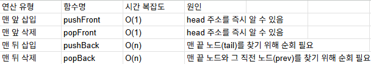

1. 삽입 연산(insertion)
    - pushFront(key) : 리스트의 맨 앞(head)에 새로운 노드를 삽입
        - 새 노드의 next가 기존 head를 가리키게 한뒤, 리스트의 head를 새 노드로 업데이트함.
        - head 위치를 알고 있으므로 O(1) 시간이 걸림
    - pushBack(key) : 리스트의 맨 뒤(tail)에 새로운 노드를 삽입
        - 리스트가 비어있다면 head로 지정하고, 그렇지 않다면 head부터 출발하여 next가 none인 테일(tail)노드를 찾아야함. 
        - 따라서, 노드 개수 n에 비례하는 O(n)시간이 걸림

2. 삭제 연산(deletion)
    - popFront() : 리스트의 맨 앞(head) 노드를 제거하고 그 값을 반환
        - 기존 head를 다음 노드(head.next)로 변경해 주기만 하면 되므로 O(1)시간이 걸림
    - popBack() : 리스트의 맨 뒤(Tail) 노드를 제거하고 그 값을 반환
        - 테일 노드를 지우려면 테일 바로 직전 노드(prev)의 next를 none으로 끊어줘야함
        - prev와 tail을 동시에 찾기 위해 두 개의 포인터를 함께 이동시키는 러닝 테크닉(Running Technique)을 사용하며, 리스트 끝까지 순회하므로 O(n) 시간이 걸림

3. 코드 구현
```python
class Node:
    def __init__(self, key=None):
        self.key = key       # 노드가 저장할 실제 데이터(값)를 상자에 담습니다.
        self.next = None     # 다음 노드가 무엇인지 가리키는 화살표입니다. 초기값은 아무것도 가리키지 않는 None입니다.

class SinglyLinkedList:
    def __init__(self):
        self.head = None     # 리스트의 시작 노드(첫 번째 상자)를 가리킵니다. 처음에는 비어 있으므로 None입니다.
        self.size = 0        # 리스트에 들어있는 노드의 총 개수를 기록하는 카운터입니다.

    def __len__(self):
        return self.size     # len(리스트)를 호출했을 때 현재 저장된 노드 개수(size)를 바로 알려줍니다.

    # ==========================================
    # 1. 맨 앞에 삽입하는 연산 (시간 복잡도: O(1))
    # ==========================================
    def pushFront(self, key):
        new_node = Node(key)       # 1) 삽입할 데이터를 넣어서 새로운 노드(상자)를 하나 만듭니다.
        new_node.next = self.head  # 2) 새 노드의 화살표가 '기존의 첫 번째 노드(head)'를 가리키도록 설정합니다.
        self.head = new_node       # 3) 이제 새 노드가 맨 앞이 되었으므로, 시작점(head)을 새 노드로 변경합니다.
        self.size += 1             # 4) 리스트에 원소가 하나 추가되었으므로 크기를 1 늘립니다.

    # ==========================================
    # 2. 맨 뒤에 삽입하는 연산 (시간 복잡도: O(n))
    # ==========================================
    def pushBack(self, key):
        v = Node(key)              # 1) 맨 뒤에 이어 붙일 새로운 노드를 하나 만듭니다.
        
        if self.size == 0:         # 2-A) 만약 리스트가 완전히 비어있는 상태였다면?
            self.head = v          #      비어있던 리스트의 처음이자 마지막 노드가 되므로 head로 지정합니다.
        else:                      # 2-B) 리스트에 기존 노드가 이미 존재한다면?
            tail = self.head       #      맨 끝 노드(tail)를 찾기 위해 출발점(head)부터 탐색을 시작합니다.
            while tail.next is not None:  # 다음 노드가 존재할 때까지(즉, 맨 끝에 도달할 때까지) 화살표를 타고 이동합니다.
                tail = tail.next   #      tail 변수를 다음 노드로 한 칸씩 옮깁니다.
            tail.next = v          # 3) 루프를 빠져나오면 tail은 진짜 맨 끝 노드입니다. 이 끝 노드의 화살표가 새 노드(v)를 가리키게 합니다.
            
        self.size += 1             # 4) 성공적으로 노드가 추가되었으므로 전체 크기를 1 늘립니다.

    # ==========================================
    # 3. 맨 앞 노드를 삭제하는 연산 (시간 복잡도: O(1))
    # ==========================================
    def popFront(self):
        if self.size == 0:         # 1) 리스트에 노드가 하나도 없다면 지울 것도 없습니다.
            return None            #    지울 수 없으므로 아무것도 없다는 의미의 None을 반환합니다.
        
        x = self.head              # 2) 삭제할 타겟인 '현재 첫 번째 노드(head)'를 나중에 메모리 해제하기 위해 변수 x에 임시로 잡아둡니다.
        key = x.key                # 3) 지워지는 노드가 가지고 있던 실제 데이터 값을 미리 백업해 둡니다. (리턴해주기 위함)
        self.head = x.next         # 4) 시작점(head)을 첫 번째 노드의 '다음 노드(x.next)'로 한 칸 옮겨서, 첫 노드를 리스트에서 제외합니다.
        del x                      # 5) 리스트에서 떨어져 나간 기존 첫 번째 노드(x)의 객체를 메모리에서 완전히 완전히 완전히 삭제합니다.
        self.size -= 1             # 6) 원소가 하나 줄었으므로 크기를 1 감소시킵니다.
        return key                 # 7) 삭제된 노드에 들어있던 데이터(값)를 최종 반환합니다.

    # ==========================================
    # 4. 맨 뒤 노드를 삭제하는 연산 (시간 복잡도: O(n))
    # ==========================================
    def popBack(self):
        if self.size == 0:         # 1) 리스트가 비어있다면 지울 맨 뒤 노드도 존재하지 않습니다.
            return None            #    삭제가 불가능하므로 None을 반환합니다.
        
        prev = None                # 2) 맨 끝 노드를 지우려면 '그 직전 노드'의 연결을 끊어야 하므로, 직전 노드를 기억할 변수를 만듭니다.
        tail = self.head           # 3) 맨 끝 노드를 추적하기 위해 시작점(head)부터 탐색할 변수 tail을 둡니다.
        
        while tail.next is not None:  # 4) tail의 다음 노드가 없을 때까지(즉, 맨 뒤 노드를 만날 때까지) 리스트를 훑어 내려갑니다.
            prev = tail            #    한 칸 전진하기 직전에, 현재 tail의 위치를 직전 노드(prev)로 저장해 둡니다.
            tail = tail.next       #    tail은 다음 노드로 한 칸 전진합니다. (루프가 끝나면 prev는 뒤에서 두 번째, tail은 맨 끝 노드가 됨)
            
        key = tail.key             # 5) 삭제될 맨 끝 노드(tail)의 데이터 값을 미리 백업해 둡니다.
        
        if self.size == 1:         # 6-A) 만약 리스트에 노드가 딱 1개밖에 없어서 그 노드가 head이자 tail이었던 상황이라면?
            self.head = None       #      그 유일한 노드가 지워지므로 리스트는 완전히 비게 됩니다 (head를 None으로 변경).
        else:                      # 6-B) 리스트에 노드가 여러 개 있었다면?
            prev.next = None       #      맨 끝 노드가 사라지므로, 뒤에서 두 번째였던 노드(prev)의 다음 화살표를 None으로 만들어 새로운 테일로 삼습니다.
            
        del tail                   # 7) 리스트에서 끊어낸 진짜 맨 끝 노드(tail) 객체를 메모리에서 완전히 삭제합니다.
        self.size -= 1             # 8) 원소가 하나 줄었으므로 크기를 1 감소시킵니다.
        return key                 # 9) 삭제된 맨 끝 노드에 들어있던 데이터(값)를 최종 반환합니다.
```


4. 연산별 시간 복잡도 정리

- 

* 한방향 연결리스트는 뒤쪽 연산(Back)을 할때 앞쪽에서부터 계속 링크를 타고 찾아가야 해서 비효율적이라는 단점 존재
* 이를 해결하기 위해 양방향 연결리스트 
