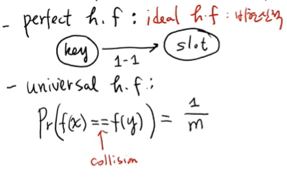

---

# 📑 강의 자료: 해시 테이블(Hash Table)의 이해와 해시 함수

## 1. 해시 테이블 개요
해시 테이블은 매우 강력하고 실제 현업에서도 널리 사용되는 자료구조입니다.

*   **주요 목적**: 데이터의 **삽입, 삭제, 탐색**을 매우 빠르게 수행하는 것입니다.
*   **성능**: 평균적으로 **$O(1)$(상수 시간)** 내에 이러한 기본 연산들이 가능합니다.
*   **실제 사례**: 파이썬의 **사전(Dictionary, `dict`)** 자료구조가 바로 이 해시 테이블을 기반으로 구현되어 있습니다.

## 2. 핵심 개념: 키(Key)와 밸류(Value)
데이터는 항상 '키'와 '밸류'의 쌍으로 저장됩니다.

*   **키(Key)**: 아이템을 구별하는 고유한 ID입니다 (예: 학번, 단어). 중복되지 않는 고유한 값을 가져야 합니다.
*   **밸류(Value)**: 키와 연관된 실제 데이터입니다 (예: 학생 이름, 단어의 뜻, 연락처 등).
*   **리스트와의 비교**: 일반 리스트에 데이터를 순차적으로 저장하면 탐색 시 $O(n)$의 시간이 걸리지만, 해시 테이블은 이를 $O(1)$로 단축시킵니다.

## 3. 해시 테이블의 작동 원리
데이터를 어디에 저장할지 결정하기 위해 **해시 함수**를 사용합니다.

1.  **해시 테이블(Hash Table)**: 데이터가 저장되는 공간으로, 각각의 저장 칸을 **슬롯(Slot)**이라고 부릅니다.
2.  **해시 함수(Hash Function)**: 키 값을 입력받아 해당 데이터가 저장될 **인덱스(주소)**를 계산해 주는 함수입니다.
3.  **저장 방식**: `인덱스 = 해시_함수(키)` 공식을 통해 계산된 위치에 데이터를 즉시 저장하거나 찾아냅니다.

## 4. 해시 함수(Hash Function)

### 4.1 나누기 방법 (Division Method)
가장 단순하고 대표적인 방법입니다.
*   **계산식**: `f(k) = k % m` (k는 키 값, m은 해시 테이블의 크기).
*   **원리**: 키 값을 테이블의 크기로 나눈 **나머지**를 인덱스로 사용합니다. 나머지는 항상 0부터 m-1 사이의 값이므로 테이블의 인덱스 범위 안에 들어오게 됩니다.

### 4.2 충돌(Collision) 문제
*   **정의**: 서로 다른 키 값이 해시 함수를 거쳤을 때 **동일한 인덱스**로 매핑되는 현상입니다.
*   **해결의 필요성**: 이미 데이터가 있는 슬롯에 새로운 데이터를 저장할 수 없으므로, 이를 해결하기 위한 '충돌 해결 방법(Collision Resolution)'이 반드시 필요합니다.
*   **충돌해결방법**: 
    *   Open Addressing (개방 주소법):
        → 충돌 시 다른 빈 슬롯을 찾아 저장
        → Linear Probing: 한 칸씩 이동하며 탐색
        → Quadratic Probing: 1, 4, 9칸씩 이동
        → Double Hashing: 두 번째 해시 함수로 간격 결정

    *   Chaining (체이닝):
        → 같은 슬롯에 연결 리스트로 여러 데이터 저장
        → 파이썬 dict가 이 방식 사용
        → 충돌이 많아지면 O(1) → O(n)으로 저하

→ 이 부분이 면접에서 가장 많이 나와

### 4.3 좋은 해시 함수의 조건
해시 테이블의 성능은 해시 함수가 얼마나 좋은지에 달려 있습니다.
1.  **적은 충돌(Less Collision)**: 키 값들을 슬롯에 골고루 분산시켜 충돌 확률을 낮추어야 합니다.
2.  **빠른 계산(Fast Computation)**: 인덱스를 계산하는 과정 자체가 너무 복잡하면 전체 연산 속도가 느려집니다.

## 5. 다양한 해시 함수 종류
키의 특성에 따라 다양한 함수를 선택할 수 있습니다.

*   **숫자형 키**: 나누기(Division), 곱하기(Multiplication), 폴딩(Folding), 중간 제곱(Mid-square) 방식 등.
*   **문자열(String) 키**:
    *   **Additive**: 문자의 아스키 코드를 모두 더하는 방식.
    *   **Rotating**: 비트 이동(Shift) 연산을 섞어 더하는 방식.
*   **이상적인 함수**:
    *   
    *   **Perfect Hash Function**: 충돌이 전혀 발생하지 않는 이상적인 함수 (현실적으로 구현이 매우 어려움).
    *   **Universal Hash Function**: 충돌 확률을 수학적으로 일정 수준(1/m) 이하로 보장하는 함수. (C-Universal로 많이 사용(c/m))

*   Load Factor (적재율) = n / m
        n = 저장된 데이터 수
        m = 해시 테이블 크기

        → Load Factor가 높을수록 충돌 확률 증가
        → 보통 0.7 초과 시 테이블 크기 2배 확장
        → 파이썬 dict도 이 방식으로 자동 확장

*   시간복잡도
| 연산 | 평균 | 최악 |
|------|------|------|
| 탐색 | O(1) | O(n) |
| 삽입 | O(1) | O(n) |
| 삭제 | O(1) | O(n) |

최악 O(n) = 모든 키가 같은 슬롯에 충돌할 때
→ 좋은 해시 함수로 방지
   
## 6. 요약
해시 테이블은 **해시 함수**를 이용해 키를 인덱스로 직접 변환함으로써 탐색 시간을 획기적으로 줄인 자료구조입니다. 효율적인 해시 함수 설계와 충돌 관리가 성능의 핵심입니다.

---
