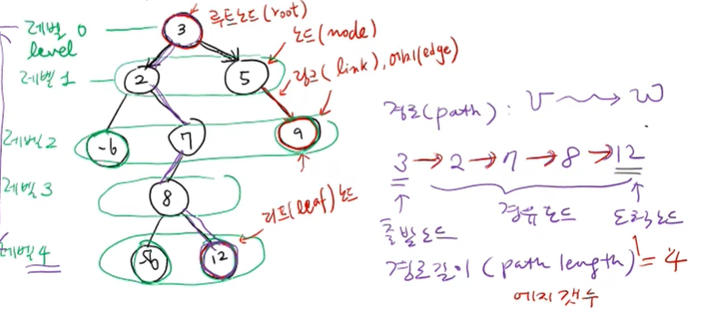
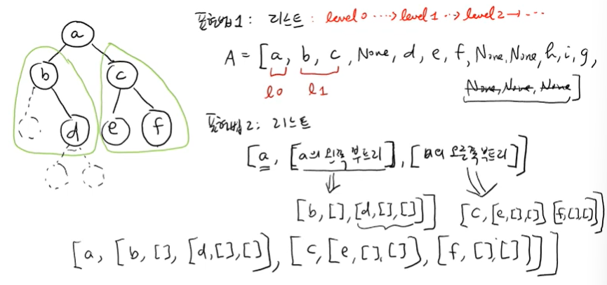

---

# 🌲 강의 자료: 트리(Tree) 구조의 이해

## 1. 트리 구조의 개요
트리는 지금까지 살펴본 배열이나 연결 리스트와 같은 **순차적 자료구조(Linear Data Structure)**와는 다른 계층적 구조를 가집니다. 

*   **계층적 관계**: 부모와 자식 간의 관계를 통해 데이터를 구성하며, 마치 족보와 같은 모양을 띱니다.
*   **연결 리스트와의 관계**: 연결 리스트는 자식 노드가 최대 하나뿐인 트리의 특별한 경우라고 볼 수 있습니다.
*   **이진 트리(Binary Tree)**: 각 노드가 **최대 2개까지의 자식 노드**를 가질 수 있는 트리를 말하며, 가장 널리 쓰이는 형태입니다.

## 2. 주요 용어 정리
트리 구조를 이해하기 위해 사용하는 핵심 용어들은 다음과 같습니다.

*   
*   **노드(Node)**: 데이터를 저장하는 기본 단위입니다.
*   **링크(Link) / 엣지(Edge)**: 노드와 노드를 연결하는 선입니다.
*   **루트 노드(Root Node)**: 트리의 최상단에 위치한 최고의 조상 노드입니다.
*   **리프 노드(Leaf Node)**: 자식 노드가 없는 가장 말단의 노드(잎 노드)입니다.
*   **레벨(Level)**: 루트 노드를 레벨 0으로 하여, 아래로 내려갈수록 1씩 증가하는 세대 단위를 의미합니다.
*   **높이(Height)**: 루트에서 가장 깊은 리프 노드까지 갈 때 통과하는 엣지의 개수이며, 레벨의 수와 일치합니다.
*   **경로(Path) 및 길이**: 특정 노드에서 다른 노드로 가는 길을 경로라 하며, 그 경로에 포함된 엣지의 개수가 경로의 길이입니다.

## 3. 노드 간의 관계
부모-자식 관계에 따라 노드들을 다음과 같이 구분합니다.

*   **부모 노드(Parent Node)**: 특정 노드의 바로 위에 연결된 노드입니다.
*   **자식 노드(Child Node)**: 특정 노드의 바로 아래에 연결된 노드입니다.
*   **형제 노드(Sibling Node)**: 같은 부모를 공유하는 노드들입니다.

## 4. 이진 트리의 저장 방법 (코드 구현)

### 4.1 리스트 표현법 (Level-by-level)
*   **방식**: 루트부터 레벨 순서대로 왼쪽에서 오른쪽으로 노드를 리스트에 담습니다.
*   **특징**: 노드가 없는 자리는 `None`으로 표시하여 인덱스 규칙을 유지합니다.

### 4.2 중첩 리스트 표현법 (Recursive List)
*   **방식**: `[Key, Left_Subtree, Right_Subtree]` 형태로 리스트 내에 또 다른 리스트를 중첩하여 재귀적으로 표현합니다.
*   **특징**: 자식이 없는 경우 빈 리스트 `[]`를 넣어 리프 노드임을 나타냅니다.

### 4.3 노드 클래스 구현 (Class Definition)
*   **방식**: 직접 클래스를 선언하여 객체 지향적으로 구현합니다.
*   **필요 멤버**: 기본적으로 **데이터(`key`)**, 왼쪽 자식 링크(**`left`**), 오른쪽 자식 링크(**`right`**)가 필요하며, 필요에 따라 부모 링크(**`parent`**)를 추가하기도 합니다.

```python
class TreeNode:
    def __init__(self, key):
        self.key = key          # 노드의 값
        self.left = None        # 왼쪽 자식 노드 참조
        self.right = None       # 오른쪽 자식 노드 참조
        self.parent = None      # 부모 노드 참조 (선택 사항)
```

---
