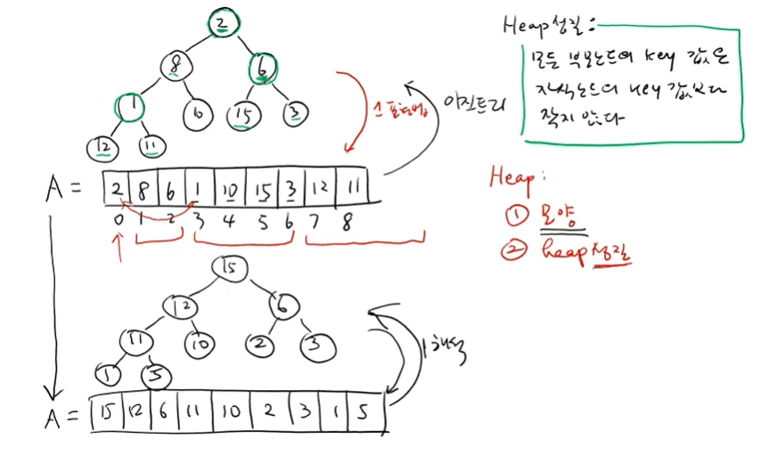

---

# 📑 강의 자료: 힙(Heap)의 정의와 성질

## 1. 이진 트리의 리스트 표현법 
힙을 이해하기 위해서는 이진 트리를 리스트(배열)로 표현하는 '레벨 바이 레벨(Level-by-level)' 방식을 먼저 이해해야 합니다.

*   **표현 방식**: 루트 노드를 시작으로 레벨 0, 레벨 1, 레벨 2 순으로 내려가며, 각 레벨에서는 왼쪽에서 오른쪽 방향으로 노드를 리스트에 저장합니다.
*   **빈 자리 처리**: 특정 위치에 자식 노드가 없는 경우, 리스트에서 해당 자리를 비워두지 않고 `None`(또는 공집합 기호)으로 표시하여 위치 관계를 유지합니다.
*   **장점과 단점**:
    *   **장점**: 노드 간의 부모-자식 관계를 **인덱스 계산만으로 즉시(상수 시간)** 찾아낼 수 있습니다.
    *   **단점**: 트리의 모양이 균형 잡히지 않은 경우, 빈 자리를 위해 불필요한 `None`을 많이 저장해야 하므로 **메모리 낭비**가 발생할 수 있습니다.

## 2. 인덱스를 이용한 노드 탐색 ($O(1)$)
리스트의 $k$번째 인덱스에 저장된 노드의 부모와 자식 위치는 다음과 같은 산술 연산으로 계산할 수 있습니다.

*   **왼쪽 자식 노드**: `2 * k + 1`
*   **오른쪽 자식 노드**: `2 * k + 2`
*   **부모 노드**: `(k - 1) // 2` (정수 나눗셈)

이러한 계산은 모두 **상수 시간($O(1)$)** 내에 이루어지므로, 링크를 따라가지 않고도 원하는 노드에 즉시 접근할 수 있다는 것이 큰 특징입니다.

## 3. 힙(Heap)의 정의
힙은 다음의 두 가지 성질을 모두 만족하는 특별한 이진 트리입니다.

### 3.1 모양 성질 (Shape Property)
*   **완전 이진 트리**에 가까운 모양을 가집니다.
*   마지막 레벨을 제외한 모든 레벨은 노드가 **꽉 차 있어야** 합니다.
*   마지막 레벨은 왼쪽부터 차례대로 노드가 채워져 있어야 합니다.
*   이 성질 덕분에 리스트 내부에 빈 공간(`None`)이 생기지 않아 메모리를 효율적으로 사용합니다.

### 3.2 힙 성질 (Heap Property - Max Heap 기준)
*   **"모든 부모 노드의 키 값은 자식 노드의 키 값보다 작지 않다(크거나 같다)."**
*   즉, `Key(Parent) ≥ Key(Child)`를 항상 만족해야 합니다.
*   이 성질 때문에 힙의 **루트 노드(`A`)에는 항상 전체 데이터 중 가장 큰 값**이 위치하게 됩니다.

## 4. 힙의 주요 연산과 시간 복잡도
힙은 우선순위 큐 등을 구현할 때 매우 효율적으로 사용됩니다.

| 연산 | 설명 | 시간 복잡도 |
| :--- | :--- | :--- |
| **`find_max`** | 루트 노드(`A`)의 값을 반환합니다. | **$O(1)$** |
| **`insert`** | 새로운 값을 힙 성질을 유지하며 추가합니다. | **$O(\log n)$** |
| **`delete_max`** | 가장 큰 값을 제거하고 남은 노드들로 힙을 재구성합니다. | **$O(\log n)$** |
| **`make_heap`** | 일반 리스트를 힙 성질을 만족하도록 재배치합니다. | (추후 설명) |

## 5. 요약
힙은 **모양 성질**을 통해 메모리 낭비를 줄이고, **힙 성질**을 통해 데이터의 최댓값에 매우 빠르게 접근할 수 있도록 설계된 자료구조입니다. 임의의 리스트에 들어있는 값들을 자리를 바꿔가며 힙 성질을 만족하도록 만드는 과정을 **`make_heap`**이라고 부릅니다.

---