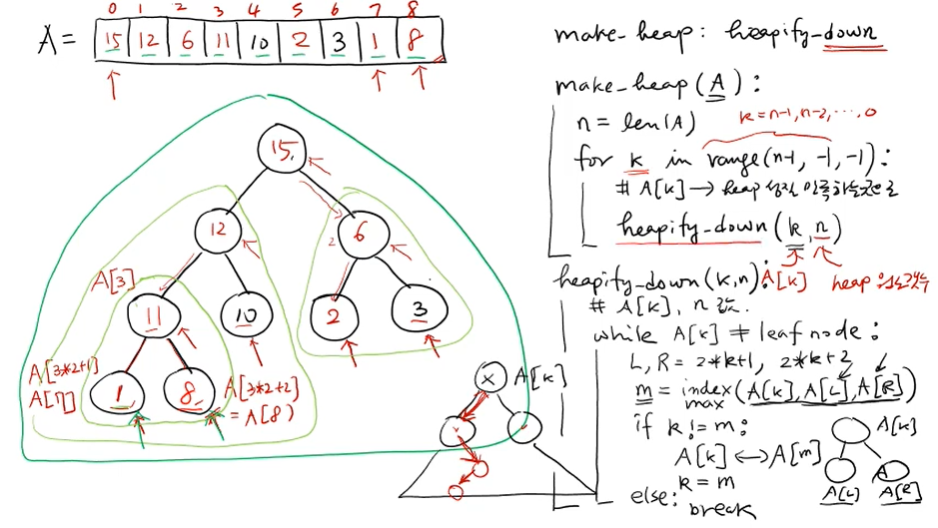
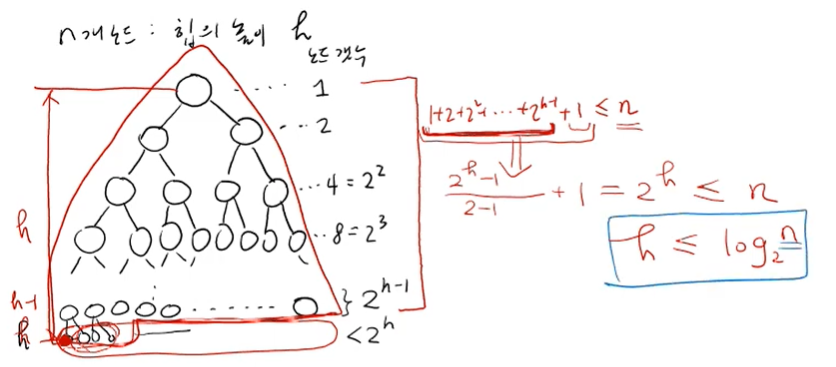

---

# 📑 강의 자료: 힙(Heap)의 생성 - make_heap 연산

## 1. make_heap 연산의 개요
일반적으로 입력으로 주어지는 데이터 리스트는 힙 성질(부모 노드의 값 ≥ 자식 노드의 값)을 만족하지 않습니다. **make_heap**은 이러한 임의의 리스트를 재배치하여 힙 성질을 만족하도록 만드는 과정입니다. 이 과정의 핵심은 각 노드를 아래로 내려보내며 자리를 찾아주는 **heapify_down(히피파이 다운)** 연산을 반복하는 것입니다.

## 2. 핵심 연산: heapify_down (sift-down)
특정 노드 $A[k]$를 자식 노드 방향으로 내려보내며 힙 성질을 만족하는 위치에 정착시키는 연산입니다.

*   **동작 원리**:
    1.  현재 노드($A[k]$)가 리프 노드가 아닐 때까지 반복합니다.
    2.  현재 노드의 왼쪽 자식($2k+1$)과 오른쪽 자식($2k+2$) 중 더 큰 값을 가진 노드를 찾습니다.
    3.  **교환 조건**: 자식 노드 중 최댓값이 현재 노드보다 크다면, 두 노드의 자리를 바꿉니다.
    4.  **종료 조건**: 현재 노드가 자식 노드들보다 크거나 같아서 더 이상 내려갈 필요가 없거나, 리프 노드에 도달하면 멈춥니다.
*   **주의 사항**: 자식 노드 중 **더 큰 노드**와 바꿔야 합니다. 그렇지 않으면 바뀐 후에 다시 자식과 자리를 바꿔야 하는 번거로움이 생기기 때문입니다.

## 3. make_heap 알고리즘 단계
리스트 전체를 힙으로 만들기 위해 리스트의 끝에서부터 루트까지 거꾸로 올라오며 `heapify_down`을 수행합니다.

1.  **시작 위치**: 리스트의 마지막 인덱스($n-1$)부터 시작하여 인덱스 0(루트)까지 거꾸로 순회합니다.
    *   *참고: 실제 구현에서는 자식이 없는 리프 노드들은 이미 힙 성질을 만족하므로 생략하고, 마지막 노드의 부모 노드부터 시작하는 것이 더 효율적입니다.*
2.  **반복 호출**: 각 인덱스 $k$에 대해 `heapify_down(k, n)`을 호출합니다.
3.  **결과**: 모든 노드에 대해 이 과정이 끝나면 리스트 전체가 힙 성질을 만족하게 됩니다.



## 4. 성능 및 시간 복잡도 분석

### 4.1 힙의 높이 (Height)
*   $n$개의 노드를 가진 이진 트리의 높이 $h$는 약 **$\log_2 n$**입니다.
*   각 레벨마다 노드 수가 2배씩 늘어나기 때문에, 루트에서 리프까지의 거리는 노드 수에 로그를 취한 값보다 작거나 같습니다.



### 4.2 연산 시간
*   **heapify_down**: 최악의 경우 루트에서 리프까지 내려가야 하므로 힙의 높이($h$)에 비례하는 시간이 걸립니다. 따라서 시간 복잡도는 **$O(\log n)$**입니다.
*   **make_heap**:
    *   단순하게 분석하면 $n$번의 `heapify_down`을 수행하므로 $O(n \log n)$입니다.
    *   하지만 리프에 가까운 많은 노드들은 조금만 내려가도 되고, 루트 근처의 소수 노드들만 깊게 내려가기 때문에 이를 정밀하게 계산하면 실제 수행 시간은 **$O(n)$(상수 시간)**에 수렴합니다.

## 5. 요약 알고리즘 (Pseudo-code)

```python
def make_heap(A):
    n = len(A)
    # 마지막 인덱스부터 루트(0)까지 거꾸로 진행
    for k in range(n-1, -1, -1):
        heapify_down(k, n)

def heapify_down(k, n):
    while not is_leaf(k):
        # 왼쪽, 오른쪽 자식 중 더 큰 자식의 인덱스 m 찾기
        m = find_max_child_index(k, n)
        if A[k] < A[m]:
            A[k], A[m] = A[m], A[k] # swap
            k = m # 아래 레벨로 이동
        else:
            break # 힙 성질 만족 시 종료
```


---
