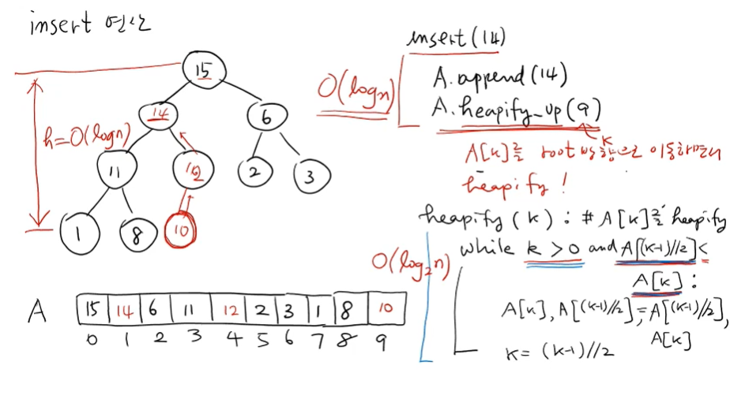
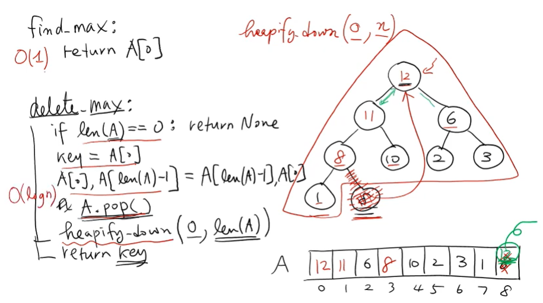
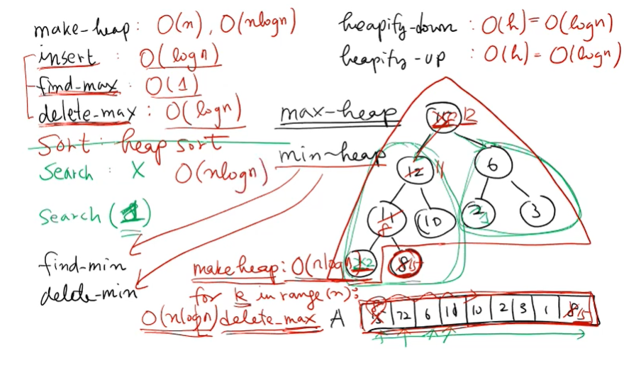

---

# 📑 강의 자료: 힙(Heap)의 연산 - 삽입(Insert)과 삭제(Delete_max)

힙은 단순히 데이터를 저장하는 배열이 아니라, **부모 노드의 값이 자식 노드의 값보다 항상 크거나 같은 '힙 성질'**을 유지해야 하는 자료구조입니다. 

## 1. 삽입(Insert) 연산과 heapify_up

새로운 값을 힙에 추가할 때는 모양 성질과 힙 성질을 모두 만족시켜야 합니다.

### 1.1 삽입 과정
1.  **모양 성질 만족**: 새로운 데이터를 리스트의 맨 마지막(가장 오른쪽 끝 리프 노드 자리)에 `append`하여 추가합니다.
2.  **힙 성질 만족 (heapify_up)**: 새로 추가된 값이 부모 노드보다 클 수 있으므로, 제자리를 찾을 때까지 위로 올려보냅니다.
    *   부모 노드($A[(k-1)//2]$)와 값을 비교합니다.
    *   새로 들어온 값이 부모보다 크다면 서로 **자리를 바꿉니다(Swap)**.
    *   더 큰 부모를 만나거나 루트 노드에 도달할 때까지 이 과정을 반복합니다.

### 1.2 시간 복잡도
*   한 레벨을 올라갈 때마다 상수 시간의 연산(비교 및 교환)이 발생합니다.
*   최악의 경우 리프에서 루트까지 올라가야 하므로, 힙의 높이인 **$O(\log n)$**의 시간이 걸립니다.

---

## 2. 삭제(Delete_max) 및 탐색(Find_max) 연산

### 2.1 최댓값 탐색 (find_max)
*   힙 성질에 의해 전체 데이터 중 가장 큰 값은 항상 **루트 노드($A$)**에 저장되어 있습니다.
*   따라서 단순히 $A$을 반환하면 되며, 시간 복잡도는 **$O(1)$**입니다.

### 2.2 최댓값 삭제 (delete_max)
루트 노드의 값을 제거하고 힙 성질을 재구성하는 과정입니다.
1.  **값 추출**: 루트 노드($A$)의 값을 따로 저장합니다.
2.  **노드 대체**: 힙의 모양을 유지하기 위해, 가장 마지막 노드(리프 노드)를 루트 자리로 옮깁니다.
3.  **구조 재정비 (heapify_down)**: 새로 루트에 올라온 값은 대개 자식들보다 작습니다. 따라서 힙 성질을 만족할 때까지 아래로 내려보냅니다.
    *   자식 노드들 중 **더 큰 값**을 가진 자식과 비교하여 자리를 바꿉니다.
4.  **시간 복잡도**: 루트에서 리프까지 내려가는 연산이므로 **$O(\log n)$**이 소요됩니다.

---

## 3. 힙의 한계: 탐색(Search) 연산의 부재

힙은 특정 키 값을 찾는 `search` 연산에는 적합하지 않습니다.
*   **이유**: 루트 노드보다 작은 값을 찾을 때, 그 값이 왼쪽 서브트리에 있는지 오른쪽 서브트리에 있는지 판단할 근거가 없습니다.
*   **성능**: 결국 모든 노드를 다 확인해야 하므로 $O(n)$이 걸립니다.
*   **결론**: 힙은 **삽입, 최댓값 확인, 최댓값 삭제**라는 세 가지 연산에 특화된 자료구조(우선순위 큐)입니다.

---

## 4. 응용: 힙 정렬(Heap Sort)

힙을 이용하면 $n$개의 데이터를 정렬할 수 있습니다.
1.  **Heapify**: 주어진 $n$개의 데이터를 `make_heap` 연산을 통해 힙으로 만듭니다 ($O(n)$ 또는 $O(n \log n)$).
2.  **반복 삭제**: 루트 노드(최댓값)를 꺼내어 배열의 맨 뒤 노드와 바꾼 뒤, 나머지 노드들에 대해 `heapify_down`을 수행합니다.
3.  이 과정을 $n$번 반복하면 오름차순으로 정렬된 결과를 얻게 됩니다.
4.  **전체 시간 복잡도**: **$O(n \log n)$**.

---

## 💡 요약 및 비교

| 연산 | 시간 복잡도 | 설명 |
| :--- | :--- | :--- |
| **`make_heap`** | $O(n)$ | 무작위 리스트를 힙 구조로 변환 |
| **`insert`** | $O(\log n)$ | 새로운 노드 추가 후 `heapify_up` 실행 |
| **`find_max`** | $O(1)$ | 루트 노드($A$) 반환 |
| **`delete_max`** | $O(\log n)$ | 루트 제거 후 마지막 노드를 올리고 `heapify_down` 실행 |
| **`search`** | $O(n)$ | 힙은 특정 값 탐색에 최적화되어 있지 않음 |
