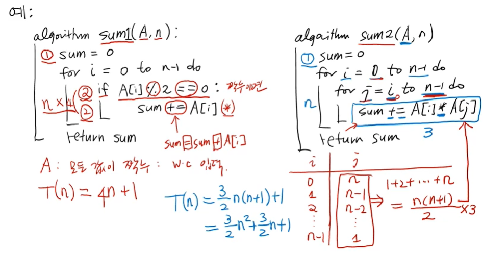

자료구조,알고리즘의 시간복잡도(time complexity)

ArrayMax(A,n):
    currentMax=A[0]
    for i=1 to n-1 do
        if currentMax<A[i]
            currentMax=A[i]
    return currentMax

1) 모든 입력에 대해 기본연산 횟수를 더한 후 평균을 냄:현실적으로 불가능(고려해야할 입력이 너무 많음)
2) 가장 안좋은 입력(worstcase input)에 대한 기본연산 횟수를 측정
    : worstcase time complexity => 어떤 입력에 대해서도 wtc보다 수행시간이 크지 않다 보장

** 알고리즘의 수행시간=최악의 입력에 대한 기본 연산 횟수로 정의 **

위 ArrayMax알고리즘에서 wtc는??
currentMax=A[i] 비교문장이 계속해서 참이되면 wtc
A의 리스트가 오름차순으로 입력이 들어온다면 wtc

T(n) (ArrayMax의 수행시간) = 2n-1
n=6 : T(6)=12-1=11

