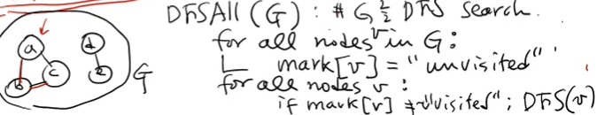

---

# 그래프 탐색의 핵심: DFS (Depth-First Search)

## 1. DFS의 개념 및 탐색 원리

### 1.1 정의
**DFS(깊이 우선 탐색)**는 그래프에서 시작 노드로부터 연결된 경로를 따라 가능한 깊숙이 탐색한 후, 더 이상 갈 곳이 없으면 직전 노드로 돌아와 다른 경로를 탐색하는 알고리즘입니다. 

### 1.2 탐색 메커니즘: 백트래킹(Backtracking)
*   **전진:** 현재 노드에서 방문하지 않은 인접 노드가 있다면 그 방향으로 깊게 들어갑니다.
*   **후퇴(Backtrack):** 더 이상 방문할 인접 노드가 없으면, 나를 호출했던 직전 노드로 돌아가서 탐색을 재개합니다.
*   **비유:** 땅속에 보물이 묻혀 있을 때, 한 구멍을 끝까지 파 내려갔다가 막히면 다시 올라와 다른 옆 구멍을 파는 것과 유사합니다.

### 1.3 BFS(너비 우선 탐색)와의 비교
| 구분 | DFS (깊이 우선 탐색) | BFS (너비 우선 탐색) |
| :--- | :--- | :--- |
| **탐색 방식** | 한 경로를 끝까지 파고듦 | 인접한 모든 노드를 먼저 방문 (층별 탐색) |
| **자료 구조** | **스택(Stack)** 또는 재귀 함수 | **큐(Queue)** |
| **특징** | 지하 깊숙이 내려갔다 올라오기를 반복 | 지하 1층을 다 보고 2층으로 내려가는 식 |

---

## 2. DFS의 구현 방법

### 2.1 재귀(Recursive) 구현 (가장 일반적인 방법)
재귀 함수 호출은 시스템 스택을 사용하므로 코드가 간결합니다.

```python
# DFS 슈도코드 기반 핵심 로직
def dfs(v):
    visited[v] = True        # 현재 노드 방문 마킹
    pre_time[v] = clock++    # 방문 시작 시간 기록
    
    for w in neighbors(v):   # 인접 노드 확인
        if not visited[w]:   # 미방문지라면
            parent[w] = v    # 트리 구조 형성을 위해 부모 기록
            dfs(w)           # 재귀 호출 (깊이 들어감)
            
    post_time[v] = clock++   # 모든 자식 탐색 완료 시간 기록
```

### 2.2 비재귀(Iterative) 구현 (명시적 스택 사용)
스택 자료구조를 직접 활용하여 구현합니다.

*   **스택 구조:** `(부모, 현재노드)` 쌍을 저장하여 방문 경로를 추적합니다.
*   **탐색 순서:** 스택은 LIFO(Last-In-First-Out)이므로, 알파벳 순서대로 방문하고 싶다면 역순으로 스택에 삽입해야 합니다.

---

## 3. DFS의 핵심 지표: 타임스탬프 (Time Stamps)

DFS 과정에서 각 노드에 기록되는 두 가지 시간 정보는 그래프의 구조를 분석하는 데 결정적인 역할을 합니다.

1.  **Pre-time (방문 시작 시간):** 노드에 처음 도달하여 탐색을 시작하는 시점.
2.  **Post-time (탐색 완료 시간):** 해당 노드에서 갈 수 있는 모든 인접 노드 탐색을 마치고 리턴하는 시점.

**💡 면접 포인트:** 이 구간 정보(`[Pre, Post]`)를 통해 노드 간의 포함 관계를 파악할 수 있으며, 이는 **DFS 트리**의 부모-자식 관계를 증명합니다.

---

## 4. DFS 트리와 에지의 종류

DFS를 수행하면 원래 그래프의 에지들 중 일부는 방문에 사용되고 일부는 사용되지 않습니다. 이 과정에서 형성되는 트리를 **DFS 트리**라고 합니다.

*   **Tree Edge:** 실제 방문에 사용된 에지.
*   **Back Edge (역방향 에지):** 이미 방문한 조상 노드로 연결되는 에지.
*   **중요성 (사이클 감지):** 그래프 내에 **Back Edge가 존재한다는 것은 그래프에 사이클(Cycle)이 존재함**을 의미합니다.

---

## 5. DFS의 주요 응용

### 5.1 위상 정렬 (Topological Sort)
*   **대상:** 사이클이 없는 방향 그래프 (**DAG**: Directed Acyclic Graph).
*   **용도:** 공정 순서 계산, 선수 과목 이수 순서 결정 등 선후 관계가 있는 작업 나열.
*   **알고리즘:** 
    1. 모든 노드에 대해 DFS를 수행하며 **Post-time**을 기록합니다.
    2. **Post-time이 큰 순서(역순)**대로 노드를 나열하면 위상 정렬이 완성됩니다.
    *   *이유:* 가장 늦게 끝나는 노드가 전체 공정의 앞부분에 위치해야 하기 때문입니다.

### 5.2 연결 성분 찾기 (Connected Components)

*   `DFS_ALL` 함수를 통해 모든 노드를 순회하며, 한 번의 DFS 호출로 방문되는 노드들을 하나의 묶음(Component)으로 식별할 수 있습니다.

---

## 6. 비재귀적 DFS 구현 (Iterative DFS)
실제 대규모 시스템에서는 재귀 호출의 스택 오버플로를 방지하기 위해 명시적인 **스택(Stack)** 자료구조를 활용한 비재귀적 방식을 선호합니다.

### 6.1 알고리즘 핵심 로직
*   **데이터 구조:** 스택에 `(부모 노드, 현재 노드)` 형태의 튜플을 저장하여 탐색 경로와 트리 구조를 동시에 파악합니다.
*   **방문 처리:** 스택에서 `pop`한 직후에 해당 노드가 이미 방문(`visited`)되었는지 확인하는 것이 필수입니다.

### 6.2 Python 실전 코드 구현
```python
def iterative_dfs(graph, start_node):
    # 초기화: (부모, 현재노드) 쌍을 스택에 저장
    stack = [(None, start_node)]
    visited = set()
    parent = {}
    
    # 방문 순서 기록을 위한 타임스탬프 (선택 사항)
    pre_time = {}
    post_time = {}
    clock = 1

    while stack:
        p, v = stack.pop()  # 스택에서 하나를 꺼냄
        
        if v not in visited:  # 아직 방문하지 않은 노드라면
            visited.add(v)    # 방문 마킹
            parent[v] = p     # 부모 노드 기록
            pre_time[v] = clock
            clock += 1
            
            # 인접 노드 확인 (알파벳 역순으로 푸시해야 알파벳 순으로 방문)
            neighbors = sorted(graph[v], reverse=True)
            for w in neighbors:
                if w not in visited:
                    # (현재 노드 v가 부모가 됨, 방문할 노드 w)
                    stack.append((v, w))
                    
    return parent, pre_time
```
*이 코드는 스택의 LIFO(Last-In-First-Out) 특성을 활용하여 깊이 우선 탐색을 수행합니다.*

---

## 7. DFS 트리와 사이클 감지 (Cycle Detection)

### 7.1 에지의 종류
DFS 탐색 시 그래프의 에지는 크게 두 가지로 분류됩니다.
1.  **트리 에지 (Tree Edge):** 실제 방문에 사용되어 부모-자식 관계를 형성하는 에지입니다.
2.  **역방향 에지 (Back Edge):** 현재 노드에서 이미 방문한 조상(Ancestor) 노드로 연결되는 에지입니다.

### 7.2 사이클의 판별 원리
*   **핵심 원리:** 그래프 내에 **역방향 에지(Back Edge)가 존재한다면, 해당 그래프에는 반드시 사이클이 존재**합니다.
*   이는 교착 상태(Deadlock) 분석이나 네트워크 순환 경로 탐지에 매우 중요하게 활용됩니다.

---

## 8. DAG와 위상 정렬 (Topological Sort)

### 8.1 DAG (Directed Acyclic Graph)
사이클이 없는 방향 그래프를 의미하며, 공정 관리나 선수 과목 이수 체계와 같이 **순서가 있는 작업**을 표현할 때 사용됩니다.

### 8.2 위상 정렬 알고리즘 프로세스
위상 정렬은 노드 간의 선후 관계를 유지하며 일렬로 나열하는 것입니다.

1.  **DFS 수행:** 모든 노드에 대해 DFS를 수행하며 **Post-time(탐색 종료 시간)**을 기록합니다.
2.  **역순 정렬:** **Post-time이 큰 순서대로(내림차순)** 노드를 나열합니다.
    *   **이유:** $A \to B$라는 에지가 있을 때, DFS 상에서 $A$의 탐색은 $B$의 탐색이 완전히 끝난 후에야 종료되므로 $A$의 Post-time이 항상 $B$보다 큽니다.
    *   따라서 가장 큰 Post-time을 가진 노드가 전체 공정의 가장 앞부분에 위치하게 됩니다.

### 8.3 실행 예시 (강의 기반)
*   **데이터 흐름:** $A \to B, A \to C, C \to B$ 등의 관계가 있을 때.
*   **결과 도출:** DFS를 통해 구한 Post-time이 $A(16), C(15), B(13) \dots$ 순이라면, 위상 정렬 결과는 `A -> C -> B ...`가 됩니다.

---

## 9. 구간 구조 (Interval Property)
DFS 탐색에서의 `[Pre-time, Post-time]` 구간은 트리 구조의 포함 관계를 명확히 보여줍니다.
*   노드 $u$가 $v$의 조상이라면, $v$의 구간은 $u$의 구간에 완전히 포함됩니다 ($A$ 안에 $B$가 포함되는 식).
*   이 성질을 이용하면 두 노드 간의 조상-자식 관계를 상숫값 비교만으로 즉시 판별할 수 있습니다.

---

### 💡 기술 면접 핵심 요약
*   **DFS의 비재귀 구현**은 명시적 스택을 사용하며, `pop` 시점에 방문 여부를 체크하는 것이 중복 방문을 막는 핵심입니다.
*   **사이클 감지**는 DFS 도중 **Back Edge**의 발견 여부로 결정됩니다.
*   **위상 정렬**은 DAG에서만 가능하며, **DFS의 Post-time을 내림차순**으로 나열하여 구할 수 있습니다.
## 📝 대기업 기술 면접 예상 Q&A

**Q: DFS와 BFS의 시간 복잡도는 어떻게 되나요?**
**A:** 인접 리스트로 구현할 경우 모든 노드($V$)와 에지($E$)를 한 번씩 확인하므로 **$O(V + E)$**입니다.

**Q: 그래프에서 사이클 존재 여부를 어떻게 확인할 수 있나요?**
**A:** DFS를 수행하는 동안 **Back Edge**가 발생하는지 확인하면 됩니다. 즉, 현재 탐색 중인 경로(Stack에 있거나 아직 Post-time이 기록되지 않은 상태)에 있는 조상 노드를 다시 방문하려고 하면 사이클이 있는 것입니다.

**Q: 위상 정렬에서 DFS가 어떻게 활용되나요?**
**A:** DFS를 수행하여 각 노드의 탐색 완료 시간(Post-time)을 구한 뒤, 이 시간을 기준으로 내림차순 정렬하면 작업의 선후 관계를 유지하는 위상 정렬 결과를 얻을 수 있습니다.

---
