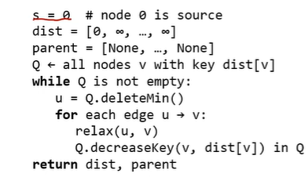

---

# 🏆 최단 경로 알고리즘 완벽 마스터 가이드 (Bellman-Ford & Dijkstra)

최단 경로 문제는 그래프에서 특정 시작 노드(Source)로부터 다른 노드들까지 가는 경로 중 **엣지 가중치의 합이 최소가 되는 경로**를 찾는 최적화 문제입니다.

## 1. 최단 경로의 핵심 수학적 원리

### 1.1 최적 부분 구조 (Optimal Substructure)
최단 경로 알고리즘이 성립할 수 있는 근거입니다. 만약 $s$에서 $i$까지 가는 최단 경로가 중간 노드 $j$를 거쳐간다면, **$s$에서 $j$까지의 경로 역시 반드시 최단 경로여야 합니다**. 만약 $s \to j$에 더 짧은 경로가 있다면 기존의 $s \to i$ 경로는 최단 경로가 아니게 되기 때문입니다.

### 1.2 릴렉스 (Relaxation, 완화) 연산
모든 최단 경로 알고리즘의 기본 단위 연산입니다.
*   **개념:** 현재 알고 있는 목적지 $v$까지의 거리($d[v]$)와 새로운 노드 $u$를 거쳐가는 거리($d[u] + w(u, v)$)를 비교합니다.
*   **수식:** `if d[u] + w(u, v) < d[v]: d[v] = d[u] + w(u, v)`.
*   더 짧은 경로가 발견되면 정보를 업데이트하는 과정입니다.

```python
for i in range (n-1):   # n-1 라운드 거침
    for each edge(u,v) in G: 
        if d[v]>d[u]+w(u,v):
            relax(u,v)
```
**$(n-1) X E$ = $O(nE)$ = $O(n^3)$ time**
---

## 2. 벨만-포드(Bellman-Ford) 알고리즘
가장 직관적이며 모든 엣지를 무차별적으로 확인하는 방식입니다.

### 2.1 동작 원리
1.  모든 노드의 거리를 무한대($\infty$)로, 시작 노드만 0으로 초기화합니다.
2.  **모든 엣지에 대해 릴렉스**를 수행합니다.
3.  이 과정을 **$n-1$번(라운드)** 반복합니다 ($n$: 노드 개수).
4.  **왜 $n-1$번인가?** 사이클이 없는 최단 경로는 최대 $n-1$개의 엣지를 가질 수 있기 때문입니다.

### 2.2 성능 및 한계
*   **시간 복잡도:** $O(V \times E)$이며, 엣지가 많은 밀집 그래프에서는 **$O(n^3)$**까지 늘어나 매우 느립니다.
*   어떤 순서로 릴렉스해야 할지 모르기 때문에 불필요한 반복 계산이 많습니다.

---

## 3. 다익스트라(Dijkstra) 알고리즘
벨만-포드의 비효율성을 개선하기 위해 **우선순위 큐**를 도입한 스마트한 방식입니다.

### 3.1 핵심 아이디어 (Greedy)
*   아직 확정되지 않은 노드들 중 **거리가 가장 짧은 노드 $u$를 선택**합니다.
*   해당 노드 $u$까지의 거리는 **이미 최단 경로임이 보장**됩니다 (더 짧은 경로는 존재할 수 없음).
*   $u$를 확정한 후, $u$와 연결된 이웃 노드들만 릴렉스합니다.

### 3.2 Python 코드 구현 (Min-Heap 활용)
실제 구현 시에는 `heapq`와 같은 우선순위 큐를 사용하여 최솟값을 빠르게 찾습니다.

```python
import heapq

def dijkstra(graph, start):
    # 1. 초기화: 모든 거리 무한대, 시작점은 0
    distances = {node: float('inf') for node in graph}
    distances[start] = 0
    parent = {node: None for node in graph} # 경로 복원용
    
    # 2. 우선순위 큐 생성 (거리, 노드)
    pq = [(0, start)]
    
    while pq:
        # 3. 현재 가장 거리가 짧은 노드 추출 (DeleteMin)
        current_dist, u = heapq.heappop(pq)
        
        # 이미 처리된 노드보다 큰 거리라면 무시
        if current_dist > distances[u]:
            continue
            
        # 4. 인접 노드 릴렉스 (Relaxation)
        for v, weight in graph[u].items():
            distance = current_dist + weight
            
            # 더 짧은 경로 발견 시 업데이트
            if distance < distances[v]:
                distances[v] = distance
                parent[v] = u # 어디서 왔는지 기록
                # 5. 변경된 거리로 큐에 삽입 (DecreaseKey 효과)
                heapq.heappush(pq, (distance, v))
                
    return distances, parent
```

---

## 4. 다익스트라 예제 상세 추적 (Source: A)


1.  **초기 상태:** $d[A]=0$, 나머지 $\infty$.
2.  **A 추출:** A의 이웃 B, C 릴렉스 $\to d[B]=5, d[C]=1$.
3.  **C 추출:** (남은 5, 1 중 1이 최소) C의 이웃 B 릴렉스 $\to 1+3=4$가 기존 5보다 작으므로 **$d[B]=4$**로 업데이트.
4.  **B 추출:** (거리 4) B의 이웃 F, E 릴렉스 $\to d[F]=5, d[E]=8$.
5.  **반복:** 큐가 빌 때까지 최솟값을 꺼내며 주변을 업데이트합니다.
6.  **결과:** 모든 노드에 도달하는 최단 거리와 부모 노드 정보가 확정됩니다.

---

## 5. 알고리즘 성능 분석 (대기업 면접 필수 지식)

다익스트라의 성능은 최솟값을 찾는 **우선순위 큐(Heap)** 자료구조에 결정됩니다.

| 자료구조 | 시간 복잡도 | 비고 |
| :--- | :--- | :--- |
| **벨만-포드** | $O(V \times E) \approx O(n^3)$ | 단순 반복, 모든 엣지 확인 |
| **Dijkstra (Binary Heap)** | **$O(E \log V)$** | 일반적인 구현 방식 |
| **Dijkstra (Fibonacci Heap)** | **$O(V \log V + E)$** | `DecreaseKey`가 $O(1)$이라 가장 빠름 |

---

## 💡 최종 요약 및 실전 팁
*   **경로 찾기:** 최단 거리만 구하는 게 아니라 실제 길을 알고 싶다면 `parent` 리스트를 역추적하여 **최단 경로 트리(Shortest Path Tree)**를 그리면 됩니다.
*   **다익스트라의 정당성:** "매 순간 가장 짧은 노드를 선택하면 그것이 곧 최단 경로다"라는 그리디 알고리즘의 대표 사례입니다.
*   **차이점:** 벨만-포드는 음수 가중치가 있어도 동작하지만 느리고, 다익스트라는 음수 가중치가 없을 때 매우 효율적입니다.
