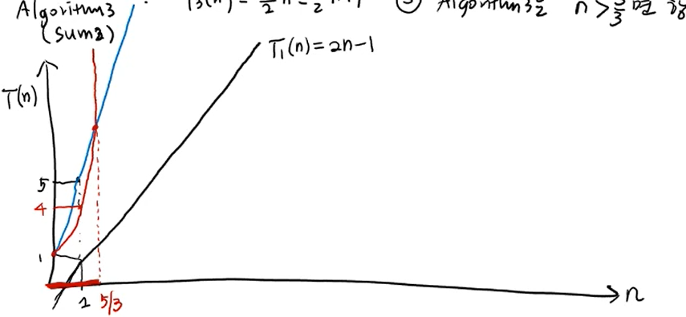
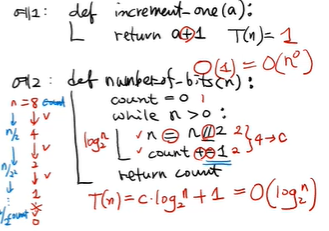

1. Big-O : 함수의 최고차항만을 계산해서 표기  
    1) 표기법 : 알고리즘의 수행시간 = 최악의 경우의 입력에대한 기본연산횟수
        - 알고리즘 1 : ArrayMax => T1(n) = 2n-1
        - 알고리즘 2 : Sum1 => T2(n) = 4n+1
        - 알고리즘 3 : Sum2 => T3(n) = (3/2)n^2 - (3/2)n + 1
        => 알고리즘 2가 알고리즘 1보다 2배 느리다.
        => 알고리즘 3는 교점전까지는 알고리즘 2보다 빠르다.
        => 알고리즘 3는 모든 n에 대해 알고리즘 1보다 느리다.
        => 알고리즘 3는 교점이후에는 항상 알고리즘 2보다 느리다.
        
        => n이 커질수록 T(n)도 커진다.
    
    2) Big-O식 표기 
        - 알고리즘 1 : O(n)
        - 알고리즘 2 : O(n)
        => 수행시간은 같다고 생각
        - 알고리즘 3 : O(n^2)
        => 알고리즘 3가 가장 느리다.

        ** 최고차항만 남긴다.
        ** 최고차항 계수(상수)는 생략
        ** Big-O(최고차항)
    
    ex1)def increment_one(a):
            return a+1

        T(n)=1
        O(1) = O(n^0)

    ex2)def numberof_bits(n):
            count=0
            while n>0:
                n=n//2
                count+=1
            return count
        
        n=8
        3비트 리턴
        1/2^(count)=1
        log2n=count

        T(n)=C*log2(n) + 1 = O(log2(n))

        
    

    과제 : prefix-sum