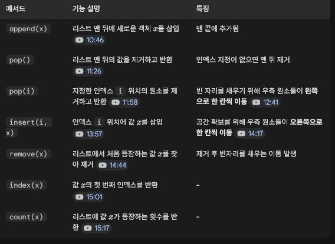

1. 순차적 자료구조(Sequential Data Structures)
    : 순차적 자료구조는 데이터(값)들이 메모리상에 연속적 혹은 순차적으로 저장되는 가장 기본적인 형태의 자료구조입니다
    : C언어, 자바, 파이썬 등 대부분의 프로그래밍 언어에서 기본적으로 제공하며, 대표적으로 배열(Array)과 리스트(List)가 있습니다

2. C언어의 배열 (Array)

    1) 선언과 메모리 구조

        int A[4] = {2, 4, 0, 5};

        - 위와 같이 선언하면 4개의 정수를 저장할 수 있는 공간이 연속적으로 할당되고, 인덱스는 0부터 시작합니다 (A[0] ~ A[3])
        - 배열 변수 A에는 배열이 시작하는 첫 번째 원소(A[0])의 시작 주소가 저장됩니다
    
    2) 인덱스 참조의 시간 복잡도: O(1)
        : 배열의 특정 인덱스 값을 읽거나 쓰는 연산은 상수 시간(O(1))이 걸립니다
            - 이유: 임의 접근 메모리(RAM)를 사용하므로 주소만 알면 즉시 접근할 수 있기 때문입니다
            - 주소 계산 공식: A[i]의 주소 = A의 시작 주소 + (i*데이터 타입의 크기) 
            - 주소를 계산하는 데 덧셈 1번, 곱셈 1번의 기본 연산만 필요하므로 상수 시간에 수행 가능합니다

3. 파이썬의 리스트 (List)
    1) 객체 참조 구조 (Object Reference)
        - C언어는 배열 공간에 실제 값이 직접 저장되지만, 파이썬 리스트는 값이 저장된 객체(Object)의 주소(참조)를 저장
        - 예를 들어 A[2] = A[2] + 1을 수행하면, 기존 공간의 값이 바뀌는 것이 아니라 새로운 객체(1)가 메모리에 생성되고 A[2]가 이 새 객체의 주소를 가리키게 됩니다
    
    2) 주요 제공 연산 및 특징
        

4. 동적 배열 (Dynamic Array)과 용량 자동 조절
    : C언어의 배열은 고정 크기(Static)인 반면, 파이썬의 리스트는 용량(Capacity)을 자동으로 조절하는 동적 배열(Dynamic Array)입니다
        - C언어의 한계
        : 처음 설정한 크기를 넘어서는 인덱스에 접근하면 메모리 침범 에러가 발생합니다
        : 크기를 늘리려면 프로그래머가 직접 malloc 등을 이용해 새 공간을 배정하고 기존 데이터를 일일이 복사해야 합니다

        - 파이썬의 자동 조절
        : 파이썬 리스트는 내부 공간이 모자라면 자동으로 더 큰 메모리를 할당받고, 데이터가 많이 삭제되면 자동으로 공간을 줄입니다
        : sys.getsizeof() 함수를 통해 확인해 보면 빈 리스트도 기본 메타데이터 공간(예: 28바이트)을 가지며, 원소가 추가됨에 따라 용량이 계단식으로 늘어나는 것을 볼 수 있습니다

5. append 연산의 내부 동작 메커니즘 (의사코드 개념)
    - 파이썬 리스트는 내부적으로 현재 저장된 원소 개수(n)와 최대 수용 용량(capacity)을 함께 관리합니다

    def append(A, x):
        # Case 1: 아직 빈 자리가 있는 경우
        if A.n < A.capacity:
            A[n] = x       # 맨 뒤 슬롯에 저장
            A.n = n + 1    # 원소 개수 1 증가
        
        # Case 2: 방이 꽉 찬 경우 
            (A.n == A.capacity)
        else:
            # 1. 기존 용량의 2배 크기를 가진 임시 리스트 B를 생성
            B = allocate_new_list(A.capacity * 2) 
        
            # 2. 기존 이사 비용 발생: A의 모든 원소를 B로 복사 (O(n) 시간 소요)
            for i in range(n):
                B[i] = A[i]
            
            # 3. 기존 리스트 A의 메모리를 해제하고 B를 새로운 A로 지정
            del A
            A = B 
        
            # 4. 여유가 생긴 공간에 새 값 x를 저장하고 카운트 증가
            A[n] = x
            A.n = n + 1

    **핵심 포인트: 
    방이 꽉 찼을 때 일어나는 이사 과정(새 메모리 할당 및 복사)은 O(n)의 시간이 소요됩니다 
    하지만 이 이사 연산은 가끔씩만 발생하므로, 전체적인 평균 시간을 계산하는 분할상환 시간(Amortized Time) 개념을 적용하면 append 역시 평균적으로 O(1)의 효율성을 보입니다. 

6. 제한된 접근을 허용하는 자료구조: 스택, 큐, 데크 (Deque)
    : 배열이나 리스트와 달리, 특정 위치에서만 삽입과 삭제를 할 수 있도록 접근을 엄격하게 제한하여 효율성을 높인 자료구조들입니다

    1) 스택 (Stack)
        - 개념: LIFO (Last-In, First-Out, 후입선출) 구조입니다. 가장 마지막에 들어간 데이터가 가장 먼저 나옵니다
        - 주요 연산: 
            - push: 데이터의 맨 위에 차곡차곡 쌓으며 삽입하는 연산
            - pop: 가장 맨 위에 있는(가장 최근에 들어온) 데이터를 삭제하고 꺼내는 연산
        - 특징: 중간에 있는 데이터에 직접 접근하거나 삭제하는 것은 불가능합니다
    
    2) 큐 (Queue)
        - 개념: FIFO (First-In, First-Out, 선입선출) 구조. 가장 먼저 들어간 데이터가 가장 먼저 나옵니다.
        - 특징: 데이터는 한쪽 끝(뒤)으로만 들어오고, 나갈 때는 반대쪽 끝(앞)에서부터 차례대로 나갑니다
        - 마찬가지로 중간 새치기나 중간 삭제는 허용되지 않습니다.

    3) 데크 (Deque - Double-Ended Queue)
        - 개념: 스택과 큐를 하나로 합쳐놓은 형태의 자료구조
        - 특징: 양쪽 끝(앞과 뒤) 어디에서나 데이터의 삽입과 삭제가 모두 자유롭게 허용

7. 연결 리스트 (Linked List)
    : 파이썬의 리스트(배열 기반)와 이름은 비슷하지만, 내부 구현과 특징이 완전히 다른 순차적 자료구조
    
    1) 논리적 순차 구조와 독립적 메모리
        - 배열/파이썬 리스트: 메모리 공간에 연속적으로 원소들이 붙어서 저장
        - 연결 리스트: 메모리상에서 연속되지 않고, 여기저기 독립된 공간에 띄엄띄엄(흩어져서) 저장
    
    2) 링크(Link)를 통한 연결
        : 연속되지 않은 공간에 있기 때문에, 각 데이터는 값(Data) 뿐만 아니라 '나의 다음 데이터가 어디(주소)에 있는지' 가리키는 링크(Link, 포인터)를 쌍으로 가지고 있어야 합니다
        - 리스트의 맨 마지막 데이터는 다음 연결된 데이터가 없으므로 None(파이썬) 혹은 NULL(C언어) 상태를 가집니다
    
    3) 연결 리스트의 장단점
        - 단점: 배열처럼 인덱스를 통한 무작위 접근(Random Access)이 불가능
        - 세 번째 원소를 알고 싶다면 맨 처음(Head) 원소부터 시작해 링크를 타고 차례대로 찾아가야 하므로 탐색 속도가 느립니다
        - 장점: 배열과 달리 데이터의 삽입과 삭제 시 원소들을 밀고 당기는 이동 비용이 들지 않아, 특정 상황에서 배열보다 훨씬 큰 강력함
