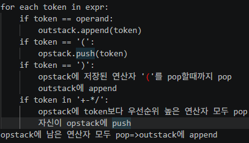
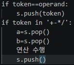

#계산기 코드 작성

1) 연산자, 피연산자 구분
2) 이항 연산자(2+3,3*5)/단항 연산자

- infix 수식 : 연산자가 두 피연산자 사이에 있음
- postfix 수식 : 피연산자를 먼저 쓴 후에 연산자를 후에 씀
    1) 괄호치기
    2) 연산자의 오른쪽 괄호 다음으로 연산자 이동
    3) 괄호 지우기
- 2+(3*5) => 2 3 5 * +
- prefix 수식 : postfix와 반대로 진행

- 입력 문자열 : "A+B*C"
- 출력 문자열 : ABC*+
- 조건 
    1) 피연산자의 순서는 그대로
    2) 연산자의 순서는 우선순위대로
- => AB*C+

- 입력 : (A+B)*C
- '(' : 우선순위 가장 낮음 / ')' : 우선순위 가장 높음
- 출력 : AB+()C* => AB+C*

리스트 : outstack (출력)
스택 : opstack
- 

postfix => 계산

- 
    