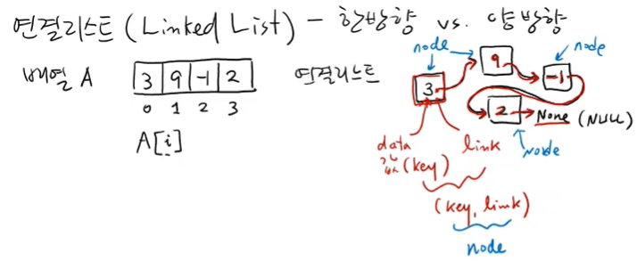
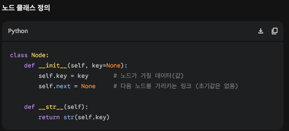
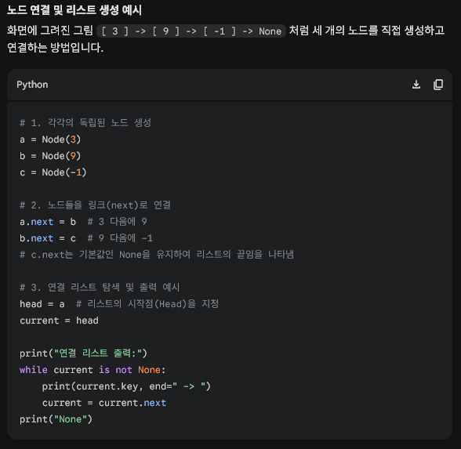

1. 연결리스트 (Linked list) : node와 link로 연결된 배열
    - 기존 배열(Array/List)의 한계
        - 파이썬의 리스트는 메모리의 연속된 공간에 아이템을 저장합니다.
        - 따라서 중간에 새로운 원소를 삽입하거나 삭제할 때, 뒤에 있는 원소들을 모두 한 칸씩 밀거나 당겨야 하므로 최악의 경우 O(n)의 시간이 걸려 비효율적입니다.
    
    - 연결 리스트(Linked List)의 개념
        - 메모리의 연속된 공간에 붙여서 저장하는 대신, 값들을 메모리 이곳저곳에 흩어져서 저장합니다.
        - 각 원소는 자신의 값뿐만 아니라, "다음 원소가 메모리 어디에 있는지"를 가리키는 주소(Link/Pointer)를 함께 저장합니다
    - 한방향
        - 한쪽 방향으로만 link가 존재
    
    - 노드(Node)
        - 연결 리스트를 이루는 가장 기본 단위입니다.
        - Key(Value): 실제 저장하는 데이터 값
        - Next: 다음 노드의 주소를 가리키는 포인터 (다음 노드가 없다면 None 또는 0)

    - 
    - 장점 : 배열 사이에 값을 넣으면 자동으로 한칸씩 이동됨(링크만 변경해주기 때문)
    - 
    - 
    