# PF-IaC — Terraform으로 만들고, Ansible로 구성한다

Terraform이 실 AWS에 EC2를 띄우고, 그 서버를 Ansible이 SSH로 구성하는 실습.
D1~D5는 LocalStack이었고 실제 AWS 계정으로 배포한 건 이번이 처음.

순서에 원칙을 하나 뒀다: **자동화하기 전에 같은 작업을 손으로 한 번 한다.**
Ansible 태스크는 결국 수동 작업의 인코딩이라, 원본을 모르면 자동화가 실패했을 때 어디가 끊겼는지 못 찾는다.

## 구성

```
pf-IaC/
├── main.tf              EC2 1대 + 키페어 + 보안그룹(22/80) + AMI 조회 + IP output
├── ansible/
│   ├── inventory.ini    정적 인벤토리 (EC2 퍼블릭 IP, ansible_user=ubuntu)
│   └── site.yml         nginx 설치·index.html·charset 설정·docker + reload 핸들러
└── images/              실행 증적 스크린샷
```

LocalStack 때와 달라진 것: provider에 `region` 한 줄이 전부다. access_key="test", skip_* 4종, endpoints 블록은 전부 LocalStack 우회 장치였다. 자격증명은 `aws configure`로 넣은 걸 provider가 알아서 읽는다. VPC도 안 만들었다 — 기본 VPC에 자동 배치.

## 흐름

### 1. Terraform 프로비저닝

```bash
terraform init && terraform apply
ssh ubuntu@$(terraform output -raw public_ip)
```

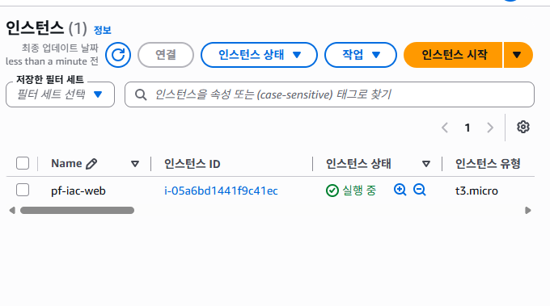

### 2. 수동 서버 구성 (자동화 전 1회)

SSH로 들어가서 손으로 한 것들:

```bash
sudo apt update && sudo apt install nginx
cat /etc/nginx/nginx.conf          # include 구조 파악
ls -l /etc/nginx/sites-enabled/    # default -> sites-available/default 심볼릭 링크
sudo vim /var/www/html/index.nginx-debian.html   # 페이지 수정 (root 소유라 sudo)
sudo nginx -t                      # 문법 검사
sudo systemctl reload nginx
sudo journalctl -u nginx -n 20
```

여기서 확인한 구조:
- `nginx.conf`가 `conf.d/*.conf`와 `sites-enabled/*`를 include로 끌어들인다
- `sites-enabled`는 `sites-available`로의 심볼릭 링크 — 사이트 on/off는 링크를 걸고 빼는 방식
- server 블록의 `root /var/www/html` + `index` 지시어 순서가 어떤 파일이 서빙될지 결정한다. 디렉토리엔 `index.nginx-debian.html`뿐인데 Welcome 페이지가 뜨는 이유가 index 순서 3번째에서 걸리기 때문
- **파일 수정 ≠ 적용.** html은 요청마다 새로 읽지만, 설정은 기동/reload 시점에 메모리로 올린다. 설정 파일이 깨져 있어도 서비스는 옛 설정으로 멀쩡히 돈다

일부러 `root` 줄의 세미콜론을 지우고 `nginx -t`를 돌려봤다:

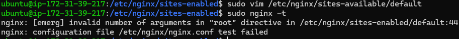

`[emerg] invalid number of arguments in "root" directive in /etc/nginx/sites-enabled/default:44` — 파일과 줄번호까지 찍어준다. 세미콜론이 없으면 다음 줄 단어들까지 root의 인자로 읽어버려서 "인자 개수" 에러가 난다. 편집은 sites-available에 했는데 에러는 sites-enabled를 가리키는 것도 심볼릭 링크라서다. reload 전에 `nginx -t`를 먼저 치는 이유 = 깨진 설정으로 서비스 죽이는 사고를 막는 안전핀.

### 3. purge 후 Ansible로 재구성

```bash
sudo apt purge -y nginx nginx-common && sudo apt autoremove -y   # 설정까지 삭제 (remove는 설정 남김)
```

WSL에서:

```bash
ansible -i inventory.ini web -m ping        # SSH + 파이썬 + 모듈실행 3종 확인
ansible-playbook -i inventory.ini site.yml  # 1회차: changed=5
ansible-playbook -i inventory.ini site.yml  # 2회차: changed=0
```

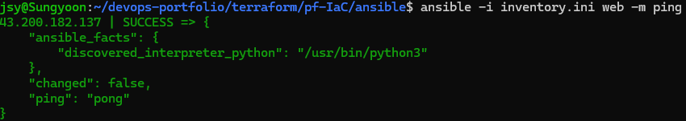

이 ping은 ICMP가 아니다. SSH로 붙어서 파이썬 모듈을 밀어넣고 실행한 뒤 JSON을 회수한다 — `discovered_interpreter_python`이 그 증거. 모든 태스크가 이 방식으로 돈다.

1회차 — `RUNNING HANDLER [reload nginx]`가 docker 설치보다도 **뒤에** 찍힌다. 핸들러는 notify한 태스크 직후가 아니라 플레이 맨 끝에 몰아서 1번 실행된다 (설정 10개를 바꿔도 reload는 1번):

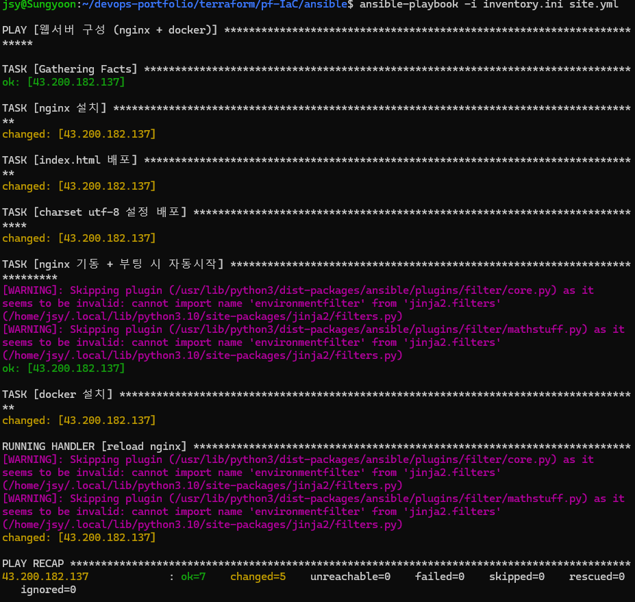

2회차 — 전부 ok, changed=0, 핸들러 줄 자체가 없다. charset.conf가 이미 같은 내용이라 copy가 ok로 끝났고 notify가 발동하지 않았다. 멱등성과 핸들러의 합작:

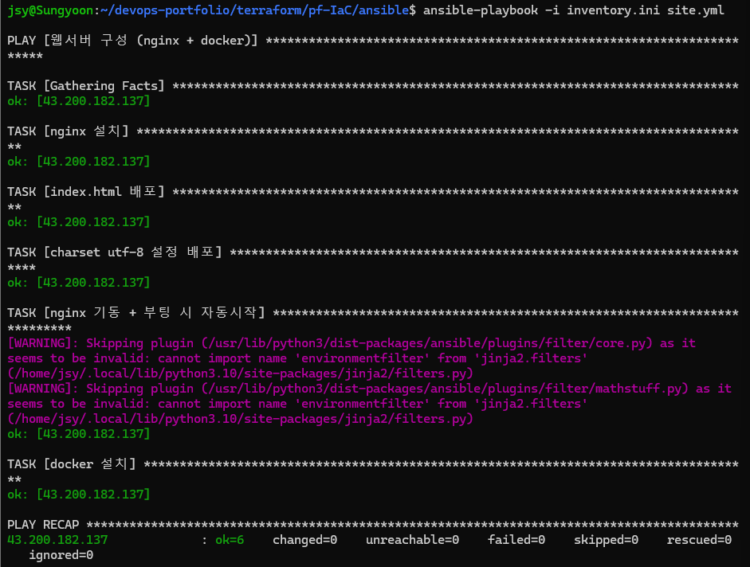

### 4. 검증

```bash
curl http://<public_ip>              # 플레이북이 배포한 페이지
curl -i http://<public_ip> | head -5 # Content-Type: text/html; charset=utf-8
ssh ubuntu@<public_ip> docker --version
```

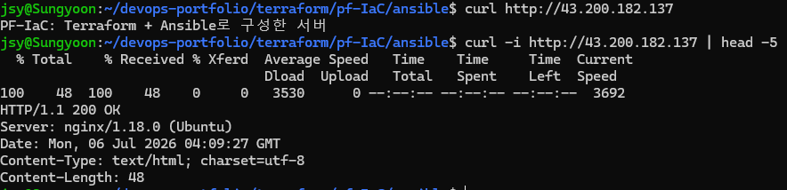
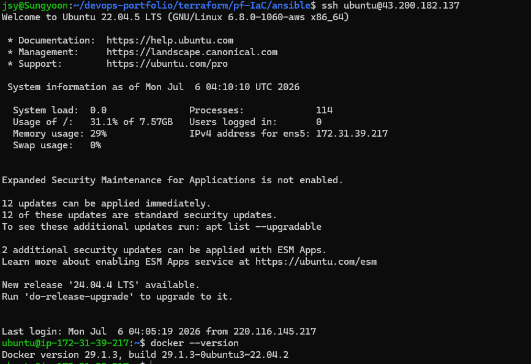

### 5. destroy

```bash
terraform destroy   # Resources: 3 destroyed
```

콘솔의 "종료됨(terminated)"이 곧 삭제 완료다. 목록엔 한 시간쯤 잔상으로 남았다가 사라진다. 루트 EBS도 종료 시 함께 삭제(기본값).

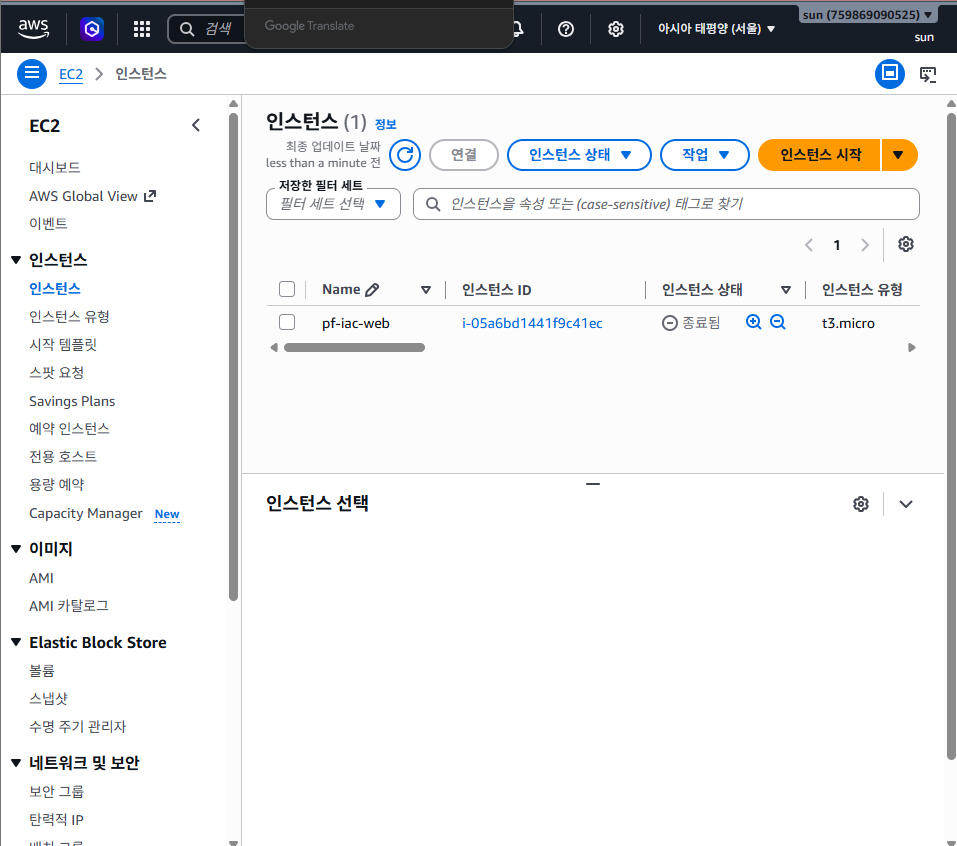

## 겪은 문제 2건

**1. 브라우저에 nginx 대신 KT 안내 페이지가 떴다**

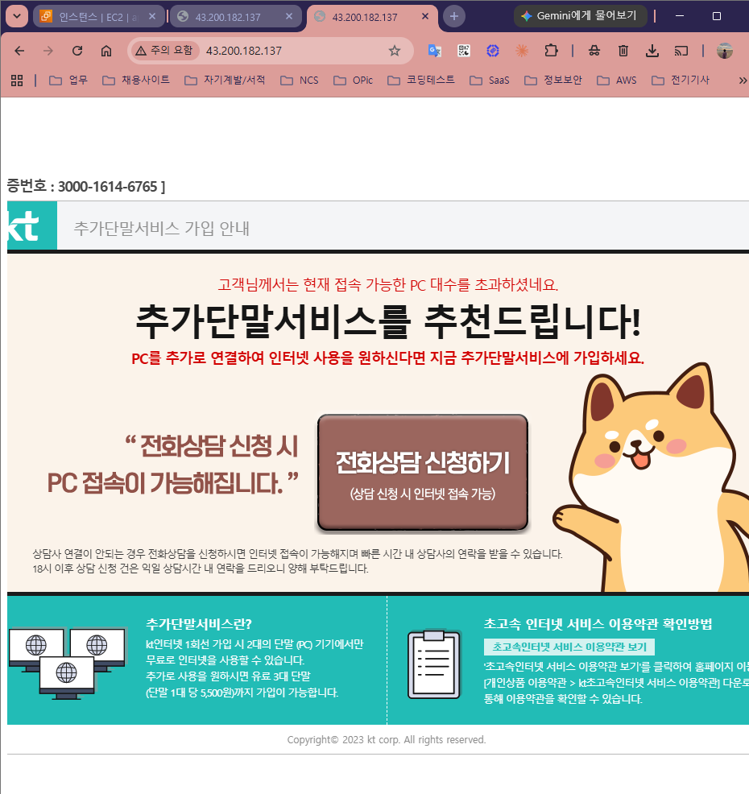

nginx 문제가 아니었다. HTTP는 평문이라 ISP가 응답을 바꿔치기할 수 있고, KT가 회선 단말 수 제한 안내 페이지로 가로챈 것. 구간을 분리해서 진단했다 — EC2 안에서 curl(정상) → 폰 LTE(정상) → 결론: 서버 무죄, 집 회선의 브라우저 HTTP만 문제. "왜 다들 HTTPS를 쓰는가"의 실물 답안. 이후 확인은 WSL curl로 진행 (curl은 가로채기를 안 당했다).

**2. 한글이 `�댁젣 Role濡�`로 깨졌다**

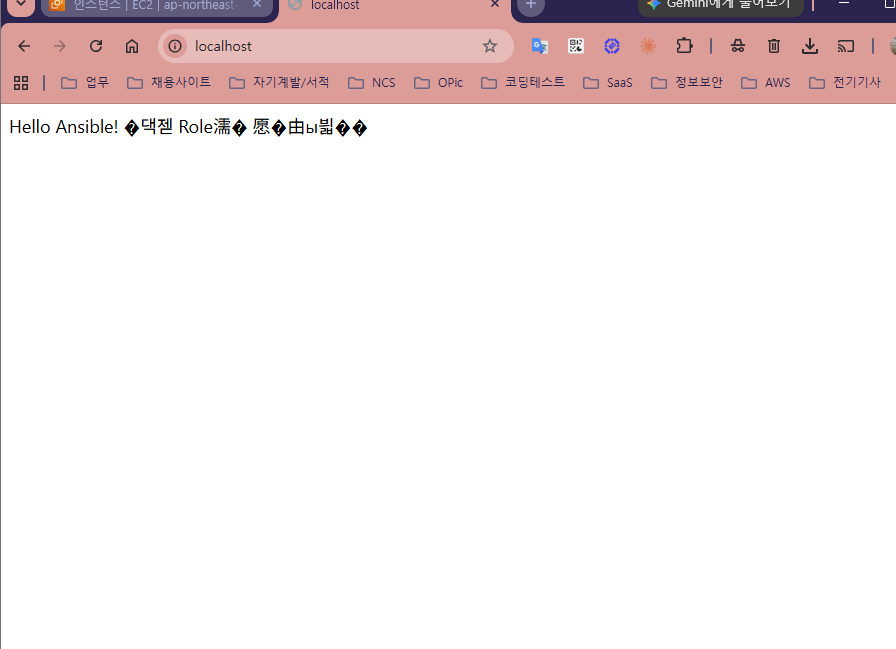

파일은 UTF-8인데 응답 헤더에 문자셋 명시가 없어서 브라우저가 EUC-KR로 잘못 추측한 것. nginx에 `charset utf-8;` 한 줄로 해결 — 응답의 `Content-Type`에 charset이 붙는다. 처음엔 고쳤다고 생각했는데 `curl -i`에 charset이 안 보였다. `grep charset /etc/nginx/...` 한 방으로 "추가 자체가 누락"임을 확정하고 다시 적용:

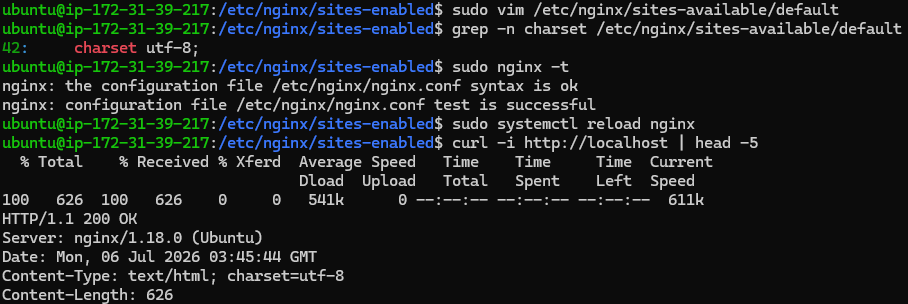

느낌으로 "적용됐겠지" 하지 말고, 명령 하나로 확정 지을 것.

## 메모

- 수동 작업 ↔ 태스크 대응: `apt install nginx` = apt 모듈, `sudo vim index` = copy 모듈, `charset utf-8;` = conf.d에 copy + notify, `systemctl reload` = 핸들러, `sudo` = become
- index.html엔 notify가 없고 charset.conf엔 있는 이유: html은 요청마다 읽고, 설정은 reload해야 적용되기 때문
- `Connection refused` = 그 포트에 아무도 안 듣고 있음 (purge 검증에서 확인)
- 다음: 이 서버에 docker로 앱을 올리고, K8s로 넘어간다
